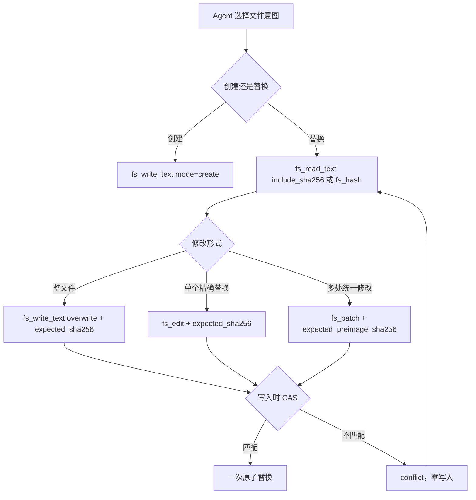

# RFC 0002：文件工具安全前置条件与输出效率

> 状态：Accepted；Stage 1 已在 DSH integration 实现，Stage 2 current-policy 证据已验收，
> Stage 3 未触发并延后。
> 基线日期：2026-08-16。
> 基线 revision：`48182b1b316f22831235cb75129a2fb430b9b39e` 加本文 Stage 1 change set。
> 影响范围：`xuanling-toolkit` 文件工具、`xuanling-mcp` 工具合同、host integration 与
> 文件工作流 Skill。
> 实施计划与证据：
> [`filesystem-safety-stage1-development-plan.md`](../plans/filesystem-safety-stage1-development-plan.md)、
> [`filesystem-safety-stage1-execution-ledger.md`](../plans/filesystem-safety-stage1-execution-ledger.md)、
> [`filesystem-safety-rfc-completion-development-plan.md`](../plans/filesystem-safety-rfc-completion-development-plan.md)、
> [`filesystem-safety-rfc-completion-execution-ledger.md`](../plans/filesystem-safety-rfc-completion-execution-ledger.md)、
> [`filesystem-safety-stage2-report.md`](../../test/deepseek-harness/evaluation/filesystem-safety-stage2-report.md)。

## 背景

XuanLing 文件工具已经提供原子替换、精确文本匹配、统一 diff、SHA-256 preimage CAS、
显式输出预算和续读 token。DeepSeek Harness（DSH）内置文件工具还提供按 agent session
记录的 read-before-edit observation gate。两类机制处理不同的失败：

- observation gate 阻止没有观察目标文件或观察已经失效的 agent 发起修改；
- preimage CAS 在实际写入点比较当前内容，阻止 stale writer 覆盖并发修改；
- 精确匹配使错误的 `old` 内容以 `not_found` 或 `conflict` 失败；
- 同目录临时文件加原子替换避免目标文件只写入一部分，但不阻止 stale overwrite。

当前 `fs_write_text` 的默认 `mode` 是 `overwrite`。已有文件可以在没有
`expected_sha256` 的情况下被整体替换。这条路径不会因内容过时而失败，是当前文件工具面最
明确的数据损坏风险。`fs_edit` 与 `fs_replace_text` 的 `expected_sha256` 是可选保护；
`fs_patch.expected_preimage_sha256` 是必填保护。

## 当前事实分级

| 结论 | 状态 | 当前证据 | 影响 |
| --- | --- | --- | --- |
| `fs_write_text(mode=overwrite)` 不要求 preimage hash | `CONFIRMED` | `FsWriteTextRequest.expected_sha256: Option<String>` 与写入实现 | stale 或误判目标时可能静默覆盖已有文件 |
| `fs_patch` 支持单文件多 hunk、整文件 preimage CAS 和零写入失败 | `CONFIRMED` | `parse_unified_diff` 收集多个 hunk，校验后只执行一次 `atomic_write` | 已覆盖同一文件多处原子修改的主要场景 |
| `fs_edit` 默认唯一匹配，多匹配与零匹配均不写入 | `CONFIRMED` | `FsEditRequest` 与 `fs_edit` 分支 | 错误心智模型通常 fail loud，但不能替代 observation/CAS |
| `fs_read_text(include_sha256=true)` 与 `fs_hash` 已可取得 CAS 输入 | `CONFIRMED` | 当前 toolkit DTO 与 MCP fs16 profile | 安全覆盖不依赖扩展 `fs_stat` |
| `--tool-profile fs` 仍会初始化 MemoryStore | `CONFIRMED` | `crates/xuanling-mcp/src/main.rs` 在 profile 选择后仍无条件 `MemoryStore::open` | DSH 的 fs-only 自动化若省略 `--memory-db` 会触碰默认库；host 必须显式注入隔离路径 |
| process 结果在 MCP `content` 与 `structuredContent` 的重复会让模型支付双份 token | `UNVERIFIED_RISK` | wire/bridge 可观察到两种表示；尚无 provider request 或 session token 归因 | 先测量 host 投影，不直接删除协议表示 |
| 大型文件读/列举自动落 artifact 能稳定降低上下文开销 | `UNVERIFIED_RISK` | process 已有 artifact；fs16 没有 artifact 工具和相同生命周期合同 | 涉及 profile、授权、保留和清理边界 |
| 新增 `fs_edit_batch` 能提供当前缺失的单文件原子性 | `DEFERRED` | 当前 `fs_patch` 已支持多 hunk 并一次写入 | 新工具会扩大目录和维护重复能力 |

## 决策

### 1. 全文件写入采用显式安全路径

文件工作流把全文件写入拆成两个无歧义的意图：

| 意图 | 调用合同 | 失败行为 |
| --- | --- | --- |
| 创建新文件 | `fs_write_text(mode=create)` | 目标已存在时返回 `already_exists`，零写入 |
| 替换已有文件 | 先读取或 hash，再调用 `fs_write_text(mode=overwrite, expected_sha256=...)` | preimage 不一致时返回 `conflict`，零写入 |

DSH 集成层可以增加 host-specific pre-execute policy：`fs_write_text` 的 `mode=overwrite`
缺少非空 `expected_sha256` 时拒绝 dispatch。该策略只检查参数是否包含写入前置条件，不改写
参数，也不把一次较早的 `stat` 当作写入时事实。新文件继续使用 `mode=create`。

第一阶段不改变 Rust DTO、MCP 工具目录或默认行为。跨 host 都需要强制策略时，再评估
server-level strict mode；该模式优先复用现有 `expected_sha256` 字段，避免增加 schema 分支。

### 2. 多处修改优先使用现有 `fs_patch`

同一文件的多个修改由一个 strict unified diff 表达。`fs_patch` 在写入前完成以下检查：

1. 读取并计算当前整文件 SHA-256；
2. 比较 `expected_preimage_sha256`；
3. 解析全部 hunk；
4. 按声明位置校验每个 context/remove 行；
5. 所有检查通过后执行一次原子替换。

任一 hunk 失败时整个调用零写入。因此当前不新增 `fs_edit_batch`。只有冻结任务证明模型无法
可靠生成 unified diff，且该失败率明显高于多次 `fs_edit` 时，才重新评估批量 old/new API。

### 3. hash 获取维持显式、低歧义入口

读取内容并准备修改时使用 `fs_read_text(include_sha256=true)`；只需要 preimage 时使用
`fs_hash`。`fs_stat` 不默认计算文件内容 hash，因为 stat 的元数据读取是低成本操作，而 hash
成本随文件大小增长。

`fs_stat(include_sha256=true)` 只作为后续候选。进入实现前需要证明它能减少模型轮次，且不会
让调用方误以为 metadata 与 hash 来自一个不可分割的 filesystem snapshot。无论 hash 从哪个
入口取得，写入时 CAS 才是并发判定点。

### 4. 输出瘦身先建立消费端证据

MCP 成功结果当前使用 structured result。部分 host 或 bridge 可能同时保留文本 `content` 和
`structuredContent`，但 wire 上存在两种表示不等于 provider 请求前缀包含两份相同正文。
process 输出优化必须先记录以下证据：

- MCP 原始响应大小；
- bridge 持久化 session 中的结果形状；
- 实际 provider request 中的结果形状；
- 同一冻结任务的 input/cache token 差异。

证据确认重复后，优先在 host adapter 或 bridge 的 consumer projection 层选择一种模型表示，
同时保留结构化运行时结果。服务端不先行删除 `content` 或 `structuredContent`，因为这会改变
所有 MCP host 的兼容合同。

### 5. diff 预算与 filesystem artifact 暂缓

`fs_edit` 的 diff 可以省去验证性回读，也是大修改时的主要结果体积来源。后续候选合同为显式
`diff` 输出选择器：完整、摘要或有界预览；默认行为在兼容窗口内保持不变。进入 schema 设计前
先用 A/B/C transcript 量化 diff 的分布和后续回读率。

filesystem 自动 artifact overflow 暂缓。引入该路径需要同时定义：

- artifact 工具是否加入 fs profile；
- capability 是否能跨调用读取；
- artifact 的 owner、过期、清理和磁盘配额；
- 文件修改后的 artifact/preimage 关系；
- host 不支持 artifact 工具时的降级行为。

仅复用 process 的落盘实现不足以形成完整文件工具合同。

## 运行路径

DSH observation gate 可以位于 Agent 选择和工具 dispatch 之间。它减少没有真实观察的调用；
XuanLing CAS 仍在工具写入点执行。任一层通过都不能代替另一层的保证。

## 组件责任

| 边界 | 责任 | 不承担 |
| --- | --- | --- |
| `xuanling-toolkit::fs` | 路径 capability、preimage CAS、严格匹配、原子替换、typed failure | agent 是否已观察文件、host 审批与 UI |
| `xuanling-mcp` | 稳定 schema/catalog、请求解码、结构化成功和错误映射 | DSH 专用参数改写或模型行为猜测 |
| `integrations/deepseek-harness` | DSH Skill、pre-execute policy、bridge 投影和 A/B/C 验收 | 修改通用 Rust 合同来适配单一 host |
| 文件工作流 Skill | 让模型选择 create、CAS overwrite、edit 或 patch | 作为唯一安全边界；服务端仍需校验 CAS |
| DSH 原生 fs | session-scoped observation、sandbox、原生 UI 卡片 | 为 MCP 工具提供隐式 observation 状态 |

## 失败与并发语义

- `mode=create` 对已存在目标返回 `already_exists`，不得转为 overwrite 重试。
- 缺少 strict precondition 的 DSH overwrite 在 dispatch 前返回稳定的策略拒绝；不得自动补 hash
  或把参数改写为其他模式。
- CAS mismatch 使用当前 `conflict` 语义，并携带实际 hash；调用方重新读取后重建修改。
- `not_found`、multiple-match `conflict`、patch parse failure 和 hunk context mismatch 均为零写入。
- 检查与写入必须位于同一工具调用中。`fs_stat` 后裸 overwrite 仍存在 TOCTOU，不构成安全路径。
- 同一文件的多 hunk patch 全有或全无。跨文件原子性不在本文范围。
- cancel 或进程崩溃不得留下部分目标内容；临时文件清理失败可以记录诊断，但不能报告写入成功。

## Cache 与工具目录

静态工具目录保持字节一致时，增加固定 Skill 或 policy 不会持续降低 prefix cache 命中率。
它们仍可能增加一次冷前缀体积。任何输入 schema、description、工具数量或排序变化都会使变化点
之后的前缀缓存失效一次，并使当前 catalog snapshot 和 A/B/C 体积基线过期。

本 RFC 的第一阶段不修改工具目录。`fs_edit_batch`、`fs_stat.include_sha256`、diff selector 或
filesystem artifact 都必须先单独量化 schema 增量，并重新建立 snapshot、投影和真实模型基线。

## 分阶段验证门槛

### Stage 1：Skill 与 DSH policy

状态：`Accepted / Implemented`，仅适用于 `integrations/deepseek-harness`。

- `xuanling-dsh-skills` profile bundle 注册 `xuanling-file-workflow` 和
  `xuanling-dsh-skills/strict-overwrite-policy.mjs`。policy module 使用 bare package
  specifier，因此 bundle 必须先安装到目标 DSH profile；单独传递该 bundle 的源码 patch
  不是受支持的加载方式。
- policy 精确匹配 `mcp__xuanling__fs_write_text`。`mode` 省略或为 `overwrite` 且缺少
  非空字符串 `expected_sha256` 时，返回
  `XUANLING_FS_OVERWRITE_REQUIRES_SHA256` 并在 MCP dispatch 前结束调用。
- `mode=create`、带 preimage 的 overwrite、malformed canonical input 和其他工具保持原始
  dispatch 路径。hash 格式、路径 capability、stale CAS 与文件副作用仍由 Rust 校验。
- 确定性验收覆盖 direct/Code Mode、官方 DSH MCP bridge、create/create-existing、matching
  CAS、stale CAS、listener disposal 与进程清理；真实模型验收覆盖 Native 文件工作流和
  policy 拒绝后的同族 read+CAS 恢复。精确命令、会话和指纹记录在 Stage 1 执行账本。

- 冻结任务覆盖：新文件创建、已有文件 CAS overwrite、stale hash、未带 hash 的 overwrite。
- policy 对 `mode=overwrite` 缺少 hash fail closed，对 `mode=create` 放行。
- policy 不修改 `ToolExecutionInput.arguments`，拒绝结果在 Native 与 Code Mode 一致可见。
- stale hash 在 XuanLing 工具层返回 `conflict`，目标字节与修改时间保持不变。
- DSH 特殊实现仅位于 `integrations/deepseek-harness`；Rust snapshot 不变。

### Stage 2：A/B/C 真实模型证据

状态：`Accepted`。验收使用 current policy/bundle 生成的新 population，没有复用早于 Stage 1
的模型会话。机器可复算 manifest 与限制记录在
[`filesystem-safety-stage2-report.md`](../../test/deepseek-harness/evaluation/filesystem-safety-stage2-report.md)。

- 相同 fixture、prompt、模型 route 与 session 隔离下，每个 arm 至少三次质量试验。
- 报告工具选择、重试次数、错误分类、oracle 结果、input/cache token 和结果体积。
- 原生工具 observation 与 XuanLing CAS 分开归因，不把一方的通过写成另一方已验证。
- 计费试验只在独立授权、隔离 memory DB 和可追溯 run id 下运行。
- 即使只挂载 `fs` profile，runner/inspect/probe 也必须传入唯一的临时
  `--memory-db`；缺少该值应 fail closed，不能把“没有 Memory 工具”误解为“不会打开 Memory DB”。
- current population 共 15 个 session；runner、strict analyzer v8 与独立文件 oracle 均通过
  15/15，A/B/C quality 分别为 3/3。
- Arm B 在没有 Native fallback 时完成五个 session 且 filesystem contract error 为 0；Arm C
  的 76 次文件调用中有 6 次选择 XuanLing。本轮不改变 Native 默认文件体验或生产 bundle。
- 唯一 typed error 是 C 在创建 `RELEASE.md` 前探测不存在文件得到的 `not_found`；没有同名重试，
  最终 workspace 通过 oracle。

### Stage 3：共享 Rust 合同候选

状态：`Not Triggered / Deferred`。Stage 1 与 Stage 2 均未修改 Rust DTO、MCP catalog、snapshot
或默认行为。

只有以下任一条件成立才进入 Rust/API 设计：

- 两个以上 host 需要同一种 strict overwrite 强制策略；
- DSH policy 无法覆盖 PTC/Native 的所有 dispatch 路径；
- 真实试验证明现有 fs16 工具组合造成稳定、可量化的正确性或轮次缺口。

当前 checkout 只有 DSH 声明 strict policy；Stage 1 direct/Code Mode probe 与 current catalog
inspection 未发现 dispatch bypass；Arm B quality 3/3 且没有 fs contract error。三个触发条件均为
`not_triggered`。

后续出现任一触发条件时，schema、CLI、错误码、兼容模式、snapshot、三平台测试和 host 投影必须
进入独立实施计划；该新证据不能直接修改 Rust 公共合同。

## 暂不采纳

- 不把精确 old/new 匹配描述成 read-before-edit observation gate。
- 不用 `fs_stat` + 裸 overwrite 替代写入时 CAS。
- 不在当前 fs16 profile 增加 `fs_edit_batch` 或 artifact 工具。
- 不根据 MCP wire 的双表示直接断言模型支付双份 token。
- 不在 Rust schema 中增加 DSH 特例，也不在 adapter 中猜测或修复模型生成的参数。
- 不以一次静态测试、mock 或单次模型成功宣布效率或安全提案完成。
