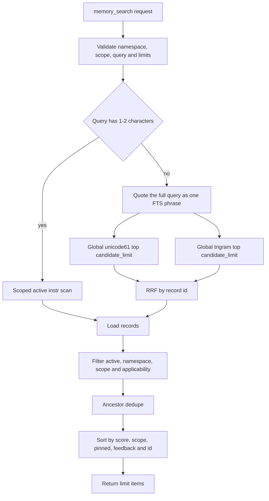

# RFC 0003：Memory Retrieval Pipeline

> 状态：Accepted / Lexical Implemented / Semantic Not Triggered。
> 基线日期：2026-08-16。
> 基线 revision：`48182b1b316f22831235cb75129a2fb430b9b39e`。
> 上游合同：[ADR 0001](0001-memory-v2-proposal-review.md)、
> [Memory v2 架构](../architecture/memory-v2-architecture.md)。
> 实施计划：
> [memory-retrieval-pipeline-development-plan.md](../plans/memory-retrieval-pipeline-development-plan.md)。
> Semantic 决策：
> [memory-retrieval-pipeline-semantic-decision.md](../plans/memory-retrieval-pipeline-semantic-decision.md)。

## 1. 决策摘要

`memory_search` 继续使用同一个 MCP 工具、请求 DTO 与响应 DTO。召回内部拆成五个阶段：

1. 规范化原始 query，并生成完全字面量的确定性查询计划；
2. 在 active、namespace、scope 与 applicability 可见性过滤后生成候选；
3. 合并 phrase、token AND、token OR、unicode61 与 trigram 排名；
4. 使用可解释且稳定的 lexical rerank 生成最终顺序；
5. 截断到 `limit`，不产生任何 canonical 或 projection 写入。

词法阶段先通过版本化 corpus、Recall@K、MRR 与 nDCG 验收。生产向量层不在本轮直接实现。
词法验收后只有达到本文的 semantic trigger，才为真实 embedder、向量 projection 与模型安装
另立实施计划。

默认构建继续保持无模型运行时、无下载器、无网络副作用。Skill 和 MCP stdio 启动不得自动下载
模型。模型交付若被触发，只能由显式 CLI 或 host integration 完成，并要求用户可见的来源、版本、
checksum、磁盘预算和安装状态。

当前 checkout 已实现上述词法阶段。冻结 after report 的 aggregate 与 critical Recall@5 均为
1.0，`english_multi_term` 8 条 critical query 的 top-5 miss 为 0；RFC semantic trigger 的
第二项未满足，因此结论为 `not_triggered`。该结论只绑定冻结 corpus 与当前证据，不形成开放域
语义召回 SLA。

## 2. 实施前基线

### 2.1 已确认行为

| 结论 | 分级 | 当前证据 | 影响 |
| --- | --- | --- | --- |
| 多词 query 被整体包装成一个 FTS5 phrase | `CONFIRMED/P2` | `fts_phrase` 对完整 query 加引号；DSH 真实查询 `fixture oracle filesystem evaluation self-report` 返回空，而标题查询命中 | 非连续、重排或部分重合的自然查询可能错误返回空 |
| unicode61 与 trigram 已各自产生候选并以 RRF 合并 | `CONFIRMED` | `search_v2` 的双 FTS 查询和固定 channel 顺序 | 新方案扩展现有词法层，不从零替换 |
| 非短 query 的 FTS `LIMIT candidate_limit` 发生在 namespace/scope/applicability 过滤之前 | `CONFIRMED` | 两条 FTS SQL 只含 `MATCH` 与 `LIMIT`；可见性在逐 record 查询后检查 | 产生 scope/applicability crowding 的明确代码路径 |
| scope/applicability crowding 已造成用户可见漏召回 | `UNVERIFIED_RISK` | 实施前没有构造足量高排名不可见候选的红测或 live 复现 | W1 先建立正确红色，不提前定为已复现根因 |
| 1 至 2 字 query 使用参数绑定 `instr` 路径 | `CONFIRMED` | `short_query` 与合同测试 | 短 CJK 召回必须保留，不因多通道规划回退 |
| 相同 DB 与请求返回 byte-identical JSON | `CONFIRMED` | `unchanged_search_is_byte_identical` | query plan、fusion 与 rerank 不得引入时间、随机数或非稳定遍历 |
| embedding 只有非默认 trait 和测试替身 | `CONFIRMED` | `experimental-embeddings`、`NoopEmbedder`、`FakeEmbedder` | 当前没有生产模型、安装器、向量表或 stale-vector 恢复路径 |
| 当前测试没有版本化质量 corpus 与检索指标 | `CONFIRMED` | Memory 合同测试覆盖生命周期、scope、短 CJK、稳定输出和 projection rebuild，但不计算 Recall@K/MRR/nDCG | 现有全绿不能证明自然查询质量 |

### 2.2 实施前运行路径

`memory_search` 不查询 proposal、review 或 historical version，不更新 last-used，也不记录 raw
query。实施前问题发生在 lexical candidate generation，不属于 proposal/review 写路径。

## 3. 质量评测合同

### 3.1 版本化 corpus

实现前冻结 `retrieval-corpus-v1`。Fixture 只包含合成或公开的工程事实，不复制真实默认 Memory
DB、credential、用户对话或模型 reasoning。Corpus 包含：

- 48 条 active record；
- 12 条 pending、rejected、archived 或 historical distractor；
- 至少 2 个 namespace、3 个 project、4 个 workspace；
- applicability 的 operating system、architecture、toolchain、project marker 四个维度；
- 40 条 query：8 条英文多词/重排、8 条中文或中英混合、8 条代码符号/路径/错误码、
  8 条 scope/applicability crowding、4 条 title/tag、4 条明确 no-match；
- 每条 positive query 的 relevant record ID、0 至 3 relevance grade、禁止出现的 record ID 与
  `critical` 标记。

Corpus、loader 与 metric implementation 必须先于生产检索修改进入正确红色。标签由 fixture 明确
给出，不使用在线模型或 LLM judge。

### 3.2 指标和门槛

同一 corpus 同时生成 baseline 与 after 报告。完成门槛绑定该 fixture，不外推为所有项目的
生产 SLA：

| Gate | 门槛 |
| --- | --- |
| visibility violations | `0`：namespace、scope、applicability、pending、archived、history 均不得泄露 |
| critical Recall@5 | `1.00` |
| aggregate Recall@5 | `>= 0.90` |
| MRR@5 | `>= 0.75` |
| nDCG@5 | `>= 0.80`，且不得低于冻结 baseline |
| no-match false positives | 4 条 no-match 的 top 5 均为空 |
| determinism | 相同 DB/request 连续三次响应 bytes 与 report digest 相同 |
| existing contracts | exact/ancestors、nearest-scope dedupe、1-2 字 CJK、active-only 全部保持 |

报告同时记录 Recall@1、每类 slice 指标、空结果数、channel 命中、候选数、query latency 和
fixture SHA-256。任何标签、corpus 或 metric 代码变化都会使此前 baseline 与 after 证据 stale。

## 4. Query Plan

### 4.1 规范化

Query planner 执行 Unicode NFC、首尾空白删除和空白段规范化。所有 FTS term 都作为参数绑定的
字面量处理；`AND`、`OR`、`NEAR`、`*`、`^` 与引号不得从用户输入变成 FTS 操作符。

Planner 不调用 LLM，不查网络，不读取项目文件，不展开同义词库。首版 query expansion 只来自
query 本身：

- 完整 phrase；
- Unicode letter/number/underscore token；
- snake_case、kebab-case 与 camelCase 的稳定 identifier sub-token；
- 连续 CJK 片段的完整值及可由 trigram 安全查询的片段；
- 1 至 2 字 query 保留现有 `instr` channel。

纯标点或规范化后无 term 的 query 返回 `invalid_input`。Planner 不截断 query 或静默丢 term；
若后续测量证明需要资源上限，必须以独立的 typed validation 合同加入。

### 4.2 多通道候选

首版通道固定为：

1. `phrase_unicode61`；
2. `phrase_trigram`；
3. `terms_and_unicode61`；
4. `terms_or_unicode61`；
5. `terms_or_trigram`；
6. `short_substring`，仅适用于 1 至 2 字 query。

通道不适用于某个 query 时返回空列表。每个通道的 FTS 表达式、rank 与 reason 名称必须稳定。
RRF 使用固定 `k=60` 和一基 rank。候选先按 visibility 过滤，再进入各通道的 top K；融合后的唯一
候选再截断到 `candidate_limit`。`candidate_limit` 不再被其他 namespace、sibling scope、
applicability mismatch 或更远 scope 的 exact duplicate 消耗。

## 5. 可见性与 Scope

候选 SQL 在 `LIMIT` 前同时约束：

- head 为 `active`；
- namespace 完全相等；
- scope key 属于 exact 或调用方 scope 的 ancestor chain；
- applicability 的四个维度满足现有交集语义；
- ancestor mode 中相同 namespace + content 的 duplicate 只保留最近 scope。

applicability 继续使用 canonical `applicability_json`，通过 SQLite JSON 查询在候选阶段过滤；
本 RFC 不增加 canonical 表。运行时和跨平台测试必须先证明 bundled SQLite 的 JSON 函数可用。
若该能力不可用，执行停止并重新设计 projection；不得退回到 filter-after-limit 或静默扩大扫描。

Scope 是召回隔离维度，不是身份认证。Host 的用户、团队或授权策略仍在 MCP 外部。

## 6. Deterministic Rerank

Rerank 只使用当前请求和 durable record facts。Lexical relevance 由以下稳定特征构成：

1. 命中的 channel 及 RRF fused score；
2. query term coverage；
3. phrase 命中；
4. 命中字段层级：title/tags、summary、content；
5. exact identifier/token 命中。

最终顺序保持现有架构的优先级：lexical relevance → scope distance → pinned → 当前 revision 的
feedback delta → record ID。权重或 tuple 在冻结 corpus 上确定后成为常量；不能在运行时自学习、
读取 last-used 或依赖 HashMap 遍历顺序。

`SearchItemV2.score` 继续表示 deterministic lexical score，`reasons` 使用固定、可测试的 reason
代码说明 channel 和主要 boost。DTO 不新增字段。相同 request 的 score、reason 顺序和 JSON bytes
必须一致。

## 7. Projection 与恢复

Canonical facts 仍是 immutable versions、heads、tags、proposals、reviews 与 feedback events。
unicode61/trigram 是 active-only derived projection：

- approve create/replace/archive 的原事务继续维护两个 FTS projection；
- import 只导入 canonical rows，随后重建 projection；
- `memory rebuild-index` 只重建 derived projection，不改变 canonical digest；
- server startup 不执行全量 rebuild；
- projection 损坏返回 typed failure 或由显式 rebuild 修复，不读取历史或 pending 作为降级结果。

Query planner 与 rerank 不持久化 query、候选、score 或模型输出。当前 lexical 方案不新增 migration；
若实现发现必须改变 schema，计划立即停止并补 migration、rollback 与 JSONL compatibility 设计。

## 8. Semantic Trigger 与模型交付边界

词法验收完成后生成 semantic decision report。只有同时满足以下条件才触发向量专项：

1. scope/visibility、query planner 和 deterministic rerank 已通过全部正确性 gate；
2. 固定 semantic/paraphrase slice 仍有至少 3 条 critical query 未在 top 5 命中；
3. 一个离线、固定版本的实验 embedder 在同一 corpus 上使 aggregate Recall@5 提升至少 `0.05`，
   且 visibility violation 保持 0；
4. 记录模型大小、冷启动、单 query 延迟、批量重建时间和 peak RSS 后，用户明确接受资源预算；
5. 模型来源、license、checksum、目标平台和删除/升级路径均已确定。

未触发时，`experimental-embeddings` 继续只含 trait 和测试替身。触发时另立计划，至少定义：

- vector row 绑定 record ID、revision、content hash、model ID、dimensions 与 config digest；
- stale vector 不参与召回；
- lexical 与 vector 各自产生可见候选，再由 RRF 合并；
- query embedding 失败、timeout、missing model 或 stale index 时返回 byte-identical lexical 结果；
- index build 是显式、可取消、可恢复、限并发的 projection job，不阻塞 canonical review；
- import 后 vector projection 重新构建，JSONL 不导出向量；
- 默认 Memory DB、MCP catalog 与 Skill 不因模型缺失发生隐式写入或下载。

模型状态至少区分 `not_configured`、`missing`、`ready`、`stale`、`rebuilding` 与 `failed`。Skill 只能
解释状态和给出显式安装命令，不得自己下载。Host integration 可以包装安装 UX，但必须调用同一个
校验与原子安装入口。

Decision report 使用三态：

- semantic/paraphrase slice 少于 3 条 critical top-5 miss 时为 `not_triggered`，不要求为了证明
  可能有收益而下载模型；
- 五项 trigger 全部有证据时为 `followup_required`；
- 已达到至少 3 条 critical miss，但固定模型实验或资源/license/授权证据缺失时为
  `blocked_unresolved`。该状态不能关闭向量问题，也不能开始生产实现。

## 9. API、Cache 与兼容性

本轮 lexical 实施保持：

- `memory_search` 名称、输入 schema、输出 schema 与 annotations；
- `xuanling.memory_contract_version=2`；
- 默认工具数量、顺序与 profile；
- proposal/review、JSONL format version 1 与 Memory schema version 2；
- 默认依赖树无模型、下载器与网络 crate。

工具目录字节不变，因此不会因本轮 lexical 实现产生 schema prefix cache 重写。Search 结果的排序、
score 与 reason 是预期行为变化，必须由 golden/contract/live evidence 验收。

## 10. 性能与资源门槛

10k active record + 20k 不可见 distractor 的固定 fixture 记录 baseline/after：

- query median、p95 与最大值；
- 每个 channel 的候选数和 SQL 次数；
- `EXPLAIN QUERY PLAN` 是否走 FTS virtual index 与 head/scope 索引；
- 10k projection rebuild wall time；
- process peak RSS；
- server startup time，并证明没有 startup rebuild。

同一机器上 after query p95 不超过 baseline 的 2 倍，peak RSS 不超过 baseline + 128 MiB，projection
rebuild 不超过 baseline 的 2 倍。该相对 gate 只防止本次实现造成显著回归，不形成跨硬件 SLA。

## 11. 外部参考

[TencentDB-Agent-Memory](https://github.com/TencentCloud/TencentDB-Agent-Memory/tree/97f94654280b2932c35ba4806a491999ed244cc9)
当前实现提供了三项可复用思路：query token 的 OR 召回、keyword/vector 的 RRF、以及在支持的
backend 中把 isolation filter 放进检索请求。XuanLing 不复制以下行为：

- 不把固定倍数 over-retrieve 当成隔离过滤的完整保证；
- 不在 embedding 缺失时自动下载或选择本地模型；
- 不让检索失败改变 proposal/review 或 canonical 写入结果；
- 不引入 L0/L1/L2/L3、ACL、CodeGraph 或远程 VectorDB 产品边界。

## 12. 非目标

- CodeGraph、LSP、Wiki、代码索引和调用图。
- LLM query rewrite、在线同义词服务、cross-encoder reranker。
- 生产 embedding adapter、模型下载器、vector schema 和 semantic MCP 工具。
- 修改 candidate/review、scope tagged JSON、feedback 写入或 JSONL canonical format。
- 自动读取或迁移真实默认 Memory DB。
- 将单一 synthetic corpus 的指标描述为通用生产质量。

## 13. 后果

- 词法召回从两条“完整 phrase”列表演化为显式 query plan 和可解释融合，SQL 与测试复杂度增加。
- 可见性在 candidate top K 前执行，candidate budget 不再被已知不可见记录挤占。
- 公共 catalog 保持稳定，host 不需要新工具配置。
- 向量能力由量化缺口和资源合同触发，避免把大型模型、下载和索引成本提前塞入 Skill 或默认
  MCP 进程。
- 当前状态为 `Accepted / Lexical Implemented / Semantic Not Triggered`。以后只有新版本 corpus
  满足 semantic trigger，才改为 `Accepted / Lexical Implemented / Semantic Follow-up Required`；
  达到 miss 门槛但缺少模型、资源或交付证据时改为
  `Lexical Implemented / Semantic Blocked Unresolved`。
