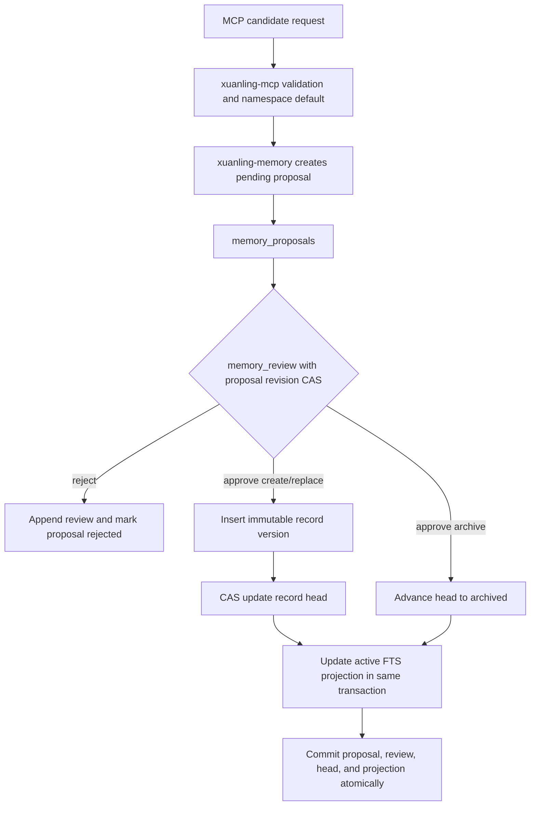
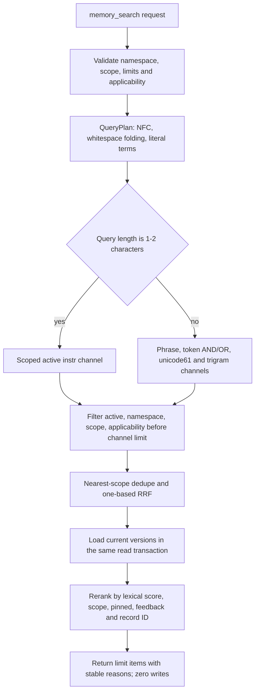

# Memory v2 架构

> 状态：当前实现；Memory schema v2、独立 `xuanling-memory` crate、9 个 Memory MCP 工具。
> 生命周期决策见
> [ADR 0001](../adr/0001-memory-v2-proposal-review.md)，检索决策见
> [RFC 0003](../adr/0003-memory-retrieval-pipeline-rfc.md)。

## 模块边界

```text
xuanling-mcp (stdio server, tool dispatch/validation)
├── xuanling-toolkit   (fs / process / project / session / artifact;无 memory)
└── xuanling-memory    (domain / store / migrations / export-import / search)
```

`xuanling-memory` 不依赖 toolkit 与任何 host 路径；`xuanling-mcp` 同时依赖 toolkit 和
Memory crate，并在结构化 domain-error envelope 中保留 Memory 错误码。默认 catalog 共 42 个
工具，Memory profile 固定暴露 9 个：

`memory_candidate_create`、`memory_candidate_replace`、`memory_candidate_archive`、
`memory_candidate_get`、`memory_candidate_list`、`memory_review`、`memory_get`、
`memory_search`、`memory_feedback`。

## 生命周期流程



## 持久化 schema(version 2)

| 表/投影 | 作用 |
| --- | --- |
| `memory_record_versions` | `(record_id, revision)` 不可变 payload、scope、hash、来源 proposal。 |
| `memory_record_heads` | 当前 revision 与 `active \| archived` 状态;维护 active dedupe 唯一性。 |
| `memory_record_tags` | version-scoped canonical tags。 |
| `memory_proposals` | create/replace/archive、request digest、idempotency、`pending \| approved \| rejected`、proposal revision。 |
| `memory_reviews` | 每 proposal 最多一个 terminal review;decision、reviewer、CAS 与 applied revision。 |
| `memory_feedback_events` | append-only、version-bound、幂等 feedback。 |
| `memory_fts_v2_unicode` / `memory_fts_v2_trigram` | derived active-only projection，不进入 export。 |
| `memory_schema_meta` | schema version 2 与 projection metadata。 |

关键不变量:

- Record revision 从 1 起;proposal revision 在 terminal 时由 1 → 2。
- 失败 review 不写 review、不改 proposal、不改 record/head/FTS。
- Active dedupe key = namespace + exact scope + NFC/newline-normalized content;
  祖先检索命中相同 key 时保留最近 scope。
- 所有 mutation 要求调用方 `idempotency_key`;同 key 同 payload 幂等返回首结果,
  同 key 不同 payload 返回 `conflict`。

## Scope 与检索

`MemoryScope` 是严格 tagged JSON,禁止空值,不做路径/Git/workspace 自动推导:

```json
{"type":"global"}
{"type":"project","project_id":"opaque-project-id"}
{"type":"workspace","project_id":"opaque-project-id","workspace_id":"opaque-workspace-id"}
```

检索链：`exact` 只读本 scope；`ancestors` 只走 workspace → project → global。一次
`memory_search` 在同一个 SQLite read transaction 中完成候选与 current-head 加载，避免并发 review
期间组合出不同 revision 的候选和 payload。



`QueryPlan` 只从 query 本身生成完全字面量的 phrase、token AND、token OR、identifier sub-token、
unicode61/trigram channel；用户输入不能注入 FTS 操作符。active、namespace、scope、applicability
和 nearest-scope dedupe 在各 channel 的 `candidate_limit` 前生效。各 channel 使用一基 rank、固定
`k=60` 的 RRF，最终顺序为 lexical relevance → scope distance → pinned → 当前 revision feedback
汇总 → record ID。

输出不含检索时间或随机 ID，不写 last-used、proposal、review、feedback 或 raw query。1-2 字查询
使用参数绑定的 `instr` fallback。FTS/JSON 能力缺失或 projection 损坏返回
`integrity_error`/`unsupported`，不扩大 scope、不读取历史版本，也不静默降级。

## Semantic（experimental）

当前 semantic trigger 为 `not_triggered`，证据见
[Semantic Trigger 决策](../plans/memory-retrieval-pipeline-semantic-decision.md)。语义召回仍是非默认
实验边界，不构成用户承诺：

- `experimental-embeddings` feature 只暴露协议中立 `Embedder` trait 与确定性测试
  双替身(`NoopEmbedder` 永远返回 typed `unsupported`,`FakeEmbedder` 用 SHA-256
  拉伸成确定性向量)。crate 不附带真实模型 adapter。
- 默认构建无模型运行时、无下载器、无网络栈(由 cargo tree 合同测试 + 源码路径
  扫描守护);MCP 默认 catalog 无任何 semantic/embed/hybrid 工具。
- 本项目不提供模型安装流程：不提供 model 目录配置、下载 UX、向量服务或
  推理后端选择。
- v2 schema 不含 embedding 行，无 stale-revision 持久化路径；未来语义失败必须保持
  lexical 结果可用(byte-identical 合同测试)。

## 错误码

`invalid_input` `not_found` `already_exists` `conflict` `database_busy` `unavailable`
`unsupported` `integrity_error` `io_error` `internal`

## JSONL 与 CLI

```text
xuanling-mcp                              # stdio server
xuanling-mcp memory export --output FILE
xuanling-mcp memory import --input FILE
xuanling-mcp memory rebuild-index
```

`--memory-db`、`--sqlite-busy-timeout-ms`、`--compat-lenient-object-params` 为共享全局
选项;默认 `~/.xuanling/memory.db`。`--compat-lenient-object-params`(默认关闭)是
ZCode host 兼容垫片:该 host 的参数矫正不解析 `$ref` 型 schema,会把 object 参数
(`output`/`scope`/`payload`/`stdout` 等)序列化成 JSON 字符串;开启后,仅对 schema
可解析为 object 的顶层参数,把可解析为 JSON object 的字符串值矫正回对象,字符串型
参数永不矫正,strict schema 仍是默认合同(经 `_meta` 的
`xuanling.compat.lenient_object_params` 可见)。JSONL format version 1:header(type/format_version/
schema_version/exported_at)+ 实体行(按稳定主键排序)+ trailer(count + SHA-256,
hash 覆盖 header 至最后一个实体行)。Export 一致性读 + 同目录临时文件,目标存在
返回 `conflict`;import 只接受空目标,单事务插入并重建 FTS;Unix 权限 0600。
