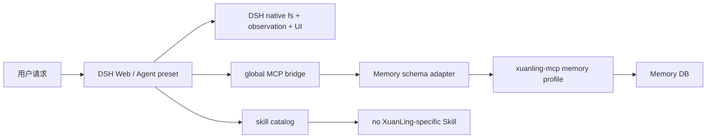
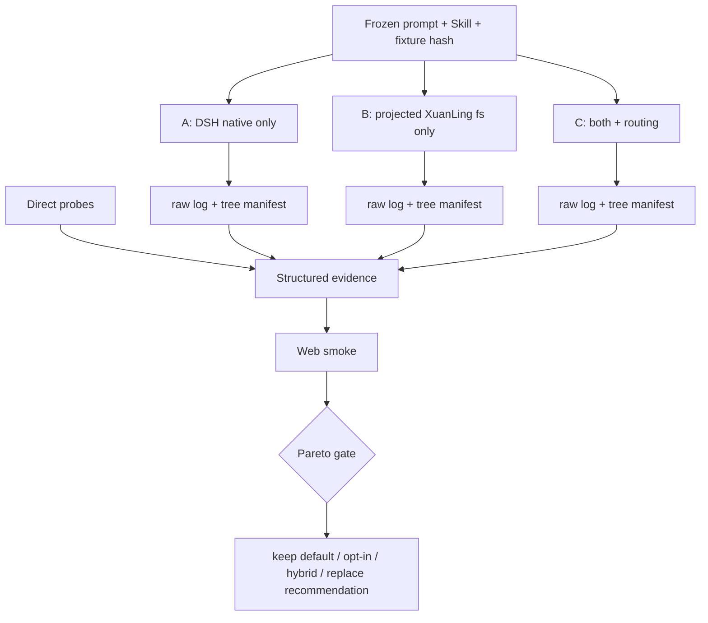

# DeepSeek Harness 专用 Skills 与文件工具评估实施计划

> 状态：实施计划；不表示当前 checkout 已完成任何工作包。
> 基线日期：2026-08-15。
> 基线 revision：`47f1cff156896cd3006258b6e4519a4bb2bc3f6a`（branch `main`）。
> 缺陷等级：`CONFIRMED P2`（DSH 推荐组合目前只有 Memory；文件工具替代/并存缺少专用 Skill、可消费 schema 和公平实测）+ `UNVERIFIED_RISK`（真实模型下哪一组形成更好的正确性/成本组合尚无证据）。
> 计划路径：`docs/plans/deepseek-harness-skills-filesystem-evaluation-development-plan.md`。
> 执行账本：`docs/plans/deepseek-harness-skills-filesystem-evaluation-execution-ledger.md`。
> 相关上游合同：`docs/guides/xuanling-mcp-integration.md`、`docs/adr/0001-memory-v2-proposal-review.md`、`docs/skills/xuanling-mcp-tools-SKILL.md`、`integrations/deepseek-harness/README.md`。
> DSH 调查基线：`/Volumes/project_home/github/deepseek-harness` revision `47f943859bef60e4160492346772ded9b24f765a`（branch `master`）；只读参考，不是允许修改范围。

## 1. 计划结论与授权边界

本轮先交付两个按需加载的 DSH 专用 Skill，再建立可重复的 A/B/C 文件工具评估：A 只暴露 DSH 原生文件工具，B 只暴露经 DSH schema 投影的 XuanLing `fs` profile，C 同时暴露两族工具并由同一个文件工作流 Skill 路由。三组使用同一模型、推理强度、Skill 正文、冻结 prompt、fixture、初始 tree hash、权限和外部 oracle；真实模型结果与直接工具探针共同形成建议。

本计划**不预先决定**替换、并存或保持 Memory-only。默认部署只有在证据完成后才可建议调整。DSH 运行时 bundle、Skill 与 policy 留在 `integrations/deepseek-harness/`；fixture、evaluation overlay、runner、analyzer、probe 与报告位于 `test/deepseek-harness/`。允许增加本仓库 `npm/test/` 合同测试和本计划文档，但禁止修改 Rust canonical schema/dispatch，也禁止修改 `/Volumes/project_home/github/deepseek-harness` checkout。

计划生成只写本文、sidecar ledger 和计划索引。Skills、测试、patch、runner 及真实模型调用均属于后续执行 Wave。

## 2. 信息来源与当前事实分级

信息优先级：本仓库 Accepted ADR/当前集成合同 → XuanLing 当前源码与 snapshot → DSH 当前源码/README/组合配置 → 当前运行进程与真实会话证据 → 历史总结。

| 结论 | 等级 | 当前 checkout 证据 | 计划处理 |
| --- | --- | --- | --- |
| XuanLing server 已有 `fs` profile，精确覆盖 16 个 `fs_*` 工具；无需新增 Rust 能力 | `CONFIRMED` | `crates/xuanling-mcp/src/profile.rs`；`tools-list.json` | C-10 禁止 Rust 修改；W3 只组合 `--tool-profile fs` |
| 推荐 `xuanling-memory` bundle 只暴露 9 个 Memory v2 工具并保留 DSH 原生文件工具 | `CONFIRMED` | `xuanling-memory/cordis.patch.yml` | 作为现状基线，不把 Memory 验收外推到文件工具 |
| 当前仓库没有随 bundle 挂载的 DSH 专用 Skill | `CONFIRMED` | `integrations/deepseek-harness/` 无 Skill bundle/`SKILL.md` | W1 红测，W2 新建独立 Skill bundle |
| DSH filesystem Skill provider 支持 `customSkillDirs`，并合并全局与 preset provider | `CONFIRMED` | DSH `skill-filesystem` 源码、web/preset composition | W2 用唯一 `providerName` 注册集成 Skill 根 |
| DSH 原生文件工具具有 read-before-edit 观察守卫、workspace sandbox、原生 diff/read 卡片 | `CONFIRMED` | DSH `tool-fs`/`fs-observation-policy` README | W4 直接探针，W6 Web 验收 |
| XuanLing 文件工具具有 sha256、显式 byte budget/续读、严格 patch、ChangeSet、完整分页等原语 | `CONFIRMED` | 当前 Skill 文档、snapshot/合同测试 | W2 路由 Skill，W4 直接探针 |
| schema adapter 已让 Memory object 参数在 DeepSeek Native/PTC 下通过，但 16 个 fs schema 尚无同等级合同/真实证据 | `CONFIRMED` + `UNVERIFIED_RISK` | projection tests 只锁定 Memory；full-catalog 变体不走 adapter | W1 正确红，W3 扩展 DSH 侧投影；禁止 ZCode lenient flag |
| `xuanling-tools-replace` 在 headless 能替换全局 fs；Web 原生 fs 来自 agent preset，不能据该 patch 声称 Web 只剩 XuanLing | `CONFIRMED` | DSH base/web/preset composition | A/B/C 主评估用 headless；Web 只验收最终混合候选 |
| 静态目录不降低 prefix 可缓存性，但工具 schema 扩大请求前缀 | `CONFIRMED` | DSH tool/skill/token-meter README | W5 记录 provider usage 与 schema bytes |
| C 是否优于 A/B、Skill 是否让模型稳定选对工具 | `UNKNOWN` | 尚无冻结任务和三轮 transcript | W5 后判断 |
| CodeGraph、LSP、embedding 下载 UX | `NON_BLOCKING` | 用户明确搁置；ADR 0001 不在范围 | 不进入实现 Wave |

## 3. 当前 checkout 基线

### 3.1 XuanLing 工作树

- Revision/branch：`47f1cff156896cd3006258b6e4519a4bb2bc3f6a` / `main`。
- 计划生成前 `git status --short --untracked-files=all` SHA-256：`7741fc50a5b2382a2a9c456770754629eda3e5fe8184b74ae42e550ec6ea054e`。
- 任务相关 tracked diff SHA-256：`e3b0c44298fc1c149afbf4c8996fb92427ae41e4649b934ca495991b7852b855`（目标 integration/tests/plans 当时均为 untracked，所以 tracked diff 为空）。
- 任务相关 untracked 内容清单 SHA-256：`9715f8a5d1031beda51edf41fbb039c02967f7ee7dc096575eb0613e2a1aae37`（写入本计划前，覆盖 `integrations/deepseek-harness` 与 `docs/plans`）。
- 工作树同时包含 Memory v2、MCP、toolkit、npm、CI、docs 的大量既有修改/删除/未跟踪文件。执行者不得回退、格式化、重命名或吸收无法归因内容；与 Allowed files 重叠时先保存逐文件 before hash。
- 现有 Memory 账本不由本计划重开或改写，也不构成文件工具验收证据。

### 3.2 DSH 只读基线

- Revision/branch：`47f943859bef60e4160492346772ded9b24f765a` / `master`。
- Dirty：两个既有 untracked 文件 `packages/core/tools/tests/xuanling-compare-measure.spec.ts` 与 `packages/mcp/mcp-client/tests/xuanling-live.spec.ts`。只作线索，禁止修改、删除、移动或用作唯一证据。
- 当前设置选择 `provider=deepseek-official`、`model=deepseek-v4-pro`、`reasoningEffort=max`；默认 permission setting 是 `danger-full-access`，禁止直接用于 benchmark。W3 必须提供不含 secret 的临时 settings 文档并固定 `workspace-write`。
- `dsh --profile headless` 只有 task 参数；从隔离 workspace 启动源码 CLI 时必须使用 DSH checkout 的 `tsx` 并设置 `TSX_TSCONFIG_PATH`，否则当前验证会错误解析 Cordis 导出。
- DSH session persistence 可配置独立 root、`compression: none`、`packChunks: false`。token meter 记录不重叠的 `uncachedInputTokens`、`cacheReadTokens`、`cacheWriteTokens`、`outputTokens`；`contextBreakdown.toolsTokens` 只是估计。

### 3.3 当前运行环境

- `127.0.0.1:3080` 当前有 DSH Web 进程，命令挂载 Memory bundle + `live-test` overlay；子进程链为 schema adapter → `target/debug/xuanling-mcp`，隔离 root 为 `/private/tmp/xuanling-dsh-live.VQcF3e`。
- 该服务只证明 Memory 路径，未挂专用 Skills，也未暴露 XuanLing `fs` profile。计划生成阶段不停止、不重启。
- W6 若无法通过账本证明 3080 监听者归本任务所有，必须保留并选择下一空闲端口；不得按端口号杀进程。
- 用户已授权本专项真实模型。live runner 仍必须要求显式 `--allow-billable-live`，避免普通测试计费。

### 3.4 可重复的当前缺口

1. `rg --files integrations/deepseek-harness` 没有专用 Skill bundle 或 Skill `SKILL.md`。
2. `xuanling-memory` 固定 `--tool-profile memory`；当前服务 catalog 不含 `mcp__xuanling__fs_*`。
3. npm projection tests 精确断言 9 个 Memory schema，未断言 16 个 `fs_*` schema。
4. full-catalog additive/replace bundle 直接启动 binary，不经过 adapter；DeepSeek object 参数仍是 `UNVERIFIED_RISK`。
5. 现有对比只有 schema 体积和源码观察，没有相同 prompt/fixture/model 下的最终 diff、错误恢复、usage、缓存和 UI 证据。

## 4. 目标合同

### C-01：专用 Skill 可发现、按需加载并随 bundle 携带

Given：DSH host 已挂 `ctx.skills`，集成 Skill bundle 从源码 overlay 或安装包加载。<br>
When：新 agent 获取 catalog，并显式加载 `xuanling-file-workflow` 或 `xuanling-memory-workflow`。<br>
Then：两个名称各出现一次；正文从 bundle 目录读取；前者只指导文件族选择，后者只指导 Memory 生命周期。<br>
And not：不复制完整 42 工具文档进系统 prompt；不依赖用户手工放入 `~/.dsh/skills`；不覆盖同名 Skill。<br>
Failure：包解析失败、重复 provider/name、无效 frontmatter 或缺失 Skill root 在 verifier/启动 gate 中明确失败。<br>
Evidence：quick validation、npm contract、`dsh --dump-config`、真实 session 的 `skill` call/body。

### C-02：同一文件 Skill 在 A/B/C 中选择可见且合适的工具

Given：同一 Skill 正文分别运行于 A（原生）、B（XuanLing）、C（并存）。<br>
When：任务需要搜索、读取、定点编辑、创建文件和核对更改。<br>
Then：A 使用原生 file tools；B 使用 `mcp__xuanling__fs_*`；C 对常规小编辑优先原生观察/UI，对 hash/CAS、byte budget、严格 patch、完整分页选择 XuanLing。<br>
And not：不调用不可见工具；不以 shell/pwsh、subagent 或进程工具绕过；不无意义双重读取。<br>
Failure：目标工具 typed error 时按该族合同恢复；B 不得静默回退 A。<br>
Evidence：三组 transcript 工具名/参数、错误/重试和外部 diff oracle。

### C-03：Memory Skill 保持 proposal/review 的人工声明边界

Given：Memory v2 九工具可见，agent 发现可能长期有价值的信息。<br>
When：agent 选择保存、替换或归档。<br>
Then：先 search/get，只创建 pending candidate 并返回 proposal id/revision；只有收到用户对具体 proposal 的显式批准/拒绝指令后才 `memory_review`。<br>
And not：不伪造 reviewer、不把 agent 判断描述为人工审核、不在 candidate 后自动 approve；解析/模型/工具失败直接跳过写入。<br>
Failure：conflict/stale/store unavailable 保持 typed failure；candidate 重试只复用原 idempotency key + 相同 payload。<br>
Evidence：Skill 静态规则测试；两段式真实会话。

### C-04：A/B/C 目录在 discovery 与 dispatch 两侧严格隔离

Given：同一 headless 基线和 Skill bundle。<br>
When：分别组装 A、B、C overlay。<br>
Then：A 有 DSH 原生 file family、无 XuanLing fs；B 有精确 16 个 XuanLing fs、无原生 file family；C 同时有两者。三组 shell/pwsh 关闭。<br>
And not：B 不暴露 full 42、Memory、process 或 advanced；隐藏工具 dispatch 也必须失败。<br>
Failure：目录漂移、duplicate registration 或 MCP startup failure 使 arm 启动失败。<br>
Evidence：组合 parser、真实 registry catalog、隐藏工具负向 dispatch、profile metadata。

### C-05：DSH fs schema 投影可消费且不改变 canonical 调用

Given：当前 16 个 fs input schema，包含 `$defs/$ref`、tagged object 和约束词汇。<br>
When：adapter 投影 `tools/list`，Native/PTC 生成并执行 nested object 参数。<br>
Then：模型面 schema 全部落入 DSH 子集，object 仍是 object；`tools/call` 参数逐字转发并由 Rust strict schema 验证。<br>
And not：不启用 `--compat-lenient-object-params`，不解析字符串参数，不改 Rust schema/DTO/dispatch，不删除 result 表示。<br>
Failure：悬空/循环 ref、无法证明等价的 union/keyword 在注册前失败；malformed call 仍为 canonical `-32602`。<br>
Evidence：16/16 schema contract、object round-trip、malformed negative、Native/PTC transcript。

### C-06：冻结 benchmark 可独立验证最终正确性

Given：同一无 secret fixture、任务、初始 manifest/hash、模型和 Skill 正文。<br>
When：A/B/C 各从重建后的同一路径执行三次独立 session。<br>
Then：外部 oracle 检查测试、允许文件、最终内容/hash 和禁止改动；runner 记录 session/log/workspace identity。<br>
And not：不相信模型自报，不共享 trial 修改，不在真实仓库运行，不复用失败 workspace。<br>
Failure：模型/tool failure 计有效失败；第一次 tool call 前 transport failure 标 `infra_invalid`，只可从干净 fixture 重跑一次且保留原证据。<br>
Evidence：每 arm 3 个 raw log、tree manifest、oracle JSON 和聚合报告。

### C-07：成本、缓存和交互效率使用同口径证据

Given：A/B/C 的 frozen prompt/route/cwd/Skill、request header 和 provider usage。<br>
When：执行 quality trials 与每 arm 紧邻 cold/warm 对。<br>
Then：报告 schema bytes、`toolsTokens`（标估计）、uncached/cache-read/cache-write/output tokens、缓存读取占比、tool calls、errors、wall time 和 result bytes。<br>
And not：不把静态目录说成降低命中率，不把 bytes 估计冒充 provider tokens，不硬编码价格或合并不同 route。<br>
Failure：usage 缺失、route 不一致或 log 不完整使经济比较为 `unverified`，不能补零。<br>
Evidence：JSONL analyzer 与逐 arm raw usage。

### C-08：独有能力与失败恢复由直接探针证明

Given：相同临时文件树和非模型 direct-call harness。<br>
When：运行 duplicate match、read 后外部变更、preimage mismatch、超量 search/glob、bounded continuation、invalid UTF-8、workspace 越界和取消清理。<br>
Then：两族的状态码、截断、恢复动作、守卫和输出体积逐项记录。<br>
And not：不从 description 推断运行行为，不把不存在的能力记为失败，不放宽 timeout/断言。<br>
Failure：fixture/bridge wrong failure 先修 harness 再比较。<br>
Evidence：结构化 probe report、before/after hash、进程/文件残留。

### C-09：最终候选在真实 Web DSH 可用并保持服务运行

Given：W5 报告完成，使用新隔离 workspace/session/settings/memory DB。<br>
When：在未占用端口启动 Web，加载 Skill bundle 与证据支持的候选，执行 file smoke 和 Memory proposal-only smoke。<br>
Then：Skill/file call 成功，UI/错误可读，Memory 不自审；进程链/URL 落账，服务保持运行。<br>
And not：不终止身份不明 3080，不用默认 Memory DB，不把 headless 外推为 UI 通过。<br>
Failure：端口冲突选下一端口；adapter/bridge/child 退出即 acceptance 失败。<br>
Evidence：浏览器/API transcript、UI screenshot/检查、`lsof`/process chain、URL。

### C-10：宿主适配与测试不污染核心、上游或真实数据

Given：dirty XuanLing/DSH checkout 与真实 DB/credentials/settings。<br>
When：执行全部 Waves。<br>
Then：变更只在 Allowed files；DSH revision/status/两个 untracked hash 不变；Rust/snapshot 不变；自动化显式使用 temp roots。<br>
And not：不写 DSH repo、`crates/**`、secret、默认 DB 或 `~/.dsh/settings.yaml`。<br>
Failure：默认 DB/WAL/SHM、DSH checkout 或 forbidden path 指纹变化立即停止并记录 incident。<br>
Evidence：前后 fingerprint、default DB hash、secret scan、Allowed files audit。

### C-11：部署建议由 Pareto 证据产生

Given：C-04 至 C-09 证据齐全。<br>
When：比较 mandatory correctness、独有恢复、provider usage/cache、errors 和 Web 集成损失。<br>
Then：在 `memory-only + native fs`、`memory + opt-in XuanLing fs`、`hybrid`、`replace` 中给出建议及反证；缺成本容忍值时保持现有默认并将 fs 标实验 opt-in。<br>
And not：不因单次成功、schema 更短、mock/probe 或模型主观回复宣布替换。<br>
Failure：任一 arm 少于三次有效 trial、Web 未验收或 evidence stale 时只给 provisional 建议。<br>
Evidence：版本化报告与 raw evidence 链接。

## 5. 需求覆盖矩阵

| 需求 | 主合同 | 辅助合同 | 当前缺口 | 目标行为 | Wave | 红测试/Oracle | 最终证据 |
| --- | --- | --- | --- | --- | --- | --- | --- |
| R-01 DSH 不只用 Memory，也用文件编辑 | C-04 | C-02/C-05 | 推荐 bundle 仅 Memory | A/B/C 精确暴露/执行 | W3 | overlay/fs gate 缺失 | registry + dispatch |
| R-02 先做好 DSH 专用 Skills | C-01 | C-02/C-03 | 无 bundle Skill | 两个按需 Skill | W2 | bundle missing red | validation + load |
| R-03 Memory 不自动自审，失败跳过写入 | C-03 | C-10 | 无 DSH 使用策略 | candidate/review 分回合 | W2/W6 | forbidden sequence | two-turn transcript |
| R-04 比较两族文件工具优劣 | C-06 | C-07/C-08 | 只有体积/源码观察 | 同任务 3×3 + probes | W4/W5 | benchmark missing | raw logs/report |
| R-05 保持缓存命中并量化前缀 | C-07 | C-04 | 无 provider usage | cold/warm + bytes | W5 | analyzer missing | token/cache table |
| R-06 DSH 逻辑留 integration，Rust 不改 | C-10 | C-05 | 文件 host 投影未验 | integration-only | 全部 | forbidden diff | fingerprints |
| R-07 启动 DSH 试用插件 | C-09 | C-01/C-02/C-03 | 当前服务无 Skill/fs | 隔离 Web + URL | W6 | current catalog gap | browser/process |
| R-08 测完再定部署 | C-11 | C-06..C-09 | 无完整 fs 决策证据 | report 后建议 | W6/W7 | decision gate | evidence map |

## 6. 已确认路径与目标路径

### 6.1 当前路径



### 6.2 目标实验路径



Skill provider 只给按需指导；adapter 只投影 discovery schema；bridge 原样转发 call/result；Rust server 保持 canonical validation/capability；runner 只创建 temp fixture/settings/session/DB；analyzer 只读 raw logs；外部 oracle 判定文件行为。

## 7. 影响边界矩阵

| 模块/边界 | 当前职责 | 允许变化 | 必须保持 | 合同 | 验证 |
| --- | --- | --- | --- | --- | --- |
| `xuanling-skills/` | N/A | bundle、两个 Skill、metadata | provider/name 唯一、按需加载 | C-01..C-03 | contract/validation/live |
| `xuanling-memory/schema-*` | Memory discovery 投影 | 补 fs 覆盖或无行为变化 helper | call 原样、Memory 9/9 | C-05 | unit/verifier |
| `test/deepseek-harness/` | Repository acceptance | A/B/C、temp config、runner/report | fail closed；不进入安装 bundle | C-04/C-06..C-10 | raw evidence |
| `npm/test/` | integration contracts | 新/扩展无网络测试 | `npm test` 不 billable | C-01/C-04/C-05/C-10 | npm tests |
| `crates/xuanling-mcp` | canonical catalog/dispatch | 禁止 | fs16/memory9 strict | C-04/C-05/C-10 | snapshot hash |
| DSH checkout | host runtime | 只读 | revision/status/hash | C-10 | pre/post fingerprint |
| DSH fs/sandbox | native execution/guard | N/A | A/C observation + workspace-write | C-02/C-08 | probes/logs |
| XuanLing fs capability | MCP execution | N/A | B/C workspace-root | C-04/C-08 | bridge/outside negative |
| Memory store | proposal/review | temp DB smoke | no self-review/default write | C-03/C-10 | transcript/SQLite audit |
| session persistence | evidence | temp raw JSONL | one trial/session | C-06/C-07 | parser |
| UI/presenter | cards | 不改 UI | native/MCP facts不混淆 | C-09 | browser |
| telemetry/audit | default off | 显式 disable | local logs/no secrets | C-10 | config/scan |
| migration/backup | N/A：无 schema migration | 无 | 不改真实数据 | C-10 | DB fingerprint |
| CodeGraph/LSP/embed | deferred | 禁止 | 本轮不扩张 | 非目标 | diff audit |

## 8. 全局不变量

1. Canonical facts 是 Rust schema、DSH raw event、fixture tree manifest、Memory tables；schema projection/token table/report 是 derived，不得反向改 canonical。
2. Skill catalog 只注入名称/短描述；正文由 `skill` 按需加载。文件 A/B/C 的 Skill content hash 完全相同。
3. candidate pending 不是 canonical record；没有具体用户 review 指令时 terminal 是 awaiting review。
4. A/B/C 必须同时约束 discovery 与 dispatch。
5. 每个 trial 从相同路径的同一 fixture manifest 恢复；arm 内 cache pair 使用相同 cwd。
6. route 固定 `deepseek-official/deepseek-v4-pro`、`reasoningEffort=max`，每个 request header 复核。
7. permission 固定 `workspace-write`；shell/pwsh 关闭。其他 mutation/delegation 使 trial 失败。
8. usage 缺失保持 `unknown`；缓存读取占比为 `cacheRead/(uncached+cacheRead+cacheWrite)`，分母 0 为 N/A。
9. 自动化显式传 temp workspace/session/settings/memory DB，设置 `DSH_TELEMETRY_DISABLED=1`，不输出 credential。
10. A/B/C 各需三次有效 trial；Skill/adapter/fixture/prompt/route/permission/catalog/analyzer 修改后计数归零。
11. timeout 由 runner 外部结算 TERM→grace→KILL 捕获的 process group，并保留 partial log。
12. 不 publish、push、commit、清理真实数据或改用户设置；最终 Web 服务是唯一有意保留的 runtime side effect。

## 9. Wave 依赖与状态机

```text
not_started -> red_confirmed -> implemented_unverified -> deterministic_green -> complete
实现或合同变化 -> implemented_unverified
错误红因、fingerprint 漂移、默认数据触碰、required gate 失败 -> red_confirmed / blocked
```

严格依赖：`W0 -> W1 -> W2 -> W3 -> W4 -> W5 -> W6 -> W7`。只有前一 Wave `complete` 才能进入下一 Wave。

## Wave 0：冻结 checkout、宿主与真实数据基线

### 目标与合同

- 覆盖合同：C-10。
- 可观测结果：相关文件、DSH dirty 文件、默认 DB、3080 listener、模型/permission 与验证命令均有 hash/身份记录。
- 明确不处理：不创建 Skill、不停服务、不调用模型。

### Entry gate

- [ ] 完整读取 `AGENTS.md`、本文和 ledger。
- [ ] 重新运行两个 checkout revision/status。
- [ ] 计划文件、ledger、索引是唯一可归因的新文档。

### Allowed files

- 本计划 ledger。

### Forbidden changes

- `crates/**`、`integrations/**`、`npm/test/**`、DSH checkout、默认设置/DB、运行进程。

### 红测试与基线

| Oracle | Trigger | Expected old failure | Wrong failure |
| --- | --- | --- | --- |
| checkout fingerprint | 比较 authoring baseline | 只有 plan/ledger/index 漂移 | 不可归因变化 |
| catalog inventory | snapshot + DSH source | fs=16、memory=9；原生族真实确认 | 旧报告代替解析 |
| process identity | `lsof` + argv/parent | memory-only 隔离链 | 仅按端口猜 ownership |

### 实施工作包

| Package | Path | Contract | Failure behavior | Targeted validation |
| --- | --- | --- | --- | --- |
| W0.1 | two checkout/status/hash | C-10 | 漂移先归因；不能归因则 stop | git status/revision/hash |
| W0.2 | catalog/settings/process | C-10 | 不读取 secret value | snapshot/safe fields/lsof |
| W0.3 | default DB + DSH dirty hashes | C-10 | absent 只记录，不创建 | stat/shasum |

### 验证命令

| Command | Provenance | Expected result | Required |
| --- | --- | --- | --- |
| `git status --short --untracked-files=all && git rev-parse HEAD` | repo instructions | 完整记录 | required |
| `git -C /Volumes/project_home/github/deepseek-harness status --short && git -C /Volumes/project_home/github/deepseek-harness rev-parse HEAD` | DSH instructions | 可解释 | required |
| `node -e "const f=require('fs');const x=JSON.parse(f.readFileSync('crates/xuanling-mcp/tests/snapshots/tools-list.json'));for(const p of ['fs_','memory_']) console.log(p,x.filter(t=>t.name.startsWith(p)).length);console.log('all',x.length)"` | snapshot | 16/9/42 或记录当前漂移 | required |

### Evidence

- Behavior before/Red/After/Files/Commands/API/storage/external/secret evidence：待 W0 执行后逐项写入 ledger；计划生成不预填通过。

### Exit gate

- [ ] dirty/untracked、重叠 diff、DSH untracked hashes 已记录。
- [ ] default DB 主/WAL/SHM 和 settings 仅记录 hash/安全字段。
- [ ] listener identity 落账；next_action 唯一指向 W1.1。

### Stop conditions

- 不可归因改动重叠；检查会暴露 secret；revision 漂移未重新调查。

## Wave 1：建立正确红测试与实验合同

### 目标与合同

- 覆盖合同：C-01、C-04、C-05、C-06、C-07、C-08、C-10。
- 可观测结果：缺 Skill bundle、fs projection、A/B/C overlays、fixture/runner/analyzer 时各因目标缺口正确红。
- 明确不处理：不实现，不调用模型。

### Entry gate

- [ ] W0 complete；before hashes 覆盖目标 tests/integration；DSH baseline 不变。

### Allowed files

- `npm/test/deepseek-harness-bundle.test.mjs`
- `npm/test/deepseek-schema-projection.test.mjs`
- `npm/test/deepseek-harness-skills.test.mjs`
- `npm/test/deepseek-filesystem-evaluation.test.mjs`
- `test/deepseek-harness/evaluation/fixtures/**`
- ledger。

### Forbidden changes

- production bundle/adapter/Skill/runner、Rust、DSH checkout。

### 红测试与基线

| Test | Trigger | Expected old failure | Wrong failure |
| --- | --- | --- | --- |
| Skill contract | 读目标 manifest/patch/SKILL | files missing | parser/fixture crash |
| fs projection | 过滤 16 schemas | unsupported/uncovered per tool | snapshot invalid |
| A/B/C composition | parse overlays | files/catalog missing | parser拒绝约定合法结构 |
| fixture oracle | raw fixture | 目标行为断言红 | syntax/dependency failure |
| analyzer | synthetic logs | analyzer missing | synthetic vocabulary stale |

### 实施工作包

| Package | Path | Contract | Failure behavior | Targeted validation |
| --- | --- | --- | --- | --- |
| W1.1 | Skill/bundle red | C-01..C-03 | 只接受 missing target | targeted node test |
| W1.2 | projection/catalog red | C-04/C-05 | 16 names逐一报告 | targeted tests |
| W1.3 | fixture/analyzer red | C-06..C-08 | raw fixture正确红 | targeted tests |

### 验证命令

| Command | Provenance | Expected result | Required |
| --- | --- | --- | --- |
| `node --test npm/test/deepseek-harness-skills.test.mjs` | new contract | correct red | required |
| `node --test npm/test/deepseek-schema-projection.test.mjs` | existing | new fs red；Memory green | required |
| `node --test npm/test/deepseek-filesystem-evaluation.test.mjs` | new | fixture/runner red | required |

### Evidence

- Behavior before/Red/After/Files/Commands/API/storage/external/secret evidence：待 W1 执行写 ledger；wrong failure 不计证据。

### Exit gate

- [ ] 每合同有正确红；Memory 旧测绿；无网络/default DB/model；next_action=W2.1。

### Stop conditions

- 需弱化既有断言、写 DSH repo，或红因是工具链/损坏 snapshot。

## Wave 2：创建并挂载两个按需 DSH Skills

### 目标与合同

- 覆盖合同：C-01、C-02、C-03、C-10。
- 可观测结果：两个 Skill 经独立 bundle provider 被发现/加载，正文简洁且职责分离。
- 明确不处理：不暴露 XuanLing fs，不跑 A/B/C，不改 Memory store。

### Entry gate

- [ ] W1 complete；`skill-creator` 主文件和 `openai_yaml.md` 已完整读取；输出路径固定。

### Allowed files

- `integrations/deepseek-harness/xuanling-skills/**`
- integration README、W1 Skill test、ledger。

### Forbidden changes

- Memory/adapter 行为、Rust、DSH repo、用户 Skill roots、benchmark 结论。

### 红测试与基线

| Test | Trigger | Expected old failure | Wrong failure |
| --- | --- | --- | --- |
| package files | npm contract | missing | version parser fail |
| DSH discovery | custom root | Skills absent | base registry absent |
| file Skill lint | tool/routing rules | no body | 猜测模型输出 |
| memory Skill lint | candidate/review | no body | 禁止显式用户 review |

### 实施工作包

| Package | Path | Contract | Failure behavior | Validation |
| --- | --- | --- | --- | --- |
| W2.1 | skill-creator init ×2 | C-01 | init 失败不手写模板绕过 | quick_validate |
| W2.2 | `xuanling-file-workflow` | C-02 | 不假设某族必然存在 | static + load |
| W2.3 | `xuanling-memory-workflow` | C-03 | candidate 后 stop；review 要用户指令 | static + synthetic |
| W2.4 | `xuanling-dsh-skills` bundle | C-01/C-10 | source/package resolve fail loud | parser/dump-config |
| W2.5 | `agents/openai.yaml` | C-01 | DSH不读取，只作 portable metadata | generator/validation |

### 验证命令

| Command | Provenance | Expected result | Required |
| --- | --- | --- | --- |
| `python3 /Users/ikaros/.codex/skills/.system/skill-creator/scripts/quick_validate.py integrations/deepseek-harness/xuanling-skills/skills/xuanling-file-workflow` | skill-creator | valid | required |
| `python3 /Users/ikaros/.codex/skills/.system/skill-creator/scripts/quick_validate.py integrations/deepseek-harness/xuanling-skills/skills/xuanling-memory-workflow` | skill-creator | valid | required |
| `node --test npm/test/deepseek-harness-skills.test.mjs` | W1 | green | required |
| `pnpm dsh --profile headless --patch /Volumes/project_home/github/xuanling/integrations/deepseek-harness/xuanling-skills/cordis.patch.yml --dump-config` | DSH CLI | unique provider/root | required |
| `npm pack --dry-run ./integrations/deepseek-harness/xuanling-skills` | package | expected files only | required |

### Evidence

- Behavior before/Red/After/Files/Commands/API/storage/external/secret evidence：待 W2 执行写 ledger；生成器命令和 file hashes 必须记录。

### Exit gate

- [ ] 两 Skill validation/static/discover/load 绿；正文各 <500 行；metadata 与触发一致；普通 tests无模型；next_action=W3.1。

### Stop conditions

- 需改 DSH parser；同名冲突无法明确；Memory 指令无法守住显式 review 边界。

## Wave 3：构建 fs schema 投影与 A/B/C 隔离组合

### 目标与合同

- 覆盖合同：C-04、C-05、C-10。
- 可观测结果：16 fs schemas 可投影；A/B/C 目录/dispatch 精确；配置使用 temp settings/session/DB 和 workspace-write。
- 明确不处理：不改默认 bundle，不改 Rust，不调用 billable model。

### Entry gate

- [ ] W2 complete；fs projection/catalog red 原因正确；Memory 9/9 baseline 记录。

### Allowed files

- `xuanling-memory/schema-adapter.mjs`、`schema-projection.mjs`
- `test/deepseek-harness/evaluation/**`、`test/deepseek-harness/live-test/**`、bridge verifier
- integration runtime adapter、bundle patch 与 README
- 相关 npm tests、ledger。

### Forbidden changes

- `crates/**`/snapshot 内容、ZCode compat flag、call coercion、result 字段删除、DSH repo、3080 process。

### 红测试与基线

| Test | Trigger | Expected old failure | Wrong failure |
| --- | --- | --- | --- |
| fs subset | project 16 schemas | uncovered/unsupported names | Memory regression |
| catalogs | registry probe | A/B/C not exact | binary/fixture missing |
| hidden dispatch | call hidden name | UNKNOWN_TOOL | domain error说明仍 dispatch |
| isolated config | omit temp env | startup fail | fallback default path |

### 实施工作包

| Package | Path | Contract | Failure behavior | Validation |
| --- | --- | --- | --- | --- |
| W3.1 | fs projection coverage | C-05 | 不可证明即 fail | 16/16 unit |
| W3.2 | common isolation overlay | C-04/C-10 | 缺任一 env fail | config negatives |
| W3.3 | A native-only | C-04 | XuanLing hidden/unknown | registry probe |
| W3.4 | B XuanLing-only | C-04/C-05 | bridge fail，无 native fallback | exact16/negative |
| W3.5 | C hybrid | C-04/C-05 | duplicate fail | exact union |
| W3.6 | temp settings/session | C-06/C-07/C-10 | raw logs temp、settings无 secret | dump/path audit |

### 验证命令

| Command | Provenance | Expected result | Required |
| --- | --- | --- | --- |
| `node --test npm/test/deepseek-schema-projection.test.mjs` | projection suite | Memory9 + fs16 green | required |
| `node --test npm/test/deepseek-harness-bundle.test.mjs npm/test/deepseek-filesystem-evaluation.test.mjs` | contracts | A/B/C/config green | required |
| `node test/deepseek-harness/scripts/verify-deepseek-bridge.mjs --binary target/debug/xuanling-mcp --tool-profile fs` | verifier extension | exact16/round-trip | required |
| `TSX_TSCONFIG_PATH=/Volumes/project_home/github/deepseek-harness/tsconfig.json /Volumes/project_home/github/deepseek-harness/node_modules/.bin/tsx test/deepseek-harness/evaluation/scripts/inspect-catalog.ts --dsh-root /Volumes/project_home/github/deepseek-harness --binary target/debug/xuanling-mcp --arms A,B,C` | DSH source runtime | exact sets + hidden dispatch；显式 temp DB | required |

### Evidence

- Behavior before/Red/After/Files/Commands/API/storage/external/secret evidence：待 W3 执行写 ledger；必须记录 canonical snapshot before/after hash。

### Exit gate

- [ ] fs16/Memory9 全绿且 snapshot hash不变；A/B/C discovery+dispatch exact；shell关、workspace-write；no fallback negative绿；next_action=W4.1。

### Stop conditions

- 需改 Rust/compat flag；headless不能同时隐藏 discovery/dispatch；temp settings不能固定 pro/max + workspace-write。

## Wave 4：完成 fixture、oracle、直接探针与证据分析器

### 目标与合同

- 覆盖合同：C-06、C-07、C-08、C-10。
- 可观测结果：无模型时可生成/重置 fixture、正确判红/绿、解析 synthetic/真实格式 logs，并输出两族直接探针报告。
- 明确不处理：不调用真实模型，不给部署建议。

### Entry gate

- [ ] W3 complete；fixture/oracle/analyzer 红因正确；从 temp cwd 的 DSH `tsx` invocation 已验证。

### Allowed files

- `test/deepseek-harness/evaluation/**`
- `test/deepseek-harness/scripts/**`
- 相关 npm tests、ledger。

### Forbidden changes

- Rust、DSH repo、用户数据和 live model/API。

### 红测试与基线

| Test | Trigger | Expected old failure | Wrong failure |
| --- | --- | --- | --- |
| raw fixture | external oracle | target behavior red、forbidden untouched | syntax/dependency error |
| solved fixture | expected patch applied to temp | oracle green | 只检查模型文本 |
| stale/duplicate | direct calls | typed guards/errors | bridge startup error |
| cap/pagination | over-cap fixture | 截断/续读语义被区分 | fixture 未超过上限 |
| analyzer | complete/incomplete/route-mismatch logs | aggregate/refuse exact | missing usage补零 |

### 实施工作包

| Package | Path | Contract | Failure behavior | Validation |
| --- | --- | --- | --- | --- |
| W4.1 | fixture generator + frozen prompt | C-06 | manifest mismatch拒绝 | create twice identical |
| W4.2 | external oracle | C-06 | forbidden/test failure nonzero | raw red + solved green |
| W4.3 | direct tool probe | C-08 | wrong failure单独分类 | structured JSON |
| W4.4 | session analyzer | C-07 | incomplete/usage missing unknown | synthetic tests |
| W4.5 | live runner dry-run | C-06/C-10 | 无 allow flag 永不启动模型 | argv/env/path snapshot |

### 验证命令

| Command | Provenance | Expected result | Required |
| --- | --- | --- | --- |
| `node --test npm/test/deepseek-filesystem-evaluation.test.mjs` | W1 | red/solved/analyzer/dry-run green | required |
| `node test/deepseek-harness/evaluation/scripts/run-filesystem-evaluation.mjs --dry-run --dsh-root /Volumes/project_home/github/deepseek-harness --binary target/debug/xuanling-mcp --arms A,B,C` | runner | redacted argv/env names/paths only；包含 `XUANLING_TEST_MEMORY_DB` | required |
| `TSX_TSCONFIG_PATH=/Volumes/project_home/github/deepseek-harness/tsconfig.json /Volumes/project_home/github/deepseek-harness/node_modules/.bin/tsx test/deepseek-harness/evaluation/scripts/probe-filesystem-tools.ts --dsh-root /Volumes/project_home/github/deepseek-harness --binary target/debug/xuanling-mcp` | current runtimes | probe report complete | required |
| `git diff --check` | repo gate | clean | required |

### Evidence

- Behavior before/Red/After/Files/Commands/API/storage/external/secret evidence：待 W4 执行写 ledger；dry-run 必须证明没有网络/model process。

### Exit gate

- [ ] fixture twice identical；raw red/solved green；probes覆盖适用边界；analyzer fail closed；普通 tests不 billable；next_action=W5.1。

### Stop conditions

- benchmark 需真实 repo/secret；oracle不能独立判断；direct probe需改 DSH source。

## Wave 5：执行真实模型 A/B/C 与 cache/usage 验收

### 目标与合同

- 覆盖合同：C-02、C-04、C-05、C-06、C-07、C-10。
- 可观测结果：A/B/C 各三次有效 quality trial，另有每 arm cold/warm pair；raw logs、manifests、oracle、usage 可追溯。
- 明确不处理：不启动最终 Web，不改默认推荐，不发布。

### Entry gate

- [ ] W4 complete；`--allow-billable-live` gate 已证明；用户授权仍适用。
- [ ] route/settings/permission/fixture/prompt/Skill hashes 冻结。
- [ ] default DB 与 DSH checkout pre-live hashes 已记录。

### Allowed files

- `test/deepseek-harness/evaluation/filesystem-tools-report.md` 的 evidence 段。
- ledger。
- runtime 只写 `/private/tmp/xuanling-dsh-fs-eval.${XUANLING_DSH_RUN_ID}/**`；runner 必须先校验该变量为新生成的非空安全标识且目标目录不存在。

### Forbidden changes

- 其他 repo 文件、default DB、`~/.dsh/settings.yaml`、DSH repo；trial 间保留 workspace 修改。

### 红测试与基线

| Test | Trigger | Expected old failure | Wrong failure |
| --- | --- | --- | --- |
| no-allow preflight | runner without flag | before startup拒绝 | 启动后拒绝 |
| route gate | first request/header | exact pro/max | secret泄漏 |
| manifest gate | each trial | frozen hash exact | 只检查目录 |
| quality | frozen prompt | 不预设赢家 | 模型自报当 oracle |
| cold/warm | same arm/prompt/cwd | provider usage or explicit unknown | estimate填 usage |

### 实施工作包

| Package | Path | Contract | Failure behavior | Validation |
| --- | --- | --- | --- | --- |
| W5.1 | live preflight | C-06/C-10 | hash/route/permission mismatch stop | dry/live argv compare |
| W5.2 | A quality ×3 | C-02/C-06 | model/tool failure计失败；infra最多重跑1 | each oracle |
| W5.3 | B quality ×3 | C-02/C-05/C-06 | no native fallback | each oracle |
| W5.4 | C quality ×3 | C-02/C-06 | each call route分类 | each oracle |
| W5.5 | cold/warm × A/B/C | C-07 | prefix不一致 pair invalid | usage analyzer |
| W5.6 | aggregate | C-07 | 不声称统计显著性 | report verifier |

### 验证命令

| Command | Provenance | Expected result | Required |
| --- | --- | --- | --- |
| `node test/deepseek-harness/evaluation/scripts/run-filesystem-evaluation.mjs --allow-billable-live --dsh-root /Volumes/project_home/github/deepseek-harness --binary target/debug/xuanling-mcp --model deepseek-official/deepseek-v4-pro --reasoning-effort max --quality-runs 3 --cache-pairs 1 --arms A,B,C` | explicit live runner | 完整 artifacts；每 trial 独立 Memory DB；exit 0 只表示采集完整 | required |
| `node test/deepseek-harness/evaluation/scripts/analyze-filesystem-evaluation.mjs --root "$XUANLING_DSH_EVAL_ROOT" --verify` | analyzer | route/log/hash/oracle/usage分类完整 | required |
| `node test/deepseek-harness/evaluation/scripts/verify-filesystem-fixture.mjs --all "$XUANLING_DSH_EVAL_ROOT"` | external oracle | independently rerun all | required |
| `git -C /Volumes/project_home/github/deepseek-harness status --short --untracked-files=all` + ledger hash script | C-10 | W0 exact | required |

### Evidence

- Behavior before/Red/After/Files/Commands/API/storage/external/secret evidence：待 W5 写入 report + ledger；每 trial 保存 exact ids/hashes，不保存 credential。

### Exit gate

- [ ] A/B/C 各三次有效 trial；修改后计数归零重跑。
- [ ] 每 trial 有 exact route、Skill load、calls/results、oracle、manifest、usage/unknown。
- [ ] cold/warm 不跨 arm/cwd/prompt/schema；default DB/settings/DSH repo不变；secret scan绿；next_action=W6.1。

### Stop conditions

- 授权撤回；provider/rate-limit 连续不可用；需展示 credential；触碰默认数据/真实 repo；route/effort不能固定；任一 arm不足三次且授权内无法继续。

## Wave 6：生成建议并在 Web DSH 试用候选

### 目标与合同

- 覆盖合同：C-03、C-09、C-11、C-10。
- 可观测结果：先形成 evidence-backed candidate，再以新的隔离 Web 服务验证 Skill、file、Memory proposal-only 和 UI；服务保持运行。
- 明确不处理：不修改生产默认 bundle、不发布、不自行 review。

### Entry gate

- [ ] W5 complete，report 可从 raw evidence 重算；候选遵循 C-11。
- [ ] port/workspace/session/settings/memory DB 均为隔离路径。

### Allowed files

- `test/deepseek-harness/evaluation/filesystem-tools-report.md`。
- `test/deepseek-harness/evaluation/scripts/verify-report.mjs`。
- `npm/test/deepseek-filesystem-evaluation.test.mjs`（只覆盖 report verifier 的 fail-closed 合同）。
- integration README、ledger。
- runtime 只写 `/private/tmp/xuanling-dsh-web-eval.${XUANLING_DSH_RUN_ID}/**`；沿用 W5 已落账的 run id 时必须新建 `web/` 子树，不得覆盖评估 evidence。

### Forbidden changes

- production bundle behavior、未知 3080 listener、default DB、DSH repo、Rust。

### 红测试与基线

| Test | Trigger | Expected old failure | Wrong failure |
| --- | --- | --- | --- |
| decision completeness | report verifier | 缺少 v1 evidence manifest 或其与 W5 原始根不一致 | verifier硬编码赢家或只检查 Markdown 存在 |
| Web catalog | new session | current service无 Skill/fs | reuse old session |
| proposal-only | save fixture insight | pending/no review | DB未隔离 |
| explicit review | second user approval | then review | same turn auto-review |
| UI | native/MCP calls | readable/distinct | only HTTP 200 |

### 实施工作包

| Package | Path | Contract | Failure behavior | Validation |
| --- | --- | --- | --- | --- |
| W6.1 | Pareto draft | C-11 | 缺证据写 provisional | report verifier |
| W6.2 | start Web | C-09/C-10 | conflict选新 port；child fail | lsof/process chain |
| W6.3 | file Skill smoke | C-01/C-02/C-09 | UI/session failure落账 | browser/API/oracle |
| W6.4 | Memory two-turn | C-03/C-09 | first turn review = fail | transcript/SQLite audit |
| W6.5 | keep running | C-09 | 记录 session id/URL/roots | health check |

### 验证命令

| Command | Provenance | Expected result | Required |
| --- | --- | --- | --- |
| `pnpm dsh web --patch /Volumes/project_home/github/xuanling/integrations/deepseek-harness/xuanling-skills/cordis.patch.yml --patch "$XUANLING_DSH_CANDIDATE_PATCH" --patch "$XUANLING_DSH_ISOLATED_WEB_PATCH"` | DSH CLI/integration | new port + live children | required |
| `node test/deepseek-harness/evaluation/scripts/verify-report.mjs test/deepseek-harness/evaluation/filesystem-tools-report.md "$XUANLING_DSH_EVAL_ROOT"` | evidence gate | every conclusion sourced | required |
| Browser/API smoke（执行当轮先完整读取 Browser skill） | Web acceptance | Skill/file/two-turn/UI | required |

### Evidence

- Behavior before/Red/After/Files/Commands/API/storage/external/secret evidence：待 W6 写 ledger；必须记录最终 URL、process tree、temp roots 与 UI artifact。

### Exit gate

- [ ] 建议区分 verified/tradeoff/unknown/deferred；Web file oracle绿；Memory分回合；UI绿；URL/process/session id落账且服务存活；next_action=W7.1。

### Stop conditions

- Web需改 DSH upstream/preset；只能杀未知进程取端口；Web与 headless结论冲突（回 W5/W6，不忽略）。

## Wave 7：最终回归、文档与交付门禁

### 目标与合同

- 覆盖合同：C-01 至 C-11。
- 可观测结果：required deterministic/live gates 当前有效，docs/report 与运行配置一致，服务可试用。
- 明确不处理：不实施报告建议中的下一阶段生产切换。

### Entry gate

- [ ] W6 complete，Web healthy；changed files与 Allowed files一致；live后无行为/fixture改动。

### Allowed files

- 本计划/ledger/plans index、integration README/report。
- W1-W4 scoped files仅允许无行为收尾；行为变化使 W5/W6 stale。

### Forbidden changes

- Rust、DSH repo、用户数据/settings、publish/commit/push、删/ignore tests、改 report data。

### 红测试与基线

| Test | Trigger | Expected old failure | Wrong failure |
| --- | --- | --- | --- |
| scoped full gates | all current changes | green | ignored/shrunk glob |
| freshness | hashes vs W5/W6 | exact | handwritten state |
| forbidden diff | fingerprints | no new forbidden | existing dirty误判 |
| live health | URL/process | parent + children | parent only |

### 实施工作包

| Package | Path | Contract | Failure behavior | Validation |
| --- | --- | --- | --- | --- |
| W7.1 | scoped regression | C-01..C-10 | failure回对应 Wave | npm/docs/verifiers |
| W7.2 | freshness/decision audit | C-11 | stale撤回并重跑 | report verifier |
| W7.3 | fingerprints/live handoff | C-09/C-10 | dead service重启重验 | process/URL |

### 验证命令

| Command | Provenance | Expected result | Required |
| --- | --- | --- | --- |
| `npm --prefix npm run check` | manifest | green | required |
| `npm --prefix npm test` | manifest | green、no billable | required |
| `npm --prefix npm run check:docs` | docs | green | required |
| `node test/deepseek-harness/scripts/verify-deepseek-bridge.mjs --binary target/debug/xuanling-mcp --tool-profile memory` | integration | Memory9 green | required |
| `node test/deepseek-harness/scripts/verify-deepseek-bridge.mjs --binary target/debug/xuanling-mcp --tool-profile fs` | W3 | fs16 green | required |
| `git diff --check` | repo | green | required |
| 两 checkout/default DB/live process fingerprint commands（由 W0 ledger 固化） | C-09/C-10 | no forbidden drift + URL alive | required |

### Evidence

- Behavior before/Red/After/Files/Commands/API/storage/external/secret evidence：待 W7 写 final ledger；任何 not-run required gate 阻止 complete。

### Exit gate

- [ ] Matrix无遗漏；C-01..C-11 current evidence；W0-W7 complete；3×3/cold-warm/Web not stale。
- [ ] required commands绿、无 ignored；default data/DSH/Rust无本轮变化；report完整；URL alive；ledger=`COMPLETE`。

### Stop conditions

- required gate根因不明；evidence stale；需发布/push/清理/生产默认变更。

## 10. 测试与验收总矩阵

| Gate | 适用范围 | 证明内容 | 命令/来源 | 未运行时状态上限 |
| --- | --- | --- | --- | --- |
| Skill validation | 2 Skills | frontmatter/name/metadata | `quick_validate.py` | `implemented_unverified` |
| npm targeted/full | bundle/adapter/analyzer | contracts/regression/no billable | node tests + `npm test` | `implemented_unverified` |
| docs | plan/README/report | links/placeholders/tables | `check:docs` | `implemented_unverified` |
| DSH dump/registry | A/B/C | discovery+dispatch | CLI/tsx probe | `implemented_unverified` |
| MCP wire | fs/memory | real binary strict calls | bridge verifier | `implemented_unverified` |
| direct probes | both runtimes | guards/paging/errors/cleanup | W4 probe | `deterministic_green` |
| fixture/oracle | final files | user-visible correctness | external oracle | `deterministic_green` |
| Native live | A/B/C | real model selection/edit | 3×3 | `deterministic_green` |
| PTC live | B/C | object schemas in Code Mode | W5 smoke | conditional；候选含 PTC 时 required |
| cache/usage | A/B/C | provider economics | cold/warm | `deterministic_green` |
| persistence/restart | session/Memory/Web | durable/reload | raw logs + restart | `deterministic_green` |
| Web/UI/live | candidate | Skills/cards/workflow/URL | Browser/process | `deterministic_green` |
| migration/rollback | N/A：无 schema migration | rollback=disable overlay；不删 temp | config identity | N/A 不限状态 |
| full Rust | N/A：Rust forbidden | snapshot hash no drift | fingerprint | Rust drift即 stop |

关键 live 计数：A/B/C 各三次有效 quality trial。任何影响 Skill、adapter、fixture、prompt、route、permission、catalog 或 analyzer 的修改将全部计数归零。不得增加 sleep、扩大 timeout、减少断言或滥用 `infra_invalid` 制造通过。

## 11. 故障与恢复矩阵

| 故障 | Typed/可观察状态 | Durable facts | 用户结果 | 恢复 |
| --- | --- | --- | --- | --- |
| Skill frontmatter/path invalid | verifier/startup error | path/hash | unavailable | 修 W2，重验 |
| MCP binary/adapter unavailable | startup/child exit | argv/redacted stderr | B/C unavailable | 修配置，不 fallback |
| projection unsupported | `DshSchemaProjectionError` | tool/schema location | registration fails | 只加可证明投影，否则 stop |
| malformed/stringified object | `-32602` | raw args/result | call fails | 修 schema，不 coercion |
| native unobserved/stale | `FS_NOT_OBSERVED`/conflict | read/edit version | reread needed | reread/edit |
| XuanLing stale preimage | conflict | sha/request | no write | reread/rebuild patch |
| duplicate match | typed tool error | count/error | no ambiguous edit | specific old text/allowed replace-all |
| output cap | retained limit or cursor | cap/count/cursor | explicit incomplete | continue |
| invalid UTF-8 | typed/read failure | path/hash/error | text read fails | XuanLing bytes；native记录 gap |
| outside root | sandbox/`outside_capability` | path/mode/root only | denied | correct path，不 escalate |
| provider failure before tool | `infra_invalid` | partial log/usage/error | not quality-counted | clean retry once |
| model/tool failure after dispatch | valid failed trial | full log/manifest | reported fail | do not erase |
| cancel/timeout | cancelled/terminated | process group/signals/hashes | incomplete | TERM→grace→KILL/check children |
| log incomplete/corrupt | analyzer `unverified` | raw file | metrics unavailable | preserve + rerun |
| default data/upstream drift | incident + blocked | before/after hashes | stop | no auto revert/delete |
| duplicate run id | `already_exists` | old evidence | refuse overwrite | new id |
| port occupied | bind/preflight | listener identity | alternate URL | next free port |
| Web child exits | health failure | process/stderr | unavailable | fix/restart/re-smoke |
| disk full/temp write | temp I/O error | partial temp | blocked | new explicit temp root；cleanup另授权 |
| backup/migration crash | N/A：无 migration/import/export | N/A | N/A | no scope expansion |
| secret leak | scan failure | location/type only | evidence quarantined | stop/fix redaction |

## 12. 决策方法

1. Mandatory correctness：三轮 oracle、forbidden files、workspace containment；不全过的 arm 不可默认。
2. Recovery/capability：direct probe 和真实任务是否实际用到独有原语。
3. Integration quality：observation、sandbox、approval、UI、Native/PTC。
4. Economy：provider usage、schema bytes、calls/errors/wall time；估计与计费字段分列。
5. Pareto：无真实独有收益则保持 `Memory + native fs`；有收益但有成本则 opt-in；只有 correctness 不差且收益被用到才考虑 hybrid/replace。
6. 成本容忍值缺失时展示 tradeoff，不发明百分比阈值。

报告包含 checkout/model/Skill/prompt/fixture hashes、exact catalogs、每 trial oracle、calls/errors、usage/cache、probes、Web UI、failed/not-run、推荐/反证和 raw evidence root。

## 13. 全局停止条件与禁止捷径

- 上游合同冲突、重叠 dirty 无法归因、需修改 Rust/DSH/public schema 时停止并重新规划。
- 需真实数据清理、secret、publish/push/commit 或终止未知进程时停止请求授权。
- required gate 根因不明时停止。
- 不删除/弱化/ignore tests，不缩 catalog，不降错误等级，不用 mock 替 live。
- 不把单次成功、单平台、headless、schema measurement 或 probe 外推为完成。
- 不把 transport failure 伪装工具质量失败，也不把 model/tool failure 标 infra-invalid。
- 不用模型文本代替 file oracle，不用 schema 代替 runtime。
- W5 前不改默认推荐；W6 建议不自动实施生产切换。

## 14. 最终完成定义

只有以下全部满足才能 `COMPLETE`：

1. Matrix无遗漏，C-01..C-11均有 current evidence，W0-W7 complete。
2. 两个 Skill source/package discover/load green，Memory 无自动 review。
3. A/B/C discovery+dispatch exact；fs16/Memory9 schema/wire green。
4. direct probes完整；A/B/C各三次；cold/warm/usage可重算。
5. happy、malformed、stale、duplicate、cap、outside、cancel/timeout、restart适用路径有证据。
6. Web file + Memory two-turn + UI green，URL/process保持运行。
7. Rust/DSH/default DB/user settings/credentials无本轮变化，无 secret leak。
8. final report列 files/passed/failed/not-run/model/external/raw evidence/recommendation limits。
9. npm check/test/docs、bridge verifiers、diff-check全绿，无 ignored required tests。

否则只能为 `implemented_unverified`、`deterministic_green`、`BLOCKED` 或 `HANDOFF_REQUIRED`。

## 15. 执行账本与恢复

账本字段由 sidecar 文件实例化，至少包含 plan/revision/status/diff/untracked、DSH fingerprint、current Wave/package/state、A/B/C clean counts、last/next action、gates/files/failures/not-run/blockers/live service。

恢复顺序：

1. 重读适用 `AGENTS.md`、本文、ledger 和上游合同。
2. 运行两个 checkout status/revision。
3. 比较 checkout/default DB/settings/evidence fingerprints；受影响 evidence stale，live counts归零。
4. 找首个未 complete Wave/package，从 `next_action` 恢复。
5. 一次推进一个 package；修改后先 targeted gate。
6. 更新 evidence/fingerprint/next action 后才解锁。

## 16. 首轮执行指令

```text
完整读取仓库指令、本计划和列出的 XuanLing/DSH 合同。读取 ledger；先记录两个 checkout、
DSH 两个既有 untracked 文件、默认 Memory DB 三文件、settings 安全字段和 3080 process identity。

从 W0 首个未完成 package 开始。前项未过 Exit gate 不开始下一项。生产实现前先有正确红测；
DSH 运行时逻辑只写 integrations/deepseek-harness；测试资产只写 test/deepseek-harness 与允许的
npm tests/docs。禁止修改 Rust/DSH repo。

真实模型必须等 W5，显式 --allow-billable-live，使用 temp workspace/session/settings/memory DB、
workspace-write 和关闭 shell 的 A/B/C overlays。可安全继续且未触发 Stop conditions 时不得提前结束。
硬限制先更新 ledger 并返回 HANDOFF_REQUIRED；只有最终定义全满足才 COMPLETE。
```

## 17. 中断续作指令

```text
不依赖聊天摘要。重读 AGENTS.md、计划、ledger、相关合同，运行两个 checkout status/revision，
校验 default DB/settings/evidence fingerprints。漂移先标 stale，A/B/C counts归零。

定位首个未 complete Wave/package，从 next_action 恢复。按红测、实现、targeted validation、
contract acceptance、ledger update推进。禁止写 DSH repo、Rust、default DB、user settings。
只能以 COMPLETE、BLOCKED 或 HANDOFF_REQUIRED 结束并输出全部状态字段。
```

## 18. 状态输出协议

```text
EXECUTION_STATUS: HANDOFF_REQUIRED | BLOCKED | COMPLETE
PLAN_ID: deepseek-harness-skills-fs-eval-20260815
CHECKOUT_FINGERPRINT:
CURRENT_WAVE:
CURRENT_WORK_PACKAGE:
WAVE_STATE:
CONTRACTS_PROVEN:
EVIDENCE_ADDED:
FAILED_GATES:
NOT_RUN_GATES:
BLOCKERS:
NEXT_EXACT_ACTION:
LEDGER_PATH: docs/plans/deepseek-harness-skills-filesystem-evaluation-execution-ledger.md
```
