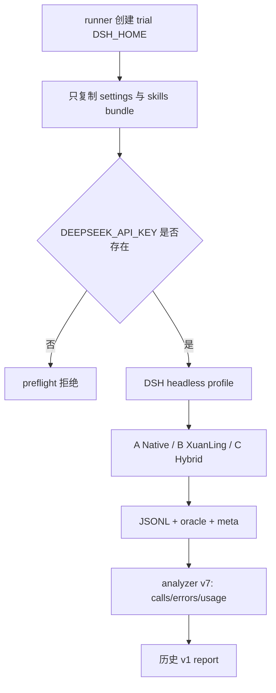
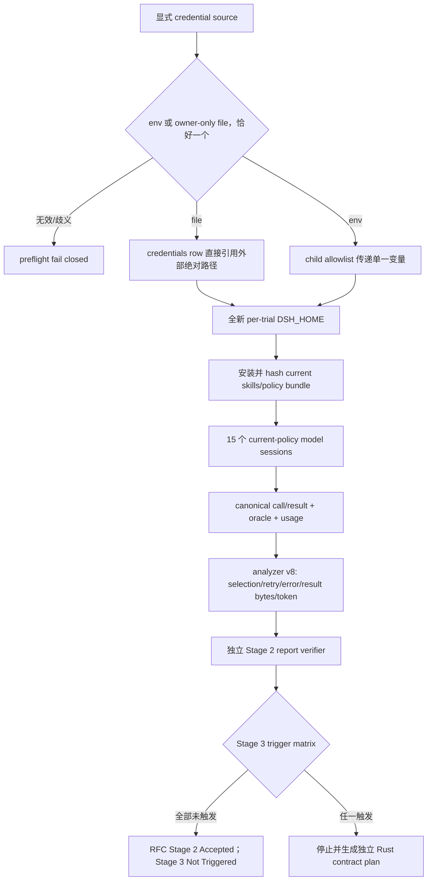

# 文件安全 RFC 0002 完成实施计划

> 状态：实施计划；不表示当前 checkout 已完成任何本计划工作包。
> 基线日期：2026-08-16。
> 基线 revision：`48182b1b316f22831235cb75129a2fb430b9b39e`。
> 缺陷等级：Stage 1 风险为已修复的 `CONFIRMED P1`；Stage 2 证据时效为
> `CONFIRMED` 合同缺口；Stage 3 必要性为 `UNVERIFIED_RISK`。
> 计划路径：`docs/plans/filesystem-safety-rfc-completion-development-plan.md`。
> 执行账本：`docs/plans/filesystem-safety-rfc-completion-execution-ledger.md`。
> 相关合同：[`RFC 0002`](../adr/0002-filesystem-tool-safety-and-efficiency-rfc.md)、
> [`Stage 1 账本`](filesystem-safety-stage1-execution-ledger.md)、
> [`历史 A/B/C 计划`](deepseek-harness-skills-filesystem-evaluation-development-plan.md)、
> [`历史 A/B/C 账本`](deepseek-harness-skills-filesystem-evaluation-execution-ledger.md)。

## 1. 目标与非目标

### 1.1 合同

#### C-01：当前 policy 必须进入每个适用 trial

Given：当前 `xuanling-dsh-skills` bundle、strict overwrite policy 和 fs16 release binary。
When：runner 创建 Arm B 或 Arm C 的全新 DSH profile 并启动模型。
Then：profile-local bundle hash 与源码 bundle 相同，`mcp__xuanling__fs_write_text` 缺少
`expected_sha256` 的 overwrite 在 MCP dispatch 前拒绝。
And not：不得复用早于 Stage 1 的 session，也不得通过源码 patch 假装安装 bundle。
Failure：bundle 缺失、hash 漂移、policy 未加载或出现 unsafe dispatch 时 trial `incomplete`，
整轮证据失效。
Evidence：trial `meta.json`、strict policy probe、MCP call count、bundle SHA-256。

#### C-02：刷新 A/B/C 真实模型证据

Given：冻结 route、fixture、prompt、permission、tool catalog 与旁路禁用集合。
When：A、B、C 每臂运行三次 quality trial 和一组 cold/warm pair。
Then：15 个 session 均有唯一日志、canonical `turn/end`、独立 oracle、固定
`deepseek-official/deepseek-v4-pro/max` route 和可归属工具调用。
And not：不得把基础设施失败重写为模型失败，不得跨臂复用 workspace/session/Memory DB。
Failure：任一臂不足三次有效 quality trial、cache pair 前缀不一致或 route 漂移时 Stage 2
保持 `implemented_unverified`。
Evidence：raw JSONL、runner summary、strict analyzer、独立 fixture oracle。

#### C-03：完成 RFC 指定的可比指标

Given：每个 session 的 canonical tool call/result 和 provider usage 事件。
When：analyzer 聚合当前证据。
Then：报告包含工具选择、模型可见 tool-result bytes、typed error code、同名工具 error 后重试、
input/output/cache token 和 duration；缺失或歧义字段标为 `unknown` 并使 required 验证失败。
And not：不得从日志文件大小推导模型结果体积，不得把 retry 猜成 provider retry。
Failure：call/result 无法唯一关联、重复 terminal result 或错误码无法分类时 trial incomplete。
Evidence：analyzer 红绿测试、v8 JSON 输出、report verifier 重算结果。

#### C-04：credential、默认数据与外部 checkout 隔离

Given：当前 shell 没有 `DEEPSEEK_API_KEY`，存在一个 owner-only DSH credential 文件。
When：runner 使用显式 `--credentials-file` 执行 live trial。
Then：DSH credential provider 直接引用该绝对路径，runner 只验证路径类型与权限，不读取、复制、
hash 或输出 credential 内容；trial DB、DSH_HOME 和 workspace 位于新 evidence root。
And not：不得打开默认 Memory DB、读取用户 settings、修改 DSH checkout 或把 credential 文件放进
evidence root。
Failure：source 缺失、非普通文件、POSIX mode 含 group/other bits、同时传 env 与 file、运行中失效
或 evidence 出现 credential-shaped payload 时 fail closed。
Evidence：preflight 合同、trial metadata 的 source-kind、路径/权限检查、默认 DB 和 checkout 指纹。

#### C-05：报告只陈述当前证据

Given：新的 current-policy evidence root 和历史 pre-policy 报告。
When：生成 Stage 2 报告并运行 verifier。
Then：新报告单独保存，明确区分 current evidence、historical baseline、tradeoff、unknown 和
candidate decision；所有数值可从 raw evidence 重算。
And not：不得覆盖历史报告、声称统计显著性、宣布生产默认切换或把单任务结果泛化为全项目。
Failure：manifest/root/population/hash/aggregate 不一致时 verifier 非零退出。
Evidence：新报告、v2 manifest、`verify-report.mjs` 或独立 delta verifier。

#### C-06：Stage 3 使用封闭触发条件

Given：Stage 1 deterministic evidence 与 Stage 2 current-policy live evidence。
When：评估 RFC 0002 的三个 Stage 3 条件。
Then：每个条件记录 `triggered`、`not_triggered` 或 `unknown` 及证据；全部未触发时 Stage 3 标记
`Not Triggered / Deferred`，RFC 可以完成本轮决策。
And not：不得因“Rust 更统一”或单次重试直接修改 DTO、schema、catalog、snapshot 或默认行为。
Failure：出现第二 host 的相同需求、任何 direct/Code Mode policy bypass，或至少两个 B quality
trial 由同一 fs contract 缺陷导致 oracle failure 且 direct probe 可复现时，停止本计划并生成
独立 Stage 3 公共合同计划。
Evidence：trigger matrix、policy probe、live arm report、Rust snapshot hash。

#### C-07：保留 Stage 1 交付与最终可恢复性

Given：Stage 1 Web 服务 `http://127.0.0.1:61488`、既有 dirty worktree 和完成账本。
When：执行本计划。
Then：Stage 1 服务保持 HTTP 200，全部新增证据与状态写入本计划账本，最终状态可从文件恢复。
And not：不得停止未知进程、提交、push、发布、清理历史 evidence 或吸收无关 dirty change。
Failure：服务、默认 DB、DSH checkout 或不可归因 diff 漂移时停止并记录 incident。
Evidence：最终 HTTP/process、Git、DB、binary 和账本指纹。

### 1.2 非目标

- 不实现 `fs_edit_batch`、`fs_stat.include_sha256`、diff selector、filesystem artifact overflow
  或 process 双表示瘦身。
- 不改变 Memory v2、召回策略、向量模型、CodeGraph 或 LSP。
- 不修改 DSH upstream checkout、生产默认 bundle、用户 settings 或发布配置。
- 不在本计划内实现 Stage 3 Rust API；触发后必须另立 schema/compatibility/migration 计划。
- 不删除或改写历史 A/B/C 报告和账本；它们只作为 pre-policy baseline。

## 2. 当前 checkout 基线

### 2.1 工作树与版本

- XuanLing：`main`，revision `48182b1b316f22831235cb75129a2fb430b9b39e`。
- `git status --short --untracked-files=all` 为 16 项，SHA-256
  `2b8b09b7eab593fc5111c0d56900f002682e26f21be3b012f798a3a03fecd655`；全部属于已验收但未提交的
  RFC 0002 Stage 1 change set。本计划不得回退或吸收这些改动。
- 任务相关 tracked binary diff SHA-256 为
  `cd49896580f3ed2aac4629580deae4be6728e79638d6f721f45b1969a3c13884`；任务相关 untracked path
  list SHA-256 为 `1eda640d19e3aaa8a0e8ce0a346bd989500815e62deffdd452319b393d1874b7`。
- DSH：`master`，revision `47f943859bef60e4160492346772ded9b24f765a`，仅两个既有 untracked
  comparison test，status SHA-256
  `39d1f6c63477d3faf9beb23e6eda9bf80c8f231418e1f019bb1730fbe2a1bdc1`。

### 2.2 合同与 artifact

- Rust tools snapshot SHA-256：
  `1ee881e3a5644cae1249b1fdeccfcfe78a8c5762510eb33c5455f3cb38c6d020`。
- release `xuanling-mcp` SHA-256：
  `68d340723f8b79f260fc6577a814311f157b515e4ecfc89e499746f8de2d10d2`。
- default Memory DB SHA-256：
  `c828b6ed632ccd21864cc6c48b8d15a2dd969ff433b73be39f0c9fad47a4e6aa`，WAL/SHM 不存在。
- frozen task SHA-256：
  `faff54eae2b9863225f9bd424db8d0ffa3178dcb657e3fd4eef3ce7276298000`。
- current skills bundle SHA-256：
  `57eb2adb325e4b581a03909c34c87ea6fde0db416fcea10dd2729ebf2037fc62`。
- 历史报告位于 `test/deepseek-harness/evaluation/filesystem-tools-report.md`，绑定
  pre-policy evidence root，不得作为 Stage 2 current evidence。

### 2.3 外部环境

- Stage 1 隔离 Web 服务 `http://127.0.0.1:61488` 当前 HTTP 200，process group `30855`。
- 历史评估服务 `http://127.0.0.1:57960` 已停止；历史 evidence root 仍存在。
- 当前 shell 未导出 `DEEPSEEK_API_KEY`。
- 已发现一个现有 DSH credential 文件，mode `0600`；只读取了路径 metadata，未读取内容。
- runner 当前只接受环境变量 credential，因此 file-reference 路径是 `CONFIRMED` Stage 2 entry
  gap，必须先有正确红测和 fail-closed 实现。

### 2.4 当前正确失败信号

- 无环境 key 的 live runner 必须在启动模型前报 `DEEPSEEK_API_KEY is required`。
- 新的 file-reference 红测必须只因 runner 尚不支持 `--credentials-file` 失败；fixture、DSH
  launcher 或 synthetic model failure 属 wrong failure。
- 旧 analyzer v7 不输出 result bytes、typed error class 或 retry-after-error；这是 C-03 的正确红因。
- 任何读取 credential 内容、复制到 evidence root 或输出到 argv/meta 都是安全 gate 失败。

## 3. 已确认路径与目标路径

### 3.1 当前路径



### 3.2 目标路径



runner 处理 trial 生命周期与证据完整性；DSH credential provider 读取 credential；模型只观察
tool schema/result；Rust 处理 canonical filesystem side effect；analyzer 和 report verifier 只读取
持久化 evidence。任何层不得把另一层的通过当成自己的证明。

## 4. Requirement Coverage Matrix

| 需求 | 合同 | 当前缺口 | 目标行为 | Wave | 红测试 | 最终证据 |
| --- | --- | --- | --- | --- | --- | --- |
| current policy 进入 B/C | C-01 | 历史 session 早于 policy | 每 trial profile-local hash + pre-dispatch guard | W1-W3 | missing/stale bundle | meta + probe + wire count |
| A/B/C 重新实测 | C-02 | current-policy population=0 | 3 quality + 1 pair/arm | W3 | stale root rejected | 15 raw sessions + oracle |
| 重试/错误/结果体积 | C-03 | analyzer v7 不输出 | canonical per-call metrics | W1-W4 | malformed/duplicate result | analyzer v8 + report |
| 已配置 credential 可安全复用 | C-04 | shell env 缺 key | external file reference，无复制/读取 | W1-W3 | missing/mode/both sources | preflight/meta/secret scan |
| 保留历史并产出新建议 | C-05 | 旧 report 绑定旧 root | 独立 current report | W4 | stale v1 manifest | report verifier |
| 完成 RFC Stage 3 决策 | C-06 | trigger 状态未判定 | 三条件封闭结论 | W4 | evidence 缺失拒绝 | trigger matrix + RFC diff |
| 保留 Stage 1 服务/工作树 | C-07 | 长任务可能漂移 | 最终指纹与 HTTP 200 | W0-W5 | drift oracle | ledger fingerprints |

每个要求只有一个主合同；辅助合同不改变主映射。

## 5. 影响边界矩阵

| 模块/边界 | 当前职责 | 允许变化 | 必须保持 | 合同 | 验证 |
| --- | --- | --- | --- | --- | --- |
| evaluation runner | trial 启动、隔离、采集 | credential source + bundle evidence | explicit env allowlist、no overwrite | C-01/C-02/C-04 | Node contract + dry-run |
| common overlay | 旁路禁用、raw JSONL | credentials path/watch 配置 | A/B/C 禁用集合 | C-04 | catalog inspect |
| analyzer | canonical session 聚合 | v8 call/result metrics | lifecycle/usage fail closed | C-03 | synthetic logs |
| report verifier | 重算 population/aggregate | v2 metric与policy hash | root 精确绑定 | C-03/C-05 | negative fixtures |
| Stage 2 report | current evidence decision | 新文件 | 历史报告字节不变 | C-05/C-06 | SHA + verifier |
| RFC 0002 | accepted/proposed 状态 | Stage 2/3 decision | Stage 1 边界 | C-06 | docs review |
| xuanling-skills | Skill + strict policy | 仅缺陷修复时允许 | tool name/error code | C-01 | package/probe |
| Rust toolkit/MCP | canonical schema/effects | 本计划禁止 | snapshot/catalog/binary | C-06 | hashes + bridge |
| default Memory DB | 用户 canonical data | 禁止变化 | bytes/WAL/SHM | C-04/C-07 | pre/post hash |
| DSH checkout | external host | 禁止变化 | rev + two untracked files | C-04/C-07 | status hash |
| Stage 1 Web | 当前试用服务 | 只读 health check | process group/URL | C-07 | curl + ps |
| migration/backup | N/A：无 schema 或 canonical data change | N/A | 不进入 | C-06 | forbidden diff |

## 6. 目标合同与全局不变量

### 6.1 Canonical 与 derived facts

- raw JSONL、trial `meta.json`、workspace bytes、oracle verdict 和 provider usage 是 Stage 2
  canonical evidence。
- analyzer JSON、Markdown 表格、ranking 和 Stage 3 trigger matrix 是 derived projection，必须由
  verifier 从 canonical evidence 重算。
- 历史 report 与旧 evidence root 是 immutable baseline，不参与 current population。

### 6.2 终态、幂等与并发

- trial success 需要 process exit 0、无 signal/spawn error、唯一 session、canonical terminal、
  route exact、oracle pass 和 required metrics complete。
- model/tool error 可以形成有效 trial，但必须分类并由 oracle 决定质量；infra error 不形成有效样本。
- run id 与 evidence root 是幂等边界：已存在即拒绝，不 resume、不覆盖。
- 所有 trial 串行，避免共享 build/session/credential watcher 状态；每臂质量计数修改后归零。
- cancel/timeout 采用 TERM、grace、process-group KILL；已生成 evidence 标记 incomplete，不删除。

### 6.3 Credential 与日志

- credential source 只能是非空环境变量或绝对 owner-only file 中的一个。
- file-reference 模式只传路径给 DSH credential provider；runner 不读取文件正文。
- argv、dry-run、meta、stdout/stderr、JSONL、report 和 ledger 不保存 credential 内容。
- file-reference 模式的 secret evidence 明确为 structural isolation + credential-shaped scan，不伪装成
  exact-value scan。

### 6.4 Compatibility、migration、recovery

- runner 新参数为 additive；环境变量模式保持兼容。
- analyzer schema 从 v7 到 v8，旧 evidence 可读但旧 report verifier 不自动升级结论。
- storage/schema migration、rollback 和 backup 为 N/A：本计划不改 canonical database/schema。
- provider unavailable、rate limit 或 timeout 时保留 raw trial，使用全新 run id 重跑整个受影响臂；
  不在同一 population 混合补丁前后的样本。

## 7. Wave 依赖与状态机

```text
W0 contract_and_current_baseline
  -> W1_red_metrics_and_credential_contracts
  -> W2_runner_analyzer_and_verifier
  -> W3_current_policy_live_population
  -> W4_report_and_stage3_decision
  -> W5_final_gates_and_handoff
```

每个 Wave 使用：

```text
not_started -> red_confirmed -> implemented_unverified -> deterministic_green -> complete
```

实现或合同变化退回 `implemented_unverified`；错误 gate 或红测失效退回 `red_confirmed`。只有前一
Wave `complete` 才解锁下一 Wave。Stage 3 trigger 不属于本计划的实现分支；触发时本计划以
`BLOCKED` 或 `HANDOFF_REQUIRED` 结束，并指向新的公共合同计划。

## Wave 0：合同与 current baseline

### 目标与合同

- 覆盖合同：C-01..C-07。
- 本 Wave 完成后的可观测结果：checkout、Stage 1 service、credential metadata、old report、
  binary/catalog/default DB 与授权边界全部落账。
- 明确不处理：不修改 runner/analyzer/overlay，不启动模型。

### Entry gate

- [ ] 适用指令、RFC、Stage 1 账本、历史评估计划/账本已完整读取。
- [ ] dirty/untracked 与重叠 diff 已记录并可归因。
- [ ] DSH checkout 和 Stage 1 service 可只读验证。

### Allowed files

- 本计划、执行账本、`docs/plans/README.md`。

### Forbidden changes

- 生产代码、测试、overlay、schema、依赖、用户数据、DSH checkout、外部服务。

### 红测试与基线

| Test/Oracle | Trigger | Expected old failure | Wrong failure |
| --- | --- | --- | --- |
| checkout fingerprint | current status/hash | exact 16-entry Stage 1 set | handwritten summary |
| current evidence freshness | old report timestamp/hash | classified historical | old report accepted current |
| credential metadata | path stat only | present regular mode 0600 | credential body read |

### 实施工作包

| Package | Symbol/path | Contract | Failure behavior | Targeted validation |
| --- | --- | --- | --- | --- |
| W0.1 | checkout/evidence inventory | C-01..C-07 | unknown overlap stops | status/hash/curl/stat |
| W0.2 | ledger baseline | C-07 | missing fact remains unknown | docs gate |

### 验证命令

| Command | Provenance | Expected result | Required/conditional |
| --- | --- | --- | --- |
| `git status --short --untracked-files=all` | AGENTS protocol | exact attributable set | required |
| `git -C /Volumes/project_home/github/deepseek-harness status --short --untracked-files=all` | external boundary | two preserved files | required |
| `npm --prefix npm run check:docs` | npm manifest | docs clean | required |
| `curl -fsS http://127.0.0.1:61488/` | Stage 1 ledger | HTTP 200 | required |

### Evidence

- Behavior before：写入账本。
- Red failure：N/A；W0 是基线 Wave，无生产缺陷红测。
- Behavior after：写入账本。
- Files changed：仅计划文件。
- Commands passed/failed/not run：逐项写入账本。
- API/storage/UI/restart/external/secret：只记录 metadata 与 hash，不读取内容。

### Exit gate

- [ ] 所有 baseline 可复算且无 unknown overlap。
- [ ] credential 内容未读取；Stage 1 HTTP 200。
- [ ] 账本 `next_action` 唯一指向 W1.1。

### Stop conditions

- 发现不可归因 dirty overlap、默认 DB/WAL/SHM 漂移或 Stage 1 service 不可解释失效。
- 需要读取 credential 内容才能完成 W0。

## Wave 1：credential 与指标红合同

### 目标与合同

- 覆盖合同：C-01、C-03、C-04、C-05。
- 本 Wave 完成后的可观测结果：红测分别命中 file-reference 缺口、analyzer v7 指标缺口和 stale
  report 拒绝；普通测试不启动模型。
- 明确不处理：不写实现、不调用 provider。

### Entry gate

- [ ] W0 complete。
- [ ] baseline fingerprints 当前有效。
- [ ] synthetic fixture 不含真实 credential 或网络 endpoint。

### Allowed files

- `npm/test/deepseek-filesystem-evaluation.test.mjs`。
- 必要的新 synthetic fixture 位于 `test/deepseek-harness/evaluation/fixtures/`，不得含 secret。
- 执行账本。

### Forbidden changes

- runner、analyzer、overlay、report、RFC、Rust、DSH checkout、真实 evidence root。

### 红测试与基线

| Test/Oracle | Trigger | Expected old failure | Wrong failure |
| --- | --- | --- | --- |
| file credential accepted | env absent + `--credentials-file` | unknown arg/env-key preflight fail | fixture/DSH missing |
| source exclusivity | env + file / neither | deterministic preflight deny | model starts |
| owner-only mode | permissive file | pre-start deny | file body read |
| analyzer v8 metrics | paired calls/results/errors | fields absent | malformed fixture |
| duplicate/orphan result | invalid JSONL | analyzer incomplete | silently double count |
| stale v1 report | old report as current | verifier deny | Markdown parser crash |

### 实施工作包

| Package | Symbol/path | Contract | Failure behavior | Targeted validation |
| --- | --- | --- | --- | --- |
| W1.1 | runner credential red tests | C-04 | exact red only | Node name-pattern |
| W1.2 | analyzer metric red tests | C-03 | exact missing fields | Node name-pattern |
| W1.3 | report freshness red tests | C-05 | stale evidence rejected | Node name-pattern |

### 验证命令

| Command | Provenance | Expected result | Required/conditional |
| --- | --- | --- | --- |
| `node --test --test-name-pattern='credential file' npm/test/deepseek-filesystem-evaluation.test.mjs` | Node test runner | fails only for credential gap | required |
| `node --test --test-name-pattern='analyzer v8' npm/test/deepseek-filesystem-evaluation.test.mjs` | Node test runner | fails only for metric gap | required |
| `node --test --test-name-pattern='current-policy report' npm/test/deepseek-filesystem-evaluation.test.mjs` | Node test runner | fails only for freshness gap | required |
| `npm --prefix npm test` | npm manifest | existing tests remain green except new red selection | required baseline |

### Evidence

- Behavior before/Red/After/Files/Commands/API/storage/external/secret：逐测试写 ledger；不把 compile、
  fixture 或 timeout 失败当正确红。

### Exit gate

- [ ] C-03/C-04/C-05 各有正确红，旧合同测试仍绿。
- [ ] 红测无网络、无模型、无真实 credential body。
- [ ] `next_action` 指向 W2.1。

### Stop conditions

- 红测必须修改 DSH upstream 或读取 secret 才能触发。
- JSONL 当前合同无法唯一关联 call/result；先记录 `UNKNOWN`，不得猜字段。

## Wave 2：runner、analyzer 与 verifier

### 目标与合同

- 覆盖合同：C-01、C-03、C-04、C-05。
- 本 Wave 完成后的可观测结果：file-reference credential fail closed；analyzer v8 输出 canonical
  retry/error/result metrics；新 report verifier 绑定 current policy hash。
- 明确不处理：不运行 billable model，不更新 RFC decision。

### Entry gate

- [ ] W1 complete 且红因正确。
- [ ] DSH credential provider 的 explicit `path` 与 `watch` 合同已从当前 checkout 核实。
- [ ] Allowed files 与 Stage 1 dirty diff 可区分。

### Allowed files

- `test/deepseek-harness/evaluation/scripts/run-filesystem-evaluation.mjs`。
- `test/deepseek-harness/evaluation/scripts/analyze-filesystem-evaluation.mjs`。
- `test/deepseek-harness/evaluation/scripts/verify-report.mjs` 或一个专用 delta verifier。
- `test/deepseek-harness/evaluation/overlays/common/cordis.patch.yml`。
- `test/deepseek-harness/evaluation/config/settings.template.yaml`。
- `npm/test/deepseek-filesystem-evaluation.test.mjs`、integration README、账本。

### Forbidden changes

- fixture/task/oracle、arm catalog、Skill/policy 语义、Rust、DSH checkout、默认 DB、历史 report。

### 红测试与基线

| Test/Oracle | Trigger | Expected old failure | Wrong failure |
| --- | --- | --- | --- |
| W1 tests | current implementation | target reds | unrelated failure |
| dry-run source mode | file path metadata | no secret/value in JSON | path/content printed |
| analyzer old evidence | historical root | readable as v8 projection | history modified |

### 实施工作包

| Package | Symbol/path | Contract | Failure behavior | Targeted validation |
| --- | --- | --- | --- | --- |
| W2.1 | credential source resolver | C-04 | exactly-one + owner-only | synthetic runner tests |
| W2.2 | common credentials row | C-04 | missing env path startup fail | dump/inspect catalog |
| W2.3 | call/result analyzer v8 | C-03 | orphan/duplicate incomplete | synthetic JSONL tests |
| W2.4 | current-policy report schema | C-01/C-05 | stale hash/root reject | verifier negatives |

### 验证命令

| Command | Provenance | Expected result | Required/conditional |
| --- | --- | --- | --- |
| `node --check test/deepseek-harness/evaluation/scripts/run-filesystem-evaluation.mjs` | Node | syntax clean | required |
| `node --check test/deepseek-harness/evaluation/scripts/analyze-filesystem-evaluation.mjs` | Node | syntax clean | required |
| `npm --prefix npm test` | npm manifest | all green | required |
| runner `--dry-run` with file reference metadata | runner | problems=[]，no secret | required |
| `inspect-catalog.ts` for A/B/C | integration | exact catalog + policy | required |

### Evidence

- Behavior before/Red/After/Files/Commands/API/storage/external/secret：写 ledger；file-reference 模式必须
  明示 exact-value scan 为 N/A，不得伪报。

### Exit gate

- [ ] W1 红测全部转绿，普通测试无 billable call。
- [ ] old env mode 兼容，file mode 不读取/复制 credential。
- [ ] analyzer 对 duplicate/orphan/malformed fail closed。
- [ ] `next_action` 指向 W3.1。

### Stop conditions

- 需要把 raw credential 注入 argv/meta 或放进 evidence root。
- DSH provider 不支持外部 path，或 path 模式会修改 source file。
- analyzer 必须用启发式正文匹配才能关联 call/result。

## Wave 3：current-policy 真实模型 population

### 目标与合同

- 覆盖合同：C-01..C-04、C-07。
- 本 Wave 完成后的可观测结果：A/B/C 各三次有效 quality trial 和一组 cold/warm pair，current
  policy/bundle hash、oracle、usage 和 v8 metrics 全部完整。
- 明确不处理：不写报告结论、不切生产默认、不启动新 Web 服务。

### Entry gate

- [ ] W2 complete；`--allow-billable-live` 与 fresh run-id gate 仍有效。
- [ ] 当前执行授权覆盖 15 个 DeepSeek session。
- [ ] credential source、default DB、DSH checkout、Stage 1 HTTP 与全部 frozen hash 已记录。

### Allowed files

- 运行时仅写 `/private/tmp/xuanling-dsh-fs-eval.$XUANLING_DSH_RUN_ID/**`。
- 执行账本。

### Forbidden changes

- Git checkout 文件、credential source、default DB、用户 settings、DSH repo、Stage 1 process。

### 红测试与基线

| Test/Oracle | Trigger | Expected old failure | Wrong failure |
| --- | --- | --- | --- |
| no-allow | live argv 无 flag | pre-start deny | provider call |
| duplicate run id | root exists | pre-start deny | overwrite evidence |
| policy presence | B/C metadata | exact bundle hash | source-only patch |
| each trial oracle | frozen task | pass/fail independently | model self-report |
| route/prefix | headers/cache pair | exact/projection match | estimate |

### 实施工作包

| Package | Symbol/path | Contract | Failure behavior | Targeted validation |
| --- | --- | --- | --- | --- |
| W3.1 | pre-live fingerprints | C-04/C-07 | drift stops | hashes/curl/stat |
| W3.2 | A quality/cache | C-02/C-03 | infra retry max 1 with new arm root | per-trial oracle |
| W3.3 | B quality/cache | C-01..C-03 | no Native fallback | policy/error metrics |
| W3.4 | C quality/cache | C-01..C-03 | calls strictly classified | policy/error metrics |
| W3.5 | population verification | C-02..C-04 | any incomplete blocks | analyzer/oracle/scan |

### 验证命令

| Command | Provenance | Expected result | Required/conditional |
| --- | --- | --- | --- |
| `node test/deepseek-harness/evaluation/scripts/run-filesystem-evaluation.mjs --allow-billable-live --dsh-root /Volumes/project_home/github/deepseek-harness --binary target/release/xuanling-mcp --model deepseek-official/deepseek-v4-pro --reasoning-effort max --quality-runs 3 --cache-pairs 1 --arms A,B,C --credentials-file "$XUANLING_DSH_CREDENTIALS_FILE"` | live runner | 15 complete collections | required |
| `node test/deepseek-harness/evaluation/scripts/analyze-filesystem-evaluation.mjs --root "$XUANLING_DSH_EVAL_ROOT" --verify --arms A,B,C --quality-runs 3 --cache-pairs 1` | analyzer | v8 complete | required |
| `node test/deepseek-harness/evaluation/scripts/verify-filesystem-fixture.mjs --all "$XUANLING_DSH_EVAL_ROOT"` | external oracle | 15/15 pass | required |
| checkout/default DB/Stage 1 fingerprints | W0 | unchanged | required |

### Evidence

- 每个 trial 记录 session id、route、workspace、Memory DB、bundle hash、tool calls/results、error、
  retry、result bytes、usage 和 oracle；credential 只记录 source-kind。

### Exit gate

- [ ] A/B/C quality 各 3 个有效样本，全部 15 workspace oracle 通过。
- [ ] no bypass、no secret payload、no default DB/DSH/Stage 1 drift。
- [ ] 连续计数 A=3、B=3、C=3，`next_action` 指向 W4.1。

### Stop conditions

- provider/rate limit/timeout 连续三轮无法解除。
- credential source 需要读取/复制才能继续。
- 任一 arm 需修改 prompt/fixture/catalog 后补样本；必须丢弃旧 population 并回 W2/W3。

## Wave 4：报告与 Stage 3 决策

### 目标与合同

- 覆盖合同：C-03、C-05、C-06。
- 本 Wave 完成后的可观测结果：current-policy 报告可重算，RFC Stage 2 状态更新，Stage 3 三个
  trigger 有封闭结论。
- 明确不处理：不应用候选配置，不实现 Rust contract。

### Entry gate

- [ ] W3 complete；raw evidence 与 analyzer version 冻结。
- [ ] historical report hash unchanged。
- [ ] report 数字可由 verifier 重算。

### Allowed files

- `test/deepseek-harness/evaluation/filesystem-safety-stage2-report.md`。
- report verifier 与其 Node tests（仅为 current schema 必需变化）。
- `docs/adr/0002-filesystem-tool-safety-and-efficiency-rfc.md`。
- integration README、执行账本。

### Forbidden changes

- runner/analyzer/fixture/policy/Skill/overlays、Rust、历史 report/evidence、生产默认。

### 红测试与基线

| Test/Oracle | Trigger | Expected old failure | Wrong failure |
| --- | --- | --- | --- |
| report before manifest | empty/new doc | verifier fail | parser crash |
| aggregate mutation | one metric changed | verifier fail | accepted narrative |
| Stage 3 unknown | missing trigger evidence | RFC remains Proposed | guessed false |

### 实施工作包

| Package | Symbol/path | Contract | Failure behavior | Targeted validation |
| --- | --- | --- | --- | --- |
| W4.1 | Stage 2 report | C-03/C-05 | unknown explicit | report verifier |
| W4.2 | historical comparison | C-05 | no causal claim | hash + tables |
| W4.3 | Stage 3 trigger matrix | C-06 | trigger stops | probe/report/snapshot |
| W4.4 | RFC state update | C-06 | evidence不足保持 Proposed | docs review |

### 验证命令

| Command | Provenance | Expected result | Required/conditional |
| --- | --- | --- | --- |
| `node test/deepseek-harness/evaluation/scripts/verify-report.mjs test/deepseek-harness/evaluation/filesystem-safety-stage2-report.md "$XUANLING_DSH_EVAL_ROOT"` | report verifier | exact current evidence | required |
| `npm --prefix npm run check:docs` | npm manifest | links/tables clean | required |
| RFC durable-doc leak scan | write-project-docs | no conversation wording | required |

### Evidence

- 报告列出 verified、tradeoff、unknown、historical 和 decision；Stage 3 每条 trigger 绑定具体
  evidence，不用主观“值得做”替代。

### Exit gate

- [ ] report verifier 通过，历史 report 不变。
- [ ] Stage 3 全部未触发并有证据，或本计划停止并指向独立 Stage 3 plan。
- [ ] RFC 状态不超过 current evidence，`next_action` 指向 W5.1。

### Stop conditions

- 任一 Stage 3 条件触发、报告只能靠手改数字通过、或需要改变生产默认。

## Wave 5：最终 gate 与 handoff

### 目标与合同

- 覆盖合同：C-01..C-07。
- 本 Wave 完成后的可观测结果：全部 deterministic/live/docs/fingerprint gate 当前有效，RFC
  decision 与账本一致，Stage 1 service 保持可试用。
- 明确不处理：commit、push、publish、生产切换、Stage 3 implementation。

### Entry gate

- [ ] W4 complete，或 Stage 3 trigger 已按 Stop condition 形成独立 handoff。
- [ ] W3 后无 runner/analyzer/policy/fixture 行为变化。
- [ ] changed files 全部在 Allowed files 内。

### Allowed files

- 本计划、账本、plans index、RFC、Stage 2 report、integration README。
- W1/W2 scoped test/runner/analyzer/verifier 文件只允许无行为收尾；行为变化使 W3/W4 stale。

### Forbidden changes

- Rust/DSH checkout/default DB/credential source/Stage 1 service、发布与 Git 外部状态。

### 红测试与基线

| Test/Oracle | Trigger | Expected old failure | Wrong failure |
| --- | --- | --- | --- |
| freshness | final hashes vs W3 | exact | stale evidence reused |
| forbidden diff | paths/snapshot | no drift | dirty hidden |
| live health | 61488/process | HTTP 200 | only stale PID |
| docs/report | final files | all green | ignored check |

### 实施工作包

| Package | Symbol/path | Contract | Failure behavior | Targeted validation |
| --- | --- | --- | --- | --- |
| W5.1 | scoped/full regression | C-01..C-05 | failure returns owning Wave | npm/probes/verifier |
| W5.2 | final fingerprints | C-04/C-07 | drift incident | Git/DB/DSH/HTTP |
| W5.3 | ledger/RFC handoff | C-06/C-07 | not-run explicit | docs/diff |

### 验证命令

| Command | Provenance | Expected result | Required/conditional |
| --- | --- | --- | --- |
| `npm --prefix npm test` | npm manifest | all tests pass | required |
| `npm --prefix npm run check` | npm manifest | package contract pass | required |
| `npm --prefix npm run check:docs` | npm manifest | docs pass | required |
| `node test/deepseek-harness/scripts/verify-deepseek-bridge.mjs --binary target/release/xuanling-mcp --tool-profile fs` | integration | fs16 bridge pass | required |
| strict overwrite + filesystem probes | Stage 1 plan | 16/16 and 12/12 | required |
| `git diff --check` | Git | clean | required |
| final Git/DSH/default DB/binary/HTTP fingerprints | W0 | unchanged except attributable plan files | required |

### Evidence

- Behavior before/Red/After/Files/Commands/API/storage/external/secret 全量写 ledger；failed、not-run、
  ignored 和 external gaps 不得省略。

### Exit gate

- [ ] Requirement Coverage Matrix 无未映射项。
- [ ] W0-W5 全部 complete，所有 required gate 无 failed/stale/not-run。
- [ ] RFC Stage 2 与 Stage 3 状态和 evidence 一致。
- [ ] Stage 1 Web、default DB、DSH checkout、Rust snapshot 无禁止漂移。

### Stop conditions

- required gate 根因不明、dirty overlap 无法归因、secret 泄漏或外部状态需未授权修改。

## 8. 测试与验收总矩阵

| Gate | 适用范围 | 证明内容 | 未运行时状态上限 |
| --- | --- | --- | --- |
| Node syntax/unit | runner/analyzer/verifier | 参数、解析、fail-closed | `implemented_unverified` |
| npm contract | 全 integration | bundle/Skill/evaluation 回归 | `implemented_unverified` |
| synthetic integration | DSH config/profile | credential path、catalog、policy | `implemented_unverified` |
| persistence/restart | evidence root | 唯一 session、保留、重算 | `deterministic_green` |
| migration/rollback | N/A：无 schema/data change | forbidden diff 证明 N/A | `deterministic_green` |
| live provider | 15 sessions | current model behavior | `deterministic_green` |
| report verifier | raw -> projection | 数值和决策来源 | `deterministic_green` |
| external checkout/data | DSH/default DB/credential | 无禁止漂移 | `deterministic_green` |
| docs/diff | RFC/report/ledger | 可交付质量 | `deterministic_green` |

policy bypass、call/result pairing 和 evidence-root overwrite 相关 gate 连续三次通过。增加 sleep、扩大
timeout、减少断言、跳过 trial 或改为 ignored 都不能形成证据。

## 9. 故障与恢复矩阵

| 故障 | typed 状态 | required durable facts | 用户可见结果 | 恢复 |
| --- | --- | --- | --- | --- |
| credential source missing/ambiguous | `preflight_error` | source kind，不含值 | live 未启动 | 提供恰好一个 source |
| credential mode 非 owner-only | `credential_permission_denied` | path metadata | live 未启动 | 修正权限，禁止复制替代 |
| credential 运行中失效 | provider typed error | session/meta/incomplete | trial invalid | 新 run id 重跑受影响臂 |
| provider timeout/rate limit | provider/transport error | raw JSONL、exit、duration | infra failure | 最多一次 infra retry；连续三次停止 |
| model malformed tool input | canonical tool error | call/result/error code | valid model failure | 保留，不改参数替模型修复 |
| unsafe overwrite | `XUANLING_FS_OVERWRITE_REQUIRES_SHA256` | wire=0、result bytes | model可恢复 | read/hash + CAS；记录 retry |
| stale CAS | Rust `conflict` | file unchanged、actual hash | model可恢复 | 重读重建 |
| orphan/duplicate result | `analyzer_incomplete` | offending seq/call id | report 拒绝 | 修 parser 或判 host incident |
| cancel/timeout/process crash | `incomplete` | signal/exit/session logs | trial invalid | process-group cleanup，新 root |
| duplicate run id | `already_exists` preflight | existing root path | 拒绝覆盖 | 新 run id |
| default DB/DSH drift | `incident` | before/after hashes | Wave blocked | 归因后重新基线或停止 |
| report mutation/stale root | verifier error | manifest/root mismatch | 不更新 RFC | 从 raw evidence 重建 |
| secret-shaped evidence | security failure | file/line hash，不回显内容 | 整轮无效 | 隔离原因并新 root 重跑 |
| Stage 3 trigger | `stage3_required` | trigger evidence | 本计划停止 | 新公共合同/兼容计划 |

disk full、permission denied 和 evidence write failure 均为 `incomplete`，不得以 console output 替代
durable evidence。Backup/restore 为 N/A：不改 canonical data；evidence 不自动删除。

## 10. 全局停止条件与禁止捷径

- 上游 RFC、DSH runtime 或当前 JSONL 合同冲突未解决时停止。
- dirty worktree 重叠无法归因时停止。
- 公共 API/schema/catalog/状态语义变化缺少独立 Stage 3 计划时停止。
- secret、默认数据、发布、push 或破坏性操作缺少独立授权时停止。
- required gate 失败且根因不明时停止。
- 不通过删除测试、弱化断言、缩小 population、减少三连、放宽 route、增加 sleep、扩大 timeout、
  替换真实模型或修改 oracle 继续。
- 不把单测、mock、一次 Web、一个 backend 或冻结任务成功外推为通用结论。

## 11. 最终完成定义

1. Requirement Coverage Matrix 没有未映射要求。
2. W0-W5 在当前 checkout 全部 `complete`。
3. required gates 无 failed、stale 或 not-run。
4. 15 个 current-policy session、oracle、retry/error/result/token 指标与 report verifier 全部通过。
5. credential source、default DB、DSH checkout、Rust snapshot 与 Stage 1 service 边界有最终证据。
6. historical report 未修改，新报告不声称生产切换或统计显著性。
7. Stage 3 三条件均有结论；未触发则 RFC 明确 deferred，触发则本计划不得谎报 COMPLETE。
8. 最终报告列出修改文件、命令、失败、未运行项、ignored tests 和外部依赖缺口。

## 12. 执行账本与恢复协议

账本 schema 位于
`docs/plans/filesystem-safety-rfc-completion-execution-ledger.md`，包含 revision、status/diff/
untracked 指纹、Wave 状态、连续计数、required gates、失败、未运行、blocker 和唯一 next action。

恢复顺序：

1. 重读适用指令、RFC、本计划与账本。
2. 运行 `git status --short --untracked-files=all` 与 `git rev-parse HEAD`。
3. 比较 XuanLing、DSH、default DB、binary、bundle、fixture 和 Stage 1 HTTP 指纹，标记 stale。
4. 找到首个未 `complete` Wave 和 work package。
5. 只执行账本 `next_action`，修改后先跑定向 gate。
6. 只能以 `COMPLETE`、`BLOCKED` 或 `HANDOFF_REQUIRED` 结束。

### 首轮执行指令

```text
完整读取仓库指令、RFC 0002、本计划和执行账本。先记录当前 XuanLing/DSH checkout、Stage 1
HTTP、default DB、release binary、bundle、fixture、历史报告和 credential metadata 指纹。

从 W0 的第一个未完成 work package 开始。前一 work package 未通过 Exit gate 时不开始下一项。
W1 先获得因 credential file-reference、analyzer v8 metric 和 current report freshness 缺口失败的
正确红测。实现后先跑 synthetic/Node gate，再在全新 evidence root 运行 billable W3。

不读取、复制或输出 credential 内容，不修改 Rust/DSH/default DB/Stage 1 service。存在安全下一步
时继续；硬限制时更新账本并返回 HANDOFF_REQUIRED。只有最终完成定义全部满足才返回 COMPLETE。
```

### 中断续作指令

```text
不依赖聊天摘要。重读仓库指令、RFC、计划和账本，运行 status/revision/fingerprint，标记 stale
证据。定位首个未 complete Wave 与 next_action，一次只推进一个 work package，按红测、实现、
定向验证、合同验收、账本更新顺序执行。Stage 3 条件触发时停止并生成独立公共合同计划。
只能以 COMPLETE、BLOCKED 或 HANDOFF_REQUIRED 结束并输出计划规定的状态字段。
```

```text
PLAN_AUTHORING_STATUS: COMPLETE
PLAN_PATH: docs/plans/filesystem-safety-rfc-completion-development-plan.md
BASELINE_REVISION: 48182b1b316f22831235cb75129a2fb430b9b39e
REQUIREMENTS_MAPPED: C-01..C-07
SECTIONS_COMPLETE: control, scope, baseline, flow, coverage, boundaries, invariants, waves, gates, recovery
UNKNOWN_OR_BLOCKED: none for plan authoring; live credential file-reference requires W1 red/W2 implementation before W3
VALIDATION_RUN: docs/link/leak/placeholder/fence/diff gates
NEXT_EXACT_ACTION: execute W0.1 current checkout and external-state baseline
```
