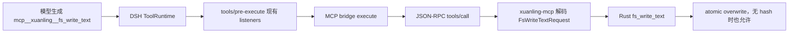
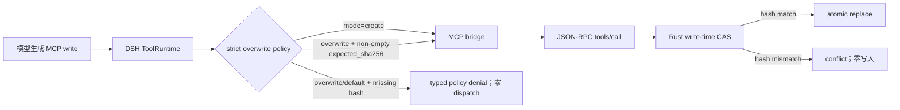

# 文件工具安全前置条件 Stage 1 实施计划

> 状态：实施计划；不表示当前 checkout 已完成任何工作包。
> 基线日期：2026-08-16。
> 基线 revision：`48182b1b316f22831235cb75129a2fb430b9b39e`。
> 缺陷等级：`CONFIRMED P1`（XuanLing `fs_write_text` 的默认 overwrite 路径允许无
> preimage 的整体覆盖；Stage 1 的拒绝策略位于 DSH integration）。
> 计划路径：`docs/plans/filesystem-safety-stage1-development-plan.md`。
> 执行账本：`docs/plans/filesystem-safety-stage1-execution-ledger.md`。
> 相关上游合同：`docs/adr/0002-filesystem-tool-safety-and-efficiency-rfc.md`、
> `docs/adr/0001-memory-v2-proposal-review.md`（仅用于边界，不修改 Memory 合同）。

## 1. 目标与非目标

### 1.1 目标

- **C-01：全文件替换有显式 precondition**。当 DSH 通过 XuanLing MCP 调用
  `mcp__xuanling__fs_write_text`，`mode` 为 `overwrite` 或省略且
  `expected_sha256` 缺失/为空时，dispatch 在进入 MCP 子进程前以稳定策略错误拒绝，
  不产生文件副作用。
- **C-02：创建语义保持独立**。`mode=create` 不要求 hash；目标不存在时继续进入
  XuanLing canonical 校验，目标已存在时仍由 Rust 返回 `already_exists`，不能由 DSH
  policy 改写成 overwrite 或自动重试。
- **C-03：CAS 仍由写入点决定**。带非空 `expected_sha256` 的 overwrite 原样转发；
  stale hash 由 XuanLing 返回 `conflict`，policy 不读取文件、不补 hash、不改写参数，
  且目标字节保持不变。
- **C-04：所有 DSH 分派形态一致**。Native MCP call 与 Code Mode 的 MCP 子调用都
  经过同一 `tools/pre-execute` policy；拒绝消息可见且不触发 MCP `tools/call`。
- **C-05：集成可选、默认不切换**。策略只由 DSH 的 `xuanling-skills` bundle 挂载；
  不修改公共 Rust schema、MCP catalog、默认 Memory DB、DSH checkout 或生产默认
  profile。现有 Memory-only bundle 不因本计划自动挂载文件 policy；本地源码通过
  profile 的目录安装进入 Loader，不支持仅传 Skills bundle `--patch` 的未安装形态。

### 1.2 非目标

- 不给 DSH Native `write` 增加 XuanLing 的 `expected_sha256` 规则；Native 工具继续
  由其 observation/sandbox 合同负责。
- 不新增或修改 `fs_write_text`、`fs_edit`、`fs_patch` 的 Rust DTO、错误码、schema
  snapshot 或 MCP 工具数量。
- 不实现 `fs_edit_batch`、`fs_stat(include_sha256=true)`、diff selector、filesystem
  artifact overflow 或 process 结果去重；这些仍按 RFC 0002 的后续证据门禁处理。
- 不把 policy 变成通用 shell/terminal/subagent 权限系统，不读取用户文件来判断目标
  是否存在，不持久化观察状态。
- 不修改 `/Volumes/project_home/github/deepseek-harness` checkout；该 checkout
  的既有两个 untracked 测试必须保留。
- 不扩展 DSH Loader 以支持动态 module specifier 或 tree-carrier include path 插值。
- 不发布、push、切换用户默认 bundle、修改真实 credential 或默认
  `~/.xuanling/memory.db`。

## 2. 当前 checkout 基线

### 2.1 工作树与外部依赖

- XuanLing branch：`main`。
- XuanLing revision：`48182b1b316f22831235cb75129a2fb430b9b39e`。
- XuanLing 初始 `git status --short`：clean；初始 status 指纹为
  `e3b0c44298fc1c149afbf4c8996fb92427ae41e4649b934ca495991b7852b855`（空状态）。
- DSH revision：`47f943859bef60e4160492346772ded9b24f765a`，branch `master`；当前
  有两个既有 untracked 测试：
  `packages/core/tools/tests/xuanling-compare-measure.spec.ts` 和
  `packages/mcp/mcp-client/tests/xuanling-live.spec.ts`。它们不属于本计划，不能删除或
  改写。
- RFC 0002 当前状态是 `Proposed`；本文只冻结其 Stage 1，不宣布 RFC 全部条目已接受。

### 2.2 已确认实现事实

| 事实 | 状态 | 证据 |
| --- | --- | --- |
| `FsWriteTextRequest.mode` 默认 `overwrite` | `CONFIRMED` | `crates/xuanling-toolkit/src/fs/write.rs` 的 `default_overwrite` |
| `expected_sha256` 是可选字段，存在时在原子写入前比较当前 hash | `CONFIRMED` | 同文件 `fs_write_text` 实现 |
| `mode=create` 对已有文件返回 `already_exists` | `CONFIRMED` | toolkit 写入分支及现有 fs contract tests |
| MCP 模型名为 `mcp__<server>__<raw>` | `CONFIRMED` | DSH `mcp-client/src/tools.ts` 的 `publicToolName` |
| `tools/pre-execute` 在工具 body 前运行，返回 `deny` 会物化错误结果 | `CONFIRMED` | DSH `packages/core/tools/src/index.ts` |
| Code Mode 子调用携带父 token 并再次进入工具 pipeline | `CONFIRMED` | DSH `packages/core/tools/src/code-mode.ts` |
| `cordis:include` 的 path 作为 tree-carrier config 保持 literal；额外 policy 模块必须 profile-installed | `CONFIRMED` | DSH `vendor/include`、`vendor/loader` 与真实 profile 启动失败 |

### 2.3 当前症状与正确失败信号

当前 XuanLing 服务本身允许以下请求进入 Rust：

```json
{
  "path": "existing.txt",
  "content": "replacement",
  "mode": "overwrite"
}
```

当目标已存在且没有 `expected_sha256` 时，Rust 会读取旧内容并执行原子替换；这是
`CONFIRMED P1` 数据损坏路径。Stage 1 的正确旧行为红测必须证明：在 DSH policy
安装后，上述请求返回 `isError=true` 的策略拒绝，MCP 子进程没有收到 `tools/call`，
目标内容和 mtime 不变。带 hash 的 stale 请求仍要到 Rust 才返回 `conflict`。

## 3. 当前路径与目标路径

### 3.1 当前路径



### 3.2 目标路径



责任分界：DSH policy 只验证调用意图是否携带 overwrite 前置条件；XuanLing Rust
仍是路径 capability、当前内容 hash、CAS 和原子替换的唯一事实来源。policy 不把
一次先前的 `fs_hash` 视为写入时快照。

## 4. Requirement Coverage Matrix

| 需求 | 合同 | 当前缺口 | 目标行为 | Wave | 红测试 | 最终证据 |
| --- | --- | --- | --- | --- | --- | --- |
| 拒绝无 hash 的 overwrite | C-01 | DSH 没有该 host policy | deny before MCP dispatch，零副作用 | W1/W2 | policy unit + bridge spy | DSH trace + fixture hash |
| 保留显式 create | C-02 | 无 policy 时可用，需锁定不误拒 | create 继续 dispatch；existing 由 `already_exists` 失败 | W1/W2 | create allow + Rust contract | JSON-RPC trace + file oracle |
| 保留写入点 CAS | C-03 | policy 不能越权判断 stale | 带 hash 原样转发，Rust 返回 conflict | W1/W2 | argument identity + stale CAS | MCP wire + unchanged bytes |
| Native/Code Mode 一致 | C-04 | 现有 policy 未覆盖 XuanLing 参数 | 两条 pipeline 都拒绝 | W1/W3 | parent/subcall cases | DSH synthetic + optional live |
| 仅 DSH integration 变化 | C-05 | 无独立 policy bundle/contract | Rust snapshot、default DB、DSH checkout 不变 | W0-W4 | boundary scan/fingerprint | final fingerprints |
| 不提前做 RFC 后续优化 | C-05 | 讨论项尚未实现 | deferred 项保持文档状态 | W0/W4 | forbidden-path scan | RFC/report diff |

## 5. 影响边界矩阵

| 模块/边界 | 当前职责 | 允许变化 | 必须保持 | 合同 | 验证 |
| --- | --- | --- | --- | --- | --- |
| `integrations/deepseek-harness` | DSH bundle、Skill、adapter、评估脚本 | 新增 policy plugin/patch、Skill 说明和合同测试 | DSH-specific；不改 Rust catalog | C-01..C-05 | npm tests、dump-config、synthetic DSH |
| `xuanling-toolkit::fs` | 路径、hash、CAS、原子写 | 本 Wave 禁止 | stale conflict、zero-write、schema | C-02/C-03 | existing cargo tests |
| `xuanling-mcp` | schema、decode、wire error mapping | 本 Wave 禁止 | tool name、input JSON、snapshot | C-03/C-05 | snapshot/bridge verifier |
| DSH `tools/pre-execute` | host dispatch policy | 只通过 integration plugin 注册 listener | deny 在 body 前、Code Mode 复用 | C-01/C-04 | DSH fixture/tests |
| 文件 Skill | 模型路由和恢复提示 | 增加严格 overwrite 规则 | native/XuanLing 分工、无 shell fallback | C-01/C-02 | skill contract/quick validate |
| Memory store/DB | proposal/review/FTS | 禁止变化 | 默认 DB 指纹和生命周期 | C-05 | DB hash/WAL check |
| DSH checkout | host implementation | 禁止修改 | 两个既有 untracked 文件 | C-05 | status fingerprint |
| 发布/registry | npm metadata | 本 Wave 不发布 | package version unchanged unless tests require local bundle version | C-05 | package checks |

## 6. 目标合同与全局不变量

- `fs_write_text` 的 `mode` 语义由 XuanLing canonical schema 定义；policy 不接受字符串
  同义词、不做 trim/隐式默认替换，也不重写参数。
- `expected_sha256` 的语义是写入时当前内容的 preimage，不是 observation token，也
  不是 DSH session 状态。policy 只检查非空字符串存在；hash 格式和实际匹配由 Rust
  校验。
- policy 拒绝是 transient tool failure：无 JSON-RPC 副作用、无文件写入、无 Memory
  写入、无自动重试。模型可根据错误重新读取并构造新调用。
- `mode=create` 不是 overwrite 的降级路径；目标存在时 `already_exists` 必须原样可见。
- stale hash 是 canonical `conflict`；policy 不把它转换为 `FS_NOT_OBSERVED` 或自行
  重试。
- Native DSH `write` 和 XuanLing MCP `fs_write_text` 是不同工具语义，名称匹配必须
  精确限定 `mcp__xuanling__fs_write_text`（可配置 server prefix），不能按 `write` 或
  `fs_write_text` 后缀误伤其他 provider。
- 错误消息不得包含内容正文、secret、API key 或完整文件路径之外的敏感数据；policy
  错误只说明工具、模式和缺少 hash 的恢复动作。
- 插件卸载/HMR 后 listener 必须消失，不保留全局可变状态；policy 本身无持久化。
- 失败、取消、超时和 MCP 子进程不可用时不改变文件或默认 DB；启动配置缺失应 fail loud。

## 7. Wave 依赖和状态机

```text
W0 contract_and_baseline
  -> W1 red_tests_and_policy_contract
  -> W2 implementation_and_bundle_wiring
  -> W3 deterministic_and_live_acceptance
  -> W4 final_gates_and_documentation
```

每个 Wave 遵循：`not_started -> red_confirmed -> implemented_unverified ->
deterministic_green -> complete`。任何 policy、patch、Skill 或 test 改动都会使后续
acceptance evidence stale；并发 race/Code Mode 关键测试至少连续三次通过。

## Wave 0：合同、RFC 决策边界与基线

### 目标与合同

- 覆盖合同：C-01..C-05。
- 可观测结果：当前 RFC、Rust/MCP/DSH 路径、外部 checkout、默认 DB 和允许文件范围
  均有可复现 fingerprint。
- 明确不处理：不实现生产代码、不修改 DSH checkout、不改变 RFC 后续阶段状态。

### Entry gate

- [x] 仓库规则已读取。
- [x] RFC 0002 和当前实现已读取。
- [x] XuanLing/DSH revision 与 dirty/untracked 已记录。

### Allowed files

- `docs/plans/filesystem-safety-stage1-development-plan.md`
- `docs/plans/filesystem-safety-stage1-execution-ledger.md`
- `docs/adr/0002-filesystem-tool-safety-and-efficiency-rfc.md`（只补决策记录时）

### Forbidden changes

- `crates/**`、`Cargo.lock`、MCP snapshot、默认 DB、DSH checkout、发布配置。

### 红测试与基线

| Test/Oracle | Trigger | Expected old failure | Wrong failure |
| --- | --- | --- | --- |
| policy contract missing | policy module/patch 不存在 | 文件缺失的正确红 | parser、工具链或无关 import 崩溃 |
| checkout fingerprint | status/revision/hash | 输出可复算 | 把旧账本 fingerprint 当当前证据 |

### 实施工作包

| Package | Symbol/path | Contract | Failure behavior | Targeted validation |
| --- | --- | --- | --- | --- |
| W0.1 | RFC/plan/ledger | C-01..C-05 边界 | 未决策不得实现 | `git status`、`git rev-parse`、hash |

### 验证命令

| Command | Provenance | Expected result | Required/conditional |
| --- | --- | --- | --- |
| `git status --short` | 仓库规则 | 初始状态可复算 | required |
| `git rev-parse HEAD` | 仓库规则 | `48182b1…` | required |
| `npm --prefix npm run check:docs` | `npm/package.json` | 当前 Markdown 链接/占位检查通过 | required after docs |

### Evidence

- Behavior before: XuanLing Rust 允许无 hash overwrite；DSH 无 strict policy。
- Red failure: 待 W1 添加，当前不可宣称 policy 已存在。
- Behavior after: N/A。
- Files changed: 计划与账本。
- Commands passed: 基线 `git status`/`rev-parse`。
- Commands failed: none。
- Commands not run: policy tests、live DSH。
- API/storage/UI/restart evidence: N/A。
- External dependency evidence: DSH source read-only；两个 untracked 文件保留。
- Secret/redaction evidence: 未读取 credential 内容。

### Exit gate

- [ ] C-01..C-05 各有路径、边界和验证命令。
- [ ] 当前/目标路径与禁止范围已记录。
- [ ] 账本 `next_action` 唯一明确。

### Stop conditions

- 发现 policy 必须修改 Rust schema 或 DSH checkout 才能覆盖合同。
- 当前 dirty/untracked 与允许文件范围发生无法归因的重叠。

## Wave 1：红测与 policy 纯逻辑合同

### 目标与合同

- 覆盖合同：C-01..C-04。
- 可观测结果：纯逻辑 policy 对工具名、mode、hash 和参数保持性有正确红测；旧实现
  因 policy 缺失而失败，错误不是测试 fixture 崩溃。
- 明确不处理：不连接真实 MCP、不改 Rust、不调用 billable model。

### Entry gate

- [ ] W0 为 complete。
- [ ] 允许文件与重叠 diff 已记录。

### Allowed files

- `integrations/deepseek-harness/xuanling-skills/**`
- `npm/test/deepseek-harness-policy.test.mjs`
- `npm/test/deepseek-harness-skills.test.mjs`
- `docs/plans/filesystem-safety-stage1-development-plan.md`
- `docs/plans/filesystem-safety-stage1-execution-ledger.md`

### Forbidden changes

- `crates/**`、DSH checkout、Memory DB、默认 profile。

### 红测试与基线

| Test/Oracle | Trigger | Expected old failure | Wrong failure |
| --- | --- | --- | --- |
| overwrite missing hash | `mcp__xuanling__fs_write_text`, mode overwrite | policy module缺失/断言失败 | 测试无法加载或把 native write 当目标 |
| default mode missing hash | mode omitted | 同上 | 把 schema default 猜成 create |
| explicit create | mode create | policy module缺失/断言失败 | policy 一律拒绝 |
| foreign provider | `mcp__other__fs_write_text`/native `write` | policy module缺失/断言失败 | 后缀匹配误伤 |
| argument immutability | frozen input | policy module缺失/断言失败 | policy 自动补 hash/改 mode |

### 实施工作包

| Package | Symbol/path | Contract | Failure behavior | Targeted validation |
| --- | --- | --- | --- | --- |
| W1.1 | `strict-overwrite-policy.mjs` pure evaluator | C-01..C-03 | 返回 allow/deny，不能 throw malformed schema | `node --test` |
| W1.2 | bundle manifest/patch parser test | C-05 | 缺 row/错误 package 结构正确失败 | policy contract test |
| W1.3 | file Skill contract additions | C-01/C-02 | Skill 指导缺 hash 时重新读，不自动改写 | skill test/quick validate |

### 验证命令

| Command | Provenance | Expected result | Required/conditional |
| --- | --- | --- | --- |
| `node --test npm/test/deepseek-harness-policy.test.mjs` | new contract test | 旧实现正确红，新增后绿 | required |
| `node --check integrations/deepseek-harness/xuanling-skills/strict-overwrite-policy.mjs` | Node | syntax clean | required |
| `npm --prefix npm run check:docs` | package script | docs clean | required after docs |

### Evidence

- Behavior before: policy row/module absent。
- Red failure: each test must fail for missing policy contract, not parser error。
- Behavior after: W1 pure evaluator distinguishes create/overwrite/foreign tool。
- Files changed: listed Allowed files only。
- Commands passed/failed/not run: ledger must record exact output。
- API/storage/UI/restart evidence: N/A until W3。
- External dependency evidence: no model/network。
- Secret/redaction evidence: test inputs contain fixture paths only。

### Exit gate

- [ ] 红测原因逐项核对。
- [ ] policy 不读取 filesystem、不改 arguments、不匹配 foreign/native tools。
- [ ] 关键测试连续三次通过。

### Stop conditions

- 只能通过修改 MCP schema 或 Rust 才能识别 mode/hash。
- policy 需要异步读取目标文件才能决定 allow/deny。

## Wave 2：DSH policy/plugin 与 bundle 接线

### 目标与合同

- 覆盖合同：C-01..C-05。
- 可观测结果：安装 `xuanling-skills` 并同时挂载任一提供
  `mcp__xuanling__fs_write_text` 的工具 bundle 时 policy plugin 注册；无 hash overwrite
  在 MCP bridge 前拒绝；显式 create/带 hash 调用继续进入 bridge。
- 明确不处理：不把 policy 自动加入 `xuanling-memory`，不改变默认生产 profile。

### Entry gate

- [ ] W1 complete，红测已转绿。
- [ ] DSH plugin resolution 在本地目录安装与 packed tarball 安装两种模式分别验证。

### Allowed files

- `integrations/deepseek-harness/xuanling-skills/**`
- `test/deepseek-harness/evaluation/scripts/probe-strict-overwrite-policy.ts`
- `integrations/deepseek-harness/README.md`
- `npm/test/deepseek-harness-policy.test.mjs`
- `docs/plans/filesystem-safety-stage1-development-plan.md`
- `docs/plans/filesystem-safety-stage1-execution-ledger.md`

### Forbidden changes

- DSH checkout、Rust/MCP schema、Memory bundle、真实用户 settings/DB。

### 红测试与基线

| Test/Oracle | Trigger | Expected old failure | Wrong failure |
| --- | --- | --- | --- |
| plugin row missing | dump/parse bundle | row assertion fails | DSH boot unrelated error |
| policy before bridge | spy MCP server | spy sees forbidden `tools/call` | only visible text differs |
| Code Mode subcall | parent token call | subcall bypasses policy | Code Mode unavailable fixture |

### 实施工作包

| Package | Symbol/path | Contract | Failure behavior | Targeted validation |
| --- | --- | --- | --- | --- |
| W2.1 | policy plugin export | C-01/C-04 | typed deny with stable recovery text | synthetic DSH context |
| W2.2 | skills bundle patch | C-05 | missing plugin resolution fails loud | `--dump-config`/profile install |
| W2.3 | local/packed install resolution | C-01/C-05 | 两种安装形态挂载同一 policy | profile startup probe |
| W2.4 | Skill wording | C-01/C-02 | model is told to read/hash before overwrite | skill tests |

### 验证命令

| Command | Provenance | Expected result | Required/conditional |
| --- | --- | --- | --- |
| `node --test npm/test/deepseek-harness-policy.test.mjs` | contract suite | all policy/bundle tests pass | required |
| `pnpm dsh --profile <isolated> --dump-config` | DSH CLI docs | policy row and bridge row resolve | conditional on DSH deps |
| `npm pack --dry-run ./integrations/deepseek-harness/xuanling-skills` | npm | exact policy files included | required |

### Evidence

- Behavior before: no pre-dispatch strict guard。
- Red failure: bridge spy observes unsafe call or row missing。
- Behavior after: policy denial occurs before MCP child request。
- Files changed: bundle/plugin/Skill/tests/docs only。
- Commands passed/failed/not run: ledger exact。
- API/storage/UI/restart evidence: policy result visible as tool error; full Web UI deferred W3。
- External dependency evidence: DSH source checkout read-only；本地目录与 packed bundle 均在隔离 profile 启动。
- Secret/redaction evidence: no default DB; test overlay requires explicit temp DB。

### Exit gate

- [ ] Native and Code Mode synthetic paths deny unsafe overwrite。
- [ ] create and hash-bearing paths delegate unchanged。
- [ ] plugin disposal removes listener。
- [ ] bundle package contents and resolution are deterministic。

### Stop conditions

- profile-installed package specifier无法在本地目录或 packed tarball 形态启动。
- Code Mode bypasses `tools/pre-execute`; this would require DSH change and stops the Wave。

## Wave 3：确定性与真实 DSH 验收

### 目标与合同

- 覆盖合同：C-01..C-05。
- 可观测结果：隔离 fixture 上验证 unsafe overwrite、create、correct hash、stale hash；
  MCP wire、文件 oracle、session transcript 与 policy decision 对账。
- 明确不处理：不做 provider token 优化、不把一次 live 成功外推为生产默认切换。

### Entry gate

- [ ] W2 complete。
- [ ] `DEEPSEEK_API_KEY`/其他 secret 由用户授权且只进入隔离 runner env；没有 secret 则
  只运行 synthetic gates。
- [ ] 默认 DB、DSH checkout 和 3080/未知 listener 指纹已重录。

### Allowed files

- `test/deepseek-harness/evaluation/**`
- `npm/test/**`（仅相关合同）
- `docs/plans/filesystem-safety-stage1-execution-ledger.md`

### Forbidden changes

- 默认 Memory DB、DSH checkout、用户 credential 文件、生产 profile。

### 红测试与基线

| Test/Oracle | Trigger | Expected old failure | Wrong failure |
| --- | --- | --- | --- |
| unsafe existing overwrite | isolated existing fixture | policy denial, unchanged bytes | oracle self-report accepted |
| stale CAS | old hash then external edit | canonical conflict, unchanged bytes | policy masks conflict |
| create existing | create mode existing | `already_exists`, unchanged bytes | auto overwrite |

### 实施工作包

| Package | Symbol/path | Contract | Failure behavior | Targeted validation |
| --- | --- | --- | --- | --- |
| W3.1 | policy probe | C-01..C-03 | any unsafe dispatch or byte change fails | bridge spy/oracle |
| W3.2 | Code Mode transcript | C-04 | missing parent policy evidence is incomplete | DSH session analyzer |
| W3.3 | optional Web smoke | C-04/C-05 | no API key => not-run, not green | isolated Web + UI/manual |

### 验证命令

| Command | Provenance | Expected result | Required/conditional |
| --- | --- | --- | --- |
| `npm --prefix npm test` | package script | repository contract green | required |
| `npm --prefix npm run check` | package script | package/check green | required |
| `node test/deepseek-harness/scripts/verify-deepseek-bridge.mjs --binary <bin> --tool-profile fs` | integration script | fs bridge contract green | required if binary available |
| isolated DSH runner command recorded in ledger | DSH CLI | policy/wire/oracle evidence | conditional live |

### Evidence

- Behavior before/red/after must include raw MCP call count and fixture hash。
- Every live run records route, workspace, temporary DB, session id and redacted env names。
- UI evidence cannot replace wire/oracle evidence。
- Any missing external dependency leaves Wave `deterministic_green` at most, never `complete`。

### Exit gate

- [ ] unsafe overwrite has zero dispatch and zero write across three consecutive runs。
- [ ] stale/create/hash paths preserve canonical Rust semantics。
- [ ] Code Mode evidence exists or is explicitly marked conditional with blocker。
- [ ] default DB/DSH status fingerprints unchanged。

### Stop conditions

- Any live request reaches default DB or non-isolated workspace。
- Provider route/credentials cannot be pinned or evidence is stale。
- Policy denial is not distinguishable from MCP server failure。

## Wave 4：最终 gate、RFC 状态与 handoff

### 目标与合同

- 覆盖合同：C-01..C-05。
- 可观测结果：所有 required local gates、docs、fingerprints 和 RFC decision record
  一致；RFC 明确 Stage 1 accepted/implemented，后续阶段仍 deferred。
- 明确不处理：不宣称生产默认 bundle 已切换；不启动 Memory recall RFC 实现。

### Entry gate

- [ ] W3 complete，或 external live gate 有明确 `deterministic_green`/`not-run` 状态。
- [ ] dirty/untracked 与本计划修改可归因。

### Allowed files

- 本计划、执行账本、RFC 0002、相关 integration/plugin/Skill/test 文件。
- W4 文档 gate 修复仅允许 `plan.md` 的既有表格语法与
  `npm/scripts/check-docs.mjs` 的 evaluation-fixture 分类；不得改变其产品合同。

### Forbidden changes

- 未授权发布、push、默认配置、Rust schema、DSH checkout、用户数据清理。

### 红测试与基线

| Test/Oracle | Trigger | Expected old failure | Wrong failure |
| --- | --- | --- | --- |
| docs stale claim | RFC says implemented without evidence | docs gate fails | manual checklist accepted |
| forbidden diff scan | Rust/DSH/default DB touched | gate fails | unrelated change hidden |

### 实施工作包

| Package | Symbol/path | Contract | Failure behavior | Targeted validation |
| --- | --- | --- | --- | --- |
| W4.1 | RFC decision update | C-05 | evidence不足保持 Proposed | `check:docs` + diff review |
| W4.2 | final report/ledger | C-01..C-05 | not-run/failed explicitly recorded | full gates |

### 验证命令

| Command | Provenance | Expected result | Required/conditional |
| --- | --- | --- | --- |
| `npm --prefix npm run check` | package script | pass | required |
| `npm --prefix npm test` | package script | pass | required |
| `npm --prefix npm run check:docs` | package script | pass | required |
| `git diff --check` | Git | clean | required |
| `git status --short`/fingerprint commands | AGENTS protocol | exact final scope | required |

### Evidence

- Final report distinguishes `verified`, `deferred`, `not-run` and `candidate_not_applied`。
- All historical failures remain historical，不得覆盖为当前通过。
- 文件修改、命令、外部依赖缺口、secret redaction 和默认 DB 状态写入账本。

### Exit gate

- [ ] Requirement Coverage Matrix 无未映射项。
- [ ] required gates 无 failed/stale/not-run。
- [ ] W0-W4 状态为 complete，或明确 handoff/blocker。
- [ ] RFC 状态与 evidence 一致。

### Stop conditions

- 需要改变公共 API/schema、生产默认配置或外部系统授权。
- required gate 根因不明、证据过期或 dirty overlap 无法归因。

## 8. 测试与验收总矩阵

| Gate | 适用范围 | 证明内容 | 未运行时状态上限 |
| --- | --- | --- | --- |
| Node syntax/unit | policy module | mode/tool-name/argument semantics | `implemented_unverified` |
| npm contract | bundle/Skill/docs | package and patch shape | `implemented_unverified` |
| Rust fs contracts | canonical CAS/create behavior | existing API unchanged | `deterministic_green` |
| MCP bridge | wire/name/dispatch | arguments and errors preserve shape | `deterministic_green` |
| Code Mode | nested dispatch | same pre-execute policy | `deterministic_green` |
| live DSH | real host/provider | user-visible + transcript + oracle | `deterministic_green` |
| docs/diff/fingerprint | all changes | no forbidden drift | `deterministic_green` |

关键 Code Mode、stale CAS 和 zero-write 测试至少连续三次通过；任何失败将连续计数归零。

## 9. 故障与恢复矩阵

| 故障 | typed 状态 | durable facts | 用户可见结果 | 恢复 |
| --- | --- | --- | --- | --- |
| overwrite 缺 hash | DSH policy denial | 无 MCP/文件/DB 写入 | 明确要求先 read/hash | 重新读取或 `fs_hash` 后带 hash 重试 |
| stale hash | XuanLing `conflict` | 文件保持外部版本 | canonical conflict + actual hash（不回显正文） | 重读、重建内容、重新 CAS |
| create 已存在 | XuanLing `already_exists` | 文件不变 | 不允许隐式覆盖 | 明确选择 read+CAS overwrite |
| malformed args | MCP/Rust typed invalid input | 无文件写入 | canonical validation error | 修正参数，不由 policy 猜测 |
| policy plugin load failure | startup failure | 不启动半套 bundle | fail loud | 修复安装/路径后重启 |
| DSH cancel/timeout | aborted/transport failure | 无部分写入；临时 MCP 进程清理 | tool error | 重启隔离 session，重新观察 |
| default DB/path drift | incident/blocker | ledger 记录 hash/WAL/SHM | 停止验收 | 恢复隔离配置，不能继续 live |

## 10. 全局停止条件与禁止捷径

- 不通过删除测试、放宽 tool-name 匹配、自动补 hash、自动降级 create/overwrite 或捕获
  并吞掉 MCP 错误来形成绿色。
- 不把 pure policy unit、mock MCP 或单次模型成功外推为 Code Mode/Web/生产完成。
- 不修改 Rust schema 来适配 DSH 单一 host；若 C-04 无法由现有 pipeline 覆盖，停止并
  提交 RFC Stage 3 设计，而不是扩大本 Wave。
- 不读取或回显 API key、默认 Memory DB 内容、用户文件正文或无关 credential。
- 不覆盖 DSH checkout 的既有 untracked 改动；重叠无法归因时停止。

## 11. 最终完成定义

本计划只有在以下条件全部满足时才可标记 `COMPLETE`：

1. C-01..C-05 全部映射并有当前 checkout 证据。
2. W0-W4 全部 `complete`；红测命中目标失败原因，绿色测试覆盖成功/失败/Code Mode。
3. unsafe overwrite 在 pre-dispatch 被拒绝，create/hash/stale 路径保留 canonical 语义。
4. Rust snapshot、MCP catalog、默认 DB、DSH checkout 和用户配置无禁止漂移。
5. required npm/docs/diff/fingerprint gates 通过；外部 live gate 未运行时明确保持
   `deterministic_green` 或 `handoff_required`，不能写“已完成真实验收”。
6. RFC 0002 的 Stage 1 状态与证据一致；Stage 2/3 候选仍单独标为 deferred。

## 12. 恢复协议

1. 重读 `AGENTS.md`、本计划和执行账本。
2. 运行 `git status --short`、`git rev-parse HEAD`，并核对 XuanLing/DSH fingerprint。
3. 将因 revision、dirty/untracked、policy、Skill、patch 或测试变更而 stale 的证据归零。
4. 找到首个非 `complete` Wave 和首个未完成 work package。
5. 从账本 `next_action` 恢复，一次只推进一个 work package；修改后先跑定向 gate。
6. 账本只能以 `COMPLETE`、`BLOCKED` 或 `HANDOFF_REQUIRED` 结束，并记录全部 required、
   failed、not-run gates。

### 首轮执行指令

完整读取仓库指令、RFC 0002、本计划和执行账本。先记录当前 XuanLing 与 DSH checkout
revision、dirty/untracked 和相关 diff 指纹。从 W0 的首个未完成 work package 开始；先
添加正确红测，再实现 DSH integration policy。不得修改 Rust、DSH checkout、默认 DB 或
用户 credential。实现后依次运行定向 Node/npm gate、bridge/Code Mode synthetic gate，
再按授权运行隔离 live DSH。任何外部依赖缺失都记录为 not-run/blocker，不用 mock 替代。

### 中断续作指令

不依赖聊天摘要。重新读取 `AGENTS.md`、本计划和账本，运行 status/revision/fingerprint，
标记 stale 证据，定位首个未 `complete` Wave 和 `next_action`。一次只推进该 work package，
按红测、实现、定向验证、合同验收、账本更新顺序执行；只以 `COMPLETE`、`BLOCKED` 或
`HANDOFF_REQUIRED` 结束。

```text
PLAN_AUTHORING_STATUS: COMPLETE
PLAN_PATH: docs/plans/filesystem-safety-stage1-development-plan.md
BASELINE_REVISION: 48182b1b316f22831235cb75129a2fb430b9b39e
REQUIREMENTS_MAPPED: C-01..C-05
SECTIONS_COMPLETE: control, scope, baseline, flows, matrix, boundaries, waves, gates, recovery
UNKNOWN_OR_BLOCKED: live provider authorization conditional; direct source-only Skills overlay is unsupported by DSH tree-carrier interpolation contract
VALIDATION_RUN: baseline git status/revision; source/API read-only inspection
NEXT_EXACT_ACTION: create W0 ledger and add W1 red tests for strict overwrite policy
```
