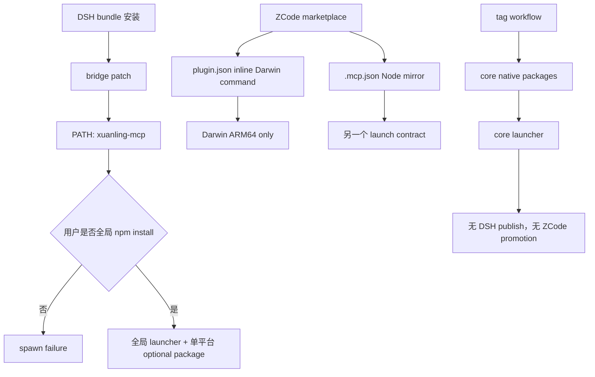
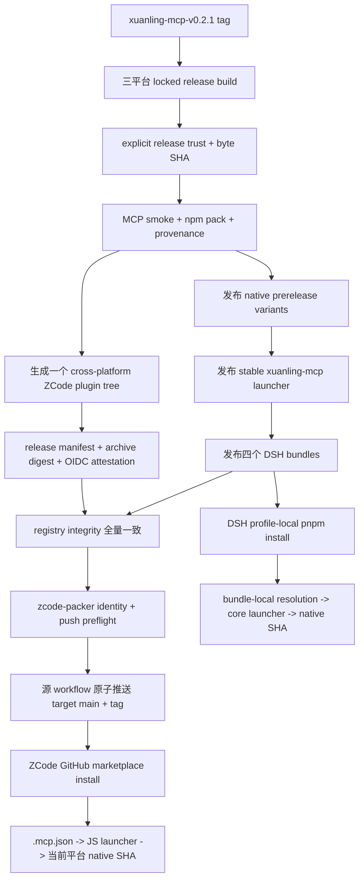

# Host 本地集成与分发实施计划

> 状态：实施计划；不表示当前 checkout 已完成任何本计划工作包。
> 基线日期：2026-08-17。
> 基线 revision：`c68ecfb01132f1daf9cdb0cf3e4572d42d987b4f`。
> 缺陷等级：`CONFIRMED P1 release blocker`（当前 DSH 包依赖全局
> `xuanling-mcp`，当前 ZCode 插件仅携带 Darwin ARM64）；ZCode 远程重装与杀毒软件信誉为
> `UNVERIFIED_RISK`。2026-08-17 经用户授权，平台发布者证书签名改为可选增强，不再是发布门禁。
> 计划路径：`docs/plans/host-local-integration-distribution-development-plan.md`。
> 执行账本：`docs/plans/host-local-integration-distribution-execution-ledger.md`。
> 目标首发版本：`0.2.1`。
> 目标 ZCode 仓库：`umbrella22/xuanling-zcode-marketplace`（已创建但当前为空、无默认分支）。
> 相关上游合同：[DSH package and install](https://deepseek-harness.github.io/deepseek-harness/develop/basic/)、
> [ZCode Plugin](https://zcode.z.ai/cn/docs/plugin)、
> [`npm-publish.yml`](../../.github/workflows/npm-publish.yml)、
> [`xuanling-mcp` npm package](../../npm/packages/xuanling-mcp/package.json)。

## 1. 目标与非目标

### 1.1 合同

#### C-01：DSH 工具包必须使用 profile-local XuanLing runtime

Given：从 npm 安装到 `$DSH_HOME/profiles/demo` 的
`xuanling-dsh-memory`、`xuanling-dsh-tools` 或 `xuanling-dsh-tools-replace`。
When：DSH 组合并启动该 bundle，且 `PATH` 中不存在全局 `xuanling-mcp`。
Then：bundle 通过自身安装树解析同版 `xuanling-mcp` JS launcher；launcher 再解析当前
OS/CPU/libc 的 native optional dependency，并在启动前验证 native SHA-256。
And not：不得执行全局 `npm install`、运行时 `npx`、`PATH` fallback、postinstall 下载或从
GitHub 临时拉取 binary。
Failure：launcher、platform package、binary 或 checksum 缺失时 fail loud，错误指向重新安装
当前 profile package，不建议全局安装，也不回退到其他平台 binary。
Evidence：packed manifest、profile-local resolution test、无全局命令的 clean-profile transcript、
launcher checksum negative test。

#### C-02：四个 DSH 包保持清晰且可组合的能力边界

Given：`xuanling-dsh-memory`、`xuanling-dsh-tools`、
`xuanling-dsh-tools-replace` 和 `xuanling-dsh-skills` 四个发布包。
When：用户通过 `dsh plugin --profile demo add xuanling-dsh-memory@0.2.1` 等精确 package
命令安装。
Then：前三个工具包精确依赖 `xuanling-mcp@0.2.1`；Skills 包不依赖 MCP runtime；Memory
仍只暴露 Memory profile；additive/replace 的工具目录与禁用行保持现有合同。
And not：不得把四包合并为一个隐式模式包，不得让 Skills 自行启动 MCP，也不得同时推荐安装
多个会注册 `xuanling-tools` 行的工具包。
Failure：多个工具包同时安装时文档和 verifier 报配置冲突；bridge/Skill 上游依赖解析失败时
DSH 启动非零退出，不静默忽略 bundle。
Evidence：四个 tarball allowlist、package dependency matrix、DSH `--dump-config`、Memory/fs
catalog probe 和 strict overwrite probe。

#### C-03：ZCode 使用一个跨平台、自包含插件

Given：从 `umbrella22/xuanling-zcode-marketplace` 安装的一个 `xuanling-mcp` plugin。
When：ZCode 3.7.7 或合同兼容版本在 Darwin ARM64、Linux x64 glibc 或 Windows x64 MSVC
环境启动 `.mcp.json`。
Then：`.mcp.json` 是唯一 MCP launch contract，使用 `${ZCODE_PLUGIN_ROOT}` 指向随插件分发的
JS launcher；plugin 同时携带三个 native package，launcher 只选择当前平台并验证 SHA-256。
And not：`.zcode-plugin/plugin.json` 不内联 Darwin-only command，不拆成三个按平台命名的插件，
不依赖用户全局 npm package。
Failure：unsupported OS/CPU/libc、缺少 Node、platform package 不匹配或 checksum 失败时明确
拒绝；不得尝试执行另一平台文件。
Evidence：generated tree manifest、三平台 launcher smoke、ZCode clean install、MCP discovery 与
至少一个 read-only tool call。

#### C-04：发布 binary 必须具有显式 release trust、provenance 与完整性证明

Given：tag release 构建出的三个 native binary。
When：进入 npm staging 和 ZCode marketplace staging。
Then：每个 native package 记录 source commit、binary SHA-256 与显式 `releaseTrust`；其中
`npmProvenance.status=required-at-publish`，`publisherSigning` 必须明确为 `not-provided` 或经过验证的
平台发布者签名。全部 npm item 使用 npm provenance 发布，ZCode archive 在 promotion 前生成
GitHub OIDC build-provenance attestation。
And not：不得用缺失字段表达 unsigned，不得使用 ad-hoc/self-signed 冒充发布者签名，不得在 hash
后修改 binary，不使用 UPX，也不得关闭杀毒软件或建议用户跳过安全检查。
Failure：release trust 缺失/畸形、hash 漂移、npm provenance 失败或 ZCode attestation 失败时
release 停止；若未来提供发布者签名，则其身份、timestamp 或验证失败同样停止。
Evidence：package `xuanlingBinary.releaseTrust`、binary SHA-256、release manifest schema v2、npm
provenance、GitHub artifact attestation 与 archive digest。

#### C-05：npm 发布顺序可恢复且不暴露悬空依赖

Given：`xuanling-mcp-v0.2.1` tag 对应的完整 release set。
When：CI 发布 npm artifacts。
Then：顺序固定为 native prerelease variants → stable `xuanling-mcp@0.2.1` launcher → 四个
DSH bundles；每一步先查询 registry integrity，已存在且一致则幂等跳过，不一致则停止。
And not：不得先发布依赖尚不存在的 DSH 包，不得覆盖 npm immutable version，不得在完整验证前
更新 release announcement 或 ZCode marketplace。
Failure：中途网络/registry/权限失败时保留已发布 immutable facts，下一次从首个缺失 artifact
恢复；不执行 unpublish 作为自动 rollback。
Evidence：release-set manifest、registry integrity report、publish log、重复执行 no-op 结果。

#### C-06：ZCode 仓库只接收经过验证的直接 promotion

Given：主仓库 release workflow 产生的 ZCode marketplace archive、SHA-256、source commit 和
version manifest，以及 GitHub Environment `zcode-packer` 中的 `XL_PUBLISH_TOKEN` secret 和
`ZCODE_REPOSITORY` variable。
When：主仓库在八个 npm release items 完整对账后直接 checkout
`umbrella22/xuanling-zcode-marketplace`。
Then：源 workflow 先验证 source/target 仓库身份、认证访问、`permissions.push=true` 和 target
default branch `main`，再验证 digest、source tag、完整 tree allowlist 与版本，并以一次原子 push
更新 `main` 和创建同版 immutable tag。
And not：不得把 credential 写入 source、artifact、日志或 target tree，不依赖目标仓库 workflow，
不从未经固定的 `main` branch 下载 binary，不让目标仓库重新编译 Rust，也不允许同一 tag 指向
不同 tree。
Failure：Environment 配置缺失、target identity 不符、认证失败、push 权限不足、default branch
不是 `main`、artifact 过期、digest 不同或 tag 已存在但 tree 不同时 fail closed；若 tag/tree
相同则幂等完成。
Evidence：Environment 配置元数据、authenticated repository permission response、source workflow
log、target commit/tag/tree hash。

#### C-07：发布完成必须有 clean-install 与真实 host 证据

Given：registry 和 ZCode marketplace 上已发布的 `0.2.1` artifacts。
When：在没有全局 `xuanling-mcp` 的临时 DSH profile、三平台 CI runner 和本机 ZCode 3.7.7
执行安装与重启。
Then：DSH 推荐 Memory+Skills 组合可启动，full-tools profile 可完成文件 read/hash，ZCode 可发现
MCP/Skill 并在重启后继续使用；所有实际 binary SHA 与 release manifest 一致。
And not：不得用源码目录、手工 cache 修改、mock bridge 或单平台 smoke 替代发布后安装。
Failure：任一 host 只能通过全局 package、临时环境注入或 cache 手改运行时，release 不得标记
complete；杀毒软件阻止时保留原安全设置并记录产品/版本/签名状态。
Evidence：profile package.json/node_modules、DSH transcript、GitHub Actions 三平台 logs、ZCode
installed record/process SHA 和 restart transcript。

#### C-08：集成源码、测试和用户现有改动保持边界清晰

Given：当前 MIT 迁移 dirty set、`integrations/` runtime source、根 `test/` 与 ignored `docs/`。
When：实施本计划。
Then：`integrations/` 只保留 host 安装或生成 runtime template 必需文件；generator、fixture、
evaluation 和 contract tests 位于 `npm/` 或根 `test/`；MIT 改动按现状保留并纳入发布合同；计划与
账本可被 Git 跟踪。
And not：不得回退用户已有 MIT 变化、吸收 `AGENTS.md`/`plan.md`、修改 DSH upstream checkout、
改动 Rust MCP schema/tool catalog/Memory 数据，也不得把 release staging 产物提交回主源码树。
Failure：出现无法归因的 overlapping diff、ignored plan、runtime 目录混入测试报告或默认 Memory
DB 变化时停止。
Evidence：allowed-path review、Git fingerprints、package file lists、default DB pre/post hash、
`git diff --check`。

### 1.2 非目标

- 不改变 Rust tool schema、MCP wire contract、Memory retrieval、CodeGraph、LSP 或默认 Memory DB。
- 不修改 DeepSeek Harness upstream；只消费当前发布的 profile/bundle 合同。
- 不为 ZCode 3.7.7 实现宿主补丁；网页列出的 npm marketplace source 在本机 3.7.7 仍不作为
  稳定依赖。
- 不支持 Darwin x64、Linux ARM64、musl 或 Windows ARM64；新增平台需要独立 target/package
  合同。
- 不嵌入 Node runtime；ZCode 插件明确要求可执行的 Node.js，用户只是不需要全局 npm package。
- 不承诺 provenance、attestation 或未来可选签名能消除杀毒软件误报，也不通过压缩壳、白名单
  绕过或关闭保护来制造通过。
- 本计划生成本身不授权建仓、commit、push、tag、npm publish、GitHub Release 或 ZCode cache修改；
  这些动作只在 W5 取得独立外部授权后执行。2026-08-17 的执行授权已覆盖 source `main` push
  和空 target repository bootstrap；release tag、npm publish和 host install仍受各自 entry gate约束。

## 2. 当前 checkout 基线

### 2.1 XuanLing 工作树

- branch `main`，revision `c68ecfb01132f1daf9cdb0cf3e4572d42d987b4f`，commit subject
  `feat: init`。
- `git status --short --untracked-files=all` 共 45 项；porcelain-z SHA-256 为
  `18a703feed2b702ca0621149cb0f66d8005462754a7b2fe2e5065eb3279eccd7`。
- 任务相关 tracked diff SHA-256 为
  `5a6c16c26348d1efc2c9abc5a2bf64c23cad7c852090a3ca574413e04bc4c50e`；任务相关
  untracked content-list SHA-256 为
  `e205dd04cb3fda204545193841aa46f4a96f62b0a07c7c06540497b16da3fc07`。
- dirty set 是用户已有 MIT 迁移：Cargo/npm/DSH manifests、READMEs、package scripts/tests、
  LICENSE 替换和 ZCode vendored runtime license 清理。执行者必须逐文件工作在这些改动之上，
  不能恢复 dual license。
- 用户 untracked `AGENTS.md` 与 `plan.md` 不属于本计划；不得修改、删除或加入发布 artifact。
- `.gitignore` 当前包含 `docs/*`；`docs/` 整体显示 `!! docs/`，因此本计划与已有 ADR/账本尚不可
  正常进入版本控制。这是 W0 的 `CONFIRMED` 可恢复性缺口。
- `origin=https://github.com/umbrella22/xuanling.git`，但 `git ls-remote --heads origin` 为空，
  GitHub API 也未报告 default branch；任何 CI/tag release 前必须先建立 canonical remote branch。
- submodule：N/A，`git submodule status` 为空。

### 2.2 当前 package 与 release 状态

- Cargo workspace、npm release workspace 和 `xuanling-mcp` package 均为 `0.2.1`。
- `xuanling-mcp` main package通过 optional npm aliases 支持 Darwin ARM64、Linux x64 glibc 和
  Windows x64 MSVC；launcher 已在启动前校验 `xuanlingBinary.sha256`。
- 三个 DSH 工具包目前只依赖 `@deepseek-ai/dsh-mcp-client`，patch 默认执行 PATH 中的
  `xuanling-mcp`；Memory adapter 的 `--binary` 也默认收到同一命令。这正是 C-01 红基线。
- `xuanling-dsh-skills` 当前只依赖 DSH Skill provider，这是应保留的正向基线。
- ZCode source 目前约 14,836 KiB，只携带 Darwin ARM64 package；`plugin.json` 内联 native
  command，而 `.mcp.json` 另有 Node launcher，形成两个 launch contracts。
- 当前 ZCode `plugin.json` 仍声明 `MIT OR Apache-2.0`，与正在进行的 MIT 迁移不一致。
- baseline `npm-publish.yml` 只构建和发布 core launcher/native variants；尚未 pack/publish DSH
  bundles，也没有 ZCode archive/direct-promotion job。
- 2026-08-17 对 `xuanling-mcp@0.2.1` 和四个 DSH package 的 registry 查询均为 E404；版本仍可
  作为首次发布使用，但 npm package name ownership 和 bootstrap token 是 W5 外部 gate。

### 2.3 外部 host 基线

- DeepSeek Harness checkout：XuanLing sibling checkout `../deepseek-harness`，branch `master`，
  revision `47f943859bef60e4160492346772ded9b24f765a`；两个既有 untracked comparison tests 必须
  保留。porcelain-z SHA-256 为
  `89b2a20a38d35a43db781e2255f5165d2ddbd77e3c7c17f2a410c7c68f627585`。
- DSH current docs 明确：`dsh plugin --profile demo add xuanling-dsh-memory@0.2.1` 这类命令在
  profile 目录内交给 pnpm，
  out-of-tree bundle 及其 dependencies 位于 profile-local `node_modules`；npm prebuilt package
  不需要 git `prepare` 授权。
- 本机 ZCode 为 `3.7.7` build `3.7.7.4926`。网页文档列出 npm source，但同版内置
  `diagnosing-plugins` Skill 明确只支持 directory/github/git/url/git-subdir，拒绝 npm/pip。
  稳定方案使用 GitHub marketplace source；宿主未来支持 npm 时另行简化。
- ZCode 3.7.7 app runtime 的 plugin sync service 默认 archive 上限为
  `50 * 1024 * 1024` bytes；remote source entries 不内嵌 payload。生成的 marketplace entry 必须
  使用 immutable GitHub source，并通过本机 install/sync gate，不能依赖接近上限的本地镜像。
- 当前本机安装记录是 directory source `xuanling-local@0.2.1`，cache 中同样只有 Darwin
  runtime；它只能作旧基线，不能作新仓库验收证据。
- `umbrella22/xuanling-zcode-marketplace` 已存在但 `isEmpty=true`、无默认分支。GitHub 登录具有
  admin 权限；W5 负责用仅含 `README.md`、`README-ZH.md` 和 `LICENSE` 的 bootstrap tree 建立
  `main`。
- 主仓库 GitHub Environment `zcode-packer` 已存在，secret metadata 包含
  `XL_PUBLISH_TOKEN`，variable `ZCODE_REPOSITORY` 为
  `umbrella22/xuanling-zcode-marketplace`。secret value 未读取；实际授权必须由 authenticated API
  的 `permissions.push=true` 证明，Environment 名称存在本身不构成授权证据。
- 平台发布者证书不是 0.2.1 发布前提；当前明确按 `publisherSigning.status=not-provided` 发布。
  npm bootstrap token只允许检查是否配置和认证是否成功，不读取或记录 secret 值。

### 2.4 当前验证基线

- `npm --prefix npm run check`：通过，`xuanling-mcp@0.2.1` metadata 合同绿色。
- `npm --prefix npm test`：79/79 通过；这是新红测试之前的基线，不证明 C-01 至 C-07。
- `npm --prefix npm run check:docs`：通过，47 个 Markdown 文件；checker 会主动遍历 ignored
  `docs/`，但这不证明它们可提交。
- `git diff --check`：通过；存在一个 THIRD_PARTY_LICENSES CRLF warning，无 whitespace error。
- 当前本地 release binary SHA-256 分别为 `a81b5c79...`（host release）和
  `5813718e...`（aarch64 target release）；它们未绑定 final source commit、npm provenance 与
  ZCode attestation，不可复用为 release artifact。

### 2.5 事实分级

| 事实 | 分级 | 触发与影响 | 解除条件 |
| --- | --- | --- | --- |
| DSH 默认依赖 PATH/global package | CONFIRMED P1 release blocker | clean profile 无全局命令即无法启动 | C-01 red/green + clean install |
| ZCode plugin 只有 Darwin ARM64 | CONFIRMED P1 release blocker | Linux/Windows 必然缺 package | 三平台 generated tree + smoke |
| plugin.json/.mcp.json 双 launch contract | CONFIRMED P1 release blocker | 不同 command/args 可漂移 | `.mcp.json` 成为唯一合同 |
| 发布者签名凭据可用性 | NON_BLOCKING | 0.2.1 明确记录 `not-provided`；不影响 MCP 执行 | 未来有真实证书时另行启用并验证 |
| ZCode remote reinstall 行为 | UNVERIFIED_RISK | 当前代码/文档支持，尚无新仓库 live 证据 | W5 local + remote-source transcript |
| 杀毒软件误报概率 | UNVERIFIED_RISK | provenance/attestation 不等于 OS publisher reputation | 记录 trust/hash/扫描事实，不承诺零误报 |
| ZCode 网页 npm source | NON_BLOCKING | 与 3.7.7 runtime 漂移 | 继续使用 GitHub source |

## 3. 已确认路径与目标路径

### 3.1 当前路径



### 3.2 目标路径



### 3.3 责任与持久化

- npm release scripts 拥有 version、package allowlist、tarball integrity、source commit 和 registry
  comparison；不拥有 host 配置。
- DSH bundle patch 拥有 profile-local module resolution、tool profile 和 host policy；Rust 仍拥有
  canonical tool validation、filesystem capability 与 Memory store。
- ZCode generator 拥有 marketplace tree projection；`.mcp.json` 是 launch canonical fact，
  `plugin.json` 只引用 component path。
- native package `xuanlingBinary` metadata、release manifest、npm registry integrity 和 target repo
  tagged tree 是 durable release facts；CI logs、ZCode cache 与 DSH temp profiles 是 evidence/projection。
- 任一 package publish 是不可逆 side effect；后续 failure 通过幂等 retry/新 patch version恢复，
  不自动 unpublish。

## 4. Requirement Coverage Matrix

| 需求 | 主合同 | 当前缺口 | 目标行为 | Wave | 红测试 | 最终证据 |
| --- | --- | --- | --- | --- | --- | --- |
| 不依赖全局 npm package | C-01 | PATH fallback | profile-local exact dependency | W1-W2 | clean PATH resolution | DSH clean profile |
| DSH 四包继续分离 | C-02 | 未发布且三包缺 core dependency | 三工具包 + 纯 Skills | W1-W2 | dependency matrix | 四 tarballs/catalog |
| DSH 安装自动带 launcher/binary | C-01 | 用户需先全局安装 | exact core + optional native | W2/W5 | missing local runtime | installed node_modules |
| ZCode 单独分发仓库 | C-06 | 仓库不存在 | generated GitHub marketplace | W3-W5 | target contract absent | target commit/tag |
| ZCode 一个插件跨三平台 | C-03 | Darwin-only | 三 native aliases + selector | W1-W3 | missing platform packages | three-OS smoke |
| `.mcp.json` 唯一 launch contract | C-03 | plugin.json inline command | component path reference | W1-W3 | dual-contract assertion | manifest verifier |
| 降低分发与误报风险 | C-04 | 无显式 trust/attestation | provenance + explicit unsigned + SHA + attestation | W1/W4 | release-trust oracle | provenance/attestation + SHA |
| CI 构建后推送分发仓库 | C-06 | 无 promotion | verified artifact + direct atomic push | W1/W4-W5 | direct-push contract absent | source workflow + target tag |
| npm 发布顺序和失败恢复 | C-05 | 只发布 core | ordered idempotent eight-item set | W1/W4-W5 | order/integrity test | registry report |
| integrations 仅保留 runtime | C-08 | ZCode staging script/binary 混在 source | template/runtime 与 test/generator 分离 | W2-W3 | package allowlist | final tree review |
| README 正式双语发布说明 | C-07 | 当前仍描述 global/local path | English canonical + README-ZH | W2/W6 | stale wording scan | packed READMEs |
| 保留 MIT 与 Rust 行为 | C-08 | dirty overlap | MIT 合同合并，Rust catalog 不变 | W0-W6 | fingerprint/snapshot | final diff/hashes |

每个用户需求恰好映射一个主合同；其他合同只作为安全或发布辅助约束。

## 5. 影响边界矩阵

| 模块/边界 | 当前职责 | 允许变化 | 必须保持 | 合同 | 验证 |
| --- | --- | --- | --- | --- | --- |
| DSH package manifests | bundle metadata/deps/files | exact core dep、publish metadata、README | 四包身份/能力边界 | C-01/C-02 | pack verifier |
| DSH patches/adapters | bridge/Skill host glue | local launcher resolution | profiles、strict overwrite、schema projection | C-01/C-02 | patch/probe tests |
| npm main launcher | target select/hash/spawn | 去除 global-only recovery wording | target map、signal/exit behavior | C-01/C-03 | launcher unit tests |
| native package staging | binary metadata/hash | release-trust input | target/os/cpu/libc/notice | C-04/C-05 | verify-package |
| npm release workflow | build/publish core | sign、DSH pack/publish、ZCode artifact | native-before-main | C-04/C-05 | workflow contract/live run |
| ZCode runtime template | plugin metadata/Skill/MCP | single `.mcp.json` contract | workspace root/compat mode | C-03/C-08 | zcode contract test |
| ZCode generator | 当前 host-only sync | all-target immutable staging | no runtime network/install scripts | C-03/C-06 | synthetic + release set |
| target marketplace repo | 当前为空 | bootstrap docs + verified generated tree | no target workflow/Rust build/manual binary | C-06 | target tree/tag verifier |
| GitHub auth | `zcode-packer` metadata configured | Environment-scoped direct promotion | no token content in repo/artifact/log | C-06 | authenticated permission/secret scan |
| npm registry | immutable packages | eight package/version publications | integrity match/no overwrite | C-05 | `npm view` report |
| ZCode host/cache | plugin discovery/install | authorized UI install only | no manual cache write | C-03/C-07 | installed record/live transcript |
| DSH upstream | external host | N/A：只读验收 | revision/untracked files | C-02/C-08 | pre/post fingerprints |
| Rust crates/MCP catalog | canonical server | N/A：本计划禁止修改 | schema/snapshot/Memory data | C-08 | diff + existing tests |
| docs/.gitignore | plan/release docs | make docs trackable | no unrelated ignore churn | C-08 | `git check-ignore` |
| migration/backup | N/A：无 schema/data migration | N/A | default DB untouched | C-08 | pre/post hash |

## 6. 目标合同与全局不变量

### 6.1 Canonical facts 与 derived projections

- canonical source facts：tag、source commit、Cargo/npm version、target map、package source files。
- canonical built facts：native bytes、explicit release trust、native SHA-256、npm tarball integrity、
  ZCode archive digest、generated tree hash。
- canonical external facts：npm registry integrity/provenance、GitHub artifact attestation、target repo
  commit/tag tree；可选 publisher signature identity仅在真实验证后出现。
- DSH profile、ZCode installed cache、README tables和 CI summaries 是 derived projections；必须能回指
  canonical version/hash，不得反向修改 release facts。

目标 `release-manifest.json` 至少包含：`schema_version=2`、`version`、`source_commit`、每个平台
Rust target/binary/SHA/release trust、全部 npm package name/version/integrity、ZCode tree/archive digest、
生成器版本和目标 marketplace tag。JSON key 排序与输出稳定，secret/certificate 私钥内容永不进入。

### 6.2 Success、partial、failure、cancel 与 recovery

- pre-release success：全部本地/CI contracts 绿色，但没有 registry/target/live host side effect；状态上限
  `deterministic_green`。
- npm partial success：至少一个 immutable package 已存在、完整 release 未结束；状态
  `implemented_unverified`，账本记录已发布 integrity 和首个缺失项。
- promotion success：npm 八个 release items、ZCode tagged tree、DSH/ZCode live acceptance 全部一致。
- cancel before publish：无外部 durable change，重新运行完整 verification。
- cancel during publish：不回滚已发布 package；registry reconciliation 后从首个缺失 item恢复。
- cancel during target promotion：原子 push 前没有 target durable change；tag 不存在可重试，
  tag/tree 一致则 no-op，tag/tree 不同则 blocker。
- process crash/restart：只从 ledger、registry、artifact manifest 和 target tag恢复，不依赖聊天摘要。

### 6.3 Idempotency、ordering、concurrency 与 retry

- release identity 是 `(version, source_commit)`；同一 version 不允许第二个 source commit。
- npm identity 是 `(name, version, integrity)`；存在且相同为 success，存在且不同为 hard failure。
- target promotion identity 是 `(tag, source_commit, tree_sha256)`；相同 no-op，不同 hard failure。
- GitHub Actions concurrency 对 release tag禁止 cancel-in-progress；target main/tag 使用单次 atomic
  push；第二个同版 run在 registry/target reconciliation 后退出或恢复。
- 网络、rate limit、artifact download 可以有有界 retry；release-trust、provenance、attestation、
  optional signature、hash、schema mismatch 或 unsupported platform 不重试掩盖。

### 6.4 Compatibility 与版本

- 本计划首发版本固定为 `0.2.1`，因为 2026-08-17 registry 上五个 public names均不存在。
- 三个 DSH 工具包必须使用 exact `xuanling-mcp: "0.2.1"`；不得用 `latest`、caret 或 git branch。
- DSH bridge/Skill provider 保持当前 `^0.1.0-rc.5`，除非 W1 证明上游 package contract不兼容；
  变更上游范围触发 stop condition。
- ZCode marketplace main entry可以指向 immutable `xuanling-mcp-v0.2.1` tag；installed package不能
  通过 mutable branch取得 runtime。
- npm/ZCode package中不执行 lifecycle install scripts；升级通过 package manager/marketplace reinstall。

### 6.5 Secret、release trust、日志与 telemetry

- 0.2.1 允许的 secret names 只有一次性 npm bootstrap token 与 `zcode-packer` 的
  `XL_PUBLISH_TOKEN`。日志只记录 configured/missing 与 authenticated permission，不记录 token值。
- temporary `.npmrc` 与 checkout credential只存在于临时 runner；artifact、cache、tarball、README、
  ledger和 target tree中禁止出现 secret bytes。
- `publisherSigning=not-provided` 是 canonical 状态；未来若启用平台签名，必须记录真实验证身份且签名后
  不得再修改 binary。
- telemetry：N/A，本计划不新增 runtime telemetry。Release logs 由 GitHub/npm保留，需通过 leak scan。

### 6.6 数据、权限与 sandbox

- DSH/ZCode 安装不打开默认 Memory DB；所有 smoke server显式使用临时 `--memory-db`。
- `--workspace-root` 仍是 filesystem capability，不是 process sandbox；README不得暗示签名等于 sandbox。
- package manager和 GitHub clone在 agent sandbox之外执行 trusted code；因此包内禁止 lifecycle scripts，
  target repo只含已验证 bytes。
- backup/restore/migration：N/A，无 schema 或用户数据变化；default DB pre/post bytes必须一致。

## 7. Wave 依赖和状态机

```text
not_started
  -> red_confirmed
  -> implemented_unverified
  -> deterministic_green
  -> complete

实现、manifest、workflow 或目标合同变化
  -> implemented_unverified

失败 gate、stale artifact、release-trust/provenance/attestation/hash 漂移或 red test 失效
  -> red_confirmed
```

严格依赖：

```text
W0 contract_and_dirty_baseline
  -> W1_release_red_contracts
  -> W2_dsh_profile_local_packages
  -> W3_zcode_cross_platform_projection
  -> W4_release_trust_publish_and_promotion_pipeline
  -> W5_authorized_live_release_acceptance
  -> W6_final_gates_and_release_docs
```

只有前一 Wave 在当前 checkout 为 `complete` 才解锁下一 Wave。W4 的范围是 release pipeline
实现与本地/合成验证；所有本地 required gate 通过后可以标为 `complete`。真实 npm provenance、
GitHub attestation、canonical remote、npm ownership、目标 token push permission 和 host acceptance
都是 W5 entry/live gate，
不得用 W4 的 metadata 或 fixture 代替。W5 包含不可逆外部 side effects，必须取得当轮独立授权。

## 8. Wave 0：冻结合同、dirty 归属与可恢复文档

### 8.1 目标与合同

- 覆盖合同：C-08；为 C-01 至 C-07 建立 current fingerprint。
- 本 Wave 完成后的可观测结果：计划、账本和现有 docs 可进入版本控制；MIT dirty set、外部
  checkouts、registry names、remote 和默认 DB 均有可重复基线。
- 明确不处理：package behavior、runtime staging、release trust、发布和外部仓库创建。

### 8.2 Entry gate

- [ ] 重新完整读取根 `AGENTS.md`、本计划和账本。
- [ ] 运行 `git status --short --untracked-files=all` 与 `git rev-parse HEAD`。
- [ ] 确认 `AGENTS.md`、`plan.md` 和 MIT 迁移仍可归属，未出现未知 overlap。
- [ ] DSH checkout、ZCode 版本和 registry 只读检查可用。

### 8.3 Allowed files

- `.gitignore`
- `docs/README.md`
- `docs/plans/README.md`
- `docs/plans/host-local-integration-distribution-*.md`
- 本 Wave 只读证据写入 ledger；不创建 release artifact。

### 8.4 Forbidden changes

- `Cargo.toml`、`Cargo.lock`、`crates/**`、`npm/**`、`integrations/**`、`.github/workflows/**`。
- DSH checkout、ZCode cache、默认 Memory DB、Git remote、npm registry 和 GitHub repositories。
- 回退、格式化或重新生成当前 MIT dirty set。

### 8.5 红测试与基线

| Test/Oracle | Trigger | Expected old failure | Wrong failure |
| --- | --- | --- | --- |
| docs tracking | `git check-ignore docs/plans/...` | 当前返回 ignored | 文件不存在或 Git 仓库损坏 |
| canonical remote | `git ls-remote --heads origin` | 当前无 branch | 网络/TLS/auth error |
| target repo existence | `gh repo view ...` | repository not found | GitHub auth unavailable |
| registry names | 对计划列出的五个 `name@0.2.1` 运行 `npm view` | 五个 public names E404 | rate limit/registry outage |
| current contracts | npm check/test/docs | 79 tests 全绿 | MIT 迁移自身失败 |

### 8.6 实施工作包

| Package | Symbol/path | Contract | Failure behavior | Targeted validation |
| --- | --- | --- | --- | --- |
| W0.1 | Git/DSH/ZCode/npm baselines | C-08 | drift 归因不明则停止 | status/rev/hash/API |
| W0.2 | MIT dirty classification | C-08 | 未归属文件不进入 allowed set | per-path manifest |
| W0.3 | `.gitignore` docs rule | C-08 | 仅删除过宽 `docs/*`；其他 ignore 不动 | check-ignore/status |
| W0.4 | ledger prerequisites | C-04/C-06 | 只记 configured/missing，不读 secrets | metadata-only preflight |

### 8.7 验证命令

| Command | Provenance | Expected result | Required/conditional |
| --- | --- | --- | --- |
| `git status --short --untracked-files=all` | repository baseline | 变更全部归属 | required |
| `git rev-parse HEAD` | Git | revision 精确 | required |
| `git check-ignore docs/plans/host-local-integration-distribution-development-plan.md` | C-08 | 修改后非零，文档不再 ignored | required |
| `npm --prefix npm run check` | current manifest | pass | required |
| `npm --prefix npm test` | current contracts | 79 baseline tests pass | required |
| `npm --prefix npm run check:docs` | current docs gate | pass | required |
| `git ls-remote --heads origin` | external remote | 结果写 ledger；为空保持 W5 blocker | required |
| `gh repo view umbrella22/xuanling-zcode-marketplace` | target discovery | not-found 作为 expected baseline | required |
| `git diff --check` | Git | clean | required |

### 8.8 Evidence

- Behavior before：docs ignored；canonical remote 无 branch；target repo 不存在。
- Red failure：记录每个 Oracle 的 exit code 和 stderr 分类。
- Behavior after：docs 可跟踪，其他外部事实不变。
- Files changed：仅 Allowed files。
- Commands passed/failed/not run：逐条写 ledger。
- API/storage/UI/restart evidence：N/A，本 Wave 不启动 runtime。
- External dependency evidence：只读 GitHub/npm/DSH/ZCode metadata。
- Secret/redaction evidence：只记录 secret 是否配置，不记录长度、hash 或内容。

### 8.9 Exit gate

- [ ] docs tracking 红色因正确且转绿。
- [ ] 45 项现有 dirty/untracked 有归属清单，用户文件保持 untouched。
- [ ] npm 79 baseline、docs 和 diff gates current。
- [ ] external blockers 有解除条件，不把 repository not-found 当实现失败。
- [ ] 账本更新到 W1.1，fingerprint 使用修改后的 current status。

### 8.10 Stop conditions

- MIT diff 与本计划拟修改同一行且无法语义合并。
- 取消 docs ignore 会暴露无法归属的敏感或废弃文件。
- 当前 npm baseline 不再是 79/79 且根因不明。
- 只读 external query 返回权限/网络故障而非合同结果。

### 8.11 Handoff

W0 complete 后，ledger `next_action` 必须是：在不修改 production files 的前提下新增 W1
release contract red tests，并运行 focused test 确认失败原因。

## 9. Wave 1：建立分发与发布顺序红合同

### 9.1 目标与合同

- 覆盖合同：C-01、C-02、C-03、C-04、C-05、C-06、C-08。
- 本 Wave 完成后的可观测结果：每个当前缺口都有命中现有 source/workflow 的正确红测试；79 个
  baseline tests仍绿，新失败数量和原因固定。
- 明确不处理：不改 package manifests、patches、launcher、generator、workflow 或外部系统。

### 9.2 Entry gate

- [ ] W0 在当前 checkout 为 complete。
- [ ] dirty/untracked 与重叠 diff 已重新记录。
- [ ] npm test harness、Node 24 和现有 integration fixtures 可用。
- [ ] current package version仍为 `0.2.1`，registry仍未出现冲突 package。

### 9.3 Allowed files

- `npm/test/deepseek-harness-bundle.test.mjs`
- `npm/test/deepseek-harness-skills.test.mjs`
- `npm/test/package-contract.test.mjs`
- `npm/test/platform-contract.test.mjs`
- `npm/test/zcode-plugin-contract.test.mjs`
- `npm/test/release-distribution-contract.test.mjs`（新建）
- `test/release/**`（仅小型 synthetic JSON/file fixtures，不含 binary/secret）
- `docs/plans/host-local-integration-distribution-*.md`

### 9.4 Forbidden changes

- `npm/scripts/**`、`npm/packages/**`、`integrations/**`、`.github/workflows/**`。
- 任何 Rust source/snapshot、DSH upstream、真实 binary、ZCode cache、registry/repositories。
- 用 module-not-found、missing fixture 或 syntax error 充当正确红色。

### 9.5 红测试与基线

| Test/Oracle | Trigger | Expected old failure | Wrong failure |
| --- | --- | --- | --- |
| DSH exact runtime dep | 读三工具包 manifest | 缺 `xuanling-mcp: 0.2.1` | JSON parse/fixture failure |
| DSH local launcher | 解析三 patch | 仍出现 PATH `xuanling-mcp` | bridge/tool profile断言失败 |
| Skills purity | 读 Skills manifest | 正向保持：无 core dep | 把正向 invariant误做红色 |
| no-global recovery | 扫 launcher/READMEs | 仍建议 `npm install -g` | 无关文字命中 |
| ZCode sole MCP contract | 读 plugin/mcp manifests | plugin.json仍 inline server | JSON schema读取失败 |
| ZCode target set | 读 source/generated contract | 只有 Darwin package | 真实 binary缺失本身导致 crash |
| release trust before publish | 解析 release workflow与 package metadata | 无 explicit trust/provenance/attestation gate | PR workflow未发布 |
| DSH publish order | 解析 release workflow/scripts | 无四 bundle pack/publish | YAML parser故障 |
| promotion contract | 解析 workflow | 无 immutable artifact/direct push | target repo不存在 |
| runtime-source hygiene | 扫 integrations tree | ZCode host binary和 staging script混入 | README/Skill误报 |

### 9.6 实施工作包

| Package | Symbol/path | Contract | Failure behavior | Targeted validation |
| --- | --- | --- | --- | --- |
| W1.1 | DSH manifest/patch tests | C-01/C-02 | 只因 global/default dep 缺口红 | focused Node tests |
| W1.2 | launcher wording/install tests | C-01/C-07 | 精确匹配 global-only建议 | package tests |
| W1.3 | ZCode manifest/target tests | C-03/C-08 | 双合同/Darwin-only红 | zcode focused tests |
| W1.4 | release workflow static Oracle | C-04/C-05/C-06 | 缺 step/order/auth红 | distribution test |
| W1.5 | synthetic hash/tree fixtures | C-03/C-06 | fixture自校验先绿 | fixture hash test |

### 9.7 验证命令

| Command | Provenance | Expected result | Required/conditional |
| --- | --- | --- | --- |
| `node --test npm/test/deepseek-harness-bundle.test.mjs` | C-01/C-02 red | 新合同正确红，旧断言绿 | required |
| `node --test npm/test/zcode-plugin-contract.test.mjs` | C-03 red | 新合同正确红，旧断言绿 | required |
| `node --test npm/test/release-distribution-contract.test.mjs` | C-04-C-06 red | 精确缺失项红 | required |
| `npm --prefix npm test` | regression | 原 79 tests pass；仅列明新 tests红 | required |
| `npm --prefix npm run check:docs` | docs | pass | required |
| `git diff --check` | Git | clean | required |

### 9.8 Evidence

- Behavior before：global PATH、Darwin-only、无 explicit release trust/attestation/DSH publish/promotion。
- Red failure：每个 test name、assertion、expected current value和实际 current value。
- Behavior after：N/A，本 Wave 不实现。
- Files changed：tests/fixtures/ledger only。
- Commands passed：fixture self-check、79 baseline tests。
- Commands failed：合同红测试；wrong failure必须为零。
- API/storage/UI/restart evidence：N/A。
- External dependency evidence：N/A，不把 target repo不存在作为 test fixture failure。
- Secret/redaction evidence：fixtures 不含 credentials。

### 9.9 Exit gate

- [ ] C-01 至 C-06 每条至少一个正确红色或已证明的正向 invariant。
- [ ] 新 tests 不依赖将来才创建的 module/fixture才能运行。
- [ ] 旧 79 tests无回归。
- [ ] 红色计数、失败名和 checkout fingerprint写入 ledger。
- [ ] `next_action` 唯一指向 W2.1 package manifest/runtime resolution。

### 9.10 Stop conditions

- 当前 source 已满足某个假定缺口，测试不能人为反转正确行为。
- 需要修改 DSH upstream或 Rust contract才能构造红测。
- workflow YAML 无可靠结构化解析路径且 regex可能误判；先补受限 parser fixture。
- 新测试打开默认 Memory DB或执行外部 publish。

### 9.11 Handoff

W1 只能以 `red_confirmed` 结束；ledger 保存确切失败集合。实现者从 W2.1 开始，一次只关闭一组
DSH failures，不能先改测试预期。

## 10. Wave 2：发布可自包含安装的 DSH packages

### 10.1 目标与合同

- 覆盖合同：C-01、C-02、C-07、C-08。
- 本 Wave 完成后的可观测结果：四个 npm tarballs内容、metadata和双语 README完整；三工具包从
  profile-local dependency启动，Skills保持纯包；源码/packed smoke不需要全局 `xuanling-mcp`。
- 明确不处理：ZCode projection、publisher signing、registry publish和外部 repo。

### 10.2 Entry gate

- [ ] W1 为 complete/red evidence current。
- [ ] DSH revision/status与 W0一致。
- [ ] exact core version和 package names仍可用。
- [ ] MIT files与 package `license=MIT` 合同保持 current。

### 10.3 Allowed files

- `integrations/deepseek-harness/README.md`
- `integrations/deepseek-harness/README-ZH.md`
- `integrations/deepseek-harness/xuanling-*/package.json`
- `integrations/deepseek-harness/xuanling-*/cordis.patch.yml`
- `integrations/deepseek-harness/xuanling-*/README.md`（新建）
- `integrations/deepseek-harness/xuanling-*/README-ZH.md`（新建）
- `integrations/deepseek-harness/xuanling-memory/schema-adapter.mjs`
- `integrations/deepseek-harness/xuanling-memory/schema-projection.mjs`
- `integrations/deepseek-harness/xuanling-skills/**`（只允许 package/runtime docs 与必要 policy修复）
- `npm/packages/xuanling-mcp/lib/launcher.js`
- `npm/scripts/pack-dsh-bundles.mjs`（新建）
- `npm/scripts/verify-dsh-release-set.mjs`（新建）
- W1 tests、`test/release/**`、计划和 ledger。

### 10.4 Forbidden changes

- `crates/**`、MCP snapshots、Memory DB、ZCode source、release workflows、external systems。
- global install/npx/postinstall/prepare/runtime download。
- 改变 Memory profile工具数、replace禁用集合、strict overwrite decision或schema projection语义，
  除非现有 focused test证明 packaging 必需；发生时停止扩大计划。

### 10.5 红测试与基线

| Test/Oracle | Trigger | Expected old failure | Wrong failure |
| --- | --- | --- | --- |
| exact core dependency | pack三工具包 | dependency missing | npm registry network call |
| local JS resolution | 在 synthetic profile树求值/启动 | PATH command被调用 | fake node_modules缺 fixture |
| Skills purity | pack Skills | 无 core dep，保持绿 | 给 Skills加 runtime |
| tarball allowlist | `npm pack --json` | 当前无 per-package README/metadata | npm CLI版本错误 |
| missing/corrupt native | launcher fixture | typed reinstall/current-profile error | checksum test fixture无效 |
| no global wording | package/readme scan | 当前仍有 global install文本 | 示例中的历史引用误报 |

### 10.6 实施工作包

| Package | Symbol/path | Contract | Failure behavior | Targeted validation |
| --- | --- | --- | --- | --- |
| W2.1 | 三工具包 manifests | C-01/C-02 | exact core dep/metadata不一致即 pack拒绝 | dependency test |
| W2.2 | patch local launcher resolution | C-01 | resolve失败/sha失败 fail loud | no-PATH synthetic smoke |
| W2.3 | Memory adapter child argv | C-01/C-02 | adapter failure转发且清理 child | adapter tests |
| W2.4 | Skills pure package | C-02 | 不启动/依赖 MCP | Skill package tests |
| W2.5 | four pack/verify scripts | C-02/C-08 | 文件多/少、script、版本漂移拒绝 | pack release set |
| W2.6 | package/root EN+ZH READMEs | C-07 | stale global/path instructions拒绝 | docs + tarball scan |

### 10.7 验证命令

| Command | Provenance | Expected result | Required/conditional |
| --- | --- | --- | --- |
| `node --test npm/test/deepseek-harness-bundle.test.mjs` | C-01/C-02 | all pass | required |
| `node --test npm/test/deepseek-harness-skills.test.mjs` | Skills contract | all pass | required |
| `node --test npm/test/package-contract.test.mjs npm/test/platform-contract.test.mjs` | launcher | all pass | required |
| `node npm/scripts/pack-dsh-bundles.mjs --out npm/dist/dsh` | W2 new contract | four tarballs/manifests | required |
| `node npm/scripts/verify-dsh-release-set.mjs --root npm/dist/dsh --version 0.2.1` | W2 new verifier | exact set/integrities | required |
| `npm --prefix npm test` | full Node contracts | all pass | required |
| `npm --prefix npm run check:docs` | docs | pass | required |
| `git diff --check` | Git | clean | required |

### 10.8 Evidence

- Behavior before：三工具包需要 PATH/global；packages无独立发布 README。
- Red failure/behavior after：逐项对应 W1 test转绿。
- Files changed：仅 Allowed files，package tarballs位于 ignored `npm/dist`。
- Commands passed/failed/not run：pack result filename/size/integrity写 ledger。
- API/storage/UI/restart evidence：synthetic profile-local spawn + adapter teardown。
- External dependency evidence：真实 DSH install留 W5，不用 local link冒充。
- Secret/redaction evidence：package/tree扫描无 credential-shaped file。

### 10.9 Exit gate

- [ ] 四 tarball files、license、repository、publishConfig、version完整且无 lifecycle scripts。
- [ ] 三工具包 exact依赖 core，Skills无 core dependency。
- [ ] PATH中不存在 `xuanling-mcp` 时 synthetic profile仍解析 local launcher。
- [ ] Memory/full/replace/Skills现有能力合同无回归。
- [ ] DSH upstream和默认 DB指纹不变；ledger指向 W3.1。

### 10.10 Stop conditions

- DSH loader不能从 bundle patch的 `baseUrl`/profile tree稳定解析 dependency。
- 必须新增 DSH upstream API或全局环境才能启动。
- exact core dependency导致 pnpm optional alias无法安装且无法用正式 npm语义解决。
- package需要 install-time script、binary下载或写用户目录。

### 10.11 Handoff

保存四个 pack manifests和 source fingerprint；下一轮从 W3.1 将现有 ZCode host-only staging改成
all-target generated projection，不复用 `integrations` 中的旧 Darwin bytes。

## 11. Wave 3：生成单一跨平台 ZCode marketplace projection

### 11.1 目标与合同

- 覆盖合同：C-03、C-06、C-08。
- 本 Wave 完成后的可观测结果：从已验证 core release tarballs确定性生成一个含三平台 runtime的
  marketplace tree/archive；`.mcp.json` 是唯一 launch contract，source template不再提交 host binary。
- 明确不处理：npm publish、target repo创建/push、可选发布者签名和 ZCode cache安装。

### 11.2 Entry gate

- [ ] W2 complete，core main/native tarball staging可用。
- [ ] 三 target IDs与 `targets.js` current且无第四个隐式平台。
- [ ] ZCode 3.7.7 official/runtime facts已重新验证或标记 stale。
- [ ] source Darwin binary/hash不作为 target artifact输入。

### 11.3 Allowed files

- `integrations/zcode-plugin/marketplace.json`
- `integrations/zcode-plugin/plugins/xuanling-mcp/.zcode-plugin/plugin.json`
- `integrations/zcode-plugin/plugins/xuanling-mcp/.mcp.json`
- `integrations/zcode-plugin/plugins/xuanling-mcp/README.md`
- `integrations/zcode-plugin/plugins/xuanling-mcp/README-ZH.md`
- `integrations/zcode-plugin/plugins/xuanling-mcp/LICENSE`（新建）
- `integrations/zcode-plugin/plugins/xuanling-mcp/skills/**`
- 删除 `integrations/zcode-plugin/plugins/xuanling-mcp/bin/**` 的 checked-in staging bytes。
- 删除/迁移 `integrations/zcode-plugin/plugins/xuanling-mcp/scripts/sync-binary.mjs`。
- `npm/scripts/stage-zcode-marketplace.mjs`（新建）
- `npm/scripts/verify-zcode-marketplace.mjs`（新建）
- `npm/test/zcode-plugin-contract.test.mjs`
- `npm/test/release-distribution-contract.test.mjs`
- `test/release/**`、计划和 ledger。

### 11.4 Forbidden changes

- Rust crates、DSH packages、release workflow、真实 ZCode cache/marketplace records、external repo。
- 每平台拆插件、inline OS selector、runtime download、`npm install`、UPX或提交 `npm/dist`。
- 保留 plugin.json inline MCP command作为“兼容 mirror”。

### 11.5 红测试与基线

| Test/Oracle | Trigger | Expected old failure | Wrong failure |
| --- | --- | --- | --- |
| sole launch contract | parse plugin/mcp | inline + mirror双合同 | invalid JSON |
| root variable | inspect command args | 使用 CLAUDE alias/host-only native | ZCode env docs不可访问 |
| all targets | stage verified synthetic set | source只有 Darwin | synthetic hash不匹配 |
| release-trust/hash propagation | compare package/release tree | 旧 sync只复制 host且无 trust metadata | tar extraction failure |
| deterministic projection | stage两次 | tree/hash必须相同，旧 script会就地改 source | timestamps进入输出 |
| runtime hygiene | `find integrations` | checked-in bin + release script存在 | LICENSE/Skill误判 |
| remote immutable source | marketplace entry | 当前 relative local source | GitHub API网络错误 |

### 11.6 实施工作包

| Package | Symbol/path | Contract | Failure behavior | Targeted validation |
| --- | --- | --- | --- | --- |
| W3.1 | plugin/marketplace manifests | C-03/C-06 | version/ref/component不一致拒绝 | JSON contract |
| W3.2 | `.mcp.json` launcher contract | C-03 | Node/platform/hash错误 fail loud | three-target unit smoke |
| W3.3 | source cleanup | C-08 | generated bytes只到 `npm/dist` | repository tree scan |
| W3.4 | `stage-zcode-marketplace.mjs` | C-03/C-06 | source set/hash/file list缺失零输出 | synthetic/release staging |
| W3.5 | `verify-zcode-marketplace.mjs` | C-03/C-06 | extra/missing/mutable ref拒绝 | negative fixtures |
| W3.6 | release manifest/tree digest | C-04/C-06 | binary hash与npm metadata不一致拒绝 | manifest cross-check |
| W3.7 | EN/ZH runtime docs | C-07/C-08 | global npm/双合同/误导安全声明拒绝 | docs/package scan |

### 11.7 验证命令

| Command | Provenance | Expected result | Required/conditional |
| --- | --- | --- | --- |
| `node --test npm/test/zcode-plugin-contract.test.mjs` | C-03 | all pass | required |
| `node npm/scripts/stage-zcode-marketplace.mjs --release-root npm/release --out npm/dist/zcode-marketplace --version 0.2.1 --commit "$(git rev-parse HEAD)"` | W3 new contract | deterministic tree/archive | required |
| `node npm/scripts/verify-zcode-marketplace.mjs --root npm/dist/zcode-marketplace --version 0.2.1 --commit "$(git rev-parse HEAD)"` | W3 verifier | exact tree/hash/refs | required |
| 上述 stage 两次并比较 tree SHA-256 | reproducibility | equal | required |
| `node npm/scripts/smoke-mcp.mjs --launcher npm/dist/zcode-marketplace/plugins/xuanling-mcp/bin/node_modules/xuanling-mcp/bin/xuanling-mcp.js` | MCP smoke | explicit temp DB，pass | host target required |
| `npm --prefix npm test` | Node full | W0-W3 tests pass；W4 contract tests remain exact red until W4, then full suite must pass | required staged gate |
| `npm --prefix npm run check:docs` | docs | pass | required |
| `git diff --check` | Git | clean | required |

### 11.8 Evidence

- Behavior before：14 MiB Darwin-only source、两个 launch contracts、就地 sync script。
- Red failure/behavior after：三 target aliases和 sole `.mcp.json`逐项转绿。
- Files changed：runtime template + generator/tests；generated bytes不在 Git status。
- Commands passed：两次 tree hash、host launcher smoke、negative fixture拒绝。
- Commands failed/not run：其他两 OS smoke留 W4 CI。
- API/storage/UI/restart evidence：raw MCP only；ZCode UI留 W5。
- External dependency evidence：GitHub source object静态合同；无 target repo write。
- Secret/redaction evidence：archive/file manifest scan。

### 11.9 Exit gate

- [ ] generated plugin恰有 main launcher + 三 platform package aliases。
- [ ] 每个 native byte hash与 source npm platform manifest一致。
- [ ] plugin.json只引用 `.mcp.json`；`.mcp.json`使用 `${ZCODE_PLUGIN_ROOT}`。
- [ ] marketplace source是 target repo immutable GitHub tag，不是 mutable branch/local path/npm source。
- [ ] source integration中无 checked-in binary/staging script；generated output只在 ignored dist。
- [ ] 两次 staging tree hash一致；账本指向 W4.1。

### 11.10 Stop conditions

- ZCode manifest不能引用 `.mcp.json`或 `${ZCODE_PLUGIN_ROOT}`在 3.7.7 不生效。
- 单一 plugin无法选择三个 native package而必须依赖 host未声明功能。
- generated runtime超过 host hard limit且 immutable GitHub source不能绕过 payload mirroring。
- stage需要执行 npm lifecycle script、访问 mutable registry latest或修改 source template。

### 11.11 Handoff

W3 保存 generated archive digest、tree hash、每平台 explicit release-trust metadata和本机 raw smoke。
W4 只能以重新构建的 release binary开始，不能给 W3旧 byte补写虚假 provenance、attestation或签名
metadata。

## 12. Wave 4：release trust、npm release set 与直接 promotion pipeline

### 12.1 目标与合同

- 覆盖合同：C-04、C-05、C-06；辅助 C-01 至 C-03。
- 本 Wave 完成后的可观测结果：tag workflow能从 locked source构建、记录显式 release trust、验证、
  pack并按序发布八个 npm release items，生成带 GitHub OIDC attestation 的 ZCode artifact，并在
  registry完整后通过 `zcode-packer` 直接验证、checkout和原子推送 target `main` + immutable tag；
  npm bootstrap或 promotion prerequisites未配置时在 build/publish前 fail closed。
- 明确不处理：本 Wave不实际创建 repo、push tag、publish package或安装 host；只实现和验证 pipeline。

### 12.2 Entry gate

- [ ] W3 complete，generated tree和全部 package pack manifests current。
- [ ] release workflow current source已读取，existing bootstrap/Trusted Publishing行为有基线。
- [ ] npm bootstrap和 `zcode-packer` 只做 presence/authentication/permission design，不读取 secret。
- [ ] main/native/DSH/ZCode release set版本和 source commit单一。

### 12.3 Allowed files

- `.github/workflows/npm-publish.yml`
- `.github/workflows/xuanling-mcp-npm.yml`
- `.github/workflows/xuanling-portability.yml`（仅 paths/artifact verification需要时）
- `npm/scripts/check-version.mjs`
- `npm/scripts/pack-package.mjs`
- `npm/scripts/verify-package.mjs`
- `npm/scripts/verify-release-set.mjs`
- `npm/scripts/publish-idempotent.mjs`
- `npm/scripts/release-signature.mjs`
- `npm/scripts/registry-release.mjs`
- `npm/scripts/check-release-prerequisites.mjs`
- `npm/scripts/verify-published-release.mjs`
- `npm/scripts/zcode-promotion-lib.mjs`
- `npm/scripts/promote-zcode-marketplace.mjs`
- W2/W3 new release scripts
- `npm/test/release-distribution-contract.test.mjs`
- `npm/test/package-contract.test.mjs`
- `test/release/**`
- `npm/README.md`、`npm/README-ZH.md`
- `integrations/zcode-plugin/plugins/xuanling-mcp/README.md`
- `integrations/zcode-plugin/plugins/xuanling-mcp/README-ZH.md`
- target repository bootstrap template只允许位于 `test/release/target-repo-template/**`，且精确包含
  `README.md`、`README-ZH.md`、`LICENSE`；W5授权后才写外部 repo。
- 计划和 ledger。

### 12.4 Forbidden changes

- Rust source/schema、integration runtime语义、真实 secrets、npm registry、Git tags/remotes、external repo。
- 取消现有 npm provenance、降低 package allowlist或允许缺失/模糊的 release-trust metadata。
- 把 unsigned伪装成已签名，或让 PR artifact绕过 tag release provenance进入 promotion。
- secret echo、credential写入 Git remote/repo/artifact、伪造 publisher signature和 UPX。

### 12.5 红测试与基线

| Test/Oracle | Trigger | Expected old failure | Wrong failure |
| --- | --- | --- | --- |
| explicit unsigned state | inspect staged package | 缺字段与 unsigned无法区分 | JSON fixture不可读 |
| npm provenance | inspect publish argv/metadata | provenance未强制 | registry fixture不可用 |
| ZCode attestation | inspect release DAG | archive无 OIDC attestation | action parser故障 |
| source-bound hash | mutate staged byte | verifier必须拒绝 | fixture binary不存在 |
| complete npm set | inspect/execute verifier | current set无四 DSH packages | core tarball invalid |
| publish ordering | mocked registry transcript | current workflow无 DSH phase | actual npm network call |
| partial retry | synthetic registry states | existing same integrity skip，mismatch fail | E404 parser误判 |
| direct promotion gate | inspect pipeline | current为 App/dispatch path | target repo missing |
| scoped token boundary | workflow secret scan | Environment direct-push contract absent | generic `GITHUB_TOKEN`误报 |

### 12.6 实施工作包

| Package | Symbol/path | Contract | Failure behavior | Targeted validation |
| --- | --- | --- | --- | --- |
| W4.1 | release prerequisite job | C-04/C-06 | missing secret、wrong repo、push=false或非 main在build/publish前失败 | dry-run/static verifier |
| W4.2 | explicit release-trust staging | C-04 | missing/malformed trust拒绝；unsigned必须显式 | package contract |
| W4.3 | npm provenance + ZCode OIDC attestation | C-04 | provenance/attestation失败停止 | workflow contract/live run |
| W4.4 | source-bound native staging | C-04/C-05 | stage后任何 byte漂移拒绝 | package hash verifier |
| W4.5 | DSH pack/publish jobs | C-02/C-05 | native/main未完成不执行 | DAG/order tests |
| W4.6 | registry reconciliation | C-05 | mismatch hard fail，E404 publish | mocked + script tests |
| W4.7 | ZCode artifact/attestation | C-03/C-06 | npm set不完整不进入 promotion | release manifest verifier |
| W4.8 | `zcode-packer` direct checkout/push | C-06 | target/token/permission/default branch缺失停止 | auth/DAG static test |
| W4.9 | source-side promotion scripts + target bootstrap template | C-06 | digest/tag/tree mismatch拒绝；matching replay no-op | synthetic direct replay |
| W4.10 | pre-release npm/ZCode READMEs | C-03-C-08 | package内文档必须在 pack/publish前冻结；不声称 live验收已发生 | docs/package scan |

### 12.7 验证命令

| Command | Provenance | Expected result | Required/conditional |
| --- | --- | --- | --- |
| `node --test npm/test/release-distribution-contract.test.mjs` | C-04-C-06 | all pass | required |
| `node --test npm/test/zcode-plugin-contract.test.mjs` | synthetic strict core/ZCode set generated in temp | release-trust metadata, deterministic tree/archive, extra/mutable rejection | required |
| `node npm/scripts/pack-dsh-bundles.mjs --out npm/dist/w4-dsh --commit $(git rev-parse HEAD) && node npm/scripts/verify-dsh-release-set.mjs --root npm/dist/w4-dsh --version 0.2.1 --commit $(git rev-parse HEAD)` | DSH release staging | four packages, source commit, allowlist and integrity | required |
| `node --test npm/test/release-distribution-contract.test.mjs` | fake registry/target replay | partial retry, immutable conflict, direct promotion idempotency | required |
| `actionlint .github/workflows/*.yml` | workflow syntax | pass | required；若未安装先记录 tool prerequisite，不用替代 parser伪绿 |
| `npm --prefix npm run check` | manifest | pass | required |
| `npm --prefix npm test` | full Node | all pass after W4; W3 entry had exactly three correct W4 reds | staged required |
| `npm --prefix npm run check:docs` | docs | pass | required |
| `git diff --check` | Git | clean | required |
| GitHub OIDC artifact attestation | release workflow | ZCode archive attestation created | conditional in W4，required in W5 |

### 12.8 Evidence

- Behavior before：release仅 core，无 explicit release trust、artifact attestation、DSH packages或
  ZCode direct promotion。
- Red failure/behavior after：DAG/order/auth/hash fixtures逐项转绿。
- Files changed：Allowed files；无 generated credential/archive被 Git跟踪。
- Commands passed：static workflow、synthetic registry/promotion replay、full Node/docs。
- Commands failed/not run：真实 npm provenance、artifact attestation和 release明确留给 W5。
- API/storage/UI/restart evidence：N/A，所有外部 side effects禁止。
- External dependency evidence：仅 metadata presence和 mock adapter；不得声称 publish成功。
- Secret/redaction evidence：workflow/fixture/log grep无 token/private-key bytes。

### 12.9 Exit gate

- [ ] release DAG确保 credential preflight → hash/release-trust/stage → ZCode attestation → native publish
  → main publish → DSH publish → registry reconciliation → direct atomic promotion。
- [ ] registry/tag mismatch均 fail closed，重复相同 release可恢复。
- [ ] PR CI与 tag release provenance界限清楚，PR artifact不会进入 promotion。
- [ ] target bootstrap tree不含 executable workflow；source workflow只接受 verified immutable artifact。
- [ ] 本地 required gates全绿；真实 external gates列入 W5 blockers。
- [ ] package内 README 在 W5 pack/publish前定稿；W6不得修改已发布版本携带的 README bytes。
- [ ] 本地 W4 implementation gates先达到 `deterministic_green`，再将 W4 标为 `complete`；真实 npm
  provenance/attestation、registry、target token permission和 host gates明确保留为 W5，不得伪造为
  本地证据。

### 12.10 Stop conditions

- provenance或 attestation只能通过泄露长期 credential才能生成。
- npm first-publish无法在不使用宽账户 token情况下完成，且 Trusted Publishing也无法预配置。
- `zcode-packer` token不能认证 exact target或没有 `permissions.push=true`。
- workflow只能靠 mutable branch/latest恢复 artifact。
- stage后 binary被重新打包工具修改，导致 canonical hash不稳定。

### 12.11 Handoff

W4 结束时输出一份外部 preflight checklist。只有用户针对精确 action集合授权后，W5 才可
bootstrap 空 target repo、提交/push source main、创建 release tag、发布 npm和触发 ZCode promotion。

## 13. Wave 5：授权后的首次发布与真实 host 验收

### 13.1 目标与合同

- 覆盖合同：C-01 至 C-07，辅助 C-08。
- 本 Wave 完成后的可观测结果：`0.2.1` 已按合同发布；target marketplace有 immutable tag；
  DSH clean profiles和 ZCode 3.7.7从公开分发面安装并完成真实工具调用。
- 明确不处理：新功能、额外平台、host upstream修复、默认 DB迁移或杀毒软件绕过。

### 13.2 Entry gate

- [ ] W4 complete且 current checkout没有未知 drift。
- [ ] 用户明确授权 source main commit/push 与 target repo bootstrap；release tag、npm publish、
  direct promotion和本机 host install由 W5.4 再做独立 gate。
- [ ] source/target exact identity、interactive bootstrap permission、`zcode-packer` Environment
  secret/variable metadata已记录；不读取 secret value。
- [ ] npm package ownership/bootstrap与 Trusted Publishing状态已盘点；publisher signing明确为
  `not-provided`，不作为 W5.4 tag blocker。
- [ ] release version `0.2.1` registry reconciliation无 immutable conflict；E404可作为首发 blocker输入。
- [ ] 默认 Memory DB、DSH checkout、ZCode当前 installed record已做 before snapshot。

### 13.3 Allowed files与外部目标

- 主仓库：只允许 W0-W4已验收 change set、release commit/tag和 workflow artifacts。
- 目标 repo `umbrella22/xuanling-zcode-marketplace`：`marketplace.json`、
  `plugins/xuanling-mcp/**`、`README.md`、`README-ZH.md`、`LICENSE`、release manifest；不新增 target
  workflow。
- 临时 `$DSH_HOME`、临时 workspace、临时 Memory DB。
- ZCode UI管理的 marketplace/install records；禁止直接编辑 cache。
- npm registry精确 package/version集合。

### 13.4 Forbidden changes

- 未在授权清单中的 repo、branch、tag、package version、ZCode cache path或用户配置。
- `npm unpublish`、force push、tag move、manual registry edit、关闭 AV/Gatekeeper、manual cache copy。
- 打开默认 Memory DB的自动化 smoke；所有测试 server必须显式 temp DB。
- 为通过 live host而改 production source；任何 source修复使 W4 evidence stale并退出 W5。

### 13.5 红测试与基线

| Test/Oracle | Trigger | Expected old failure | Wrong failure |
| --- | --- | --- | --- |
| registry preflight | `npm view`五包 | 首发前 E404 | auth/rate-limit |
| target repo preflight | `gh repo view` | 创建前 not-found | GitHub outage |
| no-global DSH | clean PATH/profile | 旧 package无法启动 | dsh/pnpm本身不在 PATH |
| ZCode GitHub source | clean marketplace install | 旧 local source/Darwin cache不可作证 | 手工 cache已污染 |
| release trust/attestation | downloaded package/archive | 旧 artifact无 explicit trust或 attestation | verifier tool missing |
| three-platform launch | released tree on CI matrix | 旧 tree缺 Linux/Windows | runner unrelated failure |

### 13.6 实施工作包

| Package | Symbol/path | Contract | Failure behavior | Targeted validation |
| --- | --- | --- | --- | --- |
| W5.1 | repository preflight window | C-06/C-08 | source/target identity或写权限缺失则 BLOCKED | snapshots/API checks |
| W5.2 | target repo bootstrap | C-06 | token push权限或 default branch未就绪不进入 release | repo settings/readback |
| W5.3 | source release commit + main push | C-05/C-08 | dirty未归属或 remote ancestry不一致则停止；不创建 tag | remote ancestry |
| W5.4 | release credential/registry gate | C-04/C-05 | npm/ZCode认证任一缺失则 BLOCKED，零 tag/publish | Environment metadata + registry |
| W5.5 | release tag + provenance npm run | C-04/C-05 | 从首个失败 item恢复 | workflow + registry report |
| W5.6 | ZCode direct promotion | C-03/C-06 | digest/tag mismatch拒绝；main/tag atomic push | target tag/tree |
| W5.7 | DSH Memory+Skills clean profile | C-01/C-02/C-07 | global command命中即失败 | install/dump/model transcript |
| W5.8 | DSH full-tools+Skills clean profile | C-01/C-02/C-07 | native fallback/unsafe overwrite即失败 | fs read/hash/policy |
| W5.9 | three-platform released launcher | C-03/C-04 | target/release-trust/hash任一不符 | CI matrix smoke |
| W5.10 | ZCode 3.7.7 install/restart | C-03/C-07 | UI/cache/manual divergence停止 | discovery/call/restart |
| W5.11 | post-side-effect audit | C-05-C-08 | DB/DSH/source drift为 incident | fingerprints/reconciliation |

### 13.7 验证命令与真实动作

| Command/Action | Provenance | Expected result | Required/conditional |
| --- | --- | --- | --- |
| `gh run watch "$XUANLING_RELEASE_RUN_ID" --exit-status` | GitHub Actions | release workflow green | required |
| `npm view xuanling-mcp@0.2.1 dist.integrity --json` | registry | manifest exact | required |
| 对四个 DSH package执行同版 `npm view` | registry | all exact | required |
| `dsh plugin --profile xuanling-memory-e2e add xuanling-dsh-memory@0.2.1 xuanling-dsh-skills@0.2.1` | DSH official CLI | profile-local install | required |
| `dsh --profile xuanling-memory-e2e --dump-config` | DSH | exact Memory+Skills rows | required |
| `dsh plugin --profile xuanling-tools-e2e add xuanling-dsh-tools@0.2.1 xuanling-dsh-skills@0.2.1` | DSH official CLI | profile-local install | required |
| DSH live read-only Memory/fs prompts | real model/bridge | expected tool family与结果 | required；billable授权随 W5 |
| `gh attestation verify <zcode-archive> --repo umbrella22/xuanling` | GitHub | OIDC build provenance valid | required |
| published native package `releaseTrust` + npm provenance | npm/GitHub | explicit `not-provided` publisher signing and valid provenance | required |
| generated launcher MCP smoke on Linux/macOS/Windows | release CI | all pass with temp DB | required |
| ZCode UI add GitHub marketplace/install/restart | host acceptance | MCP/Skill可发现、read-only call pass | required |
| ZCode remote source sync/reinstall | host behavior | immutable source ref保留 | conditional；无 remote环境记 `UNVERIFIED_RISK`，不外推 |

### 13.8 Evidence

- Behavior before：registry E404、target repo已创建但无 default branch/workflow、local directory ZCode install。
- Red failure/behavior after：公开 registry/repo/host evidence，不使用 source link。
- Files changed：source release commit与target generated commit分别列出。
- Commands passed：workflow IDs、npm integrities/provenance、artifact attestation、profile/install transcripts。
- Commands failed：保留原 exit/result；不得删除失败 run。
- Commands not run：remote ZCode环境若不可用明确记录。
- API/storage/UI/restart evidence：DSH model、ZCode UI/restart、registry和target API。
- External dependency evidence：npm/GitHub/ZCode/DSH versions与实际 bytes。
- Secret/redaction evidence：workflow log/target tree/evidence root leak scan。

### 13.9 Exit gate

- [ ] 八个 npm release items存在且 integrity与 manifest一致。
- [ ] target repo main/tag/tree与 source commit/archive digest一致。
- [ ] 三平台 explicit release trust、npm provenance和 ZCode artifact attestation current。
- [ ] 两个 clean DSH profiles不含全局 `xuanling-mcp`依赖并完成 real calls。
- [ ] ZCode从 GitHub marketplace clean install，MCP/Skill/restart通过。
- [ ] 三平台 released launcher smoke绿色。
- [ ] 默认 DB、DSH checkout、用户无关配置与主源码 fingerprints无计划外漂移。
- [ ] ledger指向 W6 docs/final gates；任何 source修改将本 Wave全部 evidence标 stale。

### 13.10 Stop conditions

- 外部授权未覆盖某个 action或目标身份不精确。
- 任何 package/version已存在不同 integrity。
- release trust、npm provenance、artifact attestation或 `zcode-packer` push权限失败。
- main commit不在 canonical remote default branch。
- ZCode安装只能靠直接 cache写入或 local directory source。
- AV/Gatekeeper阻止且原因不明；不得关闭保护继续。
- 默认 Memory DB、DSH checkout或用户文件出现计划外变化。

### 13.11 Handoff

外部 failure时 ledger必须记录 durable facts和唯一恢复动作。例如 native/main已发布但 DSH未发布，
`next_action` 是“查询七项 registry integrity并从首个 E404 DSH manifest恢复”，不是重发全部或 unpublish。

## 14. Wave 6：最终回归与正式发布文档

### 14.1 目标与合同

- 覆盖全部合同 C-01 至 C-08。
- 本 Wave 完成后的可观测结果：source、packed npm、published registry、target tagged tree和双语
  READMEs一致；所有 required gates current；计划/账本可标 `COMPLETE`。
- 明确不处理：发布后的新 feature、额外平台、AV vendor reputation申诉和 host upstream proposal。

### 14.2 Entry gate

- [ ] W5 complete，无 failed/stale/not-run required gate。
- [ ] final checkout/target repo/registry fingerprints已冻结。
- [ ] live acceptance后没有 production source change。
- [ ] docs目录可跟踪，计划和 ledger不会被 ignore。

### 14.3 Allowed files

- `README.md`、`README-ZH.md`
- `npm/README.md`、`npm/README-ZH.md`
- `docs/README.md`、`docs/guides/xuanling-mcp-integration.md`
- `docs/plans/README.md`、本计划和 ledger。
- npm package、DSH bundle和 ZCode plugin携带的 README 在本 Wave 是只读 parity input；若必须修改，
  回退 W4、升级未发布版本并重建 tarball，不能修改已发布的同版 source bytes。
- 仅非 package 文档修正；任何 behavior修改退回对应 Wave。

### 14.4 Forbidden changes

- source、tests、manifest、workflow、version、registry、target runtime tree、ZCode cache。
- 把 conditional remote-sync、AV信誉或未运行平台写成已验证。
- 修改 publish timestamp/integrity、删除失败记录或弱化安全说明。

### 14.5 红测试与基线

| Test/Oracle | Trigger | Expected old failure | Wrong failure |
| --- | --- | --- | --- |
| stale install docs | scan READMEs | global npm/local path/双合同文字已不存在 | historical plan命中 |
| version/link parity | source/packed/published compare | 任一 `0.2.1`/URL漂移拒绝 | registry outage |
| supported matrix | docs vs targets/manifest | 恰好三平台 | 文案顺序差异 |
| security claims | scan/review | 明确 unsigned，provenance/attestation不承诺零误报 | 合法的“不保证”被拒 |
| final release set | full verifier | source/tree/registry全部一致 | stale local dist被误用 |

### 14.6 实施工作包

| Package | Symbol/path | Contract | Failure behavior | Targeted validation |
| --- | --- | --- | --- | --- |
| W6.1 | root/npm distribution docs | C-01/C-04/C-05/C-07 | 只陈述 published facts | docs/package scan |
| W6.2 | DSH EN/ZH parity | C-01/C-02/C-07 | 已发布 tarball README与 W4 source逐字一致 | tarball/readme parity |
| W6.3 | ZCode EN/ZH parity | C-03/C-06/C-07 | target README与 W4 generated tree逐字一致 | target/source parity |
| W6.4 | final release report | C-04-C-08 | failed/not-run不隐藏 | ledger evidence matrix |
| W6.5 | full regression/fingerprints | all | 任一 drift回退对应 Wave | all gates ×3 where required |

### 14.7 验证命令

| Command | Provenance | Expected result | Required/conditional |
| --- | --- | --- | --- |
| `cargo fmt -p xuanling-toolkit -p xuanling-memory -p xuanling-mcp -- --check` | CI | pass，无 Rust diff | required |
| `cargo check -p xuanling-toolkit -p xuanling-memory -p xuanling-mcp --all-targets` | CI | pass | required |
| `cargo test -p xuanling-mcp --test protocol` | CI | pass | required |
| `cargo test -p xuanling-mcp --test golden` | CI | pass | required |
| `npm --prefix npm run check` | npm | pass | required |
| `npm --prefix npm test` | npm | all pass，三次连续 | required |
| `npm --prefix npm run check:docs` | docs | pass | required |
| complete release/DSH/ZCode verifiers | W2-W4 | source/published exact | required |
| `git diff --check` | Git | clean | required |
| durable-doc leak scan | documentation skill | no conversation/secret/local absolute-path leaks | required |
| registry/target/provenance/attestation reconciliation | external | exact current facts | required |

### 14.8 Evidence

- Behavior before/after：package内 README 已在 W4 定稿；本 Wave只在非 package文档记录实际
  published facts，并验证 source/tarball/registry/target文档逐字一致。
- Red failure：stale wording/version/link扫描结果。
- Files changed：docs only。
- Commands passed：full Rust/npm/docs/release verifiers和三次关键 Node suite。
- Commands failed/not run：必须为空才可 complete；conditional remote-sync单列 residual risk。
- API/storage/UI/restart evidence：引用 W5 current IDs/hash，不复制 secret/raw credential。
- External dependency evidence：registry/target/ZCode/DSH current versions。
- Secret/redaction evidence：最终 source、artifacts、logs和 docs leak scan。

### 14.9 Exit gate

- [ ] Requirement Coverage Matrix无未映射或未证明项。
- [ ] W0-W6全部 complete，所有 evidence绑定 final checkout/source commit。
- [ ] required gates无 failed/stale/not-run/ignored。
- [ ] npm/target/provenance/attestation/DSH/ZCode live facts current且可重算。
- [ ] published双语 README没有 global npm、手工 cache、零误报或未验证远程声明。
- [ ] final ledger列出所有 source/target files、commands、failures、external IDs和 residual risk。

### 14.10 Stop conditions

- 文档发现 behavior与 published artifact不符；必须修 source并回退相应 Wave，而非改文案掩盖。
- W5之后任何 package/workflow/runtime变化。
- external artifact不可访问或 integrity无法重算。
- required test被 skip/ignored、减少断言或只跑单平台。

### 14.11 Handoff

只有最终完成定义全部满足时，账本写 `EXECUTION_STATUS: COMPLETE`。若发布已经发生但 live host或
最终 gate未完成，状态保持 `HANDOFF_REQUIRED` 或 `BLOCKED`，并保留 registry/target durable facts。

## 15. 测试和验收总矩阵

| Gate | 适用范围 | 证明内容 | 未运行时状态上限 |
| --- | --- | --- | --- |
| format/lint | Node/YAML/docs | syntax、workflow、格式一致 | implemented_unverified |
| npm unit/contract | launcher/manifests/generator | local resolution、hash、allowlist、order | implemented_unverified |
| synthetic integration | fake registry/tree/direct promotion | partial retry、tag/tree idempotency | implemented_unverified |
| package tarball | core/native/四 DSH | 实际 publish bytes和文件边界 | implemented_unverified |
| release trust + provenance | three release runners/npm | explicit unsigned state、source hash与 npm provenance | deterministic_green |
| ZCode artifact attestation | GitHub release workflow | archive由 canonical workflow/commit生成 | deterministic_green |
| three-platform launcher | Linux/macOS/Windows | target selection、SHA、MCP smoke | deterministic_green |
| DSH clean profile | published npm + real DSH | 无 global package的实际安装/调用 | deterministic_green |
| ZCode clean install/restart | published GitHub marketplace | host discovery、MCP/Skill、restart | deterministic_green |
| npm registry reconciliation | public immutable packages | version/integrity/order | deterministic_green |
| target repo promotion | Environment token/tag/tree | cross-repo immutable projection | deterministic_green |
| default DB/checkout isolation | user data/external repo | 无计划外 side effect | deterministic_green |
| full Rust repository subset | shared binary contract | integration未破坏 MCP | deterministic_green |
| docs/link/diff/leak | 全部修改 | 可交付质量与无 secret | deterministic_green |

关键连续 gate：W6 的 `npm --prefix npm test`、complete release verifier、ZCode generated tree
verifier和 registry reconciliation必须在 final source上连续三次通过；任一 source修改或失败使计数归零。
不得通过 sleep、扩大 timeout、减少 platform、删除 test、改 ignored或把 live改 mock形成通过证据。

## 16. 故障与恢复矩阵

| 故障 | Typed/terminal 状态 | Required durable facts | 用户可见结果 | 恢复动作 |
| --- | --- | --- | --- | --- |
| malformed package/plugin manifest | validation_failed | source commit + failing path | 安装/发布前拒绝 | 修 source，W1起重跑 |
| unsupported OS/CPU/libc | unsupported_platform | observed platform + supported matrix | 明确不支持 | 不fallback；新增平台另立计划 |
| Node unavailable in ZCode | dependency_unavailable | ZCode version + PATH metadata | MCP启动失败并提示 Node prerequisite | 安装受支持 Node后重试 |
| native optional package missing | dependency_unavailable | package/version/target | profile/plugin重新安装提示 | 重装同一 host package |
| native SHA mismatch | integrity_failed | expected/actual SHA，不含 binary dump | 拒绝执行 | 删除受损安装并从 canonical source重装 |
| DSH bridge unavailable | host_dependency_failed | DSH/bridge versions + startup error | profile启动非零 | 修 profile dependency，不改 Rust |
| npm bootstrap secret missing for unclaimed names | release_blocked | secret configured=false + E404 names | publish未开始 | 配置短期 token后先跑无 tag preflight |
| publisher certificate unavailable | non_blocking | `publisherSigning.status=not-provided` | release继续且文档明确 unsigned | 未来版本可另行增加真实证书签名 |
| AV/Gatekeeper阻止 | security_product_blocked | product/version/release-trust/hash | 不执行 binary | 保留保护，调查/提交 vendor复核；不绕过 |
| npm E404 during lookup | publish_candidate_missing | name/version/local integrity | 进入 publish step | 按序发布 |
| npm existing same integrity | idempotent_replay | registry/local integrity | 跳过并继续 | 无需修改 |
| npm existing different integrity | immutable_conflict | registry/local integrity | hard failure | bump新版本并另立 release，不覆盖 |
| publish rate limit/network timeout | external_retryable | completed items + first missing | partial release | 有界重试/reconciliation |
| cancel during publish | partial_release | registry item matrix | release未宣布 complete | 从首个 missing恢复，不unpublish |
| ZCode artifact过期 | artifact_unavailable | run id/digest/source tag | promotion未发生 | 从同一 source重建新 artifact并重跑 workflow |
| promotion replay | idempotent_replay | version/source/tree digest | same tree no-op | 返回 success |
| target tag/tree mismatch | immutable_conflict | expected/actual commit/tree | promotion停止 | 不移动 tag；调查或新版本 |
| target token permission denied | release_blocked | environment/repo/`permissions.push` | promotion未发生 | 修正最小权限后重试 |
| ZCode 50 MiB sync cap | host_limit_exceeded | archive/raw byte counts + source kind | remote sync拒绝 | 确认 remote GitHub source不内嵌；否则停止重设计 |
| remote SSH/WSL offline | dependency_unavailable | remote kind/error | remote acceptance未运行 | 保留 UNVERIFIED_RISK，不外推 |
| disk full during install/staging | io_failed | target path/free-space error | 零/部分 temp output | 清理本计划 temp dir，重新 stage |
| process crash after temp write | incomplete | temp path + canonical manifest | 不标完成 | 删除精确 temp path，重跑原子 promotion |
| default Memory DB变化 | isolation_incident | before/after hashes/WAL/SHM | 全部 acceptance stale | 停止并定位 writer，不自动恢复用户数据 |
| secret出现在 log/artifact | security_incident | finding location，不复制 secret | release停止/凭据轮换 | 撤销 artifact、轮换凭据、重新构建证据 |
| duplicate concurrent release | concurrency_conflict | run ids/version | 一个 run继续，另一个等待/退出 | concurrency + registry reconciliation |
| backup/restore/migration | N/A | 无 schema/data change | N/A | default DB必须字节不变 |

## 17. 发布前后精确顺序

### 17.1 Pre-release（无外部写入）

1. 重新构建三平台 locked release binary。
2. 三平台写入 explicit release trust并绑定 source commit与 native SHA；publisher signing为
   `not-provided`。
3. 对 canonical bytes执行 MCP smoke并生成 notices。
4. stage/verify/pack native packages，再 stage/verify/pack main launcher。
5. pack/verify四个 DSH bundles。
6. 从上述 verified tarballs生成 ZCode tree/archive和 release manifest。
7. 运行 full tests、three-platform CI和 leak scan。

### 17.2 Authorized release（外部 durable side effects）

1. registry reconciliation全部 item。
2. publish core native prerelease variants。
3. publish stable core launcher。
4. publish四个 DSH packages；first release使用受限 bootstrap credential，后续切换 Trusted Publishing。
5. 再次读取八个 release items的 registry integrity。
6. 使用 GitHub OIDC upload/attest ZCode marketplace artifact。
7. source workflow用 `zcode-packer` token验证 exact target identity、default branch和 push permission。
8. source workflow验证 artifact并原子更新 target main与 immutable tag。
9. DSH/ZCode clean install、restart、real tool acceptance。
10. 只有全部通过后更新 release-facing docs/status。

步骤 2 之后无法提供事务式 rollback；因此每一步都必须写 ledger，并以 reconciliation/retry恢复。

## 18. 全局停止条件与禁止捷径

- 上游 DSH/ZCode合同与本计划关键假设冲突且无法用当前 host验证时停止。
- dirty worktree overlap无法归因、用户文件将被覆盖或 docs tracking暴露敏感内容时停止。
- 公共 package/version/launch schema变化超出 C-01 至 C-08时停止并更新计划/红测。
- npm publish、repo创建、push/tag或 ZCode install缺少当轮独立授权时停止。
- secret只能通过打印、hash、copy或 artifact保存才能使用时停止。
- required gate失败根因不明时停止；不能删除测试、弱化断言、缩小平台或降级错误继续。
- 不能用缺失字段表达 unsigned，也不能用 ad-hoc/self-signed 冒充 publisher signing；local source、
  manual cache、global npm或 mock host不能替代验收。
- 不能把单一 macOS live成功外推为 Linux/Windows，也不能把 CI binary smoke外推为 ZCode UI成功。
- 不能把 provenance、attestation或未来可选签名写成“杀毒软件保证不误报”。
- 不能自动 unpublish、force push、移动 tag、覆盖 external repo tree或清理用户 DB。
- 任一 smoke server省略 explicit temp `--memory-db` 时停止并标记隔离证据 stale。

## 19. 最终完成定义

1. Requirement Coverage Matrix没有未映射需求。
2. W0 至 W6在 final checkout全部 `complete`。
3. 所有 required gates通过，无 failed、stale、not-run、ignored或 todo gate。
4. DSH三工具包 exact依赖 core，Skills保持纯包，四 tarballs和 registry bytes一致。
5. DSH clean profile在无全局 `xuanling-mcp`时完成实际安装、启动和工具调用。
6. ZCode一个 plugin携带三平台，`.mcp.json`唯一，GitHub clean install/restart通过。
7. 三平台 release trust、npm provenance、ZCode attestation和全部 SHA/integrity current。
8. npm发布顺序、partial retry、duplicate/mismatch和 cancel recovery有证据。
9. target repo由 source workflow从 immutable artifact直接 promotion，main/tag/tree与 source commit一致。
10. source integration无 checked-in staging binary/test/evaluation，generated bytes只存在发布 artifact/target repo。
11. default Memory DB、DSH checkout、用户无关文件和 ZCode cache边界无计划外变化。
12. English READMEs为 canonical，README-ZH提供等价中文，安装/安全/支持矩阵与发布事实一致。
13. 最终报告列出 source/target files、commands、failures、未运行项、external IDs、integrities、
    release trust/attestation和 residual risks。
14. plans/ledger/docs均可被 Git跟踪，状态只依据 final checkout与外部可重算证据。

只要任一 required项未满足，最终状态只能是 `implemented_unverified`、`deterministic_green`、
`BLOCKED` 或 `HANDOFF_REQUIRED`，不能使用“基本完成”或“主要完成”。

## 20. 执行账本 schema 与恢复顺序

sidecar ledger：
`docs/plans/host-local-integration-distribution-execution-ledger.md`。

```yaml
schema_version: 1
plan_id: "host-local-integration-distribution-20260817"
updated_at: "ISO-8601 timestamp"
plan_status: "not_started | executing | complete"
checkout:
  revision: "40-char commit"
  branch: "main"
  status_sha256: "sha256"
  relevant_diff_sha256: "sha256"
  relevant_untracked_sha256: "sha256"
external_checkouts:
  deepseek_harness:
    revision: "40-char commit"
    status_sha256: "sha256"
  zcode:
    version: "3.7.7"
release:
  version: "0.2.1"
  source_commit: null
  npm_items: []
  zcode_archive_sha256: null
  target_tree_sha256: null
current_wave: "W0"
current_work_package: "W0.1"
wave_state: "not_started"
clean_acceptance_count: 0
last_completed_action: null
next_action: "one exact action"
required_gates: []
changed_files: []
failed_commands: []
not_run_commands: []
blockers: []
```

恢复顺序：

1. 重新读取适用 `AGENTS.md`、本计划和 ledger。
2. 运行 `git status --short --untracked-files=all` 与 `git rev-parse HEAD`；重算 source/DSH指纹。
3. 若 W5已开始，再查询 npm七项 integrity、source release run和 target tag/tree；外部 durable facts优先。
4. 比较 fingerprint，将受影响 evidence标 stale，连续通过计数归零。
5. 找到首个未 `complete` Wave和首个未完成 work package。
6. 只执行 ledger `next_action`，先定向 gate，再更新 ledger。

一个执行轮次只能以 `COMPLETE`、`BLOCKED` 或 `HANDOFF_REQUIRED` 结束。状态尾部固定为：

```text
EXECUTION_STATUS: HANDOFF_REQUIRED | BLOCKED | COMPLETE
PLAN_ID: host-local-integration-distribution-20260817
CHECKOUT_FINGERPRINT:
CURRENT_WAVE:
CURRENT_WORK_PACKAGE:
WAVE_STATE:
CONTRACTS_PROVEN:
EVIDENCE_ADDED:
FAILED_GATES:
NOT_RUN_GATES:
BLOCKERS:
NEXT_EXACT_ACTION:
LEDGER_PATH: docs/plans/host-local-integration-distribution-execution-ledger.md
```

## 21. 首轮执行指令

```text
完整读取仓库指令、本实施计划和执行账本。重新运行 git status --short --untracked-files=all、
git rev-parse HEAD，并重算计划定义的 relevant diff/untracked 指纹；读取 DSH revision/status、
ZCode version和当前 npm/GitHub只读状态。

从 W0.1 开始。先把当前 MIT dirty set和用户 untracked文件归属写入账本，再解决 docs/* ignore的
可恢复性红色。前一 work package未通过 Exit gate时不开始下一项。W1只加红测试，不改 production；
W2-W4按 red、实现、定向验证、完整 package/release verification顺序执行。

除非用户在 W5 当轮明确授权精确的 repo/branch/tag/package/host actions，否则不得创建仓库、commit、
push、tag、npm publish、direct promotion或修改 ZCode安装状态。任何 smoke server必须显式使用
临时 --memory-db。只要存在安全的本地下一步且未触发 Stop conditions就继续；硬限制时先更新账本
并返回 HANDOFF_REQUIRED。
```

## 22. 中断续作指令

```text
不依赖此前聊天摘要。重新读取仓库指令、实施计划和执行账本，运行 Git/DSH fingerprint检查。
如果 W5曾经开始，先从 npm registry、GitHub Actions和 target repo重建 durable release matrix，
再判断 source evidence是否 stale；不得假设上次 publish失败意味着零外部变化。

定位首个未 complete Wave和首个未完成 work package，从 ledger next_action恢复，一次只推进该项。
对 package/version/integrity/tag/tree使用幂等 reconciliation；同 identity不同 bytes立即停止。修改后先跑
定向 gate，再跑本 Wave required gates并更新账本。只能以 COMPLETE、BLOCKED或
HANDOFF_REQUIRED结束，并输出计划规定的全部状态字段。
```

## 23. 计划生成门禁结果

- Inventory：完成 root/DSH worktree、manifest、release workflows、tests、README、npm registry、
  ZCode docs/runtime和 GitHub repo只读调查。
- Trace：完成 DSH profile-local、npm publish、ZCode generation/promotion和 host install端到端路径。
- Contract：C-01 至 C-08覆盖全部需求、保留行为与禁止项。
- Boundary：Rust/DSH upstream/Memory DB禁止变化，runtime/generator/test/target repo责任分离。
- Red baseline：每条目标合同映射正确旧失败与 wrong failure。
- Waves：W0-W6严格串行，每个含 Entry、Allowed、Forbidden、tests、packages、commands、Evidence、
  Exit、Stop和 Handoff。
- Acceptance：release trust/provenance/attestation、partial publish、cancel/retry、target promotion、
  clean install、restart、三平台、
  secret和用户数据隔离均有 gate。
- Continuation：sidecar ledger、首轮/续作和固定状态协议已包含。
- Adversarial review：已检查遗漏、false-complete、stale external evidence、mock替代和 dirty覆盖风险。

```text
PLAN_AUTHORING_STATUS: COMPLETE
PLAN_PATH: docs/plans/host-local-integration-distribution-development-plan.md
BASELINE_REVISION: c68ecfb01132f1daf9cdb0cf3e4572d42d987b4f
REQUIREMENTS_MAPPED: C-01..C-08; 12 requirement rows
SECTIONS_COMPLETE: control, goals/non-goals, baseline, flows, coverage, boundaries, invariants, W0-W6, tests, failures, release order, stop conditions, completion, ledger, first-run, continuation
UNKNOWN_OR_BLOCKED: npm first-publish bootstrap/ownership; canonical remote has no branch; target repo is empty with no default branch; ZCode remote-sync and AV reputation remain live evidence gates; publisher signing is optional
VALIDATION_RUN: check:docs 49 files passed; mandatory-wave field audit passed; durable-doc wording/absolute-path scan passed; trailing-whitespace scan passed; git diff --check passed with one pre-existing CRLF normalization warning
NEXT_EXACT_ACTION: initialize ledger W0.1 after revalidating current fingerprints; do not modify production before W1 red contracts
```
