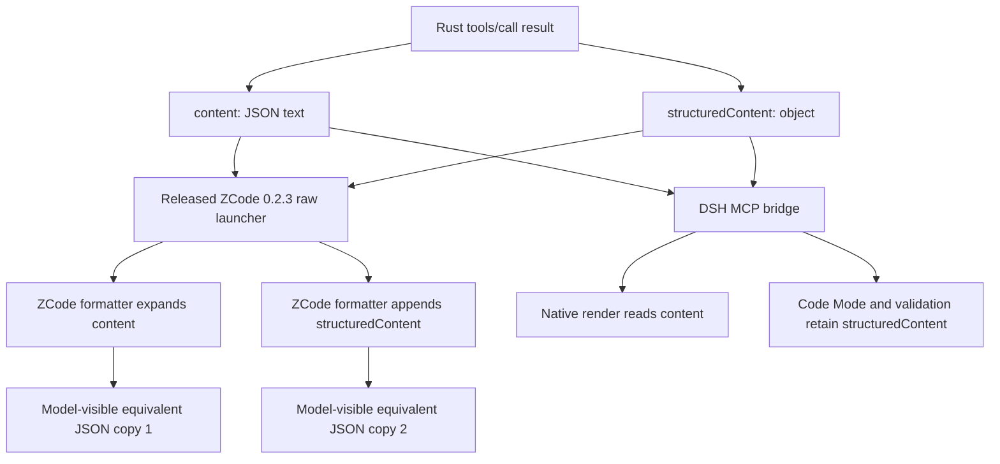
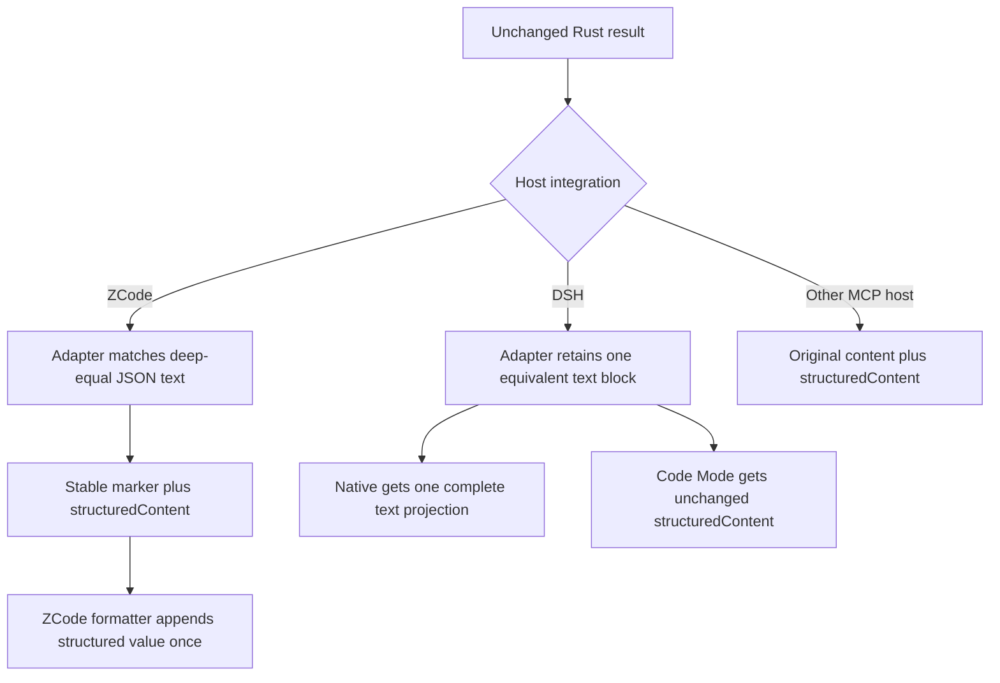
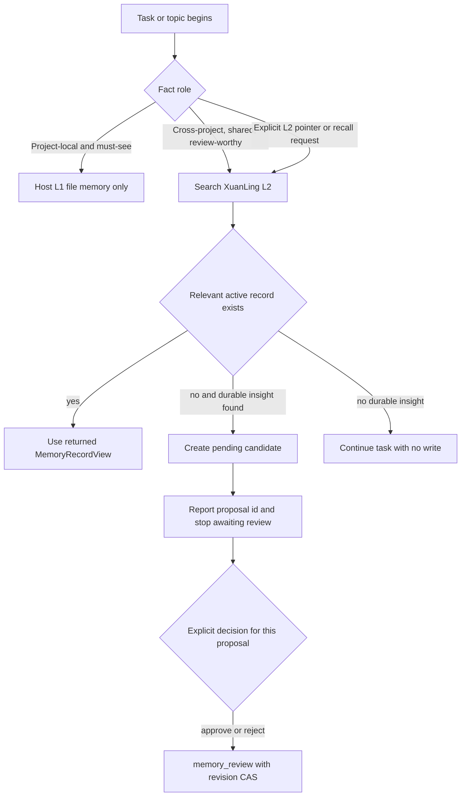

# 宿主结果投影与 Agent 使用效率优化实施计划

> 状态：实施计划；不表示当前 checkout 已完成任何工作包。
> 基线日期：2026-08-18。
> 基线 revision：`9a08f33a2582e4a6c61d0eceb3bfb6f3657ef13f`。
> 计划目标版本：`0.2.4`；进入发布 Wave 时若该版本已存在，停止并重新选择版本，不能覆盖。
> 缺陷等级：ZCode 已发布插件的重复结果投影为 `CONFIRMED P1`；当前 DSH Native 双倍
> token 成本为 `UNVERIFIED_RISK`；Windows toolkit portability 为 `CONFIRMED P1 release gate`。
> 计划路径：`docs/plans/host-result-projection-agent-efficiency-development-plan.md`。
> 执行账本：`docs/plans/host-result-projection-agent-efficiency-execution-ledger.md`。
> 相关合同：[ADR 0002](../adr/0002-filesystem-tool-safety-and-efficiency-rfc.md)、
> [ADR 0003](../adr/0003-memory-retrieval-pipeline-rfc.md)、
> [MCP integration guide](../guides/xuanling-mcp-integration.md)、
> [Host 分发计划](host-local-integration-distribution-development-plan.md)、
> [`npm-publish.yml`](../../.github/workflows/npm-publish.yml)。

## 1. 目标与非目标

### 1.1 目标合同

#### C-01：Rust MCP 双表示保持为 canonical wire contract

Given：`xuanling-mcp` 返回同时包含 `content` 与 `structuredContent` 的
`tools/call` 结果。
When：ZCode 或 DeepSeek Harness integration 对结果做模型侧投影。
Then：Rust handler、DTO、`outputSchema`、tool catalog、`isError` 与 `_meta` 保持字节合同；宿主
adapter 只能变换模型可见 projection。
And not：不得从 Rust 结果删除任一表示，不得修改工具参数、schema、工具数量、Memory contract
version 或其他 MCP host 的默认行为。
Failure：adapter 无法证明文本块与 `structuredContent` 等价时保留原始结果；协议帧解析失败、子进程
异常或输出写入失败时 fail closed 并终止 adapter，不猜测或吞掉结果。
Evidence：Rust snapshot 无 diff、protocol/golden tests、adapter passthrough tests、真实 stdio frame
对比。

#### C-02：ZCode 模型上下文只出现一次 canonical structured value

Given：ZCode 3.7.7 的 `formatMcpToolResult` 会展开 `content`，并另行追加
`structuredContent`。
When：ZCode plugin adapter 收到 `tools/call` 成功、typed domain error、human-readable text、非文本
block 或混合结果。
Then：与 `structuredContent` 深度等价的 JSON text block 被 stable marker 取代或在错误路径按合同
消除；ZCode 后续追加的 structured value 在模型上下文中恰好出现一次，其他内容保持顺序和字节。
And not：不得按字符串外观删除非等价 JSON，不得修改非 `tools/call` response、request id、
notification、`isError`、`_meta` 或非文本 block。
Failure：无 text block 的错误结果仍产生稳定错误 marker；未知或新 ZCode 投影语义导致 probe 不能
证明“恰好一次”时阻止发布，不退化为删除 `structuredContent`。
Evidence：旧 `0.2.3` 插件红色 transcript、adapter contract tests、安装后 ZCode session/model
projection、重启后同一 read-only tool smoke。

#### C-03：DSH Native 与 Code Mode 各自消费完整且唯一的表示

Given：DSH MCP bridge 的 Native `render()` 读取 `content`，Code Mode 与 output validation 保留
`structuredContent`。
When：Memory、tools-additive 或 tools-replace bundle 通过 result adapter 启动 MCP。
Then：canonical Rust 单一 JSON text block 原样保留；若 bridge/server 产生多个与 structured value
等价的 text block，只保留一个；Code Mode 仍获得完整 structured value。
And not：不得把 ZCode marker 语义复制到 DSH，不得把“wire 有双表示”直接报告为“provider 支付
双倍 token”，不得改变 schema adapter 的输入投影或 `tools/call` 参数。
Failure：Native text 或 Code Mode structured value 任一缺失、顺序改变、验证失败或无法归因时，
三种 DSH bundle 均不得发布。
Evidence：DSH source contract、synthetic duplicate/canonical tests、真实 Native 与 Code Mode
transcript、provider-request 或 session projection 分层报告。

#### C-04：Skills 按任务形状路由工具并默认产生稳定的重复验证结果

Given：宿主原生文件工具与 XuanLing fs/process/project 工具同时可见。
When：Agent 执行普通小编辑、hash/CAS 覆盖、多 hunk 修改、完整分页、重复测试或长任务。
Then：普通读写优先宿主原生工具；existing-file overwrite 先取得 hash 并带
`expected_sha256`；同文件多 hunk 优先 `fs_patch`；需要完整分页、跨平台结构化结果或显式预算时
选择 XuanLing；相同 argv 的重复验证调用使用 `deterministic=true`；`fs_search.file_extensions`
直接使用 `java`、`.c`、`d.ts`、`.d.mts` 这类 simple/compound exact suffix，不把复合后缀降级为
最后一段。
And not：不得用 shell 代替已有 typed file operation，不得把 `fs_patch` 包装成重复 batch API，
不得把 `duration_ms` 的稳定化误写成命令结果缓存，也不得硬编码工具数量。
Failure：typed conflict、not-found、duplicate-match、host observation 或 timeout 必须被报告并在同一
工具族内修正；长任务转宿主 job/background 能力，不伪造 MCP timeout。
Evidence：Skill contract tests、frozen task fixtures、工具调用序列、重复调用 result digest、无
unsafe overwrite transcript。

#### C-05：宿主热记忆与 XuanLing 共享记忆采用单写、分层读取

Given：宿主可能自动注入项目级文件记忆，XuanLing 提供 review-gated、跨会话/项目的词法 Memory。
When：Agent 处理项目局部事实、跨项目规范、共享解决方案或显式 Memory 指针。
Then：项目局部且需要每会话必见的事实只写宿主 L1；跨项目、团队级、需评审的事实只创建
XuanLing L2 candidate；任务进入或主题切换时由明确触发条件调用 `memory_search`，命中内容按
scope/namespace 使用。
And not：不得默认双写，不得把 pending candidate 当 canonical fact，不得自动调用
`memory_review`，不得声称当前 `memory_search` 是轻量 manifest；它实际返回完整
`MemoryRecordView`。
Failure：无命中、store unavailable、parse failure 或 candidate failure 时继续主任务并保持零
canonical 写入；仅在具体 proposal 获得显式决定后 review。
Evidence：L1-only、L2-recall、L2-candidate、no-match、store-unavailable fixtures；isolated DB
digest；candidate/review 分 turn transcript。

#### C-06：目录与结果优化决策必须由模型可见成本和任务使用率驱动

Given：默认 catalog、`core/fs/process/memory/advanced` profiles、ZCode 全量插件和 DSH 三种工具
bundle。
When：运行冻结的检索、编辑、验证和 Memory 任务集。
Then：报告分别记录 tool schema bytes/tokens、wire bytes、model-visible text bytes、structured
bytes、工具调用率、失败重试、cold/warm input tokens 与 prefix digest；目录稳定性独立于目录长度
分析。
And not：不得把 UI 双回显等同于 provider token 翻倍，不得根据一次任务“35 个工具未用”就删除
工具，不得引入动态 `tools/list` 或每轮变化的 profile。
Failure：provider usage 缺失或字段含义不唯一时记为 `unknown` 并使报告验证失败；权威 schema
tokenizer 不可获得时记录带来源的 `unknown`，不得以字符密度或 request 总量估算。后者不使其他
可观测层失效，但禁止形成精确 schema-token 结论。样本不足时只形成后续 profile RFC 的输入，
不改公共目录。
Evidence：版本化 fixture、analyzer closed allowlist、原始 session/provider evidence hash、三次
重复 report digest。

#### C-07：`0.2.4` 通过 immutable npm 与 ZCode promotion 交付

Given：C-01 至 C-06 已完成，`0.2.4` 在 registry 不存在，Trusted Publishing 与
`zcode-packer` 配置仍有效，required portability 全绿。
When：维护者授权创建 release commit/tag 并触发 `npm-publish.yml`。
Then：三平台 native、launcher、四个 DSH bundles 和 ZCode marketplace archive 来自同一 source
commit；npm provenance、archive attestation、registry integrity、target tag/tree 与 clean install
全部对账。
And not：不得复用/移动旧 tag，不得覆盖 npm immutable version，不得用源码目录或全局 npm 包
替代 published clean install，不得在 Windows portability 失败时发布。
Failure：部分发布按现有 idempotent reconciliation 恢复；registry lag 使用有界重试；ZCode
promotion 失败不回滚已发布 npm bytes，修复后重放相同 artifact。
Evidence：workflow run、八个 npm integrity、ZCode target commit/tag/tree、DSH profile-local clean
install、ZCode update/restart、最终 release manifest。

#### C-08：用户数据、secret 与现有工作树保持隔离

Given：dirty checkout、用户自有 `AGENTS.md`/`plan.md`、默认 Memory DB、DSH sibling checkout 和
已安装 ZCode state。
When：执行任何 test、live acceptance 或 release work package。
Then：测试使用临时 workspace/DB/profile；secret 只做 presence/identity 检查并由宿主传给明确的
live child；现有 dirty/untracked 与外部 checkout 指纹在前后可归因。
And not：不得读出、复制、hash 或持久化 credential 值，不得写默认 Memory DB，不得吸收两个
用户文件或 DSH 的两个既有 untracked tests，不得未经授权修改已安装 plugin state。
Failure：默认 DB/sidecar 漂移、未知 overlap、secret source ambiguous 或 host 无隔离入口时立即停止，
保留证据并请求独立授权。
Evidence：pre/post fingerprints、temp-root manifest、credential-presence-only report、Git diff 与
external checkout status。

### 1.2 非目标

- 不修改 Rust `CallToolResult`、tool schema、tool profile、snapshot、Memory DTO 或 SQLite schema。
- 不新增 `memory_manifest`、embedding/vector adapter、模型下载器、CodeGraph、LSP 或代码索引。
- 不修改 DeepSeek Harness upstream checkout；只读取其当前合同并测试 XuanLing bundle。
- 不把 ZCode 私有实现复制进公共 Rust crate，也不承诺支持未验证的 ZCode 未来版本。
- 不新增 `fs_edit_batch`、默认 hash-on-stat、fs artifact 溢出或 hidden read-before-write state。
- 不以本计划授权 commit、push、tag、npm publish、目标仓库 promotion、billable model call 或修改
  用户已安装插件；这些动作分别受 W4/W6 Entry gate 控制。
- 不把单一 synthetic corpus、一个模型或一个 host 的结果外推为通用生产 SLA。

## 2. 当前 checkout 基线

### 2.1 Git 与 dirty attribution

- branch `main`，revision `9a08f33a2582e4a6c61d0eceb3bfb6f3657ef13f`，与
  `origin/main` 一致；submodule 为 N/A。
- 计划写入前 `git status --short --untracked-files=all` SHA-256 为
  `bccdd9d5831df44879c3391d1cf6933e9faab1590f8358e077fc082b8a2df3b4`。
- 宿主投影相关 tracked diff SHA-256 为
  `ac1b669c0459cf8e2fc119c2ae7deafb5e37a56a83ab6819a1dc29854bfd06fa`。
- 三份 DSH adapter 当前字节相同，SHA-256
  `32b62ff9e2ff1bb69545f8bde56fbf654ce7876409aa8c145ab79e1b7e96faa0`；ZCode
  adapter 为 `eec33d417fe75919b38c3fba6ae083e53be84c77c444385c42d5aafe04beb910`；新增
  projection test 为 `da3fa99cac5a79ac7b37c7fe8282b06dbc08e8ab1f626c6786ef2f6866e75d92`。
- dirty set 包含 ADR/integration guide、DSH/ZCode runtime adapters、bundle manifests/READMEs、
  verifier 与 npm contract tests。它们是本计划的 `implemented_unverified` 输入，不是已发布证据。
- `AGENTS.md` 与 `plan.md` 为用户自有 untracked files；所有 Wave 均禁止修改、删除、提交或打包。

### 2.2 当前版本与发布事实

- Cargo/npm/DSH/ZCode source manifests 当前版本为 `0.2.3`；该版本已经 immutable 发布，当前 dirty
  bytes 不能继续以 `0.2.3` 发布。
- npm registry 已能读取 `@xuanling-rs/xuanling-mcp@0.2.3`、三平台 prerelease native variants
  与四个 DSH `0.2.3` packages 的 distinct integrity。
- `umbrella22/xuanling-zcode-marketplace` 的 `main` 与
  `xuanling-mcp-v0.2.3` 均指向 commit `20ffab546f470cf516a03a33d5b16be916c9390b`，tree
  `c822eb7c6c4ef32d5f62e805dd4c347d69fe5d74`。
- `@xuanling-rs/xuanling-mcp@0.2.4` 当前返回 E404，版本尚可用；W5 必须重新查询全部八个 item。
- release workflow 已使用 npm Trusted Publishing 和 GitHub OIDC；当前计划不恢复 bootstrap token。
- 旧 Host 分发账本仍停在 `0.2.2` EOTP handoff，已被后续 `0.2.3` 发布事实部分 supersede，但其
  Windows portability 与 clean-host evidence 缺口没有自动消失。W0 追加 reconciliation，不改写
  历史失败。

### 2.3 宿主与实现路径

- 本机 ZCode 为 `3.7.7` build `3.7.7.4926`，已安装 marketplace `xuanling-mcp@0.2.3`。
  installed `.mcp.json` 直接启动 launcher，未包含当前 dirty result adapter。
- ZCode app `formatMcpToolResult` 展开 `content` 后会额外追加 `Structured content:` 与
  `JSON.stringify(structuredContent)`；这是 C-02 的生产路径依据。
- DSH checkout 位于 `/Volumes/project_home/github/deepseek-harness`，revision
  `47f943859bef60e4160492346772ded9b24f765a`，branch `master`，仅有两个既存 untracked
  comparison tests。`packages/mcp/mcp-client/src/tools.ts` 的 Native render 只提取 `content`，执行值
  继续携带 `structuredContent`。
- 当前 `memory_search` 返回 `SearchItemV2 { record: MemoryRecordView, score, reasons,
  scope_distance }`，不是 id/title-only manifest。任何 Skill 都必须按这个成本事实编写。
- `--tool-profile` 已支持稳定的 `core/fs/process/memory/advanced` 组合；本计划先测量，不新增目录
  配置 surface。

### 2.4 当前验证与 blocker

- `npm --prefix npm test`：108/108 通过，包含当前 dirty adapter contract；它不证明真实 ZCode/DSH
  model projection。
- `cargo test -p xuanling-mcp --test protocol`：110/110 通过，包含 compound extension 与 snapshot
  contract；Rust result DTO 未因当前 dirty adapter 改动变化。
- `xuanling-mcp-npm` run `32094516229` 在 revision `9a08f33...` 成功。
- `xuanling-portability` run `32094516238`：Linux/macOS 全绿；Windows toolkit contract 为
  102 pass / 11 fail，主要是 `candidate_resolution_failed` / `ERROR_INVALID_FUNCTION` 与一项
  symlink parent 错误码漂移。该失败与 host projection 无因果关系，但在修复前禁止 C-07 完成。
- 本轮未启动 billable model、未修改 DSH checkout、未修改 ZCode install、未读写默认 Memory DB。

### 2.5 事实分级

| 事实 | 分级 | 当前证据 | 解除或决策条件 |
| --- | --- | --- | --- |
| ZCode 3.7.7 对等价 JSON 做双重模型投影 | `CONFIRMED P1` | app formatter + installed 0.2.3 raw launch contract | W1 red + W2 live/synthetic green |
| DSH Native 正常路径支付双倍 token | `UNVERIFIED_RISK` | source 显示 Native 只 render `content` | 分层 provider/session measurement；不得预设缺陷 |
| 当前 dirty adapters 尚未发布 | `CONFIRMED P1 release gap` | source `0.2.3` 已 immutable、dirty runtime files | 版本提升与 C-07 release evidence |
| Skills 缺少 L1/L2 单写触发协议 | `CONFIRMED P2` | DSH Memory Skill 仅规定 proposal/review | W3 Skill contracts + model sequence |
| DSH File Skill 未规定重复验证 `deterministic=true` | `CONFIRMED P2` | 当前 Skill 文本 | W3 contract + result digest |
| 新 `memory_manifest` 可降低总 token | `UNVERIFIED_RISK` | search 当前返回完整 record；无任务级 cost report | C-06 evidence 后另立 RFC，当前不实现 |
| Windows toolkit 11 failures | `CONFIRMED P1 release gate` | run `32094516238` | 独立 Rust portability 修复与三平台 green |
| 向量召回应启动 | `NON_BLOCKING/not_triggered` | RFC 0003 semantic decision：critical top-5 miss = 0 | 新 corpus 触发 RFC 五项条件才重开 |

## 3. 已确认路径与目标路径

### 3.1 当前路径



Rust 的两种表示都是 canonical wire facts。重复只在 ZCode host projection 形成；DSH 当前源码没有
相同的 confirmed projection，因此 DSH adapter 的目标是保持一份完整 Native 文本并防御重复 block，
不是删除正常单份文本。

### 3.2 目标结果投影路径



Adapter 只跟踪发往 child 的 `tools/call` request id，并只变换对应 response。initialize、tools/list、
notification、JSON-RPC error 和无匹配结构均透传；child stderr 继续写宿主 stderr，stdout 只承载 JSONL
protocol。

### 3.3 目标 Memory 使用路径



L1 只提供触发提示或项目事实，不复制 L2 canonical content。当前 `memory_search` 已返回全文；
`memory_get` 仅在按 id/revision 复核时使用，不伪装成强制的两段式省 token API。

## 4. Requirement Coverage Matrix

| 需求 | 主合同 | 当前缺口 | 目标行为 | Wave | 红测试/Oracle | 最终证据 |
| --- | --- | --- | --- | --- | --- | --- |
| ZCode 去除等价双投影 | C-02 | released 0.2.3 raw launcher | model structured value 恰好一次 | W1-W4 | installed 0.2.3 formatter count=2 | clean update + session projection count=1 |
| DSH 同步处理且不损失 Code Mode | C-03 | dirty adapter only；双 token 未证实 | Native 一份 text，Code Mode structured 不变 | W1-W4 | duplicate block fixture；canonical positive baseline | Native/Code Mode transcripts + provider layering |
| Rust 公共 wire 不变 | C-01 | host 修改可能误扩公共合同 | snapshot/catalog/result bytes unchanged | W2/W5 | snapshot drift 或 Rust diff 即失败 | protocol/golden + no Rust semantic diff |
| 优化文件/进程工具提示 | C-04 | DSH Skill 缺 deterministic 与任务形状细则 | 安全路由、CAS、patch、stable rerun | W3-W4 | 新 Skill assertions 对当前文本正确红 | frozen calls + no unsafe overwrite |
| L1/L2 Memory 分层读取 | C-05 | 无单写/触发协议，search 非 manifest | L1 local push、L2 shared pull、无双写 | W3-W4 | local/shared/no-match task fixtures | isolated DB + proposal/review transcript |
| 根据使用率和模型成本决定目录 | C-06 | 只有一次 Agent 自报与 schema 粗算 | 分层、可重复 report；当前目录不变 | W1/W4 | report/manifest 不存在 | three-run digest + decision record |
| 发布完整下一版本 | C-07 | dirty 0.2.3 bytes 不可重发 | immutable 0.2.4 + provenance/promotion | W5-W6 | registry 0.2.4 E404 | 8 npm items + ZCode tag/tree + clean installs |
| 保留 dirty/secret/用户数据 | C-08 | 多 checkout 与 live host 有副作用风险 | 隔离、指纹、独立授权 | W0-W6 | default DB/secret/overlap mutation oracle | pre/post hashes + no value exposure |

## 5. 影响边界矩阵

| 模块/边界 | 当前职责 | 允许变化 | 必须保持 | 合同 | 验证 |
| --- | --- | --- | --- | --- | --- |
| `crates/xuanling-mcp` / Rust protocol | canonical tool schema、dispatch、result | N/A：本计划禁止语义修改 | dual result、catalog、snapshot | C-01 | protocol/golden/no-diff |
| `integrations/zcode-plugin` | ZCode runtime template、Skill、launch contract | result adapter 与 Skill prompt | sole `.mcp.json` launch、runtime-only tree | C-02/C-04 | plugin contract + real ZCode |
| DSH Memory schema adapter | schema projection、MCP launch | 组合 result projection | arguments unchanged、memory-only catalog | C-03 | schema + stdio tests |
| DSH tools adapters | full/additive/replace launch | duplicate text guard | profile-local launcher、disabled rows | C-03 | three-bundle pack/catalog |
| DSH Skills package | on-demand file/Memory guidance、overwrite policy | routing与 L1/L2 prompt | review gate、strict overwrite、isolated provider | C-04/C-05 | Skill/policy tests |
| Memory durable store | immutable versions、heads、review、FTS projection | N/A | schema v2、JSONL、default DB untouched | C-05/C-08 | isolated DB digest/contracts |
| Tool catalog/cache | static schemas 与 profiles | 测量报告；不改目录 | stable ordering/bytes | C-06 | catalog digest + prefix report |
| 根 `test/` evaluation | host/eval fixtures 与 independent oracle | 新 result/Skill/cost evidence | 无 credential、无 production data | C-02-C-06 | verifier fail-closed tests |
| `npm/` packaging/tests | package allowlist、release integrity | adapters/Skills inclusion、0.2.4 metadata | exact files、provenance、no install scripts | C-02/C-03/C-07 | pack/release verifiers |
| GitHub release workflow | build/publish/promote | 仅测试证明缺口时最小修复 | Trusted Publishing、OIDC、idempotency | C-07 | actionlint + preflight + tag run |
| ZCode/DSH external host | 实际 model/session projection | 仅经独立授权安装/调用 | DSH checkout unchanged、host data preserved | C-02-C-05/C-08 | version/status/transcripts |
| Windows portability | toolkit capability semantics | 本计划只消费独立修复结果 | 0 required failure | C-07 | `xuanling-portability` matrix |
| telemetry/audit | DSH session/provider usage evidence | redacted metrics report | no secret/raw reasoning publication | C-06/C-08 | verifier + leak scan |
| backup/restore/migration | N/A：无 canonical schema/data change | N/A | existing Memory export/import unchanged | C-01/C-05 | no migration/Rust diff |

## 6. 目标合同与全局不变量

### 6.1 Canonical fact 与 projection

- Rust `content`、`structuredContent`、`isError`、`_meta` 是 wire canonical facts。
- ZCode/DSH adapter 输出是 host-local derived projection，可从原始 MCP response 与 adapter version
  重建，不持久化为新的 Memory fact。
- DSH session log、ZCode session/model projection 和 provider usage 是验收 evidence，不是产品状态。
- Memory canonical facts 仍只有 approved immutable record versions、heads、reviews 与 feedback；
  L1 指针和 Skill prompt 不复制或覆盖 L2 canonical content。

### 6.2 终态、并发与重试

- adapter success：匹配的 response 完整写出；passthrough success：原行字节保持；adapter failure：
  stderr 诊断 + nonzero exit，child 被终止，不输出半个 JSON frame。
- 多个并发 `tools/call` 以 JSON-RPC id type + value 区分，允许 out-of-order response；同一 pending id
  的重复 response 不再次投影。
- host timeout/cancel 转发给 child；child close/error 只结算一次。关键 signal/backpressure/concurrency
  tests 必须连续三次通过。
- Memory candidate 使用 idempotency key；review 使用 proposal revision CAS。无显式 review 的正确终态
  是 pending，不是 partial failure。
- npm publish 与 ZCode promotion 使用现有 immutable reconciliation；重复相同 artifact 为 no-op，
  integrity/tree drift 为 hard failure。

### 6.3 兼容与安全

- MCP input/output schema、tool names、annotations、contract version 与 default catalog 均不变化。
- adapter 仅支持 JSONL stdio；未知 framing 触发 fail closed，不增加 shell fallback。
- model/provider evidence 只保存必要 request projection、usage 与 tool sequence；不保存 credential、完整
  private prompt、raw reasoning 或不相关用户文件。
- test/live Memory 必须显式 `--memory-db "$XUANLING_TEST_MEMORY_DB"`；fs-only profile 仍会初始化 MemoryStore，因此省略该
  flag 属于测试配置错误。
- external dependency unavailable、rate limited 或 host version drift 时状态上限为
  `deterministic_green`，不能以 synthetic test 宣布 `complete`。

## 7. Wave 依赖与状态机

```text
W0 contract_and_baseline
  -> W1_red_oracles_and_measurement
  -> W2_result_projection_hardening
  -> W3_skill_and_memory_routing
  -> W4_live_host_acceptance
  -> W5_release_candidate_and_portability
  -> W6_publish_reconcile_and_close
```

每个 Wave 使用：

```text
not_started -> red_confirmed -> implemented_unverified -> deterministic_green -> complete
```

- W0-W3 的 `complete` 由当前 checkout 的 deterministic evidence 决定。
- W4 缺少真实 host/model 时最多 `deterministic_green`。
- W5 缺少 Windows/Linux/macOS required matrix 任一结果时最多 `deterministic_green`。
- W6 涉及 commit/push/tag/publish/promotion；没有逐项外部授权时保持 `blocked`，不得自行执行。
- 任一实现、fixture、Skill、host version 或 adapter 路径变化会使对应 clean acceptance count 归零。

## 8. Wave 0：冻结合同、dirty attribution 与已发布基线

### 目标与合同

- 覆盖合同：C-01、C-07、C-08。
- 本 Wave 完成后的可观测结果：当前 dirty implementation、released 0.2.3、外部 host 与 Windows
  blocker 均有可恢复指纹；旧 Host 分发账本追加非破坏性 reconciliation。
- 明确不处理：adapter/Skill 代码、版本提升、live model、发布。

### Entry gate

- [ ] 已重读根 `AGENTS.md`、本计划和 sidecar ledger。
- [ ] 当前 revision/status 与 authoring baseline 比对，所有新增 drift 可归因。
- [ ] `AGENTS.md`、`plan.md` 和 DSH 两个 untracked tests 保持用户归属。

### Allowed files

- `docs/plans/host-result-projection-agent-efficiency-*.md`
- `docs/plans/host-local-integration-distribution-execution-ledger.md`（只追加 reconciliation）
- `docs/plans/README.md`

### Forbidden changes

- `crates/**`、`integrations/**`、`npm/**`、`.github/**`、默认 Memory DB、external host state。
- 重写旧账本中的历史失败、把未完成旧 Wave 追记为完成、吸收用户文件。

### 红测试与基线

| Test/Oracle | Trigger | Expected old failure | Wrong failure |
| --- | --- | --- | --- |
| immutable source check | 比较 published 0.2.3 与 dirty package tree | 同版本 bytes 不同，禁止重发 | registry/network 无法读取 |
| installed ZCode launch check | 读取 installed 0.2.3 `.mcp.json` | adapter 不存在于 launch argv | plugin 未安装或路径猜测错误 |
| portability readback | run `32094516238` | Windows 102/11，Linux/macOS green | GitHub API/权限错误 |
| dirty attribution | status/diff/untracked hash | 当前计划相关 set 可完整分类 | 未知 overlap 或内容漂移 |

### 实施工作包

| Package | Symbol/path | Contract | Failure behavior | Targeted validation |
| --- | --- | --- | --- | --- |
| W0.1 | checkout fingerprint | C-08 | unknown overlap 时停止 | status/revision/hash commands |
| W0.2 | npm/ZCode/DSH release baseline | C-07 | registry/host 不可读记 blocker | read-only npm/gh/host metadata |
| W0.3 | old Host ledger reconciliation | C-07/C-08 | 只追加，不重写历史 | docs checker + ledger audit |
| W0.4 | dirty adapter attribution manifest | C-01/C-08 | 未归因文件停止 | explicit file/hash list |

### 验证命令

| Command | Provenance | Expected result | Required/conditional |
| --- | --- | --- | --- |
| `git status --short --untracked-files=all` | repository baseline | exact attributable set | required |
| `git rev-parse HEAD` | Git | expected revision or recorded drift | required |
| `npm view @xuanling-rs/xuanling-mcp@0.2.3 version dist.integrity --json` | release contract | 0.2.3 visible | required |
| `npm view @xuanling-rs/xuanling-mcp@0.2.4 version --json` | immutable version gate | E404 before release | required |
| `git -C /Volumes/project_home/github/deepseek-harness status --short --branch` | external baseline | same revision/two untracked tests | required on current machine |
| `npm --prefix npm run check:docs` | npm manifest | all Markdown valid | required |
| `git diff --check` | Git | no whitespace error | required |

### Evidence

- Behavior before：
- Red failure：
- Behavior after：
- Files changed：
- Commands passed：
- Commands failed：
- Commands not run：
- API/storage/UI/restart evidence：
- External dependency evidence：
- Secret/redaction evidence：

### Exit gate

- [ ] 全部 dirty paths、hash 与 owner 已记录。
- [ ] 0.2.3 registry/target facts和 0.2.4 E404 已刷新。
- [ ] 旧账本只追加 reconciliation，未伪造完成状态。
- [ ] 默认 DB、DSH、ZCode installed state 未写入。
- [ ] 账本 `next_action` 唯一指向 W1.1。

### Stop conditions

- revision 或 dirty set 出现无法归因的重叠改动。
- 0.2.4 已存在或 0.2.3 integrity 与记录不一致。
- 读取 baseline 需要输出 secret value 或修改 external host。
- 旧账本历史与 registry/target readback 无法同时保真记录。

## 9. Wave 1：建立正确红色、分层成本与使用率测量

### 目标与合同

- 覆盖合同：C-02、C-03、C-04、C-05、C-06、C-08。
- 本 Wave 完成后的可观测结果：ZCode released baseline 的重复、DSH canonical/duplicate 两类路径、
  Skill 缺口和模型成本分层均由版本化 oracle 表达。
- 明确不处理：修改 runtime adapter/Skill、发布、公共 tool profile。

### Entry gate

- [ ] W0 在当前 checkout 为 `complete`。
- [ ] dirty/untracked 与 external host 指纹 current。
- [ ] 0.2.3 package/install baseline 可在临时目录读取。

### Allowed files

- `npm/test/mcp-result-projection.test.mjs`
- `npm/test/deepseek-harness-skills.test.mjs`
- `npm/test/zcode-plugin-contract.test.mjs`
- `npm/test/deepseek-harness-bundle.test.mjs`
- `test/host-integration/**`
- `docs/plans/host-result-projection-agent-efficiency-*.md`

### Forbidden changes

- Runtime adapters、Skills、Rust、package version、workflow、external DSH/ZCode source。
- 以 mock provider usage 填充真实 `inputTokens` 或复制 private session content 进 fixture。

### 红测试与基线

| Test/Oracle | Trigger | Expected old failure | Wrong failure |
| --- | --- | --- | --- |
| ZCode 0.2.3 projection | raw dual result through installed formatter contract | equivalent structured value count=2 | parser/fixture 找不到 formatter |
| DSH canonical result | one JSON text + structured object | positive baseline：Native count=1、structured retained | 把正向基线误标红 |
| DSH duplicate guard | two equivalent JSON text blocks | current published bundle 无 guard或 count=2 | synthetic shape不符合 MCP |
| Skill deterministic contract | repeated validation task | current DSH Skill 不要求 deterministic | test只搜词不验证行为规则 |
| Memory routing contract | local/shared/explicit pointer fixtures | current Skill 无 L1/L2 single-write trigger | 通过硬编码 tool sequence 而非规则 |
| cost report verifier | 缺字段、重复 usage、UI-only data | fail closed，不生成数字 | 将 unknown 填 0 |

### 实施工作包

| Package | Symbol/path | Contract | Failure behavior | Targeted validation |
| --- | --- | --- | --- | --- |
| W1.1 | result projection oracle | C-02/C-03 | production contract未命中则停止 | focused Node tests |
| W1.2 | Skill behavior fixtures | C-04/C-05 | 红因不正确则重写 fixture | Skill tests |
| W1.3 | layered cost analyzer | C-06 | ambiguity -> unknown + nonzero verify | analyzer negative tests |
| W1.4 | released 0.2.3 measurement | C-02/C-03/C-06 | host version drift 单独记录 | report verifier |

### 验证命令

| Command | Provenance | Expected result | Required/conditional |
| --- | --- | --- | --- |
| `node --test npm/test/mcp-result-projection.test.mjs` | npm Node test pattern | correct red before runtime acceptance | required |
| `node --test npm/test/deepseek-harness-skills.test.mjs` | existing contract test | new routing assertions correct red | required |
| `node --test npm/test/zcode-plugin-contract.test.mjs npm/test/deepseek-harness-bundle.test.mjs` | existing package contracts | baseline + intentional new reds | required |
| `npm --prefix npm test` | package manifest | only declared target reds fail | required |
| planned `node test/host-integration/verify-result-cost-report.mjs ...` | W1.3 artifact | negative fixtures fail, valid report pass | required after file exists |

### Evidence

- Behavior before：
- Red failure：
- Behavior after：
- Files changed：
- Commands passed：
- Commands failed：
- Commands not run：
- API/storage/UI/restart evidence：
- External dependency evidence：
- Secret/redaction evidence：

### Exit gate

- [ ] 每个 target contract 有正确 old failure 或明确 positive baseline。
- [ ] ZCode/DSH/wire/model/structured/usage 五层不混算。
- [ ] analyzer 对 ambiguous/missing usage fail closed。
- [ ] evidence fixture 不含 credential、raw reasoning、默认 DB 或 private project content。
- [ ] 三次 analyzer report digest 相同。

### Stop conditions

- 只能通过复制 ZCode/DSH 私有源码逻辑而无法触达 installed/runtime contract。
- DSH source 证明当前 adapter 目标与真实 render 语义冲突。
- provider usage contract无法从当前 host识别，且计划试图用估算值替代。
- 红测试因 fixture、package 下载或权限故障失败。

## 10. Wave 2：收敛并硬化 ZCode/DSH result adapters

### 目标与合同

- 覆盖合同：C-01、C-02、C-03、C-08。
- 本 Wave 完成后的可观测结果：当前 dirty adapters 经并发、错误、backpressure、signal、真实 binary
  与 package allowlist 验证；ZCode 与 DSH projection 合同各自独立。
- 明确不处理：Skill/Memory prompt、Rust DTO、版本提升、live model。

### Entry gate

- [ ] W1 为 `complete`，red oracle 失败原因正确。
- [ ] 当前 dirty adapters hash 已与 W0 manifest 对账。
- [ ] Rust snapshot/catalog baseline current。

### Allowed files

- `integrations/zcode-plugin/plugins/xuanling-mcp/mcp-result-adapter.mjs`
- `integrations/zcode-plugin/plugins/xuanling-mcp/.mcp.json`
- `integrations/deepseek-harness/*/mcp-result-adapter.mjs`
- `integrations/deepseek-harness/*/schema-adapter.mjs`
- `integrations/deepseek-harness/*/cordis.patch.yml`
- `integrations/deepseek-harness/*/package.json`
- 对应 runtime README、`docs/adr/0002-*`、integration guide
- W1 test/evaluation paths、npm verifier/tests、计划/账本

### Forbidden changes

- `crates/**`、Rust snapshots、tool catalog、Memory schema/data、DSH upstream checkout。
- 删除 canonical single text block、用 substring equality、改变 arguments 或给 DSH 注入 ZCode marker。

### 红测试与基线

| Test/Oracle | Trigger | Expected old failure | Wrong failure |
| --- | --- | --- | --- |
| typed id concurrency | string/number同值 + out-of-order responses | 每个 response只匹配自身 call | JSONL harness乱序错误 |
| exact-equivalence | property order不同、值相同；相似但不等 | 仅 deep-equal block去重 | 字符串包含判断误删 human text |
| error/non-text | isError + image/resource + no text | stable error marker且非文本保留 | fallback把 JSON 再注入 |
| child lifecycle | spawn error/nonzero/signal/backpressure | nonzero once、无半 frame、child cleaned | 测试泄漏子进程 |
| DSH canonical | current Rust real call | single full text unchanged | adapter总是改写正常结果 |
| package allowlist | pack three DSH + stage ZCode | adapter精确包含且无 test files | runtime tree混入 evaluation |

### 实施工作包

| Package | Symbol/path | Contract | Failure behavior | Targeted validation |
| --- | --- | --- | --- | --- |
| W2.1 | shared adapter state machine review | C-01-C-03 | unknown frame fail closed | focused Node tests |
| W2.2 | ZCode result projection | C-02 | ambiguity保留原值/阻止发布 | formatter oracle |
| W2.3 | DSH result projection | C-03 | Native/structured任一丢失即失败 | DSH source + bridge probe |
| W2.4 | lifecycle/concurrency hardening | C-01/C-08 | leak/half-frame nonzero | three consecutive stress runs |
| W2.5 | package and docs sync | C-02/C-03 | allowlist drift停止 | pack/verifier/docs |

### 验证命令

| Command | Provenance | Expected result | Required/conditional |
| --- | --- | --- | --- |
| `node --test npm/test/mcp-result-projection.test.mjs` | focused contract | all pass | required |
| `node --test npm/test/deepseek-schema-projection.test.mjs npm/test/deepseek-harness-bundle.test.mjs npm/test/zcode-plugin-contract.test.mjs` | existing contracts | all pass | required |
| `npm --prefix npm test` | package manifest | all pass | required |
| `cargo test -p xuanling-mcp --test protocol` | CI workflow | 110 or current declared count, 0 fail | required |
| `cargo test -p xuanling-mcp --test golden` | CI workflow | 0 fail/snapshot drift | required |
| `node test/deepseek-harness/scripts/verify-deepseek-bridge.mjs --binary target/release/xuanling-mcp --tool-profile fs` | repository verifier | exact catalog/wire pass | required |
| `npm pack --dry-run --json ./integrations/deepseek-harness/xuanling-tools` | npm package contract | runtime-only allowlist | required for each DSH bundle |

### Evidence

- Behavior before：
- Red failure：
- Behavior after：
- Files changed：
- Commands passed：
- Commands failed：
- Commands not run：
- API/storage/UI/restart evidence：
- External dependency evidence：
- Secret/redaction evidence：

### Exit gate

- [ ] C-01 至 C-03 全部从正确红色转绿。
- [ ] adapter stress/lifecycle 连续三次通过，无 residual process。
- [ ] Rust source/snapshot/catalog 没有语义 diff。
- [ ] 三份 DSH adapter byte-identical，ZCode adapter保持独立语义。
- [ ] runtime package 不包含 test/evaluation/report。

### Stop conditions

- 需要改变 Rust result DTO 或 DSH upstream 才能正确实现。
- 无法可靠关联并发 JSON-RPC request/response。
- ZCode formatter version drift 使 marker/fallback 合同无法证明。
- 测试只检查字符串而不检查完整 result preservation。

## 11. Wave 3：优化 Skills 与 L1/L2 Memory 触发协议

### 目标与合同

- 覆盖合同：C-04、C-05、C-06、C-08。
- 本 Wave 完成后的可观测结果：ZCode 与 DSH Skills 对文件路由、重复验证、Memory 单写/拉取和
  pending review 使用同一语义；无需扩大工具目录。
- 明确不处理：新 MCP 工具、自动双写、host memory 文件格式、向量或 manifest。

### Entry gate

- [ ] W2 为 `complete`，result evidence不再 stale。
- [ ] W1 的 Skill red fixtures仍命中目标缺口。
- [ ] RFC 0003 `not_triggered` 与 current Search DTO 已复核。

### Allowed files

- `integrations/zcode-plugin/plugins/xuanling-mcp/skills/**`
- `integrations/deepseek-harness/xuanling-skills/skills/**`
- `integrations/deepseek-harness/xuanling-skills/package.json`
- 对应 README、`docs/skills/**`、integration guide
- `npm/test/deepseek-harness-skills.test.mjs`、`npm/test/zcode-plugin-contract.test.mjs`
- `test/host-integration/**`、计划/账本

### Forbidden changes

- Rust、MCP schema/catalog、Memory store/DB、strict overwrite policy 默认语义。
- 新增总是可见的 process Skill；若需要独立 Skill，必须先有 W1 调用率与可用工具 profile 证据并
  另立 package/catalog contract。
- 在 L1 写入 L2 正文副本、自动 review、自动模型下载。

### 红测试与基线

| Test/Oracle | Trigger | Expected old failure | Wrong failure |
| --- | --- | --- | --- |
| repeated validation | 同一 argv 连续两次 | current DSH guidance未要求 deterministic | 工具本身不支持该字段 |
| overwrite route | existing file whole replace | hash -> expected_sha256 | 只说“先读”但未带 CAS |
| multi-hunk route | one file/two hunks | fs_patch，单次原子 apply | 发明 fs_edit_batch |
| compound extension route | declaration/source mixed tree | `file_extensions: ["d.ts"]` 只命中复合后缀 | 降级为 `ts` 扩大命中 |
| project-local memory | must-see local convention | L1 only、零 XuanLing write | 双写 candidate |
| shared memory | cross-project procedure | search then pending candidate if absent | 自动 approve |
| explicit pointer recall | L1 route hint | one scoped memory_search | 每 turn 无条件搜索 |
| no-match/unavailable | L2 empty/store fail | 主任务继续、零 canonical write | best-effort partial candidate |

### 实施工作包

| Package | Symbol/path | Contract | Failure behavior | Targeted validation |
| --- | --- | --- | --- | --- |
| W3.1 | file/process verification guidance | C-04 | typed error留在同工具族修正 | Skill contract tests |
| W3.2 | Memory L1/L2 trigger rules | C-05 | no match/unavailable零写 | isolated fixtures |
| W3.3 | ZCode/DSH semantic parity | C-04/C-05 | host-specific names可不同，规则不可漂移 | cross-Skill oracle |
| W3.4 | prompt-size and trigger measurement | C-06 | usage unknown不填 0 | report verifier |

### 验证命令

| Command | Provenance | Expected result | Required/conditional |
| --- | --- | --- | --- |
| `node --test npm/test/deepseek-harness-skills.test.mjs npm/test/zcode-plugin-contract.test.mjs` | existing tests | all pass | required |
| `node --test npm/test/deepseek-harness-policy.test.mjs` | overwrite policy regression | all pass | required |
| `npm --prefix npm test` | package manifest | all pass | required |
| `npm --prefix npm run check:docs` | docs checker | all Markdown pass | required |
| planned isolated Memory routing verifier under `test/host-integration/` | W1/W3 fixture | local/shared/no-match exact outcomes | required after file exists |

### Evidence

- Behavior before：
- Red failure：
- Behavior after：
- Files changed：
- Commands passed：
- Commands failed：
- Commands not run：
- API/storage/UI/restart evidence：
- External dependency evidence：
- Secret/redaction evidence：

### Exit gate

- [ ] C-04/C-05 fixtures全绿，且没有双写/auto-review路径。
- [ ] `memory_search` 完整 record 成本在 Skill 与 report 中表述准确。
- [ ] 重复 process validation 明确使用 deterministic，但 long-running work不错误路由。
- [ ] Skill prompt byte size与触发目录 stable；三次 package digest一致。
- [ ] 默认 Memory DB 无 main/WAL/SHM drift。

### Stop conditions

- 需要修改 host 自动记忆格式或写入用户 L1 才能验证。
- 需要新增公共 Memory API 或扩大 MCP catalog。
- Skill 只能通过暴露 secret/private prompt 来判断路由。
- DSH Memory-only bundle会因新增 guidance引用不存在工具而产生误触发。

## 12. Wave 4：真实 ZCode/DSH 安装、模型投影与路由验收

### 目标与合同

- 覆盖合同：C-02、C-03、C-04、C-05、C-06、C-08。
- 本 Wave 完成后的可观测结果：预发布本地制品在真实 ZCode 3.7.7、DSH Native 与 Code Mode 中
  完成 read-only/result/Skill/Memory 工作流，分层 token 报告可独立复算。
- 明确不处理：tag、npm publish、target promotion、Windows Rust 修复。

### Entry gate

- [ ] W3 为 `complete`。
- [ ] 用户单独授权 billable model call 与必要的 local host install/update。
- [ ] 已安排独立 dogfooding 执行者，或由维护者明确豁免执行者身份门禁；任何豁免都必须保留
  “该执行者未运行”的事实，并指定可替代的冻结协议、重复次数与独立 oracle。
- [ ] credential source唯一、只检查权限/存在，不读取值。
- [ ] temp workspace/DB/DSH_HOME 可用；ZCode若无隔离 profile，已取得修改安装状态授权和恢复方案。

### Allowed files

- `test/host-integration/**` evidence/report/fixture
- 计划/账本与必要的 evaluation verifier
- 明确授权的临时目录、隔离 DSH profile、ZCode test install state

### Forbidden changes

- DSH upstream source、默认 Memory DB、用户项目、production Memory records。
- 未授权 live model、复制 API key、保存 raw reasoning、把 UI 文本当 provider request。

### 红测试与基线

| Test/Oracle | Trigger | Expected old failure | Wrong failure |
| --- | --- | --- | --- |
| ZCode installed 0.2.3 | same read-only tool | structured value模型侧出现两次 | 模型未调用工具或 plugin 未连接 |
| ZCode candidate | local 0.2.4 tree | count=1，human/error text保留 | 只看 UI card |
| DSH Native | canonical result | one full text result | provider/session缺失 |
| DSH Code Mode | structured field access | exact value，不解析 marker | model未进入 Code Mode |
| deterministic rerun | same argv/task three times | result bytes stable，usage分 cold/warm | artifact id使比较不可比 |
| Memory routing | local/shared/pointer tasks | exact L1/L2 sequence | 默认 DB 或 auto-review |

### 实施工作包

| Package | Symbol/path | Contract | Failure behavior | Targeted validation |
| --- | --- | --- | --- | --- |
| W4.1 | isolated host staging | C-08 | isolation不可证即停止 | install tree/hash manifest |
| W4.2 | ZCode projection acceptance | C-02/C-06 | count不唯一阻止 release | session/model oracle |
| W4.3 | DSH Native/Code acceptance | C-03/C-06 | 任一 projection丢失阻止 release | paired transcripts |
| W4.4 | independent Skill/Memory dogfooding | C-04/C-05 | unsafe write/dual write/auto review失败 | frozen task transcripts + independent oracle |
| W4.5 | layered cost report | C-06 | missing/ambiguous usage -> unknown/nonzero verify | report verifier 3x |

> 执行修订（2026-08-19）：维护者豁免 W4.4 的 GLM 执行者身份门禁，并接受当前 DSH revision
> `99f6f02fecdb7dff40c3fbc9470f5907c29f74ca` 上由主代理采集、独立 verifier 复算的 4 cases x
> 3 repetitions（12/12）作为 W4.4 完成证据。该豁免不产生“GLM 已在 DSH 运行”或
> “GLM-independent”结论，也不豁免 W4.2、W4.5 或后续 Wave 的独立门禁。
>
> W4.5 合同修订（2026-08-19）：当前 ZCode 不暴露 provider tokenizer；当前 DSH token meter
> 是固定字符密度 heuristic，不是权威 tokenizer。`schema_tokens` 因此必须保持带来源的
> `unknown`。当 provider usage、prefix stability、wire/model/structured/UI 分层和工具调用率均完整
> 且可复算时，报告验证可以通过；该状态不能用于声称精确 schema token 数或据此删减 catalog。

> 执行收口（2026-08-19）：W4.2 已由隔离 ZCode 候选环境完成第三次连续只读验收。两次既有
> `zcode-restart-live-0.2.4` fixture 与第三次原始 model-I/O transcript 均由
> `test/host-integration/verify-zcode-projection-live.mjs` 独立复算，结果为 `3/3`、每次一个
> model-visible projection、Memory canonical counts 全为零、默认 DB 哈希不变、无仓库残留和无
> 候选进程残留。该证据绑定 ZCode `3.7.7`；验收后宿主更新到 `3.8.1`，不把后者外推为本轮证据。
>
> W4.3 的当前 DSH revision 证据保持有效：Native matrix 为 `15/15`，Code Mode 的干净隔离
> trials 9、12、13 均读取唯一 structured value 且 canonical Memory rows 为零。W4.4 按维护者
> waiver 完成；GLM 未运行 DSH 协议，不能产生 “GLM-independent” 结论。W4.2、W4.3、W4.4、
> W4.5 均达到各自 exit gate，因此 W4 整体完成并解锁 W5；W5 仍受既有 Windows portability
> blocker 约束，不能在未获独立授权时修改 Rust 或提升版本。

### 验证命令

| Command | Provenance | Expected result | Required/conditional |
| --- | --- | --- | --- |
| existing DSH evaluation runner with `--allow-billable-live` | repository test harness | frozen route/session complete | required for complete; exact argv frozen in ledger |
| `node test/deepseek-harness/evaluation/memory-retrieval/verify-transcripts.mjs ...` | existing verifier | read-only target hits/no writes | required for Memory live slice |
| ZCode plugin install/update + read-only MCP call | installed host contract | one model-visible structured value | required; exact UI/CLI steps discovered W0 |
| planned `node test/host-integration/verify-result-cost-report.mjs --verify ...` | W1 verifier | closed report passes | required |
| pre/post Git/DB/host process fingerprints | C-08 | no unrelated drift/leak | required |

### Evidence

- Behavior before：
- Red failure：
- Behavior after：
- Files changed：
- Commands passed：
- Commands failed：
- Commands not run：
- API/storage/UI/restart evidence：
- External dependency evidence：
- Secret/redaction evidence：

### Exit gate

- [ ] ZCode result count=1，DSH Native text=1，Code Mode structured完整。
- [ ] 每个 critical host/task组合连续三次通过；失败/代码修改后计数重置。
- [ ] cost report区分 wire/model/structured/UI/usage并可复算。
- [ ] schema tokenizer不可获得时保持 `unknown` + source/reason，且没有启发式或 fabricated zero。
- [ ] Memory workflow没有双写、默认 DB 写入或未经授权 review。
- [ ] 独立 dogfooding 结果已由原始 transcript、工具调用序列和独立 filesystem/SQLite oracle
  复核；若使用执行者身份豁免，账本和报告明确记录接受依据与禁止外推的结论。
- [ ] host restart 后插件仍连接且 read-only smoke通过。

### Stop conditions

- 缺少 billable/host mutation授权。
- host自动更新导致版本或 source tree在试验间漂移。
- 无法取得模型实际输入/usage，只能观察 UI 双回显。
- credential、默认 DB、用户项目或 DSH checkout发生未知变化。

## 13. Wave 5：构建 `0.2.4` release candidate 并恢复 required portability

> 执行状态（2026-08-19）：W4 已完成并解锁 W5。W5.1 的只读预检确认八个精确的 `0.2.4`
> registry item 均不存在，当前 `0.2.3` 版本/许可证/package 合同通过，`npmjs` 与
> `zcode-packer` GitHub environments 可见；未修改任何版本或 release artifact。由于既有
> `xuanling-portability` run `32094516238` 的 Windows toolkit contract 仍为 `102 pass / 11 fail`，
> W5.0 在版本冻结之前阻塞。Rust portability 修复需要独立授权，本计划不会用 rerun、弱化断言或
> 修改 ignored 测试绕过该门禁。

> 维护者授权修订（2026-08-19）：为解除 `B-WIN-01`，维护者单独授权本 checkout 执行
> Windows toolkit capability-path 修复及 Linux/macOS/Windows 验证。该授权只覆盖导致 11
> 个既有 Windows contract 失败的 Rust 路径语义，不授权版本提升、commit、push、tag、发布或
> ZCode promotion。修复后的本地证据已写入执行账本；在原生 Windows runner 对修复 revision
> 重新运行并全绿之前，W5 仍保持 `implemented_unverified`，不能进入版本冻结。

### 目标与合同

- 覆盖合同：C-01、C-03、C-04、C-05、C-07、C-08。
- 本 Wave 完成后的可观测结果：所有 source versions 对齐 `0.2.4`，八个 npm tarball 与 ZCode
  archive 从同一 commit候选生成并可重复验证；required Windows/Linux/macOS CI全绿。
- 明确不处理：tag/publish/promotion；版本冻结前必须先消费 B-WIN-01 的原生三平台 green
  commit/evidence。

### Entry gate

- [ ] W4 为 `complete`。
- [ ] `0.2.4` 全部 registry item仍不存在。
- [ ] 独立 Windows portability工作包完成，或本 Wave保持 blocked且不版本提升/tag。
- [ ] target branch、Trusted Publishing、`zcode-packer` metadata可只读验证。

### Allowed files

- Cargo/npm/DSH/ZCode version manifests与 release README
- `crates/xuanling-toolkit/src/capability.rs` 仅限 B-WIN-01 路径语义修复
- `crates/xuanling-toolkit/src/path.rs` 仅限 B-WIN-01 Windows verbatim base 与相对
  locator 拼接时保留 `..` 的 OS 解析顺序
- `crates/xuanling-toolkit/tests/contract/capability_contract.rs` 仅限 B-WIN-01
  缺失路径递归终止回归合同
- `.gitattributes` 仅限 B-WIN-EOL-01 的
  `crates/xuanling-memory/tests/fixtures/retrieval-corpus-v1.jsonl text eol=lf` 规则
- `crates/xuanling-mcp/tests/protocol/contract_hardening.rs` 仅限
  `search_filters_hidden_ignored_globs_and_extensions` 的平台路径组件断言
- `npm/scripts/**`、`npm/test/**`、`.github/workflows/**` 仅在红合同证明发布缺口时
- `test/release/**`、计划/账本

### Forbidden changes

- 为通过 release gate跳过 Windows tests、降低断言、改 ignored、扩大 timeout掩盖错误。
- 复用旧 binary/tarball、在 final source commit后修改 artifact、加入 bootstrap npm token。
- 改变 `fs_search` 公共路径格式；不能用 rerun 掩盖 Windows-only contract-test failure。

### 红测试与基线

| Test/Oracle | Trigger | Expected old failure | Wrong failure |
| --- | --- | --- | --- |
| version contract | dirty adapters + source 0.2.3 | immutable version conflict | check script未覆盖某 manifest |
| package allowlist | pack all bundles | adapters/Skills精确出现 | npm cache污染 |
| deterministic ZCode stage | stage twice | tree/archive digest相同 | timestamp/temp path进入 payload |
| portability | three OS matrix | current Windows 11 failures必须先被独立修复 | 只运行 Linux/macOS |
| release preflight | workflow_dispatch main | validate/npm/zcode prerequisites green，side-effect jobs skipped | 实际 publish被触发 |

### 实施工作包

| Package | Symbol/path | Contract | Failure behavior | Targeted validation |
| --- | --- | --- | --- | --- |
| W5.0 | `WorkspaceScope` Windows path semantics and frozen Memory fixture checkout EOL | B-WIN-01/B-WIN-EOL-01/C-07 | any existing contract failure keeps W5 blocked; no assertion weakening or loader normalization | toolkit/Memory contracts + native three-platform workflow |
| W5.1 | version freeze and registry recheck | C-07 | any item存在即重选版本 | check-version/npm view |
| W5.2 | eight npm artifacts | C-03-C-05/C-07 | missing/integrity drift stop | release-set verifiers |
| W5.3 | ZCode archive projection | C-02/C-07 | tree/mode/hash drift stop | stage/verify twice |
| W5.4 | required CI matrix | C-01/C-07 | any required fail blocks release | npm + portability workflows |
| W5.5 | no-side-effect preflight | C-07/C-08 | credential/identity mismatch stop | workflow_dispatch |

> W5.0 执行记录（2026-08-19）：Windows 红基线的 11 个失败由两条路径解释并修复：
> `lexical_workspace_root` 不再把 Windows extended-path `Prefix` 当作可独立
> `canonicalize` 的路径；`resolve_missing_intent` 改为逐组件解析，在处理后续 `..` 前展开
> symlink，并保留缺失目标的 typed containment 结果。随后发现并修复了缺失组件被 `..`
> 消去后重新出现时的自递归路径，并新增
> `missing_component_reintroduced_after_parent_traversal_returns_not_found` 合同测试。
> 生产路径与合同断言均未弱化。macOS 本地 toolkit contract 为 `133/133`，capability
> slice 为 `38/38`，Windows/Linux toolkit
> target check/clippy 与本地三 crate check/clippy 均通过；原生 Windows runner 尚未运行，
> 因此 W5.0 仍为 `implemented_unverified`，不能解锁 W5.1 版本冻结。

> W5.0 授权更新（2026-08-19）：维护者已授权将仅包含 B-WIN-01 capability 修复、对应
> contract 回归测试和计划/账本证据的精确提交推送到 `origin/main`，并触发
> `xuanling-portability`。该授权不包含版本提升、tag、npm publish 或 ZCode promotion。

> W5.0 portability 回归（2026-08-19）：修复提交 `cf38bcca6655…` 的 Linux/macOS
> jobs 全绿，但 Windows toolkit contract 在
> `symlink_followed_by_parent_traversal_keeps_os_path_semantics` 返回 `NotFound`。第一轮
> follow-up `246b9ad57df0…` 将相对 symlink target 改为 canonical-parent join；原生 run
> `32268858927` 的 Linux/macOS 仍全绿，但 Windows 保持 `113 pass / 1 fail`，证明该假设
> 不是剩余失败的触发点。源码与 Rust 1.97 `PathBuf::push` 合同复核确认：workspace base
> canonicalize 后成为 Windows verbatim path，随后普通 `PathBuf::join` 会在 capability
> validation 之前词法消去 relative locator 中的 `..`。当前 follow-up 仅对
> `verbatim base + 普通相对 locator` 使用不归一化的 OS-string 拼接，保留空路径、
> root-relative、drive-relative 与非 verbatim 路径的既有 join 语义；合同断言未修改。
> 两个相关合同、本地 toolkit `133/133` 和 Windows target check 已通过，新的原生 Windows
> runner 尚未运行，因此 W5.0 仍为 `implemented_unverified`。

> W5.0 portability 回归（2026-08-19，run `32271448966`）：提交 `23fd18b` 的
> Linux/macOS jobs 全绿，Windows 仍为 `113 pass / 1 fail`，失败仍是
> `symlink_followed_by_parent_traversal_keeps_os_path_semantics` 的 `NotFound` vs
> `OutsideCapability`。该 run 只包含 `path.rs` 的上一轮修复；当前工作树随后定位到第二个
> 归一化点：`capability::absolute_path` 在 verbatim locator 上再次用 `PathBuf::push`
> 重建组件，提前消除了 `..`。当时的修复在所有 Windows verbatim 前缀下保留该 locator，交由
> 现有物理 resolver 按 OS 顺序处理 symlink 与 parent traversal；合同断言未改。当前本地
> toolkit `133/133`、两个相关合同 `2/2`、Memory `40/40` 与 experimental `43/43`、MCP
> protocol `110/110`、golden `21/21`、Windows target check/clippy、三 crate
> check/clippy、fmt、docs `94` 和 diff gate 均通过；该修复尚未取得新的原生 Windows run，
> 因此 W5.0 仍为 `implemented_unverified`。

> W5.0 portability 回归（2026-08-20，run `32273753668`）：提交 `e6d50fe` 的
> Linux/macOS jobs 再次完整全绿，Windows fmt/check/clippy 通过，但 toolkit contract 回退为
> `102 pass / 12 fail`。其中 11 项普通 verbatim `\.` locator 以
> `ERROR_INVALID_NAME`（os error 123）失败，原 symlink + `..` 合同则由 `NotFound` 变为
> `IoError`，证明“所有 verbatim locator 均跳过组件重建”的 guard 过宽，且 Windows extended
> path 不能直接依赖整路径 `canonicalize` 解析 `.`/`..`。当前修正删除 broad early return：普通
> verbatim locator 继续由 `absolute_path` 删除 `CurDir` 后走既有 OS canonicalization；仅
> `verbatim prefix + ParentDir` locator 保留表示并绕过整路径 canonicalization，交由现有逐组件
> resolver 在展开 symlink 后处理 parent traversal。该 resolver 内部的 relative symlink target 与
> remaining suffix 也统一使用保留 OS 语义的 join，避免 canonical verbatim base 再次提前消去
> `..`。合同断言仍未修改；本地 focused `2/2`、toolkit `133/133`、Memory `40/40` 与
> experimental `43/43`、MCP protocol `110/110`、golden `21/21`、Windows target 与本地三
> crate check/clippy、fmt、docs `94`、npm check、diff 和隔离指纹均通过。新的原生三平台证据
> 尚未取得，因此 W5.0 继续为 `implemented_unverified`。

> W5.0 portability 结果（2026-08-20，run `32276727500`）：提交 `274457fa241e…` 已使
> Linux/macOS 全部 gate 通过，并使 Windows toolkit contract 首次达到 `114/114`，确认
> B-WIN-01 的普通 verbatim `\.` 与 symlink + `..` 两类路径合同均已恢复。Windows 随后在
> Memory `frozen_corpus_has_expected_shape_and_digest` 失败（`39 pass / 1 fail`）：runner 观察值
> `cace5821…` 与把 canonical LF fixture 机械转为 CRLF 后的本地 SHA-256 精确相同；Git blob 与
> 合同期望均为 LF 的 `70b15f5e…`。此前所有 Windows run 都在 toolkit 阶段停止，因此该问题是
> 首次可观测的独立 portability blocker，不归因于 capability 修复。`xuanling-mcp-npm` run
> `32276727511` 的 launcher 和三平台 native package jobs 全绿。W5.0 仍不能 complete，因为
> Windows experimental Memory、MCP、dependency、workspace 和 smoke gates 被跳过。

> B-WIN-EOL-01 scope gate：正确责任层是 checkout 表示合同，维护者已授权根
> `.gitattributes` 中仅对 `crates/xuanling-memory/tests/fixtures/retrieval-corpus-v1.jsonl`
> 声明 `text eol=lf`。不得修改 expected digest，不得在 loader 中把 CRLF 静默归一化，也不得
> 把 rerun 当作修复。授权后的 Windows-like checkout oracle 已证明 worktree digest 为
> `70b15f5e…`；提交该规则后必须手工 dispatch 当前 `main` 的 portability workflow，并要求
> 所有 job 完整全绿，W5.0 才能进入 `complete`。

> W5.0 portability follow-up（2026-08-20，run `32279712990`）：`.gitattributes` 修复在原生
> Windows 上生效，toolkit contract `114/114`、Memory contract `40/40`、experimental Memory
> contract `43/43` 全部通过。MCP protocol 在
> `contract_hardening::search_filters_hidden_ignored_globs_and_extensions` 处 `108/109` 失败；
> 返回路径是合法的 Windows 原生 `C:\\...\\src\\main.rs`，而测试在
> `crates/xuanling-mcp/tests/protocol/contract_hardening.rs:1549-1553` 硬编码了 POSIX
> `ends_with("src/main.rs")`。这是测试可移植性缺陷，不是 MCP handler、Memory loader 或路径
> capability 实现失败。Golden、dependency、workspace 和 smoke jobs 因该失败被跳过。
> 当前 EOL 授权不包含测试修改或公共路径格式变更；W5.0 保持 `implemented_unverified`，需取得
> 独立范围授权后才能修正测试合同并重跑完整矩阵。

> W5.0 test portability correction（2026-08-20）：维护者已授权仅修改上述 MCP contract
> test 的路径组件断言。测试使用 `Path::ends_with` 比较 `src/main.rs` 的语义组件，保留
> `fs_search` 的 OS-native locator，不改变 Rust 生产实现、schema 或输出格式。完成本地 gate
> 后提交并重跑完整 portability workflow；任何其他 Rust、版本或发布修改仍不在该授权内。

> W5.0 local validation（2026-08-20）：授权测试修正已通过目标 MCP protocol `110/110`、golden
> `21/21`，目标用例 `session_close_terminates_descendants` 连续三次通过；fmt、native
> three-crate check/clippy、toolkit `133/133`、Memory `40/40` 与 experimental `43/43` 通过。
> 源 checkout 的 `npm test` 为 `145/149`，四个失败均在模型启动前由保留的用户自有自引用
> symlink `integrations/deepseek-harness/xuanling-skills/xuanling-skills` 被 bundle walker
> 拒绝（其中一个 invalid-count dry-run 因同一 setup 错误没有 JSON）；未删除或修改该 symlink。
> 排除该 symlink 的临时副本运行完整 `npm test` 为 `149/149`。这些结果仍不能替代新的三平台
> portability workflow，因此 W5.0 保持 `implemented_unverified`。

> W5.0 完成（2026-08-20）：提交 `039a1edf549b4570e9954a347faa451514fb8cec` 已推送到
> `origin/main`。`xuanling-portability` run `32284102425` 在 Linux、macOS、Windows 的
> fmt/check/clippy/contract、三平台 binary smoke、workspace full gate 全部成功；Windows
> toolkit、Memory、experimental Memory、MCP protocol、MCP golden、dependency island 均已
> 执行并通过。`B-WIN-01`、`B-WIN-EOL-01` 与 `B-WIN-MCP-TEST-PATH-01` 均解除，W5.1
> 版本冻结与 registry 复查现已解锁。该证据不授权 tag、npm publish 或 ZCode promotion。

### 验证命令

| Command | Provenance | Expected result | Required/conditional |
| --- | --- | --- | --- |
| `npm --prefix npm run check` | npm manifest | all versions/contracts agree | required |
| `npm --prefix npm test` | release workflow | all pass | required |
| `cargo fmt -p xuanling-toolkit -p xuanling-memory -p xuanling-mcp -- --check` | portability workflow | pass | required |
| `cargo check -p xuanling-toolkit -p xuanling-memory -p xuanling-mcp --all-targets` | portability workflow | pass | required |
| `cargo clippy -p xuanling-toolkit -p xuanling-memory -p xuanling-mcp --all-targets -- -D warnings` | portability workflow | pass | required |
| `cargo test -p xuanling-toolkit --features test-fixtures --test contract` | portability workflow | pass on Linux/macOS/Windows | required |
| `cargo test -p xuanling-memory --test contract` | portability workflow | pass | required |
| `cargo test -p xuanling-memory --features experimental-embeddings --test contract` | portability workflow | pass | required |
| `cargo test -p xuanling-mcp --test protocol` | portability workflow | pass | required |
| `cargo test -p xuanling-mcp --test golden` | portability workflow | pass | required |
| `actionlint .github/workflows/*.yml` | existing release practice | pass | required if workflow changed |
| `npm --prefix npm run check:docs && git diff --check` | repository gates | pass | required |

### Evidence

- Behavior before：
- Red failure：
- Behavior after：
- Files changed：
- Commands passed：
- Commands failed：
- Commands not run：
- API/storage/UI/restart evidence：
- External dependency evidence：
- Secret/redaction evidence：

### Exit gate

- [ ] versions、package/tree/hash/source commit全部一致。
- [ ] full local gates和三平台 required CI为当前候选 green。
- [ ] workflow_dispatch preflight未产生 registry/tag/target副作用。
- [ ] 0.2.4仍未发布，release candidate可由 tag workflow重建。
- [ ] 账本记录唯一 candidate commit与下一步授权需求。

### Stop conditions

- Windows portability仍红或只靠 rerun偶然通过。
- 任何 0.2.4 registry item已存在且无法证明字节一致。
- Trusted Publishing/target permission缺失或读取配置需要输出 secret。
- source candidate不在 `origin/main` 或 dirty release bytes未提交。

## 14. Wave 6：授权发布、registry/marketplace 对账与计划收口

### 目标与合同

- 覆盖合同：C-02、C-03、C-04、C-05、C-07、C-08。
- 本 Wave 完成后的可观测结果：`0.2.4` immutable release、ZCode target promotion、两宿主 clean
  install/restart和最终文档对账全部完成。
- 明确不处理：发布后追加功能、修 unrelated CI、移动旧 tag、删除用户数据。

### Entry gate

- [ ] W5 为 `complete`，candidate commit在 `origin/main`。
- [ ] 用户明确授权 exact commit/tag/publish/promotion。
- [ ] tag不存在；八个 npm item不存在；target同版 tag不存在。
- [ ] npm Trusted Publishing与 `zcode-packer` identity/permission preflight green。

### Allowed files

- Git tag与既有 release workflow产生的 external artifacts
- `docs/plans/host-result-projection-agent-efficiency-*.md`
- 必要 release README/version reconciliation commit（必须在 tag前）
- 隔离 DSH profile与经授权 ZCode install state

### Forbidden changes

- 手工修改 staged tarball/binary、移动 tag、unpublish、force-push、关闭安全/AV、发布未验证字节。
- 发布开始后修改 source；任何修复必须选择新 patch version并回到 W5。

### 红测试与基线

| Test/Oracle | Trigger | Expected old failure | Wrong failure |
| --- | --- | --- | --- |
| pre-tag absence | registry/source/target queries | exact 0.2.4均不存在 | auth/network error伪装 E404 |
| publish reconciliation | tag workflow | eight distinct integrities | registry lag直接判 drift |
| target promotion | incoming archive vs target | same source/tree/tag | target重编译或下载 floating main |
| DSH clean install | no global xuanling-mcp | profile-local launcher工作 | source link或 PATH fallback |
| ZCode clean update | marketplace tag 0.2.4 | adapter launch + restart count=1 | local directory source |

### 实施工作包

| Package | Symbol/path | Contract | Failure behavior | Targeted validation |
| --- | --- | --- | --- | --- |
| W6.1 | immutable source tag | C-07 | existing different tag stop | git/gh readback |
| W6.2 | Trusted npm publish | C-07 | partial set按 manifest重放 | registry verifier |
| W6.3 | ZCode direct promotion | C-02/C-07 | npm保持；同 artifact重试 | target compare-only verifier |
| W6.4 | DSH/ZCode clean acceptance | C-02-C-05/C-08 | source/global依赖即失败 | install/restart transcripts |
| W6.5 | docs/ledger/final fingerprints | all | missing gate不写 complete | full matrix/report |

### 验证命令

| Command | Provenance | Expected result | Required/conditional |
| --- | --- | --- | --- |
| `gh run view "$XUANLING_RELEASE_RUN_ID" --repo umbrella22/xuanling` | release workflow | all required jobs success | required |
| `node npm/scripts/verify-published-release.mjs --core-root "$XUANLING_CORE_RELEASE_ROOT" --dsh-root "$XUANLING_DSH_RELEASE_ROOT" --version 0.2.4` | workflow contract | eight item integrity match | required |
| `node npm/scripts/verify-zcode-marketplace.mjs --root "$XUANLING_ZCODE_TREE" --version 0.2.4 --commit "$XUANLING_SOURCE_COMMIT" --require-release-trust` | workflow contract | target tree valid | required |
| `dsh plugin --profile xuanling-acceptance add @xuanling-rs/xuanling-dsh-memory@0.2.4`（其余三个 bundle 逐包使用相同 profile-local 形式） | DSH public install contract | no global dependency | required |
| ZCode marketplace update/install/restart | ZCode public host contract | 0.2.4 loaded, result count=1 | required |
| `npm --prefix npm test && npm --prefix npm run check && npm --prefix npm run check:docs` | repository gates | pass | required |
| `git status --short --untracked-files=all && git diff --check` | final delivery | only attributed/user files | required |

### Evidence

- Behavior before：
- Red failure：
- Behavior after：
- Files changed：
- Commands passed：
- Commands failed：
- Commands not run：
- API/storage/UI/restart evidence：
- External dependency evidence：
- Secret/redaction evidence：

### Exit gate

- [ ] 八个 npm items、provenance、source commit与 integrity全部对账。
- [ ] ZCode target `main`/tag/tree/archive attestation对账。
- [ ] DSH clean profile与 ZCode clean marketplace update/restart通过。
- [ ] W4 result/Skill/Memory acceptance在 released bytes上重跑且 current。
- [ ] required CI无 failed/stale/not-run gate。
- [ ] 最终 ledger与旧 Host ledger reconciliation均准确，`next_action: none`。

### Stop conditions

- 缺少 exact external authorization。
- 任一 registry item/tag/tree已存在但 bytes不同。
- required workflow失败、provenance/attestation缺失或 clean install依赖源码/global package。
- 发布后发现实现缺陷；停止并选择新 patch version，不移动 0.2.4 tag。

## 15. 测试与验收总矩阵

| Gate | 适用范围 | 证明内容 | 未运行时状态上限 |
| --- | --- | --- | --- |
| Node syntax/unit | adapters/verifiers | frame/equality/error纯逻辑 | `implemented_unverified` |
| npm contract | packages/Skills/release | allowlist、prompt、version、workflow | `implemented_unverified` |
| Rust format/check/clippy | unchanged shared workspace | 公共合同无意外 drift | `implemented_unverified` |
| Rust protocol/golden | MCP wire/catalog | C-01 与 compound extension回归 | `implemented_unverified` |
| adapter stress 3x | lifecycle/concurrency | no half-frame/leak/double settlement | `implemented_unverified` |
| direct MCP subprocess | real Rust binary | adapter实际 wire path | `deterministic_green` |
| isolated Memory routing | L1/L2 fixtures | single-write/review/no-match | `deterministic_green` |
| DSH Native/Code live 3x | real model/provider | text/structured/usage | `deterministic_green` |
| ZCode installed/restart 3x | real host | one model projection | `deterministic_green` |
| schema/use/cost report 3x | frozen tasks | profile decision evidence | `deterministic_green` |
| Linux/macOS/Windows CI | portability | shipping platform contract | `deterministic_green` |
| package/provenance/attestation | release bytes | immutable supply chain | `deterministic_green` |
| post-release clean install | published DSH/ZCode | user-visible distribution | `deterministic_green` |
| docs/link/diff | all changes | durable handoff | `deterministic_green` |

任何 race、signal、backpressure、report determinism、live critical flow 或 publish reconciliation 的
连续通过计数在相关代码/fixture/host version变化后归零。sleep、扩大 timeout、删除断言、改 ignored 或
减少平台不构成通过。

## 16. 故障与恢复矩阵

| 故障 | Typed/terminal 状态 | Required durable facts | 用户可见结果 | 恢复动作 |
| --- | --- | --- | --- | --- |
| malformed/non-JSON line | adapter nonzero | stderr diagnosis，无 partial frame | integration unavailable | 修 transport；重启 host |
| unknown/non-tool response | passthrough | 原始行 | 原行为 | 无需恢复 |
| duplicate/out-of-order id | each id once | pending id set | 正确对应结果 | stress修复后重试 |
| similar but non-equal JSON text | preserve | full content + structured | 可能仍双文本但不丢数据 | 扩 oracle，不猜删 |
| error with no text block | stable error marker | isError/_meta/non-text | 可见 typed failure | 修输入后重试 |
| child spawn/exit/signal | adapter nonzero once | exit/signal record | MCP disconnected | host restart；无自动 fallback |
| output backpressure | bounded queue/drain | complete frames | 延迟但不丢帧 | drain后继续；timeout则失败 |
| DSH provider timeout/rate limit | incomplete live trial | session id/route/error，无假 usage | live acceptance失败 | 有界重试；计数归零 |
| ZCode private formatter drift | `blocked` | app version/source evidence | candidate不发布 | 更新 adapter合同或等待 host支持 |
| Memory no match | successful empty result | zero write | 主任务继续 | durable insight才提 candidate |
| Memory unavailable | typed error | zero canonical write | 报告 recall skipped | store恢复后按需重试 |
| duplicate candidate retry | idempotent replay/conflict | proposal id/revision | pending或 conflict | 同 payload复用 key；变更用新 key |
| concurrent review/stale revision | conflict | proposal/head unchanged | review未生效 | 重新读取并请求具体决定 |
| default DB/sidecar drift | `blocked incident` | before/after hash/mtime/holder | 验收中止 | 不恢复用户 DB；重新建隔离窗口 |
| Windows portability failure | release blocked | job/test/error evidence | 不发布 | 独立 Rust计划修复，三平台重跑 |
| registry lag | bounded pending | local manifest/integrity | publish等待 | 现有有界 reconciliation |
| partial npm publish | recoverable partial set | 已发布 immutable integrities | release未完成 | 同 artifact从首个缺失项重放 |
| ZCode promotion failure | npm可已完成，target未完成 | archive digest/source commit | marketplace仍旧版 | 修权限/网络后 compare+promote |
| process crash/restart | host reconnect | canonical package/DB不变 | 工具暂不可用 | restart + discovery + read-only smoke |
| disk full/permission denied | typed I/O or packaging failure | no claimed artifact | operation failed | 释放空间/修权限后从 gate重跑 |
| migration/rollback | N/A：本计划无 schema/data migration | no migration files | N/A | 发现需要 schema变更即停止另立计划 |
| backup/restore | N/A：不修改默认 canonical DB | isolated fixture可删除 | N/A | 使用现有 export/import合同，不在本计划改 |
| secret/raw response leak | security failure | redacted incident only | gate失败 | 删除受污染 evidence、轮换 secret、重新验收 |

## 17. 全局停止条件与禁止捷径

- Accepted ADR、实际 host source 与目标合同冲突且未解决。
- dirty worktree、DSH checkout、默认 DB 或 installed plugin出现无法归因的重叠修改。
- 需要改变公共 Rust API/schema/catalog/Memory状态语义但没有独立 RFC、migration与兼容计划。
- 需要真实数据、secret value、billable call、commit/push/tag/publish或 host mutation但没有单独授权。
- required gate失败且根因不明；不得靠 rerun、timeout、skip、ignored或缩小平台继续。
- 不得删除 `content`/`structuredContent`、弱化 error preservation或用 substring去重制造绿色。
- 不得把 synthetic adapter test、DSH Native单路径、ZCode UI card或单 OS成功外推为完整验收。
- 不得因为工具使用率低就动态删除目录；profile变更需要独立 cache/schema RFC。
- 不得因为 L2 初期数据少就默认双写、自动 review或引入向量模型。

## 18. 最终完成定义

1. Requirement Coverage Matrix 每项有 current red/positive baseline、green 与最终 evidence。
2. W0-W6 在同一最终 checkout 均为 `complete`。
3. Rust canonical wire/catalog/snapshot无未授权变化，ZCode/DSH adapters各自满足 C-02/C-03。
4. Skills 在冻结任务中产生正确文件、process与 L1/L2 Memory路由；无 unsafe overwrite、双写或
   auto-review。
5. 成本报告区分 wire/model/structured/UI/usage，三次 digest一致，不含 fabricated zero。
6. happy path、malformed、typed error、cancel/signal、backpressure、restart和并发 response均通过。
7. Linux/macOS/Windows required CI全绿；Windows 11项历史失败有独立解除证据。
8. `0.2.4` 八个 npm item、provenance、ZCode archive attestation、target tag/tree全部对账。
9. published DSH clean profile和 ZCode marketplace clean update/restart通过，不依赖 global npm/source。
10. 默认 Memory DB、secret、用户文件、DSH untracked tests和不相关 dirty diff均保持隔离。
11. 最终报告列出全部修改、命令、失败、未运行、ignored tests、live route与 external缺口。
12. 任何 required项缺失时状态只能是 `implemented_unverified`、`deterministic_green`、`blocked` 或
    `handoff_required`，不能写“基本完成”。

## 19. 执行账本与恢复协议

Sidecar ledger 使用：

```yaml
schema_version: 1
plan_id: "host-result-projection-agent-efficiency-20260818"
updated_at: "runtime RFC3339 timestamp"
plan_status: "ready|executing|blocked|complete"
checkout:
  revision: "current full revision"
  status_sha256: "current status SHA-256"
  relevant_diff_sha256: "current relevant diff SHA-256"
  relevant_untracked_sha256: "current relevant untracked SHA-256"
current_wave: "W0"
current_work_package: "W0.1"
wave_state: "not_started|red_confirmed|implemented_unverified|deterministic_green|complete"
clean_acceptance_count: 0
last_completed_action: null
next_action: "one exact action"
required_gates: []
changed_files: []
failed_commands: []
not_run_commands: []
blockers: []
evidence: []
```

恢复顺序：

1. 重读适用 `AGENTS.md`、本计划与 sidecar ledger。
2. 运行 `git status --short --untracked-files=all`、`git rev-parse HEAD`，并刷新 DSH/ZCode/default
   DB适用指纹。
3. 比较 checkout fingerprint；将受 drift影响的 test/live/release evidence标记 stale并清零连续计数。
4. 找到首个未 `complete` Wave和首个未完成 work package。
5. 只执行 ledger `next_action`；先定向 red/green，再更新 evidence与状态。
6. 只有当前 Wave Exit gate全部满足才解锁下一 Wave。

## 20. 首轮执行指令

```text
完整读取仓库指令、本实施计划、执行账本、ADR 0002、ADR 0003、MCP integration guide 与旧 Host
分发账本。先记录当前 checkout revision、dirty/untracked、DSH/ZCode/default DB 与 0.2.3/0.2.4
registry 指纹。

从 W0.1 开始，一次只推进一个 work package。W0-W1 不修改 runtime；生产修改前必须获得目标缺陷
的正确红色或明确的 positive baseline。实现后先跑定向验证，再跑 package/Rust/host边界。任何
billable call、host install、commit、push、tag、publish或 promotion都等待对应 Entry gate 的独立授权。

只要存在可安全执行的下一步且未触发 Stop conditions，继续推进。硬限制导致中断时先更新账本并
返回 HANDOFF_REQUIRED。只有最终完成定义全部满足时返回 COMPLETE。
```

## 21. 中断续作指令

```text
不依赖此前聊天摘要。重新读取仓库指令、本计划和执行账本，运行 git status --short
--untracked-files=all 与 git rev-parse HEAD，并刷新适用 external fingerprints。发现漂移时先标记
受影响 evidence stale。

定位首个未 complete Wave和首个未完成 work package，从 next_action恢复。按 red/positive baseline、
实现、定向验证、合同验收、账本更新顺序执行。不能用 synthetic或单平台证据替代计划要求的真实
host/CI/release gate。只能以 COMPLETE、BLOCKED 或 HANDOFF_REQUIRED结束，并输出全部状态字段。
```

执行轮次尾部固定为：

```text
EXECUTION_STATUS: HANDOFF_REQUIRED | BLOCKED | COMPLETE
PLAN_ID: host-result-projection-agent-efficiency-20260818
CHECKOUT_FINGERPRINT:
CURRENT_WAVE:
CURRENT_WORK_PACKAGE:
WAVE_STATE:
CONTRACTS_PROVEN:
EVIDENCE_ADDED:
FAILED_GATES:
NOT_RUN_GATES:
BLOCKERS:
NEXT_EXACT_ACTION:
LEDGER_PATH: docs/plans/host-result-projection-agent-efficiency-execution-ledger.md
```
