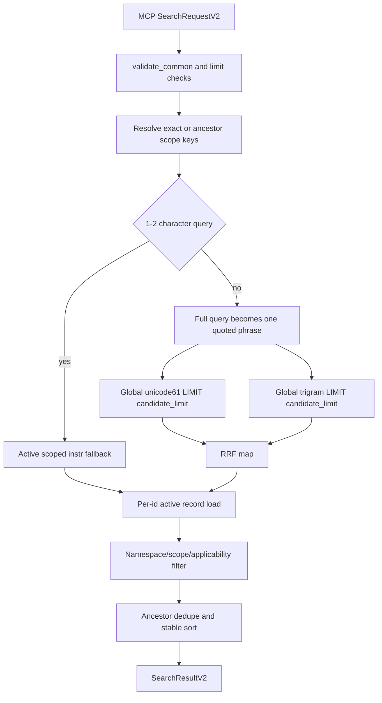
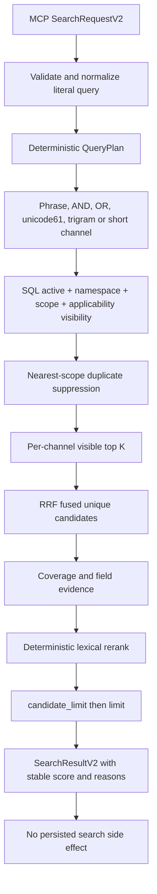

# Memory Retrieval Pipeline 实施计划

> 状态：实施计划；不表示当前 checkout 已完成任何工作包。
> 基线日期：2026-08-16。
> 基线 revision：`48182b1b316f22831235cb75129a2fb430b9b39e`。
> 缺陷等级：多词自然查询漏召回为 `CONFIRMED/P2`；scope/applicability candidate
> crowding 的用户影响为 `UNVERIFIED_RISK`。
> 计划路径：`docs/plans/memory-retrieval-pipeline-development-plan.md`。
> 执行账本：`docs/plans/memory-retrieval-pipeline-execution-ledger.md`。
> 相关上游合同：[ADR 0001](../adr/0001-memory-v2-proposal-review.md)、
> [RFC 0003](../adr/0003-memory-retrieval-pipeline-rfc.md)、
> [Memory v2 架构](../architecture/memory-v2-architecture.md)。

## 1. 信息来源与计划边界

当前计划按以下优先级绑定事实：

1. Accepted ADR 0001 的 proposal/review、scope、lexical-first 与 offline-default 合同；
2. Proposed RFC 0003 的目标检索合同；
3. `xuanling-memory` 当前 schema、store、tests 与 `xuanling-mcp` 公共 DTO/catalog；
4. DSH 真实 Memory transcript 和独立 SQLite 验证；
5. 旧计划、账本与外部实现只作为证据线索。

RFC 0003 在 W0 开始前必须由仓库维护者接受。接受 RFC 只解锁实施，不构成任何 Wave 的实现
证据。

## 2. 目标与非目标

### 2.1 目标

- 用版本化、无真实用户数据的 corpus 建立 Recall@K、MRR、nDCG、visibility 和 determinism
  基线。
- 修复完整多词 query 被当作单一 phrase 导致的稳定漏召回。
- 让 active、namespace、scope、applicability 与 nearest-scope dedupe 在 candidate top K 前生效。
- 在不改变 `memory_search` DTO/catalog 的前提下实现确定性多通道 RRF 与可解释 rerank。
- 保持 proposal/review、immutable version、active-only projection、JSONL 与 restart/rebuild 合同。
- 通过 direct store、MCP、release binary 和 DSH 真实模型验证同一检索语义。
- 以冻结指标和资源数据决定向量专项是 `not_triggered`、`followup_required` 还是
  `blocked_unresolved`。

### 2.2 非目标

- 不在本计划实现真实 embedder、模型下载器、vector schema、HNSW/sqlite-vec 或 semantic MCP
  工具。
- 不实现 CodeGraph、LSP、Wiki、代码索引、调用图或跨资产搜索。
- 不修改 proposal/review、record ID/revision、scope tagged JSON、feedback 写入或 JSONL format。
- 不引入 LLM query rewrite、在线同义词服务、cross-encoder reranker或运行时自学习。
- 不修改默认 Memory DB，不导入、清理、迁移或读取其 record 内容。
- 不发布 npm、不 push、不创建 release、不改 DSH 外部 checkout。
- 不把 synthetic corpus 或三个 DSH session 外推为所有工程的生产质量。

## 3. 目标合同

### C-01：可复算检索质量基线

Given：RFC 0003 定义的 48 active、12 non-searchable distractor、40 query corpus。
When：evaluator 在隔离 in-memory/temp DB 上建立 baseline 或 after report。
Then：输出 corpus digest、Recall@1/5、MRR@5、nDCG@5、slice、visibility、channel、候选数和
latency；相同输入报告 byte-identical。
And not：使用 LLM judge、网络、真实默认 DB、credential 或人工临时打分。
Failure：fixture schema、label、ID 引用、重复 query ID 或 metric arithmetic 无效时 fail closed。
Evidence：fixture contract、metric unit tests、baseline/after machine-readable report。

### C-02：确定性 query expansion

Given：包含自然语言、多词重排、代码 identifier、中英混合或 FTS 操作符字符的 query。
When：query planner 规范化并生成 lexical channels。
Then：生成完全字面量的 phrase、token AND、token OR、unicode61/trigram 或 short-substring
计划；channel 和 term 顺序稳定。
And not：执行用户 FTS 语法、调用模型/网络、截断 query 或读取项目文件。
Failure：空白或纯标点 query 返回 `invalid_input` 且零 DB 写入。
Evidence：planner unit/contract tests、FTS injection fixtures、三连 response digest。

### C-03：可见候选先于 candidate cap

Given：大量更高 lexical rank 的其他 namespace、sibling scope、applicability mismatch、archived、
historical 或 farther-scope duplicate。
When：执行 exact 或 ancestors search。
Then：只有 active 且满足 namespace/scope/applicability 的 nearest-scope record 消耗各 channel top K
和 fused `candidate_limit`。
And not：泄露不可见 record，或让不可见 record 挤掉本 scope 的 relevant record。
Failure：bundled SQLite 缺少所需 JSON 查询能力时返回 typed `unsupported`/`integrity_error`，不得
filter-after-limit 降级。
Evidence：crowding 红转绿、SQL query-plan、namespace/scope/applicability MCP tests。

### C-04：可解释 deterministic rerank

Given：多个可见 record 从不同 lexical channel 命中。
When：RRF 和 rerank 计算最终 top K。
Then：按 lexical relevance、scope distance、pinned、current-revision feedback delta、record ID 稳定
排序；`score` 与 `reasons` 可解释且 byte-identical。
And not：使用 wall clock、last-used 写入、随机数、HashMap 遍历顺序或未版本化模型输出。
Failure：NaN、无效 rank 或 projection/reference 损坏返回 typed failure，不伪造稳定顺序。
Evidence：rank fixture、tie matrix、连续三次序列化 digest、quality thresholds。

### C-05：canonical/projection 与恢复保持分离

Given：create/replace/archive review、restart、JSONL import 或显式 rebuild-index。
When：当前 head 或 projection 变化。
Then：unicode61/trigram 只包含 active current revision，import/rebuild 后召回等价，canonical digest
不变。
And not：search 写 canonical/query/score，startup 全量 rebuild，或返回 pending/history 作为降级。
Failure：transaction、disk、busy、crash 或 corrupt projection 产生 typed failure；显式 rebuild 可恢复。
Evidence：persistence/restart/import/rebuild tests，关键序列连续三次通过。

### C-06：公共 MCP 与 cache 合同稳定

Given：当前 42-tool catalog、Memory contract v2 和 `memory_search` schema snapshot。
When：词法实现完成并构建 server。
Then：工具名称、数量、顺序、input/output schema、annotations、profile 与 contract version 字节不变。
And not：新增 semantic tool、schema option、dynamic directory、模型依赖或网络 crate。
Failure：snapshot/catalog/dependency diff 使 Wave 回退为 `implemented_unverified`。
Evidence：snapshot、protocol、golden、dependency tree、cold/warm prefix hash。

### C-07：向量能力以证据触发

Given：W1-W5 的 frozen corpus、live、latency 和 resource evidence。
When：W6 运行 RFC 0003 semantic trigger。
Then：输出唯一结论 `not_triggered`、`followup_required` 或 `blocked_unresolved`，并逐项记录五个
trigger 的证据。
And not：在本计划自动实现模型、下载、vector projection，或把“未来可能有用”当 trigger。
Failure：semantic slice 少于 3 条 critical miss 时可直接 `not_triggered`；达到该门槛但缺少固定模型
版本、checksum/license/resource 数据或用户资源授权时为 `blocked_unresolved`，计划不能 COMPLETE。
Evidence：semantic decision report 与 RFC 状态更新。

### C-08：DSH 真实工作流召回

Given：隔离 DSH profile、临时 Memory DB、冻结多词 query 和已批准 synthetic record。
When：DeepSeek-V4-Pro/Max 通过 memory Skill 执行三次独立 search session。
Then：目标 record 在 top 5；transcript 只读召回阶段不产生 candidate/review/feedback 写入；外部 DSH
checkout 与默认 DB fingerprint 不变。
And not：用模型自报替代 tool result/SQLite oracle，复用历史 session，或读取 credential 内容。
Failure：provider/rate limit/timeout 单独归为 infrastructure failure；最多一次全新 run ID 重试。
Evidence：三份完整 transcript、tool/result pairing、独立 DB oracle、pre/post fingerprint。

### C-09：性能和索引资源有界

Given：10k visible active + 20k invisible distractor synthetic DB 和同机 baseline。
When：执行固定 query population、projection rebuild 和 server startup。
Then：after p95 不超过 baseline 2 倍，peak RSS 不超过 baseline + 128 MiB，rebuild 不超过 baseline
2 倍，startup 无全量 rebuild。
And not：用 sleep、扩大 timeout、减少 corpus 或忽略慢查询形成通过。
Failure：超限时保持 `implemented_unverified` 并优化或重新设计 channel，不进入 live acceptance。
Evidence：三次 measurement、EXPLAIN QUERY PLAN、process RSS/startup report。

### C-10：Memory v2 写入与延后边界不变

Given：任意 search、query parse failure、model absence 或 projection failure。
When：召回成功或失败。
Then：proposal/review/canonical rows 零变化；candidate 生成失败仍跳过写入，不 fallback canonical。
And not：引入 CodeGraph/LSP、读取 secret、记录 raw query telemetry 或改变 scope 认证含义。
Failure：canonical digest、catalog、forbidden dependency 或 path scan 漂移立即停止。
Evidence：before/after table counts/digest、forbidden scan、default DB hash。

## 4. 当前 checkout 基线

### 4.1 Git 与重叠修改

- Branch：`main`。
- Revision：`48182b1b316f22831235cb75129a2fb430b9b39e`。
- 计划 authoring 前 `git status --porcelain=v1 -z` SHA-256：
  `755af2e6f7136355af5742b08141214829ab4a4b5e228c5e82debe04ad7e8135`。
- Authoring 前有 15 个 dirty tracked path 和 9 个 untracked path，全部属于已验收但未提交的
  RFC 0002/DSH change set；无 submodule。
- 当前专项唯一重叠文件是 `docs/plans/README.md`。其 authoring 前 SHA-256 为
  `26ada9a982a5bdf4e2b00419fd1381151116e97aad9da857799e3742ea094e6b`，既有 diff
  SHA-256 为 `6efd4004c7d19ba8bd2191171e11edd128927fc671866b11938d8e6e21b507e1`；只允许
  追加本计划和账本两行，不改写 RFC 0002 行。
- `docs/README.md` authoring 前为 clean，SHA-256
  `85e3ea634f31c0f327bc124f2ef36438abecb3ac570acb60f324e196ee8e7732`。
- `crates/xuanling-memory/**` 与 `crates/xuanling-mcp/**` 当前无 dirty diff。任何无法归因的重叠
  修改触发停止。

### 4.2 当前版本、schema 与功能

- Workspace version `0.2.1`；Rust `1.97`；Memory schema version 2；JSONL format version 1。
- MCP snapshot 有 42 个工具、9 个 Memory v2 工具，`xuanling.memory_contract_version=2`。
- `SearchRequestV2`：namespace、scope、scope_mode、query、optional applicability、
  candidate_limit、limit。
- Projection：`memory_fts_v2_unicode` 与 `memory_fts_v2_trigram`；无 vector table。
- `experimental-embeddings` 非默认 feature 只含 trait、Noop/Fake embedder；没有生产 adapter、模型
  目录或下载 UX。
- 默认 DB `/Users/ikaros/.xuanling/memory.db` 为 155648 bytes，SHA-256
  `c828b6ed632ccd21864cc6c48b8d15a2dd969ff433b73be39f0c9fad47a4e6aa`，WAL/SHM
  不存在。执行必须使用显式临时 `--memory-db`。

### 4.3 可重复症状与已有证据

- `search_v2` 对非短 query 调用 `fts_phrase(&req.query)`，形成一个完整 quoted phrase。
- DSH session `session-096385fd-fbb4-4d26-9183-ad64c4504972` 中，多词 query
  `fixture oracle filesystem evaluation self-report` 返回空；随后标题 query
  `Verify DSH filesystem results independently` 命中同一 active record，两个 FTS reason 均存在。
- FTS SQL 在全 projection 上 `ORDER BY rank LIMIT candidate_limit`，逐 record 加载时才过滤
  namespace/scope/applicability。crowding 的代码路径明确，用户影响尚未红测。
- 当前 architecture 文档第 3 行仍声称 checkout 是 Memory v1，与当前 source/ADR 冲突；W6 只按
  当前证据修正文档状态，不将旧描述用于 baseline。
- 根 `README.md` 仍写 41 tools，而当前 snapshot 为 42；W6 按 derived catalog 修正，不以 README
  作为当前工具数量来源。
- 当前仓库没有 git remote。W6 的 Linux/macOS/Windows required CI 在 remote/runner 可用前是已知
  外部 blocker，最高状态为 `deterministic_green`。

### 4.4 已运行 baseline

| Command | 结果 | 状态含义 |
| --- | --- | --- |
| `cargo test -p xuanling-memory --test contract` | 24 pass、1 ignored measurement | 当前 lifecycle/scope/short-CJK/stability 绿；无 quality corpus |
| `cargo test -p xuanling-memory --features experimental-embeddings --test contract` | 27 pass、1 ignored measurement | trait isolation 绿；不证明生产 semantic |
| `cargo test -p xuanling-mcp --test protocol` | 109/109 pass | 当前 MCP contract baseline |
| `cargo test -p xuanling-mcp --test golden` | 21/21 pass | 当前 golden baseline |

External DSH checkout 为 revision `47f943859bef60e4160492346772ded9b24f765a`，仅有两个既有
untracked comparison test；不得修改。Stage 1 Web 在 `http://127.0.0.1:61488/` 返回 HTTP 200，
但不是本计划的 Memory acceptance 环境。

## 5. 已确认路径与目标路径

### 5.1 Current flow



### 5.2 Target flow



## 6. Requirement Coverage Matrix

| 需求 | 主合同 | 当前缺口 | 目标行为 | Wave | 红测试 | 最终证据 |
| --- | --- | --- | --- | --- | --- | --- |
| GLM/DSH 多关键词空召回 | C-02 | 完整 query 单 phrase | 多通道字面 query plan | W1-W2 | `multi_term_reordered_query_recalls_target` | corpus critical Recall@5 |
| query expansion | C-02 | 无 token AND/OR/identifier 计划 | 确定性本地 expansion | W2 | planner literal/injection matrix | plan snapshot + corpus slices |
| scope/applicability 不挤占候选 | C-03 | filter after FTS LIMIT | visibility before top K | W1-W2 | `in_scope_hit_survives_invisible_crowding` | crowding matrix + SQL plan |
| deterministic rerank | C-04 | 只有 channel RRF 和简单 tie-break | coverage/field/channel evidence | W3 | rank/tie red fixtures | MRR/nDCG + stable reasons |
| 质量指标 | C-01 | 无 corpus/evaluator | fixed labels and report digest | W1 | invalid fixture/metric tests | baseline/after reports |
| 保持 proposal/review 与失败跳过 | C-05/C-10 | 检索修改可能误伤写路径 | zero canonical write | W2-W5 | table digest assertions | restart/direct/live evidence |
| 保持 catalog/cache | C-06 | 行为变更可能改 schema/description | tools/list bytes unchanged | W2-W6 | snapshot/catalog guard | cold/warm prefix hash |
| 向量是否必要 | C-07 | 只有 trait，无触发数据 | semantic decision report | W6 | trigger decision fixtures | not_triggered/followup_required/blocked_unresolved |
| 模型不得由 Skill 自动下载 | C-07 | 无生产 UX，边界仅在 ADR 0001 | 保持 no download；后续显式 CLI/host | W6 | forbidden dependency/path scan | decision report |
| 索引不能拖垮机器 | C-09 | 只有 ignored 10k rebuild measurement | relative latency/RSS/startup gate | W4 | performance regression | three-run report |
| DSH 真实工具体验 | C-08 | 只有一次历史空召回 | 三个隔离 live search | W5 | transcript verifier red | 3/3 transcript + DB oracle |
| CodeGraph/LSP 延后 | C-10 | 讨论边界，未纳入召回实现 | 无 dependency/tool/schema | W0-W6 | forbidden scan | final catalog/tree |

## 7. 影响边界矩阵

| 模块/边界 | 当前职责 | 允许变化 | 必须保持 | 合同 | 验证 |
| --- | --- | --- | --- | --- | --- |
| `xuanling-memory::store::v2` | candidate/review/get/search/feedback | lexical query/candidate/rank 内部 | mutation transaction、active-only、typed errors | C-02-C-05 | contract/restart |
| query planner 新内部模块 | N/A | literal term/channel plan | 无网络、无模型、稳定顺序 | C-02 | unit + snapshot |
| SQLite canonical tables | immutable facts | N/A | schema v2、JSONL、digest | C-05/C-10 | table/digest |
| unicode/trigram projection | active lexical index | 查询与 rebuild 验证 | derived-only、无 startup rebuild | C-03/C-05 | import/rebuild/restart |
| `SearchRequestV2/ResultV2` | MCP DTO | 排序/score/reason 行为 | schema bytes、field shape | C-04/C-06 | snapshot/protocol |
| `xuanling-mcp` handlers | discovery/dispatch | N/A，除非修复 typed mapping | catalog/description/annotations | C-06 | tools-list hash |
| JSONL/CLI | maintenance | 只增加回归测试 | format v1、projection excluded | C-05 | round-trip |
| DSH integration | schema projection、Skill、live bridge | acceptance script与完成后文案 | external checkout、credential、default DB | C-08 | transcript/fingerprint |
| ZCode integration | deployed Skill/compat | N/A；本计划不做 live ZCode | lenient object flag 边界 | C-06/C-10 | path scan |
| telemetry/audit | 当前无 retrieval telemetry backend | 仅 synthetic report | 不持久化 raw query/user memory | C-01/C-10 | leak scan |
| backup/restore | JSONL canonical export/import | retrieval regression gate | vector/FTS 不导出 | C-05 | import/rebuild |
| semantic adapter | trait/test double | 只做 trigger decision | 无生产模型/下载/向量表 | C-07 | dependency/path scan |
| CodeGraph/LSP | N/A | N/A | 不进入本专项 | C-10 | forbidden scan |

## 8. 全局不变量

- Canonical facts 只由 approved review 事务创建；search 全路径只读。
- Pending、rejected、archived 和 historical rows 永不作为 active search fallback。
- `exact` 只读 exact scope；`ancestors` 只走 workspace → project → global。
- Scope 不是认证，计划不扩展用户/team ACL。
- Query、candidate、score、reason 与 latency 不进入 Memory DB、JSONL、日志或 telemetry。
- 用户 FTS operator 永远按字面量处理；不得拼接到 SQL 或 MATCH expression。
- Fusion/rerank 的列表、reason、score 与 tie-break 均确定性。
- `candidate_limit >= limit > 0` 保持；visible fused candidates 才消耗 candidate budget。
- Default feature、MCP startup 与 Skill 均无模型下载或网络副作用。
- Semantic failure、missing model、timeout 或 stale vector 在未来只能省略 semantic channel，lexical
  结果必须 byte-identical。
- JSONL 只携带 canonical rows；所有 retrieval projection 均可重建。
- Cancel/timeout 发生在只读 search 时无持久化结算；发生在显式 rebuild 时 canonical 不变，旧完整
  projection 保留或事务回滚。
- Secret、credential、raw reasoning 与真实默认 DB record 不得进入 fixture/report。

## 9. Wave 依赖和状态机

```text
not_started
  -> red_confirmed
  -> implemented_unverified
  -> deterministic_green
  -> complete

implementation_or_contract_change -> implemented_unverified
failed_gate_or_stale_red          -> red_confirmed
```

严格顺序：

```text
W0 contract_and_baseline
  -> W1_retrieval_corpus_and_red_tests
  -> W2_query_plan_and_visible_candidates
  -> W3_deterministic_rerank
  -> W4_recovery_and_performance
  -> W5_mcp_and_dsh_live_acceptance
  -> W6_semantic_decision_and_final_gates
```

只有前一 Wave 为 `complete` 才解锁下一 Wave。任何 `search_v2`、query planner、projection 或 DTO
修改都会使 W2-W6 的相关 evidence stale，并把连续通过计数归零。`deterministic_green` 不代表 DSH
live 或三平台 CI 已完成。

## Wave 0：接受检索合同并冻结 baseline

### 目标与合同

- 覆盖合同：C-01、C-06、C-10。
- 可观测结果：RFC 0003 状态明确、checkout/default DB/external DSH 指纹落账、现有测试与 live
  regression 证据可复核。
- 明确不处理：fixture、tests 与生产实现。

### Entry gate

- [ ] RFC 0003 已由仓库维护者明确接受。
- [ ] 重读 `AGENTS.md`、RFC、计划与账本。
- [ ] dirty/untracked 与 `docs/plans/README.md` 重叠 diff 可归因。
- [ ] Memory source、default DB 与 DSH checkout 指纹与 authoring baseline 一致，或漂移已标 stale。

### Allowed files

- `docs/adr/0003-memory-retrieval-pipeline-rfc.md`
- `docs/plans/memory-retrieval-pipeline-development-plan.md`
- `docs/plans/memory-retrieval-pipeline-execution-ledger.md`

### Forbidden changes

- `crates/**`、`npm/**`、`integrations/**`、migration、snapshot、默认 DB、DSH checkout。

### 红测试与基线

| Test/Oracle | Trigger | Expected old failure | Wrong failure |
| --- | --- | --- | --- |
| DSH historical multi-term evidence | 已记录 query 与 title query | 第一条空、第二条命中 | DB/proposal 生命周期失败 |
| current Memory baseline | 四条已运行 Cargo command | 全绿但无 quality metric | compile/fixture/default DB drift |
| catalog baseline | tools-list snapshot | 42 tools、Memory v2 | dynamic tool count |

### 实施工作包

| Package | Symbol/path | Contract | Failure behavior | Targeted validation |
| --- | --- | --- | --- | --- |
| W0.1 | ledger checkout block | C-01/C-10 | 漂移标 stale，不覆盖 | Git/default DB hashes |
| W0.2 | RFC status | C-02-C-07 | 未接受则停止 | docs diff |
| W0.3 | baseline evidence | C-01/C-06 | 命令失败原样落账 | four Cargo commands |
| W0.4 | external baseline | C-08 | 不读 credential 内容 | DSH revision/status/HTTP metadata |

### 验证命令

| Command | Provenance | Expected result | Required/conditional |
| --- | --- | --- | --- |
| `git status --short` | AGENTS.md | attributable dirty set | required |
| `git rev-parse HEAD` | AGENTS.md | 固定 revision | required |
| `cargo test -p xuanling-memory --test contract` | CI | 24 pass、1 ignored baseline 或解释后的当前计数 | required |
| `cargo test -p xuanling-memory --features experimental-embeddings --test contract` | CI | 27 pass、1 ignored baseline 或解释后的当前计数 | required |
| `cargo test -p xuanling-mcp --test protocol` | CI | 109/109 baseline 或解释后的当前计数 | required |
| `cargo test -p xuanling-mcp --test golden` | CI | 21/21 baseline 或解释后的当前计数 | required |

### Evidence

- Behavior before：完整 query 单 phrase；global FTS cap 先于 visibility。
- Red failure：历史 DSH multi-term empty；W1 尚未建立 synthetic red。
- Behavior after：N/A，W0 不改行为。
- Files changed：仅 W0 Allowed files。
- Commands passed：逐条记录 count、时间、fingerprint。
- Commands failed：逐条记录，不能从 gate 删除。
- Commands not run：corpus、performance、live、CI。
- API/storage/UI/restart evidence：仅 baseline。
- External dependency evidence：DSH checkout/HTTP metadata，不发模型请求。
- Secret/redaction evidence：不读取 credential body。

### Exit gate

- [ ] RFC Accepted；baseline 与 drift 全落账。
- [ ] Default DB hash/WAL/SHM 状态未变。
- [ ] Cargo baseline 无未归因失败。
- [ ] W1 next action 唯一明确。

### Stop conditions

- RFC 未接受或与 ADR 0001 冲突。
- Memory source、default DB 或 DSH checkout 出现无法归因漂移。
- 需要读取 credential、真实 Memory rows 或修改 Forbidden changes。

## Wave 1：冻结 corpus、evaluator 与正确红色

### 目标与合同

- 覆盖合同：C-01、C-02、C-03、C-04。
- 可观测结果：固定 corpus/evaluator 可复算当前 baseline；至少多词 regression 正确红；crowding
  风险通过红测升级为 confirmed 或被降级关闭。
- 明确不处理：生产 query/candidate/rerank 实现。

### Entry gate

- [ ] W0 在当前 checkout 为 complete。
- [ ] Corpus 记录均为 synthetic/public，无真实 DB 或 transcript payload。
- [ ] Metric formula 和 relevance grade 已由 RFC 固定。

### Allowed files

- `crates/xuanling-memory/tests/contract.rs`
- `crates/xuanling-memory/tests/contract/memory_retrieval_contract.rs`
- `crates/xuanling-memory/tests/fixtures/retrieval-corpus-v1.jsonl`
- `crates/xuanling-memory/tests/retrieval_eval.rs`
- `docs/plans/memory-retrieval-pipeline-execution-ledger.md`

### Forbidden changes

- `crates/xuanling-memory/src/**`、migrations、MCP handlers/DTO/snapshot、Cargo dependencies、integrations。

### 红测试与基线

| Test/Oracle | Trigger | Expected old failure | Wrong failure |
| --- | --- | --- | --- |
| `multi_term_reordered_query_recalls_target` | DSH semantic-equivalent synthetic query | target 不在 top 5，因为完整 phrase | compile/seed/review failure |
| `in_scope_hit_survives_invisible_crowding` | candidate_limit 个高 rank invisible distractor | target 被全局 cap 挤出 | target 文本本身不匹配 |
| `applicable_hit_survives_mismatch_crowding` | 同 scope applicability mismatch distractor | applicable target 被 cap 挤出 | applicability fixture 无效 |
| `corpus_loader_rejects_invalid_references` | missing/duplicate ID | evaluator fail closed | metric assertion failure |
| `metrics_match_hand_calculated_fixture` | fixed ranked lists | exact Recall/MRR/nDCG | float nondeterminism |

若两个 crowding tests 在未改生产代码时均通过，C-03 的 crowding 用户影响保持
`UNVERIFIED_RISK`，账本记录源代码顺序风险，禁止为制造红色而改变 fixture relevance。

### 实施工作包

| Package | Symbol/path | Contract | Failure behavior | Targeted validation |
| --- | --- | --- | --- | --- |
| W1.1 | corpus JSONL schema/loader | C-01 | malformed/duplicate/reference fail | loader tests |
| W1.2 | metric functions | C-01 | non-finite/invalid grade fail | hand-calculated tests |
| W1.3 | baseline evaluator | C-01 | report only from fixed digest | ignored eval command |
| W1.4 | multi-term red | C-02 | old behavior empty | named red test |
| W1.5 | visibility crowding red | C-03 | correct leak/miss only | named red tests |
| W1.6 | rank/tie red fixtures | C-04 | current simple rank misses target order | named red tests |

### 验证命令

| Command | Provenance | Expected result | Required/conditional |
| --- | --- | --- | --- |
| `cargo test -p xuanling-memory --test contract memory_retrieval_contract` | plan-defined test target | loader/metric tests green；behavior tests正确红 | required |
| `cargo test -p xuanling-memory --test retrieval_eval -- --nocapture` | plan-defined evaluator | baseline JSON + digest | required |
| `cargo test -p xuanling-memory --test contract` | CI | 只允许计划列出的 behavior red | required |
| `git diff --check` | repository gate | clean | required |

### Evidence

- Behavior before：记录 baseline report。
- Red failure：每个红测记录 assertion、target ID 和 old result IDs。
- Behavior after：N/A，生产实现未改。
- Files changed：fixture/tests/ledger。
- Commands passed/failed/not run：完整落账。
- API/storage/UI/restart：store-level only。
- External dependency：N/A，无模型/网络。
- Secret/redaction：fixture leak scan。

### Exit gate

- [ ] Corpus 恰好满足 RFC 数量/类别，digest 固定。
- [ ] Metric tests 全绿且 report byte-identical 三次。
- [ ] 多词红测因目标缺陷失败。
- [ ] Crowding 风险有正确红或明确降级记录。
- [ ] 生产文件零变化，W2 next action 唯一。

### Stop conditions

- 红测因 compile、fixture、proposal/review 或 FTS capability 失败。
- 需要调整 label 才能制造目标失败。
- Fixture 含真实用户数据、credential、raw transcript 或默认 DB 内容。

## Wave 2：实现 QueryPlan 与 visible candidate generation

### 目标与合同

- 覆盖合同：C-02、C-03、C-05、C-10。
- 可观测结果：多词、identifier、中英混合通过 deterministic channels；visible records 在 top K 前
  过滤；不改变 public DTO/schema。
- 明确不处理：最终 rerank 调权、生产 vector、host Skill。

### Entry gate

- [ ] W1 complete 且正确红仍在当前生产路径失败。
- [ ] Bundled SQLite JSON functions 有定向 capability test。
- [ ] `SearchRequestV2/ResultV2` snapshot hash 已记录。

### Allowed files

- `crates/xuanling-memory/src/lib.rs`
- `crates/xuanling-memory/src/store/v2.rs`
- `crates/xuanling-memory/src/retrieval.rs`
- W1 tests/fixture/evaluator
- `docs/plans/memory-retrieval-pipeline-execution-ledger.md`

### Forbidden changes

- `proposal.rs` DTO shape、`scope.rs` wire form、`migrations/**`、`embedder.rs`、Cargo dependencies、
  MCP handlers/snapshot、JSONL canonical format、default DB。

### 红测试与基线

| Test/Oracle | Trigger | Expected old failure | Wrong failure |
| --- | --- | --- | --- |
| W1 multi-term/identifier/CJK matrix | fixed query plan cases | old miss or wrong channel | FTS syntax error from unescaped input |
| visibility crowding | invisible top ranks | relevant miss under old ordering | cross-scope leak |
| punctuation-only query | normalized no-term input | old empty/FTS behavior | panic/internal |
| FTS operator literal | `AND`, quotes, `*`, `NEAR` | treated only as text | operator execution |

### 实施工作包

| Package | Symbol/path | Contract | Failure behavior | Targeted validation |
| --- | --- | --- | --- | --- |
| W2.1 | `retrieval::normalize_query` | C-02 | no-term invalid_input | planner unit |
| W2.2 | `retrieval::QueryPlan` | C-02 | no lossy truncation | channel snapshot |
| W2.3 | FTS literal builder | C-02 | operators escaped | injection matrix |
| W2.4 | visible FTS SQL | C-03 | JSON capability fail closed | crowding tests |
| W2.5 | nearest-scope suppression | C-03 | sibling never visible | ancestor matrix |
| W2.6 | fused candidate cap | C-03 | only visible unique consume cap | candidate counts |
| W2.7 | short-substring preservation | C-02/C-05 | bound parameters only | existing short CJK |

### 验证命令

| Command | Provenance | Expected result | Required/conditional |
| --- | --- | --- | --- |
| `cargo test -p xuanling-memory --test contract memory_retrieval_contract` | W1 | W1 query/visibility red转绿 | required |
| `cargo test -p xuanling-memory --test contract` | CI | 全部 pass，measurement ignored only | required |
| `cargo test -p xuanling-memory --features experimental-embeddings --test contract` | CI | lexical 同结果，semantic isolation 绿 | required |
| `cargo fmt -p xuanling-memory -- --check` | CI | clean | required |
| `cargo clippy -p xuanling-memory --all-targets -- -D warnings` | CI | clean | required |

### Evidence

- Behavior before/Red/After：逐 query IDs 与 channel reasons。
- Files changed：只能是 Allowed files。
- API evidence：DTO/schema hash保持。
- Storage：canonical table digest/row counts before=after search。
- Restart：W4 执行。
- External：N/A。
- Secret：no raw query logging。

### Exit gate

- [ ] 所有 W1 query/visibility correct reds 转绿。
- [ ] 现有 scope/short-CJK/active-only tests 无回归。
- [ ] Search 连续三次 canonical digest 零变化。
- [ ] DTO/catalog snapshot byte-identical。
- [ ] W3 next action 唯一。

### Stop conditions

- 必须改变 DTO、migration 或 dependency 才能继续。
- SQLite JSON capability 跨当前三个目标不可用。
- SQL 只能靠无界 canonical 全表扫描才能满足 visibility。
- Query expansion 引入模型、网络或运行时词典下载。

## Wave 3：实现可解释 deterministic rerank

### 目标与合同

- 覆盖合同：C-01、C-04、C-06。
- 可观测结果：固定 lexical features、RRF 和 tie-break 达到 corpus quality 门槛；score/reasons 稳定。
- 明确不处理：向量、动态学习、public field。

### Entry gate

- [ ] W2 complete。
- [ ] W1 corpus/metric code 与 digest 未变化；变化则 baseline/clean count 清零。
- [ ] 所有 rank weights/tuple 只读取当前 request/record durable facts。

### Allowed files

- `crates/xuanling-memory/src/retrieval.rs`
- `crates/xuanling-memory/src/store/v2.rs`
- W1 tests/fixture/evaluator
- `docs/plans/memory-retrieval-pipeline-execution-ledger.md`

### Forbidden changes

- Public DTO/schema、migration、embedding、MCP catalog、runtime config、telemetry。

### 红测试与基线

| Test/Oracle | Trigger | Expected old failure | Wrong failure |
| --- | --- | --- | --- |
| title/tag vs weak content | same channels, different field evidence | wrong top order | missing candidate |
| token coverage | full vs partial match | partial outranks full | query plan mismatch |
| RRF duplicate channel | record in multiple channels | score/order not expected | non-finite score |
| exact tie matrix | equal lexical/scope/pinned/feedback | record ID deterministic | insertion-order dependence |

### 实施工作包

| Package | Symbol/path | Contract | Failure behavior | Targeted validation |
| --- | --- | --- | --- | --- |
| W3.1 | one-based RRF `k=60` | C-04 | invalid rank integrity error | RRF unit |
| W3.2 | coverage/phrase/field evidence | C-04 | deterministic absent feature | rank fixtures |
| W3.3 | lexical score and reason codes | C-04 | no NaN/volatile values | serialization tests |
| W3.4 | scope/pinned/feedback/id tuple | C-04 | current revision only | tie matrix |
| W3.5 | corpus threshold tuning | C-01/C-04 | implementation不得读 labels | evaluator after report |

### 验证命令

| Command | Provenance | Expected result | Required/conditional |
| --- | --- | --- | --- |
| `cargo test -p xuanling-memory --test contract memory_retrieval_contract` | W1 | rank/tie全绿 | required |
| `cargo test -p xuanling-memory --test retrieval_eval -- --nocapture` | C-01 | critical=1.0、Recall@5>=.90、MRR>=.75、nDCG>=.80 | required |
| previous command repeated three times | AGENTS race/determinism gate | identical report digest | required |
| `cargo test -p xuanling-memory --test contract` | CI | all required pass | required |

### Evidence

- Baseline/after metrics按 slice 落账。
- Reason codes、score range、tie order 与 JSON digest 落账。
- No-match、visibility 与 canonical digest 均为零违规。
- 失败命令不得通过调 label、删 query 或放宽阈值消除。

### Exit gate

- [ ] RFC 全部 quality 门槛满足。
- [ ] nDCG 不低于 baseline，visibility=0。
- [ ] 三连 report/response digest 一致。
- [ ] Public schema/catalog hash 不变。
- [ ] W4 next action 唯一。

### Stop conditions

- 只有改 corpus/label 才能过门槛。
- 需要 wall clock、last-used、随机或模型特征。
- Score/reason 变化无法稳定解释。

## Wave 4：验证 projection 恢复与性能资源

### 目标与合同

- 覆盖合同：C-05、C-09、C-10。
- 可观测结果：review/import/rebuild/restart 召回一致，10k/20k fixture 在相对资源门槛内，startup
  不 rebuild。
- 明确不处理：真实 host/model、schema migration。

### Entry gate

- [ ] W3 complete。
- [ ] Performance fixture 与 query population digest 固定。
- [ ] 基线和 after 在同一机器、同一 profile、同一 build mode 串行运行。

### Allowed files

- Memory retrieval tests/evaluator/fixture
- `npm/scripts/verify-memory-retrieval.mjs`
- `docs/plans/memory-retrieval-pipeline-execution-ledger.md`
- W2/W3 source only when a gate exposes an attributable defect

### Forbidden changes

- Migrations、canonical schema、DTO/catalog、Cargo dependency、default DB、DSH checkout。

### 红测试与基线

| Test/Oracle | Trigger | Expected old failure | Wrong failure |
| --- | --- | --- | --- |
| restart parity | close/reopen temp DB | same ranked IDs/bytes | temp path/default DB mixup |
| import/rebuild parity | export/import canonical | same ranked IDs | exported projection dependence |
| projection corruption | delete FTS then rebuild | typed empty/failure then exact restore | canonical mutation |
| 10k/20k crowding perf | fixed population | baseline recorded | concurrent Cargo noise |

### 实施工作包

| Package | Symbol/path | Contract | Failure behavior | Targeted validation |
| --- | --- | --- | --- | --- |
| W4.1 | restart search matrix | C-05 | mismatch fail | disk temp DB test |
| W4.2 | JSONL round-trip matrix | C-05 | target stays empty on fail | CLI/store test |
| W4.3 | rebuild transaction | C-05 | canonical digest unchanged | rebuild test 3x |
| W4.4 | EXPLAIN QUERY PLAN | C-09 | full canonical scan blocks | plan report |
| W4.5 | latency/RSS/startup measurement | C-09 | threshold miss blocks W5 | report 3x |
| W4.6 | cancel/busy/crash recovery | C-05/C-10 | typed failure, no partial canonical | failure matrix |

### 验证命令

| Command | Provenance | Expected result | Required/conditional |
| --- | --- | --- | --- |
| `cargo test -p xuanling-memory --test contract` | CI | all required pass | required |
| `cargo test -p xuanling-memory --test retrieval_eval -- --ignored --nocapture` | W1/W4 | fixed performance JSON | required |
| performance command repeated three times serially | AGENTS critical gate | all within relative limits | required |
| `cargo test -p xuanling-mcp --test protocol cli_maintenance` | CI contract | import/rebuild/restart pass | required |
| `node npm/scripts/verify-memory-retrieval.mjs --binary target/debug/xuanling-mcp --mode direct` | W4 script | direct MCP corpus gate pass | required |

### Evidence

- API/storage/restart：response digest、canonical digest、projection row count。
- Failure：busy/cancel/corrupt/import typed codes 与 recovery。
- Performance：machine/build metadata、三次 raw JSON、aggregate。
- Commands failed/not run 原样记录。
- Default DB pre/post hash相同、无 WAL/SHM。

### Exit gate

- [ ] Restart/import/rebuild 关键序列连续三次通过。
- [ ] Search/rebuild failure 不改变 canonical digest。
- [ ] Performance 三连满足 RFC 相对门槛。
- [ ] EXPLAIN 无不可接受 canonical 全扫描。
- [ ] W5 next action 唯一。

### Stop conditions

- 需要 migration/schema 变化。
- Performance 只能通过减 corpus、增 timeout、并行掩盖或 ignored required test 通过。
- 默认 DB 被打开或出现 WAL/SHM。

## Wave 5：MCP、release binary 与 DSH 真实验收

### 目标与合同

- 覆盖合同：C-06、C-08、C-10。
- 可观测结果：公共 catalog 字节不变；release binary direct corpus 通过；DSH 三次真实模型多词召回
  命中且无写入副作用。
- 明确不处理：生产默认配置、ZCode live、向量。

### Entry gate

- [ ] W4 complete。
- [ ] DSH credential 只以 owner-only file reference 或环境存在性提供，不读取正文。
- [ ] 使用新 run ID、新 temp DB、新 DSH_HOME；default DB 和 DSH checkout pre-hash 已记录。
- [ ] 模型 route 固定为 DeepSeek-V4-Pro/Max，billable live 得到当前用户授权。

### Allowed files

- `npm/scripts/verify-memory-retrieval.mjs`
- `npm/test/memory-retrieval.test.mjs`
- `test/deepseek-harness/evaluation/memory-retrieval/**`
- `integrations/deepseek-harness/xuanling-skills/skills/xuanling-memory-workflow/SKILL.md`
- `docs/plans/memory-retrieval-pipeline-execution-ledger.md`
- W2/W3 source only for attributable live defect，修改后 W2-W5 evidence 全 stale

### Forbidden changes

- External `/Volumes/project_home/github/deepseek-harness/**`
- Existing RFC 0002 evaluation evidence/scripts
- MCP handler descriptions/schema/snapshot、default DB、production profile、credential content

### 红测试与基线

| Test/Oracle | Trigger | Expected old failure | Wrong failure |
| --- | --- | --- | --- |
| release direct multi-term | approved synthetic record | old binary target missing | protocol/spawn failure |
| transcript verifier | model session | target tool result top5 | model self-report only |
| read-only DB oracle | search phase | zero proposal/review/feedback delta | seed/review counts absent |
| catalog hash | tools/list | exact authoring snapshot | nondeterministic ordering |

### 实施工作包

| Package | Symbol/path | Contract | Failure behavior | Targeted validation |
| --- | --- | --- | --- | --- |
| W5.1 | release build + direct verifier | C-06/C-08 | fail before live | release direct |
| W5.2 | isolated DSH runner/verifier | C-08 | incomplete transcript nonzero | Node tests/dry-run |
| W5.3 | three live sessions | C-08 | infra separate from model failure | transcript verifier |
| W5.4 | independent SQLite oracle | C-08/C-10 | no self-report acceptance | read-only query counts |
| W5.5 | pre/post fingerprints | C-06/C-10 | any drift blocks | Git/DB/catalog hashes |

### 验证命令

| Command | Provenance | Expected result | Required/conditional |
| --- | --- | --- | --- |
| `cargo build --locked --release -p xuanling-mcp` | repository release path | release binary | required |
| `node npm/scripts/verify-mcp-contract.mjs --binary target/release/xuanling-mcp` | current contract verifier | 42 tools、contract v2 | required |
| `node npm/scripts/verify-memory-retrieval.mjs --binary target/release/xuanling-mcp --mode direct` | W4 | corpus/metric pass | required |
| `node --test npm/test/memory-retrieval.test.mjs` | W5 | runner/verifier contracts pass | required |
| `XUANLING_DSH_RUN_ID=memory-retrieval-live-w5-1 /Volumes/project_home/github/deepseek-harness/node_modules/.bin/tsx test/deepseek-harness/evaluation/memory-retrieval/run.ts --dsh-root /Volumes/project_home/github/deepseek-harness --binary target/release/xuanling-mcp --trials 3` | W5 plan-defined runner | 3 complete sessions | required, billable |
| DSH transcript verifier on the new evidence root | W5 | 3/3 target top5、zero write delta | required |

### Evidence

- Direct MCP request/result pairing and catalog hash。
- Three current live session IDs、route、query、ranked record IDs、usage。
- SQLite seed/review/search counts and canonical digest。
- Credential path metadata and zero secret redaction/leak scan。
- Default DB/DSH checkout/binary pre/post fingerprints。

### Exit gate

- [ ] Release direct corpus pass。
- [ ] DSH live 3/3 complete且独立 oracle pass。
- [ ] Search phase canonical/proposal/review/feedback delta 全为0。
- [ ] Public catalog、default DB、DSH checkout unchanged。
- [ ] W6 next action 唯一。

### Stop conditions

- Credential 需要读取、复制、hash 或输出正文。
- 连续三次 provider/rate-limit/timeout 无法解除。
- Model 通过 shell/禁用 policy/修改 DSH checkout 绕过工具面。
- Default DB、RFC 0002 evidence 或 external checkout 发生漂移。

## Wave 6：Semantic 决策、三平台 gate 与文档收口

### 目标与合同

- 覆盖合同：C-01-C-10。
- 可观测结果：semantic trigger 有唯一结论，RFC/architecture/Skill 与当前行为一致，全部本地和三平台
  gate 通过。
- 明确不处理：根据 `followup_required` 直接实现向量。

### Entry gate

- [ ] W5 complete。
- [ ] Corpus、metric、live、performance evidence均为当前 checkout。
- [ ] Semantic 实验若运行，模型版本/checksum/license/resource metadata齐全且不写默认 DB。

### Allowed files

- `docs/adr/0003-memory-retrieval-pipeline-rfc.md`
- `docs/architecture/memory-v2-architecture.md`
- `README.md`
- `docs/README.md`
- `docs/plans/README.md`
- `docs/plans/memory-retrieval-pipeline-*.md`
- Memory Skills in `docs/skills` and `integrations/**` only when behavior text changed

### Forbidden changes

- Production Rust/tests/schema/dependencies、default DB、external DSH checkout、发布/push。
- 向量实现、模型安装、CodeGraph/LSP。

### 红测试与基线

| Test/Oracle | Trigger | Expected old failure | Wrong failure |
| --- | --- | --- | --- |
| semantic trigger verifier | complete W1-W5 evidence | old repo无 decision | missing evidence accepted |
| stale architecture scan | current-v1 claim | stale line detected | historical quotation detected |
| forbidden semantic surface | default tree/catalog | zero real adapter/tool/downloader | test-only FakeEmbedder flagged |

### 实施工作包

| Package | Symbol/path | Contract | Failure behavior | Targeted validation |
| --- | --- | --- | --- | --- |
| W6.1 | semantic decision report | C-07 | critical miss + incomplete model evidence => blocked_unresolved | report verifier |
| W6.2 | RFC final status | C-07 | only evidence-backed status | docs review |
| W6.3 | architecture/Skill sync | C-02-C-08 | no future claim | docs tests |
| W6.4 | full local gates 3x | C-01-C-10 | any change resets count | gate matrix |
| W6.5 | Linux/macOS/Windows CI | C-03/C-06 | missing platform caps complete | CI artifacts |
| W6.6 | final fingerprints/report | C-06/C-10 | drift blocks | Git/default DB/DSH hashes |

### 验证命令

| Command | Provenance | Expected result | Required/conditional |
| --- | --- | --- | --- |
| `cargo fmt -p xuanling-memory -p xuanling-mcp -- --check` | CI | clean | required |
| `cargo check -p xuanling-memory -p xuanling-mcp --all-targets` | CI | pass | required |
| `cargo clippy -p xuanling-memory -p xuanling-mcp --all-targets -- -D warnings` | CI | pass | required |
| default + feature Memory contract、MCP protocol、golden | CI | all pass | required |
| `npm --prefix npm run check` | npm manifest | pass | required |
| `npm --prefix npm test` | npm manifest | pass | required |
| `npm --prefix npm run check:docs` | npm manifest | pass | required |
| `node npm/scripts/verify-mcp-contract.mjs --binary target/release/xuanling-mcp` | contract verifier | catalog unchanged | required |
| `git diff --check` | repository gate | clean | required |
| `.github/workflows/xuanling-portability.yml` matrix | CI | Linux/macOS/Windows all green | required |

### Evidence

- Final corpus baseline/after/live/performance/semantic reports and digests。
- All changed files、passed/failed/not-run commands、ignored tests。
- API/catalog、storage/restart/import/rebuild、failure、secret、external/live 与 platform evidence。
- Semantic conclusion 和后续唯一 action；不把 follow-up 当已实现。

### Exit gate

- [ ] Requirement Coverage Matrix 无未映射需求。
- [ ] 所有 Wave 在当前 checkout complete。
- [ ] 本地 required gate 连续三次绿；三平台 CI 全绿。
- [ ] DSH live、default DB、external checkout evidence current。
- [ ] RFC 最终状态与 semantic report 一致。
- [ ] Ledger 最终字段完整。

### Stop conditions

- 三平台 CI 无 remote/runner 或 required gate失败且根因不明。
- Semantic 结论需要新的 dependency/schema/public API。
- 文档试图声称向量、模型安装、CodeGraph/LSP 已实现。
- 真实数据、secret、发布、push 或破坏性操作缺少独立授权。

## 10. 测试和验收总矩阵

| Gate | 适用范围 | 证明内容 | 未运行时状态上限 |
| --- | --- | --- | --- |
| fmt/check/clippy | Memory/MCP Rust | 静态一致性 | `implemented_unverified` |
| unit | QueryPlan/RRF/metrics | literal、排序、公式 | `implemented_unverified` |
| contract | store/search/scope | public behavior | `implemented_unverified` |
| corpus quality | 40 queries | Recall/MRR/nDCG/visibility | `implemented_unverified` |
| persistence/restart | temp disk DB | durable projection恢复 | `deterministic_green` |
| migration/rollback | 当前目标 N/A：RFC禁止schema变化 | schema变化则停止重规划 | `implemented_unverified` |
| JSONL/import/rebuild | canonical/projection | round-trip与重建 | `deterministic_green` |
| MCP protocol/golden | public tool surface | DTO/catalog/result | `deterministic_green` |
| performance | 10k/20k fixture | latency/RSS/startup | `deterministic_green` |
| DSH live | real model/temp DB | agent workflow | `deterministic_green` |
| external platform | Linux/macOS/Windows | SQLite/tokenizer/JSON一致 | `deterministic_green` |
| docs/link/diff | 全部改动 | deliverable quality | `deterministic_green` |

Race、restart、rebuild、report determinism 与 live population 要求三次连续通过。实现或 fixture 变化
使计数归零。Ignored 只允许明确的 measurement target，且 W4 必须显式运行；required test 不得改成
ignored。

## 11. 故障与恢复矩阵

| 故障 | Typed 状态 | Durable facts | 用户可见结果 | 恢复动作 |
| --- | --- | --- | --- | --- |
| empty/punctuation query | `invalid_input` | 零写入 | 明确 query 无 term | 修正 query |
| malformed/legacy DTO | protocol invalid params | 零写入 | schema error | 按 v2 DTO 重试 |
| FTS operator input | success或no hit，按字面 | 零写入 | 不执行 operator | N/A |
| FTS/JSON capability unavailable | `unsupported` | canonical不变 | search不可用 | 使用受支持 build；不静默降级 |
| DB busy | `database_busy` | canonical/projection不变 | typed retryable | backoff 后同 request 重试 |
| corrupt projection | `integrity_error`或可复现空结果 | canonical保留 | 提示显式 rebuild | `memory rebuild-index` |
| rebuild transaction failure/disk full | `io_error` | canonical不变；旧完整 projection | rebuild失败 | 释放空间后重跑 |
| cancel before search | cancelled/transport | 零写入 | 无结果 | 重新发起 |
| cancel during search | cancelled/transport | 零写入 | 无partial成功声明 | 同 request 重试 |
| cancel/crash during rebuild | nonzero/typed failure | canonical不变；事务回滚 | rebuild未完成 | restart 后显式重跑 |
| restart | success | canonical与projection持久 | 同结果bytes | N/A |
| duplicate request | success | search无幂等写状态 | 同结果 | N/A |
| stale plan/corpus | gate failure | 旧evidence标stale | 不验收 | 重新baseline |
| concurrent review/search | old或new完整head | 单事务head/projection | 不出现混合version | 重试验证当前head |
| import invalid/truncated | typed failure | target canonical empty | import失败 | 修复文件后重试 |
| semantic missing/timeout | 本计划 N/A；未来省略channel | lexical/canonical不变 | lexical byte-identical | 显式修复模型后重建 |
| secret/raw query in report | security gate failure | evidence隔离 | 停止 | 删除未交付临时证据并重新生成合成fixture |
| default DB fingerprint drift | incident blocker | 不再信任隔离证据 | 停止 | 归因并重建pre/post窗口 |

Backup/restore 使用 JSONL canonical export/import；FTS 和未来 vector projection 不进入 backup。当前无
UI、remote API、telemetry backend 或 release artifact migration，分别为 N/A；MCP/DSH 是适用用户面。

## 12. 全局停止条件与禁止捷径

- ADR 0001 与 RFC 0003 冲突未解决时停止。
- Dirty worktree 重叠修改无法归因时停止。
- Public API/schema/Memory contract、migration 或 dependency 需要变化时停止并重写计划。
- 真实 DB、credential、模型下载、发布、push 或破坏性操作缺少独立授权时停止。
- Required gate 失败且根因不明时停止。
- 不通过删除 query/record、改 relevance label、弱化 assertion、降低阈值、缩小 performance population、
  增加 sleep/timeout 或 ignored test 继续。
- 不用 unit/mock/synthetic 替代 DSH live、三平台或 restart evidence。
- 不把 Semantic `followup_required` 写成向量已实现。
- 不把 TencentDB-Agent-Memory 的自动 fallback、远程 VectorDB、ACL 或 CodeGraph 边界引入本计划。

## 13. 最终完成定义

1. Requirement Coverage Matrix 没有未映射需求。
2. W0-W6 在当前 checkout 全部 `complete`。
3. Required gates 无 failed、stale 或 not-run；三连计数有效。
4. Critical Recall@5=1.00、aggregate Recall@5>=.90、MRR@5>=.75、nDCG@5>=.80、visibility=0。
5. Query failure、busy、cancel、restart、rebuild、import、concurrent review/search 合同有证据。
6. MCP catalog/schema bytes、Memory schema v2、JSONL v1、default offline dependency 均保持。
7. DSH 真实模型 3/3、三平台 CI、release direct verifier 通过。
8. Default DB 与 external DSH checkout pre/post fingerprint 相同。
9. Semantic decision 是 evidence-backed `not_triggered` 或 `followup_required`；后者只解锁新计划。
   `blocked_unresolved` 保留为 BLOCKED，不能满足最终完成定义。
10. 最终报告列出修改文件、命令、失败、未运行项、ignored measurement 和外部依赖缺口。

任一项缺失时只能报告 `implemented_unverified`、`deterministic_green`、`blocked` 或
`handoff_required`，不能报告基本完成。

## 14. 执行账本 schema 与恢复顺序

账本至少保持：

```yaml
schema_version: 1
plan_id: "memory-retrieval-pipeline-20260816"
updated_at: "2026-08-16T14:33:35+08:00"
plan_status: "not_started"
checkout:
  revision: "48182b1b316f22831235cb75129a2fb430b9b39e"
  status_sha256: "755af2e6f7136355af5742b08141214829ab4a4b5e228c5e82debe04ad7e8135"
  relevant_diff_sha256: "e3b0c44298fc1c149afbf4c8996fb92427ae41e4649b934ca495991b7852b855"
  relevant_untracked_sha256: "e3b0c44298fc1c149afbf4c8996fb92427ae41e4649b934ca495991b7852b855"
current_wave: "W0"
current_work_package: "W0.1"
wave_state: "not_started"
clean_acceptance_count: 0
last_completed_action: "Plan authoring and validation only"
next_action: "Accept RFC 0003, then refresh W0 checkout and data fingerprints"
required_gates: []
changed_files: []
failed_commands: []
not_run_commands: []
blockers: []
```

每次恢复：

1. 重读 `AGENTS.md`、RFC、计划和 ledger。
2. 运行 `git status --short` 与 `git rev-parse HEAD`。
3. 用 ledger 的 exact fingerprint commands 比较 checkout/default DB/DSH；受影响 evidence 标 stale。
4. 定位首个未 complete Wave 和 work package。
5. 从 `next_action` 恢复，一次只推进一个 package。
6. 修改后先定向 gate，再更新 ledger 和解锁状态。

## 15. 首轮执行指令

```text
完整读取仓库 AGENTS.md、RFC 0003、实施计划和执行账本。先确认 RFC 已接受；未接受时停止，
不修改生产代码。记录当前 checkout revision、dirty/untracked、相关 diff、默认 Memory DB 和
DeepSeek Harness checkout 指纹。

从 W0.1 开始。前一 work package 未通过 Exit gate 时不开始下一项。W1 先建立固定 corpus、
evaluator 和因当前缺陷失败的红测试；生产实现前不得改 relevance label 或 corpus 来制造红色。
实现后先跑定向验证，再验证 canonical/projection、restart/import/rebuild、MCP catalog、性能、
DSH live、三平台和 secret/default-DB 隔离。

存在可安全执行的下一步且未触发 Stop conditions 时继续推进。硬限制中断前更新账本并返回
HANDOFF_REQUIRED。只有最终完成定义全部满足时返回 COMPLETE。
```

## 16. 中断续作指令

```text
不依赖聊天摘要。重新读取仓库 AGENTS.md、RFC 0003、实施计划和执行账本，运行
git status --short 与 git rev-parse HEAD，并复核默认 Memory DB 和 DSH checkout fingerprint。
发现漂移时先把受影响 evidence 标 stale。

定位首个未 complete Wave 和首个未完成 work package，从 next_action 恢复。一次只推进该
package，按红测、实现、定向验证、合同验收和账本更新顺序执行。Semantic trigger 只产生
not_triggered、followup_required 或 blocked_unresolved，不在本计划实现向量。只能以 COMPLETE、BLOCKED 或
HANDOFF_REQUIRED 结束，并输出计划规定的全部状态字段。
```

执行轮次尾部固定为：

```text
EXECUTION_STATUS: HANDOFF_REQUIRED | BLOCKED | COMPLETE
PLAN_ID: memory-retrieval-pipeline-20260816
CHECKOUT_FINGERPRINT:
CURRENT_WAVE:
CURRENT_WORK_PACKAGE:
WAVE_STATE:
CONTRACTS_PROVEN:
EVIDENCE_ADDED:
FAILED_GATES:
NOT_RUN_GATES:
BLOCKERS:
NEXT_EXACT_ACTION:
LEDGER_PATH: docs/plans/memory-retrieval-pipeline-execution-ledger.md
```
