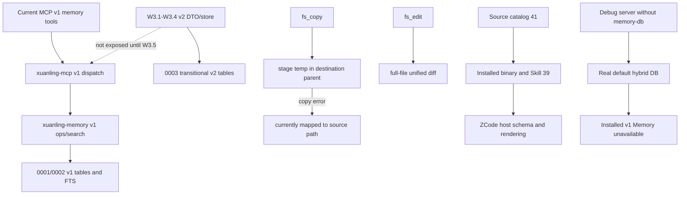
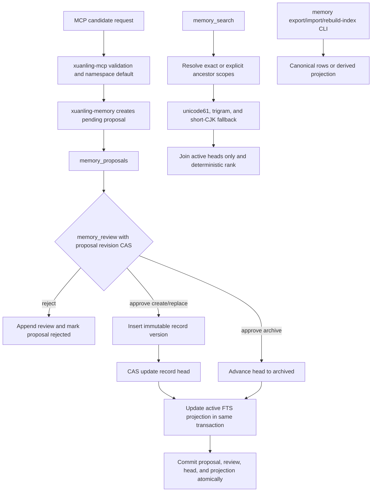
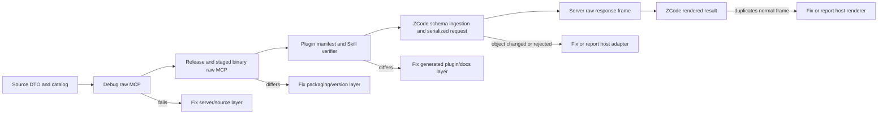

# XuanLing Memory v2 抽离与重构实施计划

> 状态：实施计划；实现状态仅以执行账本和当前 checkout 证据为准，不因本文存在而视为完成。
> Plan ID：`memory-v2-extraction-20260814`
> 基线日期：2026-08-14。
> 基线 revision：`47f1cff156896cd3006258b6e4519a4bb2bc3f6a`。
> 缺陷等级：`CONFIRMED P1`，真实旧默认 DB 已被计划外应用 migration 3，导致新启 0.1.0 server 禁用 Memory；`CONFIRMED P2`，现有直接写入/覆盖/物理删除、`fs_copy` 错误角色、`fs_edit` 整文件预览和仓库/插件合同漂移；短 CJK 检索、ZCode 参数序列化和模型上下文双计数为 `UNVERIFIED_RISK P2`。
> 计划路径：`docs/plans/memory-v2-extraction-development-plan.md`。
> 执行账本：`docs/plans/memory-v2-extraction-execution-ledger.md`。
> 目标 ADR：`docs/adr/0001-memory-v2-proposal-review.md`。
> 上游历史文档：`N/A`，当前 `docs/` 被确认为已废弃的上游维护资料，不再作为合同来源。

## 1. 摘要

按严格串行 Wave 完成以下结果：

1. 删除当前 99 个废弃文档，解除 `docs/*` ignore，建立最小、可追踪的当前仓库文档集。
2. 将 `xuanling-toolkit::memory` 抽离为独立 crate `xuanling-memory`。
3. 使用 proposal、review、CAS 和不可变版本记录替代直接 CRUD。
4. 维持 lexical-first 检索，加入显式 global/project/workspace scope、祖先检索和稳定输出。
5. 提供 v2 JSONL export/import/rebuild-index CLI，不兼容 v1 数据库。
6. 将 MCP、npm、CI 和 ZCode 插件升级到 `0.2.0`。
7. 保留实验性 embedding Rust 代码，但默认关闭，不下载模型，不暴露 MCP 工具。
8. 在本机插件切换前完成 MCP dogfooding 合同收敛：文件错误角色、局部 diff、catalog/Skill/artifact 一致性和 raw/live 分层诊断。
9. 将 W3-W9 的 test/raw/debug/release/staged 自动化 server invocation 与当时的真实默认 DB
   隔离，保留已污染 hybrid DB 现状并在破坏性切换前重新确认删除授权；只有授权后的 live
   ZCode workflow 使用新默认 v2 DB。
10. CodeGraph、LSP、真实 embedding 模型、异步 process job API、发布 npm 包均不在本计划实现范围。

## 1.1 目标与非目标

### 目标

- C-01 至 C-10 定义 Memory v2 的文档、crate、持久化、召回、维护、MCP 与本机切换结果。
- C-11 至 C-14 将 dogfooding 反馈收敛为可重现的文件错误、diff、catalog、host
  integration 与保留行为合同。
- C-15 将测试、raw probe、artifact smoke 与真实用户 Memory 数据隔离；只有 W8 重新授权
  后的 live ZCode 切换可以使用当时的新默认库。
- 所有目标必须通过 Requirement Coverage Matrix、严格串行 Wave、当前 checkout 证据和
  sidecar ledger 恢复；计划文字或单次绿色测试不构成实现完成。

### 非目标与全局不变量

- CodeGraph、LSP、真实 embedding 模型及下载 UX、异步 process job API 和 npm publish
  不在本计划实现；它们不得向 Memory schema/DTO/catalog 添加占位合同。
- 不迁移或解释 v1 用户数据库；W8 只在 staged/live gate 全绿且 holder 为空后删除三个
  旧 DB 路径。由于默认库已出现计划外 migration 3，W8 必须先展示 count/integrity 证据并
  重新确认删除授权；`toolkit-memory.db.stale-20260813.bak` 始终不修改。
- 不手工删除 `_sqlx_migrations` row、drop v2 tables、回滚 WAL 或尝试就地修复 hybrid DB；
  当前一个 v1 record 与空 v2 canonical tables 保持原样，直到独立授权的 W8 动作。
- 不修改 ZCode host 源码或 cache，不用 server DTO workaround 掩盖 host serialization/render
  问题；外部修复需要独立权限和证据。
- `process_run`/pipeline/session 保持 direct argv；不增加 shell fallback、command string
  拆词或伪装成长任务方案的同步 timeout。
- 保持 C-13 的稳定 hash、结构化 cursor、before/after hash 与非空目录删除拒绝；W7 的
  filesystem 改动不能削弱这些已有合同。
- 除 W8 明确列出的本机切换外，真实数据清理、发布、push、外部消息和破坏性迁移均不在
  授权范围内。

## 2. 当前 Checkout 基线

- 分支为 `main`，无 submodule、无 Git remote，workspace 版本为 `0.1.0`。
- `git status --short` 指纹为 `961b04f0b6c12c0188c6339d542dbbd5c887e87f75096a2c1a6f547f2b089031`。
- 相关 diff 指纹为 `4e1e447bc0e60de4553204e2c291ea254d6cbaff0b2e5bb49d76177d7fb2a8cc`。
- untracked 指纹为 `8cbac110e5b09caa0c03ebbd28b9d7b65a0e3e12e58e2790165bb70c591b75bb`。
- `docs/` 有 99 个文件、约 2 MiB，HEAD 未追踪任何 docs；当前文件清单指纹为 `5dd39b40632ccdb36e5fe942a5b6a7b7d6d86909a53640aa1e1537d8d7c46dc6`。
- Memory 源码和迁移文件目前 clean；MCP handlers/server/main、snapshot、README、npm smoke 等文件存在重叠 dirty 修改。
- v1 默认数据库为 `~/.xuanling/toolkit-memory.db`，当前有一条 `xuanling-dogfood` fact，无 embedding 行。
- `~/.xuanling/toolkit-memory.db.stale-20260813.bak` 不在删除授权内，必须保持不动。
- 计划调查结束时没有运行中的 `xuanling-mcp` 进程；执行切换时必须重新解析进程，禁止复用历史 PID。
- 已通过：Rust fmt/check/strict Clippy、Toolkit contract 165 项、Memory 35 项、MCP protocol 101 项、golden 23 项、npm check/test 7 项、`git diff --check`。
- 未运行：release build、三平台 CI、0.2.0 ZCode live acceptance。

### 2.1 当前执行检查点（2026-08-14T15:21:00+08:00）

本节记录 W0-W3 执行后的新事实，不覆盖上面的执行前基线。计划与账本位于未追踪的
`docs/` 中，因此仅以稳定的 status 路径集合和 tracked binary diff 建立检查点，不用包含
计划自身内容的递归 hash 宣称 checkout 未变化。

- revision 仍为 `47f1cff156896cd3006258b6e4519a4bb2bc3f6a`；分支仍为 `main`。
- 当前 `git status --short` 指纹为 `e42ad622d2a8edc1596a6cb9965ab58957c93d97b7b21cab6b92ce74fa05793b`；tracked binary diff 指纹为 `980168aed98c09fc10cc3a358ea69fc1e0c8421476f78813c6e3a2613151afb3`；untracked path-set 指纹为 `2197bb9365390f17232c6bf3594d010d6f6f3daa4a2c28ce459ce7eafabda732`。
- W0、W1、W2 的 `complete` 证据保留在账本；W3.1-W3.4 的 store 实现证据仍有效，但
  “验证未接触真实用户库”的前提已失效，W3 回到 `red_confirmed`，唯一恢复点为 W3.G2。
- 本次计划修订独立重跑 `cargo test -p xuanling-memory --test contract`，结果 43/43；重跑 `cargo test -p xuanling-mcp --test protocol --test golden`，结果 101/101 与 23/23。它们只确认当前局部 gate，不把 W3 标记为 `complete`。
- 当前 checkout 的 raw protocol 已多次覆盖 `output={"mode":"bounded","max_bytes":N}`；本机已安装 0.1.0 binary 的 raw `fs_read_text` 同形请求也成功。因此 ZCode 的 `-32602` 不能先归因于 server DTO，必须比较 host 实际发送 frame。
- 已安装 binary（`/Users/ikaros/.local/share/zcode-plugins/xuanling-local/plugins/xuanling-mcp/bin/node_modules/xuanling-mcp-darwin-arm64/bin/xuanling-mcp`，SHA-256 `713c84f4202a85ea3e7379d1e419175cc0b051efbdb7cea7876bdf9a24946ccd`）报告 `xuanling.contract_version=1`、39 tools；当前 checkout 的 debug binary（SHA-256 `7d2309193e3a92c06869f667a02f8ddde0874307a747bdcd3aa77b2768e4095a`）raw initialize/list 报告 contract version 2、41 tools，且 `_meta.tool_count` 与 list 长度一致。已安装 Skill/manifest 同样写 39，但其“省略 output 默认 65,536 bytes”与当前 checkout 的“省略即完整输出”合同冲突。这是已确认的 source/artifact/Skill 版本与语义漂移。
- 已安装 binary 的 raw `tools/list` 明确允许 `stdout={"file":{"path":...}}`；若 ZCode 只呈现 string enum，责任边界仍在 host schema ingestion 或实际加载版本，不能通过删除 server union 规避。
- 已安装 binary 的 raw tool result 确实同时包含 JSON text `content` 和同义 `structuredContent`；当前依赖 `rmcp 3.1.2` 的 `CallToolResult::structured` 明确构造这两个字段。raw duplication 已确认，ZCode 是否把两份都注入模型上下文仍为 `UNVERIFIED_RISK`；必须结合 negotiated protocol 与 host context/render 行为判断责任层。
- `docs/guides/xuanling-mcp-integration.md` 与 `docs/repository-boundary.md` 仍把 omitted
  output 写成默认 65,536 bytes，而当前 source/README/test 合同是 omission -> complete；它们
  进入 C-12 的文档 surface，不能由 Skill 更新单独关闭。
- 全 docs table-column audit 发现 `docs/architecture/memory-v2-architecture.md` 的
  `active | archived` 与 `pending | approved | rejected` 两行被未转义 pipe 拆列；当前
  `check-docs.mjs` 仍返回绿色，确认 table checker 缺口。原 W0 checker 合同未覆盖表格，
  W0 历史状态不回退；该红基线由 C-12/W7.5 接管。
- `process_run` 没有 server timeout；本轮 dogfooding 观察到约 30 秒 host 请求 deadline。同步工具调用无法可靠跨越 host deadline，新增 server `timeout` 参数也不能解决该问题。
- current debug raw `fs_copy` 复现：source `Cargo.toml` 存在、destination parent 不存在时，
  返回 `not_found`，但 `path` 错指 source；目标文件未创建。
- current debug raw `fs_edit_preview` 复现：对 1,284-byte `Cargo.toml` 做一次唯一单行替换，
  返回 2,706-byte diff，`replacements=1`，原文件 SHA-256 仍为
  `2a4699d8ea3b84345b6acb43962d09e2e47fd5550b6fc4dd8643e3ed21293758`。
- 真实 `/Users/ikaros/.xuanling/toolkit-memory.db` 的 `_sqlx_migrations` 已记录 migration 3
  `memory v2 core`（`installed_on=2026-08-14 07:02:54`）；v1 `memory_records=1`，v2
  proposal/version/head/review/feedback canonical rows 均为 0，`PRAGMA integrity_check=ok`。
- 新启已安装 0.1.0 binary 报 `migration 3 was previously applied but is missing` 并以
  Memory unavailable 降级。migration 3 在本次 review raw probes 之前已存在，最初写入者
  `UNKNOWN`；本次未带 `--memory-db` 的 debug probes 又在 15:50 左右触碰 WAL/SHM，未改变
  上述 row counts。该行为违反“旧用户 DB 不参与验证”不变量，相关证据 stale。
- inspection 时仍有两个 ZCode 0.1.0 MCP process，但 `lsof` 未显示其持有三个 DB 路径；
  不据此复用 PID 或宣称后续切换无 holder。

## 3. 目标合同

- **C-01 文档重建**：Given 当前废弃且 ignored 的 docs；When W0 完成；Then Git 只追踪当前仓库边界、Memory v2 ADR、架构、集成指南、计划与账本；And not 保留上游阶段/checklist/旧 ADR；Failure 为基线漂移或删除集合不明时停止；Evidence 为路径清单、链接检查和 legacy-reference 扫描。
- **C-02 crate 边界**：Given Memory 位于 Toolkit；When 抽离；Then `xuanling-memory` 独立持有 domain/store/migrations/tests，MCP 同时依赖 Toolkit 与 Memory；And not 形成反向依赖或 Toolkit re-export；Failure 为 dependency guard 失败；Evidence 为 `cargo metadata/tree` 和测试。
- **C-03 proposal/review**：Given 任意 create/replace/archive；When 请求有效；Then 只创建 pending proposal，只有 review CAS 才原子激活；And not 在解析、决策或模型失败时 fallback 写入；Failure 为 typed error 且零 canonical 写入；Evidence 为生命周期、并发和重启测试。
- **C-04 scope 隔离**：Given namespace 和显式 scope；When get/list/mutate/search；Then exact scope 匹配，祖先模式只走 workspace → project → global；And not 跨 sibling project；Failure 使用 `not_found` 或 `invalid_input` 且不泄露其他 scope；Evidence 为隔离测试。
- **C-05 稳定词法召回**：Given 未变化数据库和相同请求；When 重复 search；Then返回 byte-identical JSON，支持中英文和 1 至 2 字 CJK；And not 自动更新 last-used、依赖模型或返回 proposal/history；Failure 为 `unsupported`/`integrity_error`，不静默降级；Evidence 为排序、短查询和重建测试。
- **C-06 可移植维护**：Given v2 数据库；When export/import/rebuild-index；Then JSONL 可校验、空库单事务恢复、projection 可重建；And not 导出 FTS、embedding、score；Failure 不留下部分导入或部分输出；Evidence 为 checksum、崩溃、重启和 round-trip 测试。
- **C-07 semantic 隔离**：Given默认构建；When编译、启动或检索；Then无模型依赖、下载或网络副作用；And not 暴露 embedding MCP 工具；Failure 时 lexical 仍可用；Evidence 为 dependency tree、feature build 和 catalog 测试。
- **C-08 MCP v2**：Given 0.2.0 server；When tools/list；Then只暴露 v2 工具和保守 annotations，并发布 `xuanling.memory_contract_version=2`；And not 保留旧 mutation aliases；Failure 为 schema/protocol red test；Evidence 为 snapshot、golden 和 npm smoke。
- **C-09 本机切换**：Given已验证的 0.2.0 插件、无旧 DB holder、hybrid DB count/integrity 报告和基于当前内容重新确认的删除授权；When执行切换；Then插件使用仓库源和新默认 DB；And not 提前删除旧库、修改 ZCode cache 或强杀进程；Failure 时停止且保留旧库；Evidence 为二进制版本、codesign、tool discovery、删除前审计和 live workflow。
- **C-10 延后边界**：Given本轮完成；When后续评估 CodeGraph/LSP/模型下载；Then从独立设计进入；And not 在 Memory DTO、SQLite schema 或 MCP 中加入占位实现；Failure 为 scope review 拒绝；Evidence 为依赖和工具清单扫描。
- **C-11 文件操作诊断与预览**：Given source 存在而 destination parent 不存在，或大文件只有局部编辑；When 调用 `fs_copy`/`fs_edit`；Then copy error 的 `path` 指向已知失败 operand，`details.path_role` 使用 `source`、`destination`、`destination_parent` 或无法从 OS error 区分时的 `ambiguous`，edit 返回可由 `fs_patch` 重放且只包含变化 hunk 与命名常量 `DIFF_CONTEXT_LINES` 定义的上下文；And not 把目标侧失败映射到 source，也不把未变化的整文件删除再新增；Failure 保持 typed error、零目标写入和原始文件不变；Evidence 为 toolkit contract、MCP golden 与跨平台路径断言。
- **C-12 source/artifact/host 合同一致性**：Given source catalog、snapshot、npm smoke、README/guide/boundary docs、staged binary、plugin manifest/Skill 和 ZCode live host；When 验证同一版本；Then version、required/forbidden tool names、`_meta.tool_count == tools/list.length`、output/stdout union 及 omitted-output 语义一致，且同一 result 只向模型上下文注入一次；And not 在文档或 smoke 中硬编码易漂移的总数，也不根据 host 症状修改已通过的 raw server DTO；Failure 在首次不一致处停止并标记责任层；Evidence 为 raw debug/release/staged frames、结构化 catalog verifier 和 live ZCode transcript。仅 UI 展示重复但模型上下文单份时标记 `NON_BLOCKING` 外部 UX，不阻塞 XuanLing release。
- **C-13 dogfooding 正向不变量**：Given 已被实际使用证明有价值的现有工具；When W3-W9 修改共享 MCP/Toolkit 边界；Then `process_pipeline deterministic=true` 的 `stdout_sha256` 与无 `duration_ms` 稳定结果、`fs_search` 的 line/column/line_text/cursor、`fs_replace_text` 的 before/after SHA-256 与 replacements、`fs_remove` 对非空目录的默认拒绝保持不变；And not 为简化新合同弱化安全默认值或稳定输出；Failure 为回归 gate 失败；Evidence 为既有 contract/golden 加定向回归。
- **C-14 长任务与 argv 延后边界**：Given host 约 30 秒 deadline 和 direct-argv 安全合同；When 命令超过 deadline 或调用方带 shell 习惯；Then本计划补充 `sort` option 必须带 `-`、程序参数/输入文件必须显式、shell pipeline 改用 `process_pipeline`、跨平台搜索改用 `fs_search`、长命令改用 host-native job 的 Skill 示例，并记录异步 process job 专项输入；And not 新增 shell fallback、把命令字符串隐式拆词或声称 server `timeout` 参数可解决 host deadline；Failure 为 scope review 拒绝；Evidence 为 forbidden schema/behavior scan、Skill fixture 和后续计划入口。
- **C-15 验证与真实 Memory 数据隔离**：Given 从本次 incident 到 W9 完成前的 protocol/golden/smoke/raw/debug/release/staged 自动化 server 调用；When 启动任意 `xuanling-mcp` stdio server；Then harness 必须创建 server-owned temporary DB 并显式传入 `--memory-db`，同时证明当时的真实默认 DB migration set、canonical counts 与文件状态 before/after 不变；And not 省略该参数、自动迁移/修复/重建/删除真实库、把 hybrid DB 当 fixture，或让并行测试共享同一 temp DB；W8 获得新授权后的 live ZCode workflow 是唯一例外，并且只能使用新的 v2 默认路径；Failure 立即停止调用，只读审计 count/integrity/holder，将相关隔离证据标记 stale，并把当前 Wave 退回 `red_confirmed`；Evidence 为 unique temp path transcript、默认 DB before/after fingerprint、harness/smoke argv contract 和 ledger incident record。`--help`/`--version` 等不启动 stdio server 的 CLI 查询不适用。

## 4. 已确认路径与目标路径

当前 checkpoint 同时存在 v1 public path 与尚未接入 MCP 的 v2 store path：



| 转换点 | 当前责任/输入 | 当前输出与副作用 | 目标责任/输出 | 失败行为 |
| --- | --- | --- | --- | --- |
| Memory mutation | MCP v1 tool 直接调用 v1 store | 直接改 canonical v1 row/FTS | MCP 创建 pending proposal，review CAS 才写 immutable v2 version/head/FTS | typed error，失败零 canonical 写入 |
| Memory retrieval | v1 namespace + search args | v1 active rows | strict scope exact/ancestors + deterministic active projection | 不跨 sibling；projection 损坏报 `integrity_error` |
| Maintenance | 无 export/import/rebuild CLI | 无恢复入口 | v2 canonical JSONL + rebuildable projection | 验证失败保持目标空、输出不覆盖 |
| File copy | source/destination path | staging copy failure 可误指 source | Toolkit 产生 operand path + `path_role`，MCP 原样序列化 | 零目标写入；未知 operand 用 `ambiguous` |
| File edit | old/new text | full-file delete/add diff | `DIFF_CONTEXT_LINES` 局部、可重放 hunk | 构造/重放失败不写原文件 |
| Catalog/host | source schema、binary、Skill、host | 39/41 和 omitted-output 语义漂移 | verifier 串联 debug/release/staged/Skill/live | 首个差异层停止，不跨层 workaround |
| Validation DB | server invocation 未显式传 DB | 默认用户库被打开/迁移 | harness 创建 temp DB 并显式传 `--memory-db` | 真实库变化立即停止并只读审计 |

Memory v2 的目标运行路径如下：



MCP dogfooding 的责任定位必须按下图串行进行，不能从 UI 症状跳过 raw frame 直接修改 server：



## 5. 公共类型与持久化合同

`MemoryScope` 使用严格 tagged JSON，ID 由调用方提供、区分大小写、禁止空值，不做路径、Git 或 workspace 自动推导：

```json
{"type":"global"}
{"type":"project","project_id":"opaque-project-id"}
{"type":"workspace","project_id":"opaque-project-id","workspace_id":"opaque-workspace-id"}
```

`MemoryPayload` 固定为完整替换值：`kind`、`title?`、`content`、`summary?`、`tags[]`、`applicability`、`pinned`。Replace 不接受 partial patch，也不能改变 namespace、scope 或 record ID。

所有 mutation 需要调用方提供 `idempotency_key`；proposal、record、review、feedback event 和 actor ID 同样由调用方提供。服务端只生成 RFC3339 UTC 时间和 revision。

| MCP 工具                   | 核心输入                                                                                          | 结果与 annotations                                  |
| -------------------------- | ------------------------------------------------------------------------------------------------- | --------------------------------------------------- |
| `memory_candidate_create`  | proposal/record/idempotency/proposer IDs、namespace、scope、payload                               | pending proposal；non-destructive、idempotent            |
| `memory_candidate_replace` | proposal/idempotency/proposer IDs、namespace、scope、target ID/revision、完整 payload             | pending proposal；不移动 scope                           |
| `memory_candidate_archive` | proposal/idempotency/proposer IDs、namespace、scope、target ID/revision                           | pending archive proposal，不物理删除                     |
| `memory_candidate_get`     | namespace、scope、proposal ID                                                                     | exact-scope proposal                                     |
| `memory_candidate_list`    | namespace、scope、status/operation filters、limit、query-bound cursor                             | 稳定分页，不做祖先扩展                                   |
| `memory_review`            | review/idempotency/reviewer IDs、namespace、scope、proposal ID/revision、approve/reject、comment? | 原子 terminal；destructive hint 为 true、idempotent      |
| `memory_get`               | namespace、scope、record ID、可选 revision                                                        | 当前或指定不可变版本，包括 archived history              |
| `memory_search`            | namespace、scope、`exact/ancestors`、query、applicability、candidate_limit、limit                  | active records only                                 |
| `memory_feedback`          | event/idempotency IDs、namespace、scope、record ID/revision、helpful/unhelpful                    | append-only event、idempotent                            |

以下旧工具必须从 discovery、dispatch、Skill、snapshot 和文档中移除：`memory_put`、`memory_update`、`memory_delete`、`memory_compact`、`memory_context`。

服务端不声称验证了真人评审。`proposer_id`、`reviewer_id` 和 review comment 均为 caller-attested；MCP host approval 只是上层授权信号。

| 表/Projection                               | 作用                                                                                     |
| ------------------------------------------- | ---------------------------------------------------------------------------------------- |
| `memory_record_versions`                    | `(record_id, revision)` 不可变 payload、scope、hash、来源 proposal                       |
| `memory_record_heads`                       | 当前 revision 与 `active/archived` 状态；维护 active dedupe 唯一性                       |
| `memory_record_tags`                        | version-scoped canonical tags                                                            |
| `memory_proposals`                          | create/replace/archive、request digest、idempotency、`pending/approved/rejected`、proposal revision |
| `memory_reviews`                            | 每个 proposal 最多一个 terminal review；记录 decision、reviewer、CAS 和 applied revision |
| `memory_feedback_events`                    | append-only、version-bound、幂等 feedback                                                |
| `memory_fts_unicode` / `memory_fts_trigram` | derived active-only projection，不进入 export                                            |
| `memory_schema_meta`                        | schema version 2 和 projection metadata                                                  |

Record revision 从 1 开始；proposal revision 从 pending 的 1 转为 terminal 的 2。失败 review 不写 review、不改变 proposal、不改变 record/head/FTS。Archive 只改变 head 状态；没有 purge、restore 或物理删除 API。

Active dedupe key 为 namespace、exact scope 和 NFC/newline-normalized content 的组合。祖先检索出现相同 dedupe key 时保留最近 scope。不同 scope 可以持有相同内容。

检索先比较 lexical relevance，再按 scope distance、pinned、当前 revision 的 feedback 汇总、record ID 稳定排序。结果不包含检索时间、随机 ID 或隐式 last-used 写入。

`MemoryErrorCode` 固定为：`invalid_input`、`not_found`、`already_exists`、`conflict`、`database_busy`、`unavailable`、`unsupported`、`integrity_error`、`io_error`、`internal`。`xuanling-memory` 不依赖 Toolkit；MCP 在结构化 domain-error envelope 中原样保留 memory code。

## 6. JSONL 与 CLI 合同

CLI 形态：

```text
xuanling-mcp                              # 保持 stdio server
xuanling-mcp memory export --output FILE
xuanling-mcp memory import --input FILE
xuanling-mcp memory rebuild-index
```

`--memory-db` 和 `--sqlite-busy-timeout-ms` 为共享全局选项。默认路径改为 `~/.xuanling/memory.db`；无法解析 HOME/USERPROFILE 时返回 `unavailable`，不得回退到 cwd。

JSONL format version 为 1：

1. Header：`type=xuanling_memory_export`、`format_version=1`、`schema_version=2`、`exported_at`。
2. 实体行：`record_version`、`record_head`、`proposal`、`review`、`feedback_event`，按稳定主键排序。
3. Trailer：各类型 count 和 SHA-256；hash 覆盖 header 至最后一个实体行的原始 UTF-8 bytes 与换行，不包含 trailer。
4. Export 使用一致性读事务和同目录临时文件；目标已存在返回 `conflict`，不覆盖。
5. Import 只接受 canonical 表为空的目标；先完整验证格式、hash、count、引用、scope、revision 和生命周期，再单事务插入并重建 FTS。
6. 未知版本、截断、checksum 错误或引用错误返回 typed failure，目标保持空。
7. `rebuild-index` 不改变 canonical digest，不在 server startup 自动执行。
8. 成功输出单行 JSON summary 到 stdout；诊断到 stderr；失败非零退出。
9. Export 文件在 Unix 使用 0600；内容可能包含敏感记忆，不做会改变 canonical content 的自动脱敏。

## 7. Requirement Coverage Matrix

| 需求 | 需求/保留项 | 主合同 | 当前缺口 | Wave | 红测试或 Oracle | 最终证据 |
| --- | --- | --- | --- | --- | --- | --- |
| R-01 | 删除旧 docs 并重建当前文档 | C-01 | 99 个 ignored 上游文件 | W0 | `docs_are_tracked_and_current` | tracked docs、链接与 leakage gate |
| R-02 | Memory 从 Toolkit 抽离 | C-02 | Toolkit 持有 SQLx/schema/API | W1-W2 | `memory_is_an_independent_workspace_crate` | dependency tree |
| R-03 | 所有写入走 candidate/review | C-03 | put/update/delete/compact 直接写 | W3 | `candidate_is_invisible_until_approved` | lifecycle/live workflow |
| R-04 | 解析、决策或模型失败时跳过写入 | C-03 | v1 无 proposal 边界 | W3 | `invalid_candidate_writes_nothing` | canonical row counts |
| R-05 | global/project/workspace 隔离 | C-04 | 只有 namespace | W3-W4 | `ancestor_search_never_crosses_project` | scope matrix |
| R-06 | 保持缓存命中并增强词法召回 | C-05 | 短 CJK 与稳定输出未完整证明 | W4 | `unchanged_search_is_byte_identical` | repeated search |
| R-07 | JSONL 与 projection 恢复 | C-06 | 无维护 CLI | W5 | `corrupt_import_leaves_empty_store` | export/import/restart |
| R-08 | embedding 预留但不下载模型 | C-07 | semantic 代码默认可见于模块 | W6 | `default_build_has_no_model_runtime` | default/feature trees |
| R-09 | MCP breaking v2 与 0.2.0 | C-08 | v1 tools 与 0.1.0 metadata | W3/W8 | catalog/version tests | protocol/npm artifacts |
| R-10 | ZCode 插件仓库化并切换本机 | C-09 | source 在仓库外且 Skill 过期 | W8 | plugin source/sync tests | live discovery |
| R-11 | 删除旧 DB 且不创建新备份 | C-09 | 旧默认库仍存在 | W8 | preflight refusal tests | holder check、三文件删除 |
| R-12 | 暂缓 CodeGraph/LSP/真实模型 | C-10 | 尚无完整 forbidden scan | W0/W6 | forbidden dependency/tool scan | docs、Cargo、catalog |
| R-13 | `fs_copy` 区分 source 与 destination 失败 | C-11 | destination parent 失败映射到 source | W7 | `copy_missing_destination_parent_reports_destination_role` | toolkit error envelope + MCP golden |
| R-14 | `fs_edit` 小修改不预览整文件重写 | C-11 | `make_unified_diff` 固定全文件删除/新增 | W7 | `single_line_edit_emits_replayable_local_hunk` | preview size、hunk、fs_patch replay |
| R-15 | source/docs/snapshot/smoke/Skill/artifact catalog 同版 | C-12 | 当前 source 41、installed 39，docs/Skill 与 source 的 output 语义也漂移 | W7-W8 | `staged_catalog_contract_matches_source` | debug/release/staged/docs catalog report |
| R-16 | `output`/`stdout` object 在 raw 与 ZCode 一致 | C-12 | raw 已绿，live host 曾以误导性 `-32602` 拒绝 | W7-W8 | `live_host_preserves_tagged_union_arguments` | raw request + host serialized request |
| R-17 | 同义结果不重复占用模型上下文 | C-12 | raw 双字段已确认，host context 是否双计数未知 | W7-W8 | raw-frame/context/render comparison Oracle | negotiated frame + context/UI transcript |
| R-18 | 保留指纹、结构化搜索、hash 与删除安全默认值 | C-13 | future shared-boundary edits 存在回归风险 | W7/W9 | dogfood positive-invariant regression set | protocol/golden + live sample |
| R-19 | direct argv 保持无 shell fallback | C-14 | Skill 示例不足，真实使用发生 shell 思维误用 | W7 | forbidden behavior scan + argv examples | Skill verifier + argv regression |
| R-20 | 长命令另行设计异步 process job | C-14 | 同步调用受 host deadline 限制 | W7 | no-fake-timeout scope Oracle | follow-up scope record；本计划不实现 |
| R-21 | 测试/debug 不接触真实默认 Memory DB | C-15 | hybrid DB 已有计划外 migration 3，raw probe 又触碰 WAL/SHM | W3/W7-W9 | `all_test_servers_use_explicit_temp_memory_db` | real DB before/after + temp transcript |

## 8. 影响边界矩阵

| 边界 | 当前职责 | 允许变化 | 必须保持 | 合同 | 验证 |
| --- | --- | --- | --- | --- | --- |
| `xuanling-toolkit` | 跨平台 fs/process/project/session | 移除 memory-only 依赖 | 非 Memory 行为与已有 dirty 修改 | C-02/C-13 | Toolkit contract |
| `xuanling-toolkit::fs` | 文件操作 domain logic | error `path_role`、局部 unified diff | atomic/零写入失败、安全默认、可重放 diff | C-11/C-13 | fs contract + cross-platform CI |
| `xuanling-memory` | domain/store/migrations/CLI library API | v2 新模块与 schema | 无 Toolkit/MCP/host 路径依赖 | C-02-C-07 | dependency + contract |
| `xuanling-mcp` | wire catalog/dispatch/error envelope | 新 Memory 工具、错误适配、maintenance subcommand | stdio framing、tool profiles、filesystem capability | C-08/C-12 | protocol/golden/raw frame |
| SQLite canonical store | durable Memory facts | fresh v2 schema | atomicity、不可变版本、CAS、无物理删除 | C-03 | lifecycle/restart |
| FTS/cache | derived lexical projection | active-only v2 projection | canonical 与 projection 分离、稳定输出 | C-05 | search/rebuild digest |
| npm/CI | package、artifact 与跨平台 gates | 0.2.0、三 crate gates、catalog verifier | 不发布、三平台目标不缩减 | C-08/C-12 | package smoke/CI |
| ZCode plugin/Skill | host 配置与 agent 使用合同 | repo source、v2 Skill、verified binary sync | inline `mcpServers`、direct native binary、无手工 cache 修改 | C-09/C-12/C-14 | source verifier/live host |
| ZCode host adapter/UI | 外部 schema ingestion、序列化与渲染 | N/A：本计划只诊断和提交可复现证据 | 不用 server workaround 掩盖 host 缺陷 | C-12 | raw/live 对照 |
| real default Memory DB | 用户 v1 fact 与已污染 hybrid schema | W8 经重新授权后只删除三个显式旧 DB 路径 | 仅 read-only audit；所有自动化验证用 temp DB；授权 live ZCode 例外；不手工回滚 migration | C-09/C-15 | migrations/count/integrity/lsof/before-after |
| 权限/安全 | caller-attested review、local file permissions | caller-attested review | scope 不是认证边界、不记录 raw reasoning/secrets | C-03/C-09 | security scan/live transcript |
| async process job | N/A：当前只有同步 direct argv | N/A：另立专项 | 无 shell fallback、无伪 timeout 修复 | C-14 | forbidden scan/follow-up record |
| CodeGraph/LSP | N/A：延后 | N/A：只记录延后决定 | 不增加 schema/tool/dependency | C-10 | dependency/catalog scan |
| telemetry/audit | N/A：当前仓库无 backend | N/A | proposal/review 是本地 durable history | C-03 | schema/export audit |

## 9. Wave 状态机

```text
not_started -> red_confirmed -> implemented_unverified
  -> deterministic_green -> complete
```

只有前一 Wave 为 `complete` 才能开始下一 Wave。实现或合同变化使相关 gate 回退为 `implemented_unverified`；race、restart、import 或 lifecycle gate 失败则回退为 `red_confirmed`。W1 是红测基线 Wave，正确红色证据本身构成该 Wave 的完成结果。

下文每个 Wave 的 Entry/Exit 条件均为 required gate，即使历史 Wave 使用 prose 而非 checkbox
表示。每个 `### Evidence` 段在 ledger 中必须展开为固定字段：`Behavior before`、`Red
failure`、`Behavior after`、`Files changed`、`Commands passed`、`Commands failed`、`Commands
not run`、`API/storage/UI/restart evidence`、`External dependency evidence`、`Secret/redaction
evidence`。不适用字段记录 `N/A`、理由与上游证据，不能省略。验证命令均为 required，只有
显式写为 conditional/discovery work 的命令例外；passed 记录必须带时间、checkout
fingerprint 和关键输出。

## Wave 0：清除上游文档干扰并建立当前合同

### 目标与合同

覆盖 C-01、C-10。完成后 docs 可追踪、只描述当前 detached workspace，计划与账本可从文件恢复。

### Entry gate

- 当前 revision、status/diff/untracked/docs 指纹与本计划一致。
- 先将本计划写入目标路径并创建初始 ledger。
- 对 99 个旧文件生成逐文件清单；清单或 fingerprint 漂移时停止。

### Allowed files

`.gitignore`、`README.md`、`docs/**`、README 类文件、`npm/scripts/check-docs.mjs`、`npm/package.json`；tracked source 仅允许清理旧 plan/ADR/review 引用和注释，不允许行为变化。

### Forbidden changes

生产逻辑、schema、Cargo/npm 依赖、tests assertion、snapshot 行为、用户数据库和外部插件。

### 红测试与基线

| Oracle                                           | Expected old failure                    | Wrong failure             |
| ------------------------------------------------ | --------------------------------------- | ------------------------- |
| `docs_are_tracked_and_current`                   | HEAD 无 docs 且 `docs/*` ignored        | checkout fingerprint 漂移 |
| `no_removed_doc_links_or_legacy_contract_labels` | README/source 含旧 docs、plan、ADR 引用 | 新计划自身被误判          |

### 实施工作包

| Package | 结果                                                                                     |
| ------- | ---------------------------------------------------------------------------------------- |
| W0.1    | 逐文件删除基线 99 个旧 docs，禁止递归删除未知文件                                        |
| W0.2    | 新建 docs index、repository boundary、Memory v2 ADR/architecture、MCP guide、plans index |
| W0.3    | 删除 `.gitignore` 的 `docs/*`，确保新 docs 出现在 status                                 |
| W0.4    | 将仍适用的行为写成直接注释或当前文档链接；移除上游 Wave/Phase/review 标签                |
| W0.5    | 增加无第三方依赖的 Markdown link、placeholder、code-fence 和 leakage checker             |

### 验证命令

`npm --prefix npm run check:docs`、`git ls-files docs`、`git check-ignore docs/README.md`、既有 Rust/npm baseline、`git diff --check`。

### Evidence

记录删除清单 hash、旧/新文档树、red/green 输出、所有 comment-only 变更及未运行命令。

### Exit gate

新 docs 全部可追踪；没有指向已删除路径的链接；baseline 行为测试仍绿；dirty 重叠均已归因。

### Stop conditions

旧 docs fingerprint 不匹配、发现应保留的当前合同、或 comment cleanup 与现有 dirty 行为修改无法安全合并。

### Handoff

W0 exit 后 ledger 的唯一 `next_action` 为 W1.1；当前账本已记录 W0 `complete`，续作不得重跑删除动作。

## Wave 1：建立 crate 边界红测

### 目标与合同

覆盖 C-02。只产生能证明当前 Memory 尚未独立的红测试。

### Entry gate

W0 complete；工作树 fingerprint 已刷新；Memory 源码仍无未归因修改。

### Allowed files

`npm/test/repository-boundary.test.mjs`、测试 fixture、计划和 ledger。

### Forbidden changes

Cargo manifests、生产源码、迁移、MCP catalog。

### 红测试与基线

`memory_is_an_independent_workspace_crate`、`toolkit_does_not_export_memory`、`mcp_depends_on_memory_and_toolkit_as_siblings` 必须因当前结构断言失败，不能因解析、fixture 或命令不存在失败。

### 实施工作包

W1.1 增加基于 `cargo metadata --format-version 1` 的结构化边界测试；W1.2 保存当前 35 个 Memory 测试的通过基线与文件映射。

### 验证命令

`node --test npm/test/repository-boundary.test.mjs` 预期正确红；现有 Rust/npm 全套仍绿。

### Evidence

记录三个断言的 expected/actual dependency edge、35 项 parity 基线和下一步唯一动作。

### Exit gate

红色原因唯一指向 crate 缺失或错误依赖；无生产修改。

### Stop conditions

测试依赖字符串搜索而非 Cargo metadata，或红色来自 dirty checkout/工具故障。

### Handoff

W1 exit 后只解锁 W2.1；当前账本已记录正确红测和 W1 `complete`。

## Wave 2：机械抽离并保持 v1 行为等价

### 目标与合同

覆盖 C-02。完成后 Memory 位于独立 crate，但 MCP 工具和 v1 行为暂不改变。

### Entry gate

W1 complete；MCP 重叠 diff 已逐块阅读并记录。

### Allowed files

Cargo workspace/lock、`crates/xuanling-memory/**`、Toolkit manifest/lib/tests、MCP 中仅 memory import/dependency 适配。

### Forbidden changes

MCP tool names/schema、v1 SQLite schema/默认路径、排序、dedupe、CRUD 行为、版本号。

### 红测试与基线

W1 三个 boundary tests 为正确红；现有 35 个 Memory tests 为行为 oracle。

### 实施工作包

W2.1 移动 memory 源码、migrations 和测试；W2.2 建立独立 `MemoryError` 边界；W2.3 从 Toolkit 删除 SQLx/unicode-normalization 等 memory-only 依赖；W2.4 MCP 直接依赖 `xuanling-memory`；W2.5 保持 snapshot byte-equivalent。

### 验证命令

`cargo fmt/check/clippy` 三 crate、`cargo test -p xuanling-memory --test contract`、Toolkit/MCP protocol/golden、boundary test、`cargo tree` guard。

### Evidence

记录 move map、dependency tree before/after、35 项 parity、snapshot 无语义 diff。

### Exit gate

Toolkit 不再导出或依赖 Memory；MCP 仍完整工作；所有 v1 parity gate 绿色。

### Stop conditions

需要兼容 shim、snapshot 发生非 import-only 变化、或现有 dirty MCP 修改被覆盖。

### Handoff

W2 exit 后只解锁 W3.1；当前账本已记录 parity 与依赖边界，续作从 W3 的未完成 package 恢复。

## Wave 3：实现 v2 schema、proposal/review/CAS 与 MCP 工具面

### 目标与合同

覆盖 C-03、C-04、C-08、C-15。完成后所有 Memory mutation 使用最终 v2 API，且验证路径不再接触真实默认 DB。

### Entry gate

W2 complete；fresh temporary DB 可用。原“旧用户 DB 不参与测试”gate 已被违反：W3.G1
只读审计完成后，W3.G2 必须先冻结 post-incident baseline 并证明显式 temp DB 隔离，才能恢复 W3.5。

### Allowed files

`xuanling-memory` domain/store/migrations/tests、MCP handlers/server/main/profile/tests/snapshot、
`npm/scripts/smoke-mcp.mjs`（仅隔离 guard）、计划与 ledger。

### Forbidden changes

JSONL CLI、semantic feature、npm version、真实默认 DB 的写入/迁移/修复/删除、CodeGraph/LSP。

### 红测试与基线

`candidate_is_invisible_until_approved`、`invalid_candidate_writes_nothing`、`rejected_candidate_never_changes_head`、`stale_target_revision_conflicts`、`concurrent_review_cas_allows_one_terminal_decision`、`archive_preserves_history`、`idempotency_key_payload_mismatch_conflicts`、`old_memory_mutation_tools_are_absent`、`all_test_servers_use_explicit_temp_memory_db`。最后一项的旧失败是 omission 打开真实默认库；不是 temp fixture 创建失败。

### 实施工作包

W3.1 建立 v2 tables/checks/unique constraints；W3.2 实现完整 proposal DTO 与 request digest；W3.3 实现 review transaction 和 record version/head；W3.4 实现 append-only feedback；W3.G1 只读审计真实 hybrid DB 的 migrations/count/integrity/holder 并标记旧隔离证据 stale（已完成）；W3.G2 保存 post-incident baseline，将所有会启动 stdio server 的 protocol/golden helper 和 npm smoke 收敛到“每个 child 一个 temp DB 并显式传 `--memory-db`”，增加拒绝未隔离 spawn 的结构化 guard，运行 temp smoke/raw proof，并证明真实库 before/after 不变；W3.5 替换 MCP catalog/dispatch/schema/annotations；W3.6 加入 `memory_contract_version=2`，保留已有 generic contract version 2；W3.7 只用复制到 temp 的 v1 fixture 验证拒绝，不打开真实 v1/hybrid DB。

### 验证命令

先运行 `all_test_servers_use_explicit_temp_memory_db` 的结构化 guard，正确旧失败只能是仍有
stdio server spawn 未经过 temp-DB helper；`--help`/`--version` 查询列入显式 allowlist。
修复后运行 `node npm/scripts/smoke-mcp.mjs --binary target/debug/xuanling-mcp` 并审计其
resolved argv 含唯一 temp `--memory-db`。对真实库只运行 `sqlite3 -readonly`
migrations/count/integrity、文件 stat/hash 与 `lsof`。随后运行定向 lifecycle/schema tests、
MCP memory protocol/golden、三次连续 concurrent review CAS、全三 crate check/clippy/test、
snapshot review。任何 ad hoc raw probe 必须由 temp harness 生成路径并显式传
`--memory-db`；不允许用隔离 `HOME` 代替显式参数。

### Evidence

记录真实 DB incident/post-incident before-after、每个 child 的 temp DB path（不保留内容）、
spawn guard 的 allowlist 与扫描结果、每次测试事务前后 canonical counts、并发
winner/Conflict、restart 后 proposal/head/review、旧工具 absent 列表。

### Exit gate

W3.G2 证明真实 DB migration set/counts/file state 未被后续验证改变；Create/replace/archive/
reject/retry/restart 全部满足；任意失败无 partial state；MCP 只暴露九个 v2 Memory 工具。

### Stop conditions

需要 self-approval 声明、需要物理删除、scope 被解释为授权系统、修改既有非 Memory MCP
行为、任一 server invocation 缺少显式 temp DB，或真实 default DB 的 migration/count/mtime
在隔离 probe 后变化且无法归因。

### Handoff

W3 尚未 exit 时 ledger 必须指向本 Wave 首个未完成 package；当前唯一动作是 W3.G2，
通过隔离 gate 后才恢复 W3.5。只有 W3 全部 Exit gate 通过后，才把 `next_action` 改为 W4.1。

## Wave 4：稳定 lexical retrieval 与 projection

### 目标与合同

覆盖 C-04、C-05。完成后 exact/ancestor、短 CJK 和缓存稳定性可证。

### Entry gate

W3 complete；active/history/proposal fixture 已建立。

### Allowed files

Memory search/index 模块、FTS migration、search tests、MCP search schema/description。

### Forbidden changes

Embedding、后台索引线程、startup 全量 rebuild、CodeGraph、自动 feedback/last-used。

### 红测试与基线

`exact_search_does_not_read_ancestors`、`workspace_ancestors_never_include_sibling_project`、`one_and_two_character_cjk_are_recalled`、`historical_and_pending_rows_are_not_searchable`、`nearest_scope_wins_exact_duplicate`、`unchanged_search_is_byte_identical`、`rebuild_preserves_canonical_digest`。

### 实施工作包

W4.1 active-only unicode61/trigram projection；W4.2 参数绑定的短 CJK `instr` fallback；W4.3 exact/ancestor planner；W4.4 deterministic rank/reasons；W4.5 current-revision feedback 聚合；W4.6 explicit rebuild implementation。

### 验证命令

Memory search contract、三次稳定输出测试、MCP search golden、10k synthetic rebuild measurement、全 workspace gates。

### Evidence

记录 query plan、scope candidates、byte digest、rebuild rows/time/peak RSS；性能只证明无 startup rebuild，未定义硬件无关 SLA。

### Exit gate

相同 DB/request 返回相同 bytes；无跨项目记录；短 CJK 命中；rebuild 前后 canonical hash 相同。

### Stop conditions

需要隐藏 scan limit、结果含 volatile 字段、FTS 缺失被静默降级、或 synthetic 测试影响用户 DB。

### Handoff

W4 exit 后 ledger 记录 search/rebuild digest 与三次稳定输出证据，唯一 `next_action` 为 W5.1。

## Wave 5：JSONL export/import 与 maintenance CLI

### 目标与合同

覆盖 C-06。完成后 v2 数据可在空库可靠恢复。

### Entry gate

W4 complete；所有测试使用临时文件和临时数据库。

### Allowed files

Memory export/import/rebuild 模块与测试、MCP binary CLI/main、npm smoke。

### Forbidden changes

v1 converter、覆盖现有 export、导入非空库、用户数据库、发布脚本。

### 红测试与基线

`export_has_versioned_header_and_verified_trailer`、`truncated_import_leaves_empty_store`、`checksum_mismatch_leaves_empty_store`、`nonempty_import_conflicts`、`round_trip_preserves_ids_revisions_and_idempotency`、`export_excludes_projections`、`no_subcommand_remains_stdio_server`。

### 实施工作包

W5.1 canonical JSONL codec；W5.2 atomic export；W5.3 preflight plus single-transaction import；W5.4 maintenance subcommands；W5.5 restart/search round trip。

### 验证命令

Memory migration tests三次、CLI integration tests、npm binary smoke、canonical digest comparison、full workspace tests。

### Evidence

保存 sanitized fixture、header/trailer/count/hash、失败后 target row counts、import 后 restart/search 结果。

### Exit gate

全部故障保持零部分写；非空目标 typed Conflict；projection 未导出且可重建。

### Stop conditions

需要 v1 数据解释、目标覆盖、checksum 范围不明确、或 import 需要修改已存在 canonical rows。

### Handoff

W5 exit 后 ledger 记录 round-trip、rollback 与 restart 证据，唯一 `next_action` 为 W6.1。

## Wave 6：隔离实验性 semantic 代码

### 目标与合同

覆盖 C-07、C-10。保留未来实验入口，不形成用户承诺。

### Entry gate

W5 complete；default lexical gates 已冻结。

### Allowed files

Memory feature flags、experimental embedder/embedding store/hybrid tests、ADR/architecture。

### Forbidden changes

真实模型依赖、下载器、网络、MCP semantic tool、CodeGraph/LSP schema、默认 feature。

### 红测试与基线

`default_build_has_no_model_runtime_or_downloader`、`default_catalog_has_no_semantic_tool`、`experimental_embedding_ignores_stale_revision`、`experimental_failure_preserves_lexical_results`。

### 实施工作包

W6.1 将 `Embedder`、embedding rows、hybrid search 放入非默认 `experimental-embeddings`；W6.2 适配 versioned records；W6.3 删除 compact/context；W6.4 文档声明不提供模型安装流程。

### 验证命令

default Cargo tree/check/test、`cargo test -p xuanling-memory --features experimental-embeddings`、MCP catalog snapshot、网络/model-cache 路径扫描。

### Evidence

记录 default/feature dependency tree、无下载路径证明、fake embedder 测试。

### Exit gate

默认二进制没有模型运行时或 semantic MCP 面；feature 可编译测试但明确为 experimental。

### Stop conditions

需要选择模型、模型目录、下载 UX、向量服务、CodeGraph 或 LSP。

### Handoff

W6 exit 后 ledger 冻结 default/feature dependency tree，唯一 `next_action` 为 W7.1；不得提前进入本机切换。

## Wave 7：MCP dogfooding 合同收敛与责任定位

### 目标与合同

- 覆盖合同：C-11、C-12、C-13、C-14、C-15。
- 本 Wave 完成后的可观测结果：source/debug 层的文件错误、diff、catalog 与 raw MCP
  合同全部确定且绿色；已安装 binary 与 ZCode 症状有逐层证据，W8 只需对同一 verifier
  做 staged artifact 和 live host 验收。
- 明确不处理：Memory store/search、版本 bump、外部 ZCode cache、异步 process job 实现、
  host 源码修复。

### Entry gate

- [ ] W6 在当前 checkout 为 `complete`，W0-W6 证据未因共享文件修改而 stale。
- [ ] 当前 dirty/untracked、`plan.md` 与 dogfooding 涉及的既有 diff 已重新归因。
- [ ] source debug binary、已安装 binary、plugin manifest/Skill 的绝对路径、版本与 SHA-256
  已记录；禁止仅按 `xuanling-mcp` 进程名推断版本。
- [ ] W3.G2 的 temp-DB spawn guard 仍为绿色；真实默认 DB post-incident baseline 已在本轮
  raw probe 前重新冻结。
- [ ] ZCode live 不可用时已记录为 W8 的外部 gate，不用 mock 伪造 host frame。

### Allowed files

- `crates/xuanling-toolkit/src/fs/copy_move_remove.rs`
- `crates/xuanling-toolkit/src/fs/write.rs`
- `crates/xuanling-toolkit/tests/contract/**`
- `crates/xuanling-mcp/tests/protocol/**`
- `crates/xuanling-mcp/tests/golden/**`
- `crates/xuanling-mcp/tests/snapshots/tools-list.json`
- `npm/scripts/smoke-mcp.mjs`
- `npm/scripts/check-docs.mjs`
- `npm/scripts/verify-mcp-contract.mjs`（W7 新建）
- `npm/test/**`、`README.md`、`npm/**/README.md`、`docs/**`、计划与 ledger
- `Cargo.toml`/`Cargo.lock` 仅在局部 diff 实现确需新依赖且先完成许可、体积与三平台评审时允许；否则不得改动。

### Forbidden changes

- `crates/xuanling-memory/**`、Memory schema/DTO/search/ranking、Memory MCP 工具面。
- server timeout 字段、shell fallback、隐式拆分 command string、扩大 host deadline。
- 未取得 raw frame 证据就删除或改变 `content`/`structuredContent`，或收窄
  `OutputRequest`/`ProcessStreamMode` 的 tagged union。
- 外部 plugin 安装副本、ZCode cache、用户数据库、npm publish、Git push。
- 任何省略显式 temp `--memory-db` 的 debug/installed/release raw probe；隔离 `HOME` 不能
  替代该参数。
- 用硬编码新总数替换旧的 39/41，或只更新文案而不增加结构化 verifier。

### 红测试与基线

| Test/Oracle | Trigger | Expected old failure/signal | Wrong failure |
| --- | --- | --- | --- |
| `copy_missing_destination_parent_reports_destination_role` | 存在 source，复制到缺失 parent 下的 file | `not_found` 的 `path` 错指 source，且无 path role | source 缺失、capability 或 fixture 错误 |
| `single_line_edit_emits_replayable_local_hunk` | 200 行文件只替换中间一行 | diff 把约 200 行全部删除再新增 | edit 失败、hash 漂移或 patch parser 故障 |
| `catalog_contract_rejects_literal_tool_totals` | 扫描 smoke/README/guide/boundary/Skill contract source | 找到硬编码 39/41 或 omitted-output 语义漂移 | 未解析 live `tools/list` 就按文本猜总数 |
| `docs_table_columns_are_consistent` | 扫描全部 docs Markdown table | architecture 两行破表但当前 checker 错误绿色 | code fence 或 inline prose 的 pipe 被误报 |
| raw bounded-output Oracle | 对 debug 与已安装 binary 发送同一 `fs_read_text` object | 两者成功；证明现有 ZCode `-32602` 尚非 server 根因 | raw 请求也失败却继续归因 host |
| raw stdout-union Oracle | 比较两 binary 的 `process_run` input schema | 均包含 string 与 `{file:{path}}` | 只看 host 渲染后的 enum |
| raw/render duplication Oracle | 对照 rmcp 构造、negotiated frame、ZCode context/render | raw 同义双字段已确认；模型上下文是否双计数为 `UNKNOWN` | 把 raw 双字段存在本身直接定为 server bug |
| dogfood positive invariants | 运行 deterministic/search/replace/remove 定向合同 | 当前绿色 | 因新 fixture 或平台命令缺失失败 |
| `raw_probes_require_explicit_temp_memory_db` | 扫描并运行 debug/installed verifier 与 smoke | 旧 ad hoc raw probe 省略参数并触碰真实 WAL/SHM | 只隔离 HOME、复用一个 temp DB 或未启动 server |

### 实施工作包

| Package | Symbol/path | Contract | Failure behavior | Targeted validation |
| --- | --- | --- | --- | --- |
| W7.1 | dogfood evidence fixture/ledger | C-12/C-15 | 任一 binary/Skill 身份不明或 raw spawn 未显式使用 unique temp DB 即停止 | version、SHA、temp argv、raw initialize/list report |
| W7.2 | `stage_copy_over*`、direct copy branch、`ToolError.details.path_role` | C-11 | 已知 operand 用精确 role/path；不可区分时用 `ambiguous`；零目标写入 | source/destination/parent/race contract + MCP golden |
| W7.3 | `make_unified_diff` 或等价局部 hunk builder、`DIFF_CONTEXT_LINES` | C-11 | edit/preview 失败零写入，原文件 hash 不变 | local hunk + `fs_patch` replay |
| W7.4 | `verify-mcp-contract.mjs`、smoke、docs checker、README/guide/boundary docs | C-12 | catalog/version/required names/output semantics 任一漂移非零退出 | source/debug/release/docs fixture verifier |
| W7.5 | `check-docs.mjs` Markdown table scanner + architecture rows | C-12 | 不等列数、未转义 pipe 或损坏 fence 非零退出 | 现存两行红基线 + 注入破表红测后恢复绿色 |
| W7.6 | raw output/stdout probe 与 ZCode request capture | C-12 | 首个差异层写入 ledger；不跨层 workaround | debug/installed raw + live host 对照 |
| W7.7 | rmcp response、negotiated frame 与 context/render comparison | C-12 | owner 未确定则保持 `UNVERIFIED_RISK` 并阻止字段删除 | SDK behavior + response fixture + host transcript |
| W7.8 | positive-invariant regression set | C-13 | 任一既有安全/稳定行为回归则回退 `red_confirmed` | protocol/toolkit/golden filters |
| W7.9 | Skill direct-argv examples（`sort -u`、显式 input、`process_pipeline`、`fs_search`）与 async-job follow-up scope | C-14 | 不声称同步 timeout 可跨 host deadline | Skill fixture + forbidden scan + docs review |

### 验证命令

| Command | Provenance | Expected result | Required/conditional |
| --- | --- | --- | --- |
| `cargo test -p xuanling-toolkit --features test-fixtures --test contract` | 当前 manifest/CI | 全部绿色，含 copy/edit 回归 | required |
| `cargo test -p xuanling-mcp --test protocol` | 当前 manifest/CI + W3.G2 guard | 每个 stdio child 使用 unique temp DB；raw output/stdout 与正向不变量绿色 | required |
| `cargo test -p xuanling-mcp --test golden` | 当前 manifest/CI + W3.G2 guard | 每个 stdio child 使用 unique temp DB；error envelope/diff 输出已 review | required |
| `node npm/scripts/verify-mcp-contract.mjs --binary target/debug/xuanling-mcp` | W7 新合同；创建前为 discovery work | verifier 自建 temp DB 并显式传参；count 从 tools/list 推导，required/forbidden/version 全匹配 | required |
| `npm --prefix npm run check:docs` | 当前 npm script，W7 扩展 | 链接/fence/placeholder/table 全绿 | required |
| `node npm/scripts/smoke-mcp.mjs --binary target/debug/xuanling-mcp` | 当前 release smoke | 自建 temp DB 并显式传参；不依赖硬编码总数且核心工具可调用 | required |
| 已安装 binary raw probe（显式 unique temp `--memory-db`） | 本计划 2.1 已确认的只读 Oracle | bounded object 与 stdout union 可证；真实默认 DB 不变 | required, macOS local |
| ZCode exact-call transcript | external live host | serialized params 与 raw response 可比较 | conditional in W7；required in W8 |
| `git diff --check` | repository gate | 无 whitespace error | required |

### Evidence

- Behavior before：保存 source/deployed version、contract version、tool count、Skill 语义和
  copy/edit 旧行为；不得保存用户 memory 或 secret。
- Red failure：记录每项断言的正确旧失败及 wrong-failure 排除结果。
- Behavior after：记录 error role、局部 hunk、catalog report、raw/live 责任层。
- Files changed：必须属于 Allowed files；dependency 变化另附理由与 license 证据。
- Commands passed/failed/not run：逐条保存时间、checkout fingerprint 与关键输出。
- API/storage/UI/restart evidence：storage 只记录 temp DB 与真实默认 DB before/after 隔离
  证据；API/raw MCP required；UI 若未运行必须留给 W8，状态不得外推。
- External dependency evidence：记录 ZCode 版本、实际 binary SHA 和是否能取得 serialized
  request；无法取得时保留明确 blocker。
- Secret/redaction evidence：raw frame fixture 只使用仓库公开文本和合成路径。

### Exit gate

- [ ] C-11 两项红测均正确转绿，copy/edit failure 均证明零破坏。
- [ ] source/debug catalog verifier 不含 literal tool total，并校验 required/forbidden names。
- [ ] Markdown checker 能因破损 table 正确红，全部 docs 表格列数一致。
- [ ] output/stdout 在 raw 层的事实已冻结；任何 live 差异已定位到首次不同边界；UI-only 重复与模型上下文双计数已分级。
- [ ] C-13 正向不变量全绿；direct argv/no-shell 合同未改变。
- [ ] 所有 debug/installed raw probe、protocol/golden child 与 smoke 都由 harness 显式传入
  unique temp DB；真实默认 DB before/after 一致。
- [ ] ledger 更新为唯一下一动作 W8.1；live host 未完成项显式进入 W8 required gates。

### Stop conditions

- 修复需要改变 Memory 合同、公共 process 生命周期或未授权外部 host 源码。
- destination/source 角色无法跨 Unix/Windows 形成稳定 typed contract。
- 局部 diff 不能由现有 `fs_patch` parser 重放，或需引入未评审依赖。
- raw binary 已拒绝 tagged object，却仍按 host-only 问题继续。
- raw frame 与 host UI 未对照就删除 `content`/`structuredContent` 任一字段。
- 为通过长任务而增加 shell、同步 timeout、sleep、扩大 deadline 或降低断言。
- 任一 stdio server invocation 省略 temp DB、复用并行 temp DB，或真实默认 DB 的
  migration/count/file fingerprint 发生变化。

### Handoff

W7 exit 后 ledger 保存 source/debug 与 installed raw baselines、未关闭的 live gates，并将唯一
`next_action` 设为 W8.1。任一 W7 required gate 未通过时保持当前 package，不开始版本 bump。

## Wave 8：0.2.0、CI、ZCode 插件与本机切换

### 目标与合同

覆盖 C-08、C-09、C-12、C-14、C-15。完成后仓库是插件源，0.2.0 可本机使用，旧 DB 已按
基于 hybrid DB 现状重新取得的授权删除，并且 staged artifact/Skill/live host 与 W7 source
contract 一致。

### Entry gate

W7 complete；C-15 隔离证据仍为 current。进入破坏性本机切换子步骤前，0.2.0 release
binary/npm tarballs/plugin staging 必须全部使用 explicit temp DB 并先通过；每次切换前重新
解析所有运行进程和 DB holders。旧 hybrid DB 的 migration/count/integrity 报告必须先展示给
用户，并在该报告之后重新取得三个精确路径的删除授权。

### Allowed files

Cargo/npm metadata、CI workflows、README/docs、`integrations/zcode-plugin/**`、staging/verification scripts；外部只允许更新明确的 `xuanling-local` 安装副本和删除三个旧 DB 文件。

### Forbidden changes

npm publish、Git push、手工编辑 `.zcode/cli/plugins/cache`、SIGKILL、删除
`.stale-20260813.bak`、删除新 v2 DB、宽泛 glob/递归删除、在重新授权前删除旧 DB 或用
staged/raw/smoke probe 打开任何真实默认 DB。

### 红测试与基线

版本同步当前为 0.1.0；插件 source 不在仓库；Skill 包含五个已删除工具；sync script 硬编码旧 repo；publish metadata 无 canonical remote guard。旧默认 DB 已是 v1 row 与 migration 3/v2 空表并存的 hybrid schema，原删除授权不再覆盖这一新事实。

### 实施工作包

W8.1 bump workspace/npm/plugin 至 0.2.0；W8.2 CI 加入 `xuanling-memory`；W8.3 publish workflow 增加 canonical repository 未确认即失败的 guard，保留现有 URL；W8.4 将完整 marketplace 放入 `integrations/zcode-plugin/`；W8.5 inline `mcpServers` 为 canonical，`.mcp.json` 作为校验一致的 compatibility mirror；W8.6 sync script 从自身路径解析 repo，不写 cache；W8.7 macOS 本地 staging 在计算 package SHA 前 ad-hoc codesign；W8.8 从 W7 machine-readable contract 生成/校验 Skill，描述 candidate/review/search、omitted output、direct argv 和长任务限制，不写死 tool count；W8.9 对 staged binary 使用 explicit temp DB 重跑 W7 contract verifier；W8.10 只读生成 hybrid DB preflight report 并取得新的删除授权；W8.11 执行本机切换，再以 live ZCode 关闭或归属 output/duplicate-rendering 风险。

### 本机破坏性切换顺序

1. 验证 staged binary `--version` 为 0.2.0、签名有效、package SHA 匹配；tools/list、smoke
   和 exact raw calls 只使用 explicit unique temp DB。
2. 对 `/Users/ikaros/.xuanling/toolkit-memory.db` 执行 read-only migrations、v1/v2 canonical
   counts、`PRAGMA integrity_check`、三个文件的 resolved path/size/mtime/hash 和 holder 审计；
   展示与 W3.G1 baseline 的差异，不读取或展示 memory payload。
3. 在用户看到第 2 步报告后，重新取得只删除 `toolkit-memory.db`、
   `toolkit-memory.db-wal`、`toolkit-memory.db-shm` 且不创建新备份的明确授权。未回复、授权
   含糊或 counts/integrity 漂移时返回 `BLOCKED`，不开始后续步骤。
4. 将 repo marketplace 同步到 `/Users/ikaros/.local/share/zcode-plugins/xuanling-local` 的临时目录，验证后原子替换；由 ZCode UI refresh/reinstall，禁止手改 cache。
5. 重新用 executable path/command line 解析所有旧 `xuanling-mcp` PID；逐个发送正常 TERM 并等待退出。
6. 再次用 `lsof` 检查三个旧 DB 路径；仍有 holder 时停止。
7. 只删除第 3 步重新授权的三个显式路径，不创建备份；删除前 resolved target、file identity
   或 counts 与授权时报告不一致则停止并重新请求决定。
8. 保持 `toolkit-memory.db.stale-20260813.bak` 不变。
9. 重启 ZCode，确认实际进程版本 0.2.0、默认库为 `~/.xuanling/memory.db`。
10. 通过 ZCode 完成 candidate create → get → approve → search → feedback → replace/archive 流程。
11. 通过 ZCode 发送与 W7 raw fixture 字节等价的 bounded-output 与 file-stream object；抓取
   host serialized request、server response frame 和最终渲染，确认没有参数变形或重复呈现。

### 验证命令

版本/npm checks、release build、local host package smoke、`codesign --verify --strict`、plugin source tests、Skill legacy-name/硬编码总数/omitted-output 语义扫描、W7 contract verifier、process/holder checks、live ZCode discovery 和 exact tagged-union calls。live 切换之前的所有 server 调用必须由 harness 记录 explicit temp DB；只有重新授权并完成旧库删除后的 ZCode workflow 使用新默认库。

### Evidence

记录 binary/package SHA、codesign、temp DB argv 与真实库 before/after、hybrid DB
migration/count/integrity/file identity 报告、报告后新授权的时间与精确 target、同步前后 plugin
manifest、重新解析的 PID、TERM 结果、lsof 空结果、三个旧路径删除结果和 live MCP
transcript；不得记录 memory content 或 secrets。

### Exit gate

0.2.0 本机插件工作；staged/live catalog 与 source verifier 一致；所有 pre-switch 自动化 probe
均满足 C-15；ZCode 可按原 object 发送 `output` 与 file-stream union；模型上下文不重复注入
同义 payload；旧默认 DB 三文件仅在新授权后删除；新 DB workflow 重启后仍可召回；未执行
publish。tagged-object 仍失败或模型上下文双计数指向不可修改的外部 host 时，W8 保持
`deterministic_green` 并返回 `BLOCKED`。只有 UI 展示重复而 context 单份时记录
`NON_BLOCKING` 外部 UX，可完成 W8。

### Stop conditions

新授权未取得或先于最新 preflight report、hybrid counts/integrity/file identity 漂移、任一
pre-switch probe 打开真实 DB、进程不响应正常 TERM、仍有 DB holder、binary/Skill/cache/
catalog 版本不一致、ZCode 无法刷新、host serialized request 无法取证、codesign/SHA 失败
或删除目标路径不精确。

### Handoff

W8 exit 后 ledger 保存 staged/package/plugin/live SHA 与破坏性操作证据，唯一 `next_action`
为 W9.1。外部 host blocker 未解除时返回 `BLOCKED`，不得解锁 W9。

## Wave 9：最终回归、三平台与文档收口

### 目标与合同

覆盖全部合同。只接受当前 checkout 的新证据；C-15 同时保护 W8 live workflow 已创建的
新默认 v2 DB，不允许最终自动化回归复用它。

### Entry gate

W8 complete；无新的未归因 dirty/untracked；canonical repository URL 仍可未知，但发布保持 blocked。

### Allowed files

仅修复 gate 发现的问题；任何修改使相关 Wave 证据 stale 并回到对应 Wave。

### Forbidden changes

新功能、弱化断言、ignored required tests、扩大 timeout、mock 替代 live ZCode/CI、发布。

### 红测试与基线

所有此前红测必须已转绿；针对生产 source/catalog/Skill/plugin（排除计划、ledger 和历史
evidence allowlist）的旧工具名、v1 DB path、Toolkit memory export、CodeGraph/LSP/model
downloader 扫描必须零命中。

### 实施工作包

W9.1 全 Rust/npm/docs gates，并确认每个 test-spawned server 使用 unique temp DB；W9.2 使用
temp DB 执行 release artifact smoke；W9.3 Linux/macOS/Windows CI；W9.4 三次
race/restart/import/rebuild；W9.5 live ZCode restart 与 dogfood exact calls；W9.6 final diff、
secret、link、table、catalog、metadata 和真实默认 DB before/after review。

### 验证命令

```text
cargo fmt -p xuanling-toolkit -p xuanling-memory -p xuanling-mcp -- --check
cargo check -p xuanling-toolkit -p xuanling-memory -p xuanling-mcp --all-targets
cargo clippy -p xuanling-toolkit -p xuanling-memory -p xuanling-mcp --all-targets -- -D warnings
cargo test -p xuanling-toolkit --features test-fixtures --test contract
cargo test -p xuanling-memory --test contract
cargo test -p xuanling-memory --features experimental-embeddings
cargo test -p xuanling-mcp --test protocol
cargo test -p xuanling-mcp --test golden
cargo check --workspace --all-targets
cargo test --workspace
npm --prefix npm run check
npm --prefix npm test
npm --prefix npm run check:docs
cargo build --locked --release -p xuanling-mcp
node npm/scripts/smoke-mcp.mjs --binary target/release/xuanling-mcp
git diff --check
```

上列 protocol/golden/workspace tests 和 release smoke 中所有会启动 stdio server 的路径必须
经过 W3.G2 guard，并为每个 child 创建 unique temp DB；命令本身不显示路径时，harness 必须
把 resolved `--memory-db` argv 写入脱敏证据。W9.5 的 live ZCode restart 是唯一使用新默认
v2 DB 的路径。

### Evidence

完整列出 passed/failed/not-run、ignored tests、三平台 workflow URLs/artifact SHA、temp DB
argv 汇总、新默认 v2 DB before/after、live ZCode transcript、最终文件清单和 checkout
fingerprint。

### Exit gate

所有 Requirement Coverage 行有当前证据；所有 Wave complete；required gate 无
failed/stale/not-run；R-21 证明自动化回归未接触真实默认库；三平台 CI 与 live ZCode 均通过。

### Stop conditions

仓库无 remote 导致三平台 CI 不可运行时，状态上限为 `deterministic_green` 并返回
`BLOCKED`；不得用本机结果外推。任一自动化 child 缺少 explicit temp DB 或新默认 v2 DB
在非 live ZCode 步骤发生变化时，回退到 W3.G2/W9.1 并停止最终验收。

### Handoff

W9 只有最终完成定义全部满足时才能把 ledger 标记 `COMPLETE`；否则回到首个 failed/stale/not-run
gate 对应的 Wave，并把 `next_action` 设为一个可执行 work package。

## 10. 故障与恢复矩阵

| 故障                                   | Durable 结果                    | 用户可见结果                          | 恢复                                       |
| -------------------------------------- | ------------------------------- | ------------------------------------- | ------------------------------------------ |
| malformed/legacy request               | 无写入                          | `invalid_input`/`unsupported`         | 修正请求或使用 fresh v2 DB                 |
| duplicate ID/dedupe                    | 无写入                          | `already_exists`/`conflict`           | 新 proposal/record ID                      |
| stale proposal/target CAS              | proposal 保持 pending           | `conflict` + expected/actual revision | reject 并创建新 proposal                   |
| retry 相同 key/相同 payload            | 返回首次结果                    | success                               | 无额外动作                                 |
| retry 相同 key/不同 payload            | 无新写入                        | `conflict`                            | 使用新 key                                 |
| cancel before transaction              | 无写入                          | `cancelled`                           | 同 key retry                               |
| cancel/process loss during transaction | SQLite rollback                 | `cancelled`/连接丢失                  | 同 key retry                               |
| response 丢失但 commit 已完成          | canonical 已提交                | 调用方未知                            | 同 key replay 返回原结果                   |
| DB busy                                | 无 partial state                | `database_busy`                       | backoff 后同 key retry                     |
| permission/disk full                   | transaction rollback            | `io_error`                            | 修复环境后 retry                           |
| server restart                         | proposal/review/head/event 保留 | 正常恢复                              | reopen v2 DB                               |
| corrupted projection                   | canonical 不变                  | `integrity_error`                     | CLI rebuild-index                          |
| import checksum/reference 错误         | 空目标保持空                    | `integrity_error`                     | 修复文件                                   |
| import crash                           | 单事务 rollback                 | 非零退出                              | 重试空目标                                 |
| embedding unavailable/failure          | lexical 正常                    | default 无 semantic 状态              | N/A，无下载                                |
| rate limit/partial model response      | N/A，无外部模型                 | N/A                                   | N/A                                        |
| secret/raw reasoning                   | 不允许进入 log/error/telemetry  | sanitized error                       | 删除违规 proposal 需另行设计；本轮无 purge |
| copy destination parent 不存在         | source/destination 均不改变     | `not_found` + `destination_parent` role | 创建正确 parent 后重试                     |
| edit 局部 diff 无法生成/重放           | 原文件不改变                    | typed failure，不返回误导 preview     | 修复 hunk builder，不允许退回整文件 diff   |
| source/staged/plugin catalog 不一致    | 不切换插件、不删除旧 DB         | verifier 非零并列出首次差异           | 重新构建/同步责任层后全量重验               |
| host 将 tagged object 变成 string      | server 无副作用                 | live `-32602`，raw 同形调用仍成功     | 修复/报告 host adapter；禁止收窄 server DTO |
| host UI 重复但 context 单份            | 无 durable 变化                 | UI 同一语义出现两次                   | `NON_BLOCKING`，保留 host 复现证据          |
| host context 注入两份同义结果          | 无 durable 变化                 | token/cache 成本翻倍                  | 修首次重复责任层；未解决时阻塞 W8           |
| host deadline 截断长命令               | `UNKNOWN`，不得假定 child 已结算 | 调用方约 30 秒无结果                  | 当前改用 host-native job；异步 API 另立专项 |
| direct argv 参数写成 shell 语法        | 无额外副作用                    | child nonzero 或字面参数结果           | 修正 `args[]`；不得自动 shell retry         |
| 自动化 stdio spawn 省略 `--memory-db`  | 真实默认库可能被打开或迁移       | gate 立即失败                         | 停止 spawn，只读审计并回退 W3.G2            |
| 真实默认 DB before/after 漂移          | 保留现场，不修复或回滚           | `red_confirmed`                       | 记录 migrations/count/integrity/holder，重新归因 |
| W8 hybrid preflight 漂移或无新授权     | 三个旧 DB 文件保持原样           | `BLOCKED`                             | 展示新报告并等待独立数据处置决定             |

## 11. 测试与验收总矩阵

| Gate                         | 证明内容                         | 未运行时状态上限         |
| ---------------------------- | -------------------------------- | ------------------------ |
| fmt/check/strict Clippy      | 三 crate 静态一致性              | `implemented_unverified` |
| Memory unit/contract         | lifecycle、scope、ranking、codec | `implemented_unverified` |
| MCP protocol/golden/snapshot | 公开工具与 wire contract         | `implemented_unverified` |
| persistence/restart          | durable proposal/review/history  | `deterministic_green`    |
| migration/import/rebuild     | 数据完整性和 projection 恢复     | `deterministic_green`    |
| npm/release artifact         | launcher/native package          | `deterministic_green`    |
| macOS ZCode live             | 实际 host workflow               | `deterministic_green`    |
| Linux/macOS/Windows CI       | 跨平台 SQLite/FTS/MCP            | `deterministic_green`    |
| docs/link/leakage/diff       | 当前文档和交付质量               | `deterministic_green`    |
| fs error/diff contract       | path role、零破坏、局部可重放 hunk | `implemented_unverified` |
| catalog contract verifier   | source/debug/release/staged/Skill 同版 | `deterministic_green` |
| raw/live tagged unions       | host 不改变 object 请求          | `deterministic_green`    |
| raw/render presentation     | 兼容 frame 只被用户呈现一次      | `deterministic_green`    |
| dogfood positive invariants | hash/cursor/safe-remove/direct argv | `implemented_unverified` |
| test/raw DB isolation       | 每个 stdio child 使用 unique temp DB；真实默认 DB before/after 不变 | `red_confirmed` |
| destructive DB preflight   | hybrid migrations/count/integrity/identity、holder 与报告后新授权 | `deterministic_green` |

CAS race、cancel/commit race、restart、import rollback、rebuild digest 测试各要求三次连续通过。任何相关实现修改或一次失败将计数归零。

## 12. 全局停止条件

- dirty/untracked 重叠无法归因或安全合并。
- 需要扩大公共合同、加入 purge/restore、认证系统或 schema 兼容。
- 红测试未命中生产路径或因 compile/fixture 故障而红。
- v1 数据迁移、真实 embedding、模型下载、CodeGraph 或 LSP 成为前置要求。
- 发布、push、真实用户数据操作或额外文件删除缺少授权。
- required gate 失败且根因不明。
- 禁止通过删测试、ignored、弱化断言、增加 sleep、缩小平台矩阵或用 mock 替代 live gate 继续。
- raw debug/release/staged frame 未失败时，禁止为迎合 host 症状收窄 server DTO 或删除兼容字段。
- source/artifact/Skill 版本或 catalog 不一致时，禁止本机切换和旧 DB 删除。
- host serialized request 或 raw response 不可取得时，output/重复渲染风险不得关闭。
- 禁止把 server timeout、扩大 deadline、shell fallback 或 command string 拆词写成长任务解决方案。
- 任一会启动 stdio server 的 test/raw/debug/release/staged invocation 缺少 explicit unique temp
  `--memory-db`，或真实默认 DB 在非授权 live 步骤发生 migration/count/file-state 变化。
- W8 最新 hybrid DB preflight 未展示给用户、删除授权早于该报告、授权目标不精确，或删除前
  file identity/counts 与报告不一致。

## 13. 执行账本初始 Schema

```yaml
schema_version: 1
plan_id: "memory-v2-extraction-20260814"
updated_at: "2026-08-14T13:52:51+08:00"
plan_status: "executing"
checkout:
  revision: "47f1cff156896cd3006258b6e4519a4bb2bc3f6a"
  status_sha256: "961b04f0b6c12c0188c6339d542dbbd5c887e87f75096a2c1a6f547f2b089031"
  relevant_diff_sha256: "4e1e447bc0e60de4553204e2c291ea254d6cbaff0b2e5bb49d76177d7fb2a8cc"
  relevant_untracked_sha256: "8cbac110e5b09caa0c03ebbd28b9d7b65a0e3e12e58e2790165bb70c591b75bb (W0 initial path set)"
  w0_baseline_ignored_docs_sha256: "5dd39b40632ccdb36e5fe942a5b6a7b7d6d86909a53640aa1e1537d8d7c46dc6 (W0 initial file list)"
current_wave: "W0"
current_work_package: "W0.1"
wave_state: "not_started"
clean_acceptance_count: 0
last_completed_action: null
next_action: "重新读取 AGENTS.md、计划和账本，并验证 revision、status、diff、untracked、docs 五个指纹"
required_gates: []
changed_files: []
failed_commands: []
not_run_commands: []
blockers: []
```

恢复顺序固定为：重读指令/计划/账本 → 获取当前 status/revision/fingerprint → 标记漂移证据 stale → 找到首个未 complete Wave/work package → 只执行 ledger 的 `next_action` → 定向 gate → 更新 ledger。

## 14. 最终完成定义

1. R-01 至 R-21 全部有当前 checkout 证据。
2. W0 至 W9 全部为 `complete`。
3. 无 failed、stale、not-run required gate。
4. Proposal、review、reject、CAS、idempotency、cancel、restart、archive、import 和 rebuild 均通过。
5. Search exact/ancestor、短 CJK、无跨项目、稳定输出均通过。
6. Toolkit/Memory/MCP dependency 边界和 0.2.0 package contract 通过。
7. 默认构建无模型下载、CodeGraph、LSP 或 semantic MCP 面。
8. `fs_copy` 错误角色和 `fs_edit` 局部可重放 diff 在三平台合同中通过。
9. source/debug/release/staged/plugin/Skill catalog 由结构化 verifier 证明一致，没有硬编码工具总数。
10. raw/live tagged union、host serialized request 和 model-context 注入均有责任层证据；context 双计数未解决时不能完成，UI-only 重复以 `NON_BLOCKING` 记录。
11. C-13 的 dogfood 正向不变量保持；C-14 的 shell/timeout 禁止项零命中，异步 job 明确留给独立专项。
12. ZCode live workflow 和三平台 CI 有真实证据。
13. W3-W9 的自动化 stdio server 全部使用 explicit unique temp DB，真实默认 DB before/after
    证据完整；只有 W8/W9 的授权 live ZCode workflow 使用新默认 v2 DB。
14. 旧 DB 三个路径只在展示 hybrid migrations/count/integrity/identity 报告并取得新的精确
    授权后删除；现有 stale backup 未被修改。
15. 最终报告完整列出修改、失败、未运行、ignored、外部缺口和 artifact SHA。

## 15. 首轮执行指令

```text
完整读取 AGENTS.md、本实施计划和执行账本。账本不存在时只创建初始账本。记录当前
revision、dirty/untracked、相关 diff 和 ignored docs 指纹；任何漂移先归因。

账本不存在时才从 W0.1 初始化；账本存在时定位首个未 complete 的 work package。当前
fingerprint 与本计划 2.1/账本一致时，唯一恢复点是 W3.G2，不得重做 W0-W2、直接恢复
W3.5 或跳到新增 W7。W3.G2 先证明所有 stdio test/smoke/raw spawn 使用 explicit unique
temp DB，并证明真实默认 DB before/after 不变。
前一 work package 未通过 Exit gate 时不开始下一项。生产实现前获得目标缺陷的正确红测试；
实现后依次运行定向 gate、模块合同、持久化、restart、MCP、npm 和外部验收。除 W8 重新
授权后的 live ZCode workflow 外，任何自动化 server invocation 都不得省略 `--memory-db`。

存在安全下一步且未触发 Stop conditions 时继续。硬限制中断前更新账本并返回
HANDOFF_REQUIRED。只有最终完成定义全部满足时返回 COMPLETE。
```

## 16. 中断续作指令

```text
不依赖聊天摘要。重新读取 AGENTS.md、实施计划和执行账本，运行 git status --short 与
git rev-parse HEAD，重新计算 checkout fingerprint。发现漂移时将相关证据标记 stale。

定位首个未 complete 的 Wave 和首个未完成 work package，从 next_action 恢复。按红测、
实现、定向验证、合同验收、账本更新的顺序执行。只能以 COMPLETE、BLOCKED 或
HANDOFF_REQUIRED 结束，并输出计划规定的全部状态字段。恢复后首次启动 stdio server 前，
先确认 W3.G2 guard 为 current；未证明 explicit temp DB 隔离时不得运行 raw/debug/smoke。
```

```text
PLAN_AUTHORING_STATUS: COMPLETE
PLAN_PATH: docs/plans/memory-v2-extraction-development-plan.md
BASELINE_REVISION: 47f1cff156896cd3006258b6e4519a4bb2bc3f6a
REQUIREMENTS_MAPPED: R-01..R-21
SECTIONS_COMPLETE: goals/non-goals, current/target flows, contracts, boundaries, W0-W9, tests, failures, ledger, per-wave handoffs, continuation
UNKNOWN_OR_BLOCKED: migration 3 initial writer unknown; W8 deletion requires a new authorization after current hybrid DB report; canonical repository URL; three-platform CI has no configured remote; ZCode serialized request and model-context duplication remain W7/W8 evidence gates; async process job deferred; two architecture table rows are a confirmed W7 red baseline
VALIDATION_RUN: memory 43/43, MCP protocol 101/101, golden 23/23, debug fs_copy/fs_edit_preview reproductions, current and installed raw bounded-output probes, installed stdout-union schema probe, raw content/structuredContent probe, read-only hybrid DB migration/count/integrity/holder audit, docs check, plan/ledger table audit clean, full-doc audit found two expected W7 red rows, tracked and no-index plan/ledger whitespace checks; temp-DB isolation gate not yet rerun
NEXT_EXACT_ACTION: 校验账本 checkout fingerprint 后执行 W3.G2：冻结真实默认 DB post-incident baseline，令所有 stdio test/smoke/raw spawn 显式使用 unique temp DB，证明 before/after 不变；通过后才恢复 W3.5
```
